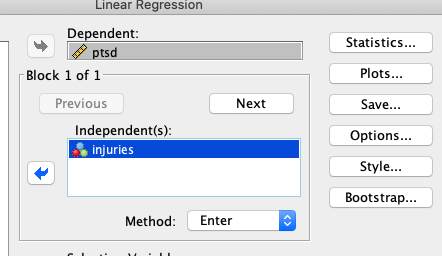
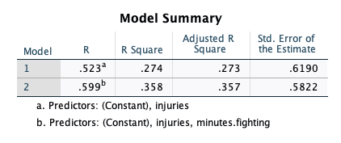

```{r, include=FALSE}
knitr::opts_chunk$set(
  comment = "#>", echo = FALSE, message=FALSE, note=FALSE, warning=FALSE, cache= FALSE
)
```

# Model Comparisons

I used to work as a professional photographer. I started right when digital photography was in its infancy. One of my favorite things to do was take a digital photo, bring it into Adobe Photoshop, then photoshop the crap out of that picture. 

Afterall, there's nothing more touching than a Disney-princess-perfect photo of a happy couple on their wedding day. 

But here's the problem: it's very easy to overdo it in photoshop. Maybe your contrast is too high or your colors are overly saturated. But what tended to happen is that you end up making gradual changes. After dozens of gradual changes, you've gone overboard without even realizing it. 

Fortunately, for overzealous photographers like myself, by hacking photoshop's layers functionality, I had the ability to see a before and after. Very often, the contrast between the before and after showed me that yes, indeed, I had gone *way* too far in my edits. 

Our brains are wired in such a way that we're not very good at judging absolutes; we're much better at judging relative differences. The same applies for statistical models: our estimates are *really* bad at telling you whether the model fits well, but statistical models are quite good at telling you which of two models is better. 

I think I'm going to say that again...in case you weren't paying attention:

** Statistics suck at telling us if a model fits. But statistics is really good at telling us which of two models fit better. **

## Nested versus non-nested Models

Alright, I'm going to qualify what I was just saying; statistical models are really good at telling which of two *nested* models fits better. 

"Why, Fifedog...what are nested models?"

So glad you asked, wise student. (And who told you my high school nickname?)

Let me give a somewhat technical definition first, then I'll illustrate with some examples.

**For two models (Model A and Model B), Model A is said to be *nested* within Model B if terms from Model B can be deleted to obtain Model A.**

Yikes, that was all stuffy sounding. Let me try a non-technical definition:

**If you can delete parts from the bigger of two models to get the smaller of the two models, the smaller model is nested within the bigger model.**

Better?

Lets look at an example of nested models. For simplicity, I'm not going to show the "coefficients" (i.e., $b_0, b_1, b_2,$ etc.), but just the variables:

$$
\begin{align}
\nonumber y =& A + B \\
\nonumber y =& A
\end{align}
$$

The second model ($y = A$) is said to be *nested* within the other model ($y = A + B$) because you can delete $B$ to get $A$ alone. Let's look at a non-nested model:

$$
\begin{align}
\nonumber y =& A + B \\
\nonumber y =& C
\end{align}
$$

There's no way to get from the more complex of the two ($y = A + B$) to the simpler of the two ($y = C$), so these models are not nested. 

Here's a few more nested examples:

$$
\begin{align}
\nonumber \text{depression} =& \text{stress} + \text{anxiety} + \text{stress}\times\text{anxiety}\\
\nonumber \text{depression} =& \text{stress} + \text{anxiety} \\
\end{align}
$$

$$
\begin{align}
\nonumber \text{blood pressure} =& \text{exercise} + \text{exercise}^2 \\
\nonumber \text{blood pressure} =& \text{exercise} \\
\end{align}
$$

$$
\begin{align}
\nonumber \text{temperature} =& \text{humidity} + \text{atmospheric pressure} \\
\nonumber \text{temperature} =& \text{humidity} \\
\end{align}
$$

In each case, we can delete one term from the larger model to get the smaller model. 

We call the larger of the two models the **full model**, while we call the smaller of the two the **reduced model**:

$$
\begin{align}
\nonumber \text{Full Model: }\text{temperature} =& \text{humidity} + \text{atmospheric pressure} \\
\nonumber \text{Reduced Model: }\text{temperature} =& \text{humidity} \\
\end{align}
$$

Like I said earlier, statistics are pretty good at telling whether the full or reduced model is the better of two models. But why?

Four words: *Is it worth it?*

Before I explain what I mean by those four magical words, I need to cover a basic concept: the fit/complexity tradeoff. 

## The Fit/Complexity Tradeoff

This can be a very technical topic, but I'm not going to be technical. But here's the basic idea: every time we add a variable (or a term, like an interaction term), our model will *always* improve in fit. (Well, technically, it might not change at all, but it can't get worse.) 

That's good, right? Well, no. The problem is that we can add *anything* to the model to improve fit. We can improve our prediction of barometric pressure by adding my daily weight to our prediction model. It will improve the fit (very slightly). But we know that my weight has nothing to do with barometric pressure. So, if our model is filled with predictors that really have nothing to do with our outcome of interest, we're adding useless information.

But there's a more sinister problem with adding useless predictors: the model will "overfit." Overfitting means that the model is fitting both the "signal" and the noise. The practical implications of that is that if we overfit, we will have very poor replication rates. 

So, let me say that all much more concisely: adding variables always improves prediction, but it also increases the probability your results won't replicate. So, you need to be very careful about what variables you decide to include in your analysis in such a way that balances fit with replication potential.

Got it?

Now we return to those four magical words: Is it worth it? 

When we ask our statistical models that questions, we're asking whether the improvement in fit is worth the cost of potentially overfitting. 

Fortunately, we have several tools we can use to determine whether the added complexity is worth it. 

## Model comparisons are tools, not procedures

I have had several students say stuff like, "My adviser thinks I should do an ANOVA, but I'd like to do a model comparison. What do you think?"

My response? Yes!

This is often met with confusion. 

The two are not mutually exclusive. Model comparisons are *tools*, much like plots, or estimates, or p-values. We can use plots, estimates, p-values, and model comparisons for *any number of analyses*. 

Let me say that again, but a smidge differently: model comparisons are tools we can use for just about any sort of analysis.

All it requires is for us to reframe our research questions into a model comparison question. 

Here are some examples:

*An ANOVA traditionally asks whether there are mean differences between groups (e.g., control, treatment A, treatment B) on some outcome. A model comparison asks whether the inclusion of group membership (control, treatment A, treatment B) improves fit above and beyond using a single mean for each group. 
*An ANCOVA asks whether group means are different after controlling for a covariate. A model comparison asks whether the inclusion of group membership improves prediction above and beyond predicting from the covariate alone.
*Traditionally, testing for an interaction asks whether the interaction effect differs from zero. A model comparison asks if a model which allows the slopes to differ depending on the third variable is substantially better than a model that does not allow the slopes to differ. 

Many of the analyses we've already been doing can be re-framed as a model comparison:

| Analysis Type | Model Comparison Question |
| ----------- | ----------- |
| t-test | Relative to a model where each group has the same mean, do I improve prediction by allowing both groups to have their own means? | 
| Conditioning Analysis (e.g., ANCOVA) | Does the addition of this variable improve prediction enough to justify keeping it? | 
| Moderation (Interaction) Analysis (a.g., Factorial ANOVA)| If I allow the slopes to be non-parallel, does it improve my prediction substantially?  |
| Multiple regression | Does the inclusion of therapy and drug use improve treatment above and beyond just demographics? |


Just about all (if not all!) analyses can be reframed as a model comparison. Because of that, we can almost always use the tools of model comparisons for analyses. 

## Visual model comparisons

Are you at all surprised that I begin with visualizations? You probably shouldn't be. I feel like we're friends at this point and might even be able to finish each other's sandwiches. (Catch that Frozen reference?)

Flexplot has various tools that allow you to visually compare two models. Perhaps the coolest tool is the `compare.fits` function. Let me go ahead and show you how it works with an example, then I'll explain the deets:

```{r modcompav1, echo=TRUE}
require(flexplot)
full_model    = lm(ptsd~injuries + north_south, data=avengers)
reduced_model = lm(ptsd~injuries              , data=avengers)
compare.fits(ptsd~north_south | injuries, 
             data=avengers, 
             model1 = full_model,
             model2 = reduced_model)
```

Let's talk about the arguments first. `compare.fits` requires four major arguments:

1. A flexplot formula specifying how the variables are displayed. All variables in this formula *must* be in one of the models you've fit. However, you do not have to have all variables displayed. For example, we could choose to only display `ptsd~north_south` and not plot injuries. 
2. The dataset
3. A fitted model. For now, that means a model fit with the `lm` function. 
4. (Optional). A second model that we wish to compare to the first. If we omit this, `compare.fits` will just visualize the one model. (In which case, it's really no different than using the `visualize` function). 

So, in short, this function will visually compare two models. In the plot above, the one in blue is the reduced model and the red one is the full model. 

So, what are we looking for when viewing two plots in compare.fits?

We are looking for *different predictions*. In this case, the two models have similar predictions, at least in some instances. For example, both models predict ptsd scores near four most of the time.

```{block, type='rmdnote', echo=TRUE}
## Do we want parallel lines in `compare.fits`?
Your natural inclination might be to say, "Holy Smokes, Stats Man! Those lines are not parallel! We have an interaction here!"

And, truth be told, you wouldn't be the first student to say that. You've been well-trained to look for nonparallel lines whenever we overlay a ghost line in flexplot. But, the red lines *are not ghost lines*. The red lines are the fits of the full model. 

So, don't confuse the two approaches. Lemme make it more clear with a bulleted list:

* When using the `flexplot` function, we often use ghost lines to see if the slopes are not parallel
* When using `compare.fits`, we don't care if they're parallel. We care if the two lines are *different*. 
```


Let's look at another example with a more drastic difference. This time, we'll fit a model predicting Covid symptom severity from health and mask-wearing behaviors:

```{r, echo=FALSE}
set.seed(2323)
mat = matrix(c(
  1, .1, .6,
  .1, 1, .3,
  .6, .3, 1),
      nrow = 3
)
require(tidyverse)
d = data.frame(MASS::mvrnorm(300, c(0,0,0), mat)) %>%
  set_names("health", "mask_behaviors", "symptom_severity")
```

```{r modcompav2, echo=TRUE}
require(flexplot)
full    = lm(symptom_severity ~ health + mask_behaviors, data=d)
reduced    = lm(symptom_severity ~ health                 , data=d)
compare.fits(symptom_severity~mask_behaviors | health, 
             data=d, 
             model1 = full,
             model2 = reduced)
```

Now our two models are quite different from one another. For example, in the right plot the two model's predictions are different by nearly a full standard deviation (1 point). 

So, again, let me say it again, but with emphasis. *When using `compare.fits`, we're trying to see whether the two models produced drastically different predictions`. 

## The `model.comparison` function

Whew! That was loads of fun. I like pictures. I like plots, But, alas, we're not done yet. More often than not, we look at a plot and say to ourselves, "That there's a lovely plot. But I'm not sure if the two are different **enough**. It would be right nice if I had some more concrete numbers to help me make a decision."

Lucky for you, we have a lovely tool to help us put what we see in concrete numbers: the `model.comparison` function.

This function is so easy to use, my dog could use it. Let's look at an example:

```{r echo=T}
model.comparison(full, reduced)
```

All it requires is two models (preferably nested). It will then report several statistics that are helpful in determining which of the two models is preferred. Let's go ahead and go through all these statistics so you know how to interpret them. 

### AIC/BIC

The AIC is short for Akaike's Information Criteria. This statistic won the award for the "Most Fun Statistic to Say" seven years running. It's pronounced: awe-ka-ick-ee. It is defined as:

$$ AIC = 2k - 2ln(\hat L)$$
where $k$ is the number of parameters and $\hat L$ is the likelihood function. 

WTF?

Don't worry about it. I'm just putting the definition there for the pedantic. And, btw, this is going to be a very brief intro to AIC. I'm not going to get into the technical nuances. I'm just going to show you how to use it. 

But, it might be good to notice that $k$, the number of parameters is in there. AIC was designed to impose a penalty on models that fit more parameters. Or, put differently, AIC tries to balance the fit/complexity tradeoff. 

So, while the AIC was specifically designed for comparing models, there's a problem with it: the numbers themselves are uninterpretable. What does an AIC of -255.87 mean? Um. Er. I don't know. What about an AIC of -1985.23? Again, I don't know. 

So, if the AIC value is meaningless, what's the point?

Well, the AIC should not be used in isolation. You always use the AIC to compare two models. *And the model with the lower AIC is the better fitting model.*

So, let's look at the AICs from the models above. The full model had an AIC of `r model.comparison(full, reduced)$statistics$aic[1]`, while the AIC of the reduced model is `r model.comparison(full, reduced)$statistics$aic[2]`. Which model fits better? The full model. Why? Because its AIC is lower. 

Naturally, you might ask, "How much better is it?"

Alas, the AIC cannot answer that. It's not like $R^2$, where we can easily develop an intuition for how large a difference is. 

All you need to remember is that the model with the lower AIC is the better fitting of the two. 

The BIC, or Bayesian Information Criteria is very similar to the AIC, but it incorporates the sample size in its calculation:

$$ BIC = k \text{ ln}(n) - 2ln(\hat L)$$

where $n$ is the sample size. 

BIC tends to be more conservative than the AIC. (In other words, the BIC will generally favor the reduced model more so than the AIC). Fortunately, the two usually agree. 

Like the AIC, the model with the smaller BIC is the favored model. Also like the AIC, the numbers associated with the BIC cannot be interpreted in isolation. Rather, we use the BIC from two models and favor the model with the lower BIC. 

### Bayes Factors

Bayes factors are freaking awesome. Remember how the actual AIC/BIC numbers are pretty meaningless? The Bayes factor takes the BIC and converts it into something that is actually meaningful. 

The Bayes factor is a ratio:

$$ \frac{\text{Evidence in favor of Model 1}}{\text{Evidence in favor of Model 2}}$$

So, if the full model has a Bayes factor of 2.5, the evidence in favor of the full model is 2.5 times larger than the evidence in favor of the reduced model. Or, conversely, you could say that the evidence in favor of the reduced model is 0.4 (i.e., 1/2.5) relative to the full model. 

So, the model that has Bayes factor values larger than 1 is the better fitting model. The model with the Bayes factor less than 1 is the worse fitting model. 

That there is quite intuitive. Going back to our previous example, the evidence in favor of the full model (which includes injuries) is `r model.comparison(full, reduced)$statistics$bayes.factor[1]` times larger than the reduced model. (That's a *massive* difference!)

By convention, Bayes factors larger than around 10 are considered fairly strong evidence in favor of that model. One thing you'll have to remember about the BF is that anything near 1 is *ambiguous*. For some reason (likely the extensive training we all receive in p-values), it's tempting to interpret a BF of, say 1.1, as saying the reduced model should be favored. This is not the case! Rather, 1.1 says the BF is having a really hard time deciding between the two. 

### p values

Let's have a fictitious conversation, shall we?

You: Aren't you diametrically opposed to p-values?

Me: Usually.

You: So...why are you reporting p-values in the software that *you* developed?

Me: I'm sorry, I'm not taking questions at this time. Please contact my PR office for further inquiries. 

You got me. 

Yes, I use p-values. But, I don't feel as cringy about it in for model comparisons as I do for null hypothesis significance testing.

Why?

There's three reasons I'm okay with using p-values for model comparisons:

1. These p-values are associated with *meaningful* hypotheses. When we do a model comparison, we're testing a theoretically-motivated hypothesis (e.g., does stress contribute to depression above and beyond one's genetic influence?). With NHST, we're testing whether a parameter is zero. That may or may not be tied to a theoretical hypothesis. 

2. With model comparisons, we only compute *one* p-value. Suppose we're trying to see if stress affects income, above and beyond demographics (age, gender, ethnicity). This model comparison will compute one p-value (full model: income = stress + age + gender + ethnicity versus reduced model: income = age + gender + ethnicity). A traditional NHST-style model will compute a p-value for *every single variable* (one for age, one for gender, one for ethnicity, and one for stress). That gives us three additional opportunities to capitalize on chance. Of course, one could choose to ignore all the other p-values and focus on the only meaningful one (stress in this case), but seeing all those other p-values might be tempt you into interpreting them. 

3. With model comparisons, we're using p-values as *one of many* pieces of evidence. I don't hate p-values. I hate how they're used. I don't mind someone reporting a p-value, provided they also give me plots, Cohen's $d$ values, correlations, slopes, Bayes Factors, etc. I have a big problem with using p-values in isolation. In the `model.comparison` function, $p$ values are reported alongside several other metrics. This prevents p-value myopia (I hope!)

Let me go back to a point I made in #2. We *could* compute the p-values for every single parameter and only interpret the one of interest. Let's say we're interested in the effects of flexibility on ptsd, controlling for minutes.fighting, injuries, and shots.taken. Our models look like this:

```{r}
full    = lm(ptsd~minutes.fighting + injuries + shots.taken + flexibility, data=avengers)
reduced = lm(ptsd~minutes.fighting + injuries + shots.taken              , data=avengers)
```

We could avoid the `model.comparisons` machinery and just compute the p-value for flexibility:

```{r}
summary(full)
```

Notice the p-value associated with flexibility (`r model.comparison(full, reduced)$statistics$p[1]`) is *exactly* the same as the p-value associated with the model comparison: 

```{r}
model.comparison(full, reduced)
```

```{r echo=FALSE}
prediff = model.comparison(full, reduced)$predicted_differences
```

Why are they the same? When we computed the p-values for the whole model, we were asking R:

* Is the slope of minutes.fighting equal to zero (after controlling for all the other variables)?
* Is the slope of injuries equal to zero (after controlling for all the other variables)?
* Is the slope of shots.taken equal to zero (after controlling for all the other variables)?
* *Is the slope of flexibility equal to zero (after controlling for all the other variables)?*

Asking if the slope is equal to zero is exactly the same as asking whether adding flexibility to our model improves the fit enough to justify its inclusion. But, with model comparisons, it doesn't compute those p-values for all those questions we didn't actually ask. Rather, it's focusing on the one hypothesis we're really asking. 

"Okay," you may say, "so what's the point of doing a model comparison if we could always just compute the p-value?"

For one, computing p-values (e.g, with the `summary` function) computes way more p-values than we actually need. Also, the `model.comparison` functions gives us much more information (e.g., AIC/BIC/Bayes factors). 

But there's a third reason to prefer `model.comparison` over the `summary` function: the `summary` function cannot compute p-values for certain types of model comparisons. 

Let's say you want to see the effect of speed *and* agility on ptsd, after controlling for minutes.fighting *and* injuries. In this case, our two models would be:

full model: ```ptsd~minutes.fighting + injuries + speed + agility```
reduced model: ```ptsd~minutes.fighting + injuries```

Now the full model has *two* variables the reduced model doesn't. There's no way to identify the effect of both variables with the `summary` function. 

### $R^2$

The final statistic the `model.comparison` function returns is the model's $R^2$. We're all familiar with this metric, so I won't go into much detail. But, `model.comparison` makes it very easy to compare model r squared values. 

### The predicted values

Back when I was talking about `compare.fits`, I was trying, by eye, to tell you how different two model's predictions are. For example, I said the two models in Figure \@ref(fit:modcompav2) differed by about 1 standard deviation. 

Perhaps, it might be a smidgen better to have more concrete values than having to eyeball things. That's what these predicted value are. 

Bascially, what `model.comparison` does in the background is it uses both models to predict scores for each individual. For example, the full model might predict a symptom severity score of 1.2, while the reduced model might predict a symptom severity score of .18. Then `model.comparison` will compute the difference in prediction. In this example (1.2 versus .18), the difference will be .02. It will compute this difference for *all* scores in the dataset. The predicted_difference section tells you the percentiles of these differences. 

Let's go ahead and pull up these statistics for the two models we compared earlier (with versus without flexibility). Let's show that again:

```{r, echo=TRUE}
model.comparison(full, reduced)$predicted_differences
```

This is telling you that the *minimum* difference between the two models is `r prediff[1]`. It also says that 25% of scores differ by no more than `r prediff[2]`, 50% differ by no more than `r prediff[3]`, 75% differ by no more than `r prediff[4]`, and that maximum difference in prediction is `r prediff[5]`. 

### What if the statistics disagree?

That there is a good question. And it happens! Most of the time, the AIC/BIC/BF/p-value/R-squared/predicted difference/plots all agree on which model is better. But sometimes you'll get an AIC/p-value that favors the full, and a BIC/BF that favors the reduced. 

What then?

You may not like the answer, but I'm going to have to be straight with you. It's time you learn some hard truths and stiffen up that upper lip, young soldier. When these statistics disagree, that tells you your answer is ambiguous. The reality is that the evidence isn't strong either way. So, my best recommendation is to report that the evidence is ambiguous, then collect more data. 

You might be uncomfortable with that. It's understandable. As humans, we don't like ambiguity. As scientists, we've been trained to reject ambiguity and uncertainty. That has, unfortunately, been to our detriment. In the past, when we *should* have been ambiguous under uncertainty, we instead were bold. That led to the replication crisis. So, it's high time we allow ambiguity into our conclusions and scientific dialogue. 

## Hierarchical Regressions: Nested Model Comparisons in SPSS

You may have to communicate with users of SPSS. Or perhaps you yourself have used SPSS. There's a popular tool in SPSS called "Hierarchical Regressions." With these, the user different "blocks" of models. For example, block one might be:

```{r, echo=FALSE}

```

While block two might add minutes.fighting:

```{r, echo=FALSE}
knitr::include_graphics("screenshots/Intro Book V 2 2022-04-18 at 8.38.10 AM.png")
```

All this is a nested model comparison. The first "block" is the reduced model, and the second "block" is the full model. 

If we look at the SPSS output, we see the $R^2$....

```{r, echo=FALSE}

```

... is the same we'd get in R:

```{r, echo=TRUE}
full    = lm(ptsd~injuries + minutes.fighting, data=avengers)
reduced = lm(ptsd~injuries                   , data=avengers)
model.comparison(full, reduced)
```

*Hierarchical Regressions are model comparisons*. I have no idea why SPSS decided to use different terminology than what statisticians use. It's quite frustrating, actually. It makes it seem like what I teach is foreign, when it's not at all. 

Damned IBM. 

## Non-nested models

This chapter has been primarily devoted to nested models, and this book isn't intended to really go too deeply into non-nested models. But, many of the research questions we ask cannot be assessed with a nested model comparison:

* Is human behavior primarily a function of punishments/reinforcements? Or is it primarily a function of genetics?
* Is the diathesis-stress model a better representation of psychological vulnerability than the differential susceptibility model?
* Do autoantibodies accrue before soluable mediators, or do soluable mediators accrue before autoantibodies? 

These sorts of models are probably best addressed with more advanced statistical procedures, such as structural equation models. (Non-nested model comparisons are the rule, rather than the exception in SEM). 

However, I will say a few things about these. First, if you try to use the `model.comparison` function for non-nested models, it will report an AIC, BIC, BF, and predicted differences. It will *not* report p-values and R squared. Why? Because p-values/R-squared only make sense with nested models. 

Fortunately, you can still use AIC/BIC/BF/predicted differences in exactly the same was you would with nested models. 

## Summary

Statistics is really terrible at determining whether a model fits. It's really good at telling you which of two models fit better. There are two types of models: nested models (meaning we can delete one part of a model to get the other model), and non-nested models. 

When comparing models, it's important to keep in mind the complexity versus fit tradeoff: adding variables always improve prediction in that dataset, but it may not cross-validate well. So we ask the computer to tell us whether adding variables improves prediction *enough* to justify adding complexity to our model. 

Flexplot offers two excellent tools for comparing models: the compare.fits function which visually shows the difference in predictions, and the compare.fits function, which computes various model comparison statistics (AIC, BIC, BF, p-values, and R squared). p-values in model comparisons are okay for several reasons, including that they're more targeted hypotheses and that they're evaluated in the context of other metrics. Remember that SPSS often will call nested model comparisons "hierarchical regressions." 
