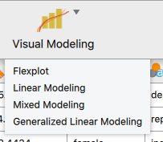
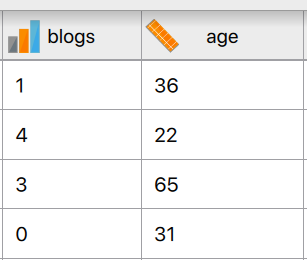
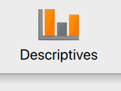
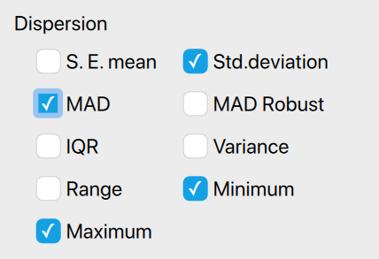
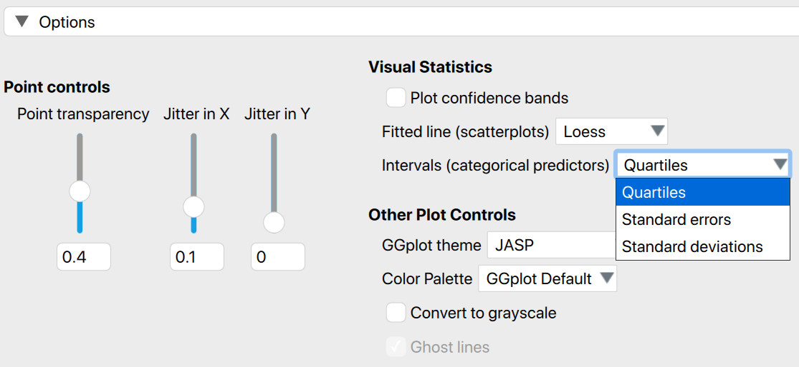
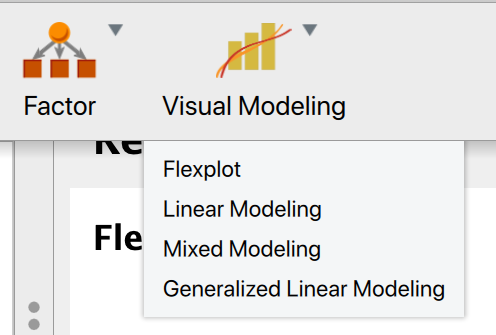
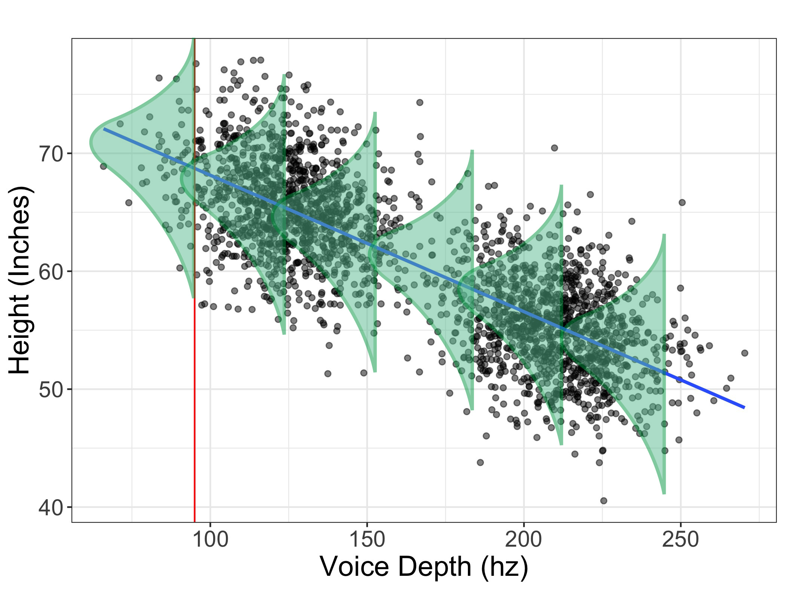
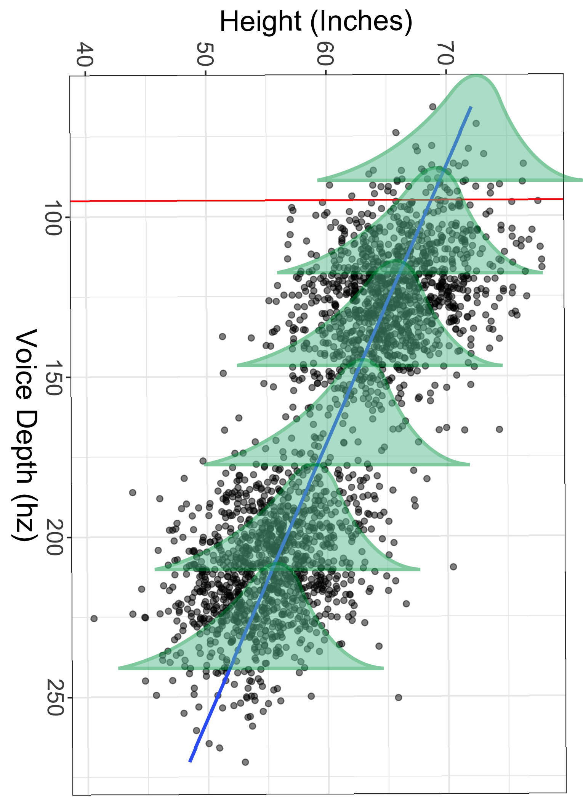
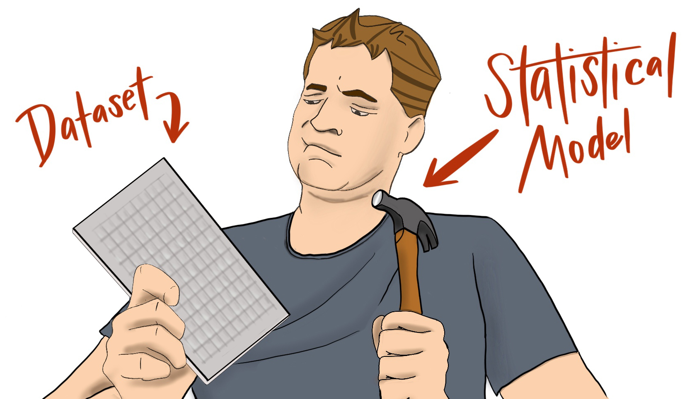
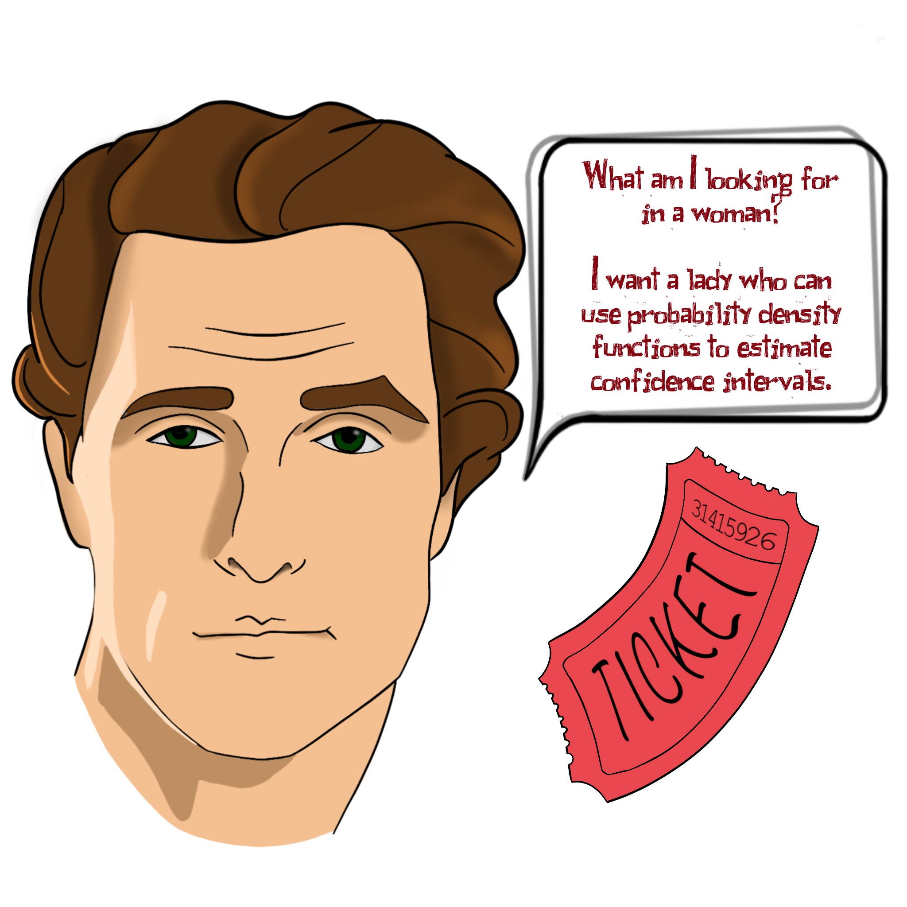

--- 
title: "The Order of the Statistical Jedi: <div style='font-size: .8em;'>Responsibilities, Routines, and Rituals</div>"
author: "Dustin Fife"
date: "`r Sys.Date()`"
site: bookdown::bookdown_site
output:
  bookdown::gitbook:
    number_sections: false
documentclass: book
bibliography: [book.bib, packages.bib, book_citations.bib, references.bib]
biblio-style: apalike
link-citations: yes
description: "This is a minimal example of using the bookdown package to write a book. The output format for this example is bookdown::gitbook."
---

# Preface

<hr>


<!--chapter:end:index.Rmd-->

```{r, include=FALSE}
knitr::opts_chunk$set(
  comment = "#>", echo = FALSE, message=FALSE, note=FALSE, warning=FALSE, cache= TRUE
)
```

# Introduction {#intro}
I was an undergraduate once. And...let’s just say the statistics force wasn’t strong with this one. At least initially. Given that my innate intellectual prowess was somewhat lacking, I knew I needed a boost to get into graduate school. So, I figured one of the best things I could do, aside from getting a statistics minor (more on that later), was to write an honor’s thesis. 

And so I did. 

In retrospect, it was kind of a dumb idea. I wasn’t terribly interested in the project. And I hate inconveniencing people. Yet here I was, barging into professors’ offices, begging for them to let me inconvenience them *and* their students to conduct a study. 

I still have nightmares about my data collection endeavors. 

Well, I finally collected the data I needed and went to my mentor for analysis. Cuz I had no idea what to do with that shiz. 

Well, it turns out, neither did my mentor. Unbeknownst to me, the data I collected and the research question I asked required an extremely sophisticated analysis. Neither my mentor nor I had any idea how to even begin to start answering the question. 

So, I did what any daunted student would do...I went to the [Statistics Jedis](http://https://statistics.byu.edu/) themselves. You see, my friends, at my alma mater, we were graced with the presence of a statistics jedi training facility (translation...a department of statistics). And since I was a padawan in training there anyhow, I went to see one of my professors.


Dr. Bruce Schallje. With silver streaked hair, a continually cocked head, and eyebrows that remained fixed on a distant problem, the guy was brilliant, yet humble. He wore jeans and brown leather boots, always boots. In fact, outside his earshot, we actually called him "Boots." 

As I approached his office, I imagined what it would look like to see raw statistical power manifest. Would he, perhaps, close his eyes and hum gently? Would he sit nomeste-style as insights seeped like mist into his flannel shirt? Or perhaps, his power would manifest by shouting brilliant insights as he pitterpattered on a keyboard like a hacker on a movie. Or maybe it would be like Neo in the Matrix...Dr. Schallje could just look at the data spreadsheet and see the hidden patterns in the data. 

But no. 

The man graphed the data. 

Yeah. He graphed it. 

And that, my friends, is where his brilliance really showed. The solution to the problem was, as it turned out, extremely simple. One only needed to plot the data. 

Yet at the same time, I thought, "That’s it? I could have done that!"

I have thought over the years about my initial observation of a statistician in his native environment. The absolute mysticism I felt said more about me than about statistics. It was only mystical because I didn’t understand statistics. 

Let me say that again, but more tweet-worthy:

```{block, type='rmdtweet', echo = TRUE}
Those who treat statistics with reverence or a measure of mysticism only reveal they really fail to understand statistics. 
```

There’s nothing mystical about statistics. That’s both good and bad. Good for you. Bad for me. It’s bad for me because I have lofty and excessive delusions of grandeur. I would love to see myself as a statistical Jedi with superpowers that exceed my own ambitions. Alas, that is not the case. There’s nothing magical or mystical about statistics. It’s actually surprisingly simple. 

That really sucks when you want to believe you’re special. 

And it wasn’t entirely my fault, I believe. Textbook writers of old have been guilty of making it way more complicated than necessary. Sums of squares, degrees of freedom, rejecting null hypotheses in infinite universes of repeated experiments?...come on, guys! Do we really need to invent or perpetuate convoluted concepts to make ourselves feel smarter than we actually are? 

Allow me to burn the veil before you. 

Statistics isn’t that complicated. 

And that’s where the good news comes in. You, my young Padawan, need not be daunted by the journey before you. Whatever PTSD you suffer from past statistical experience...let it go. Statistics as you knew it is dead to you. Prepare to march upon the enlightened path; one where statistics is not only understandable, but intuitive.

But it does take repetition.

## The power of repetition (and my...umm...*complicated* history with statistics)

My first year at [BYU in Provo, UT](http://https://www.byu.edu) I took the undergraduate statistics class in the psychology department. The class was taught by Dr. Kim, a Korean man with a very thick accent. It took me six weeks before I finally realized "shima" was "sigma."

But I can handle accents. The bigger problem was the class took place at 8AM, and the guy's voice was deep and soothing. The guy could have recorded meditation voiceovers and made millions. The moment his mouth opened, my eyelids grew heavier. And heavier. 

And I understood *nothing.* I was a really bad student. I was so confused it hurt to even try. I didn't even know what I didn't know. I didn't even know how to get help. I was *helpless*.

The professor felt bad for me, I think. Somehow, I ended up with a passing grade, having not learned a lick of statistics. 

*Finally*, I thought, *that nightmare is over!*

Oh no, good friends The nightmare had just begun. 

About the time I was applying to graduate school, I had a painful realization: I was a horrible candidate. It didn't make sense to waste hundreds of dollars to apply to graduate school when I likely wasn't going to be accepted anywhere but Trump University. 

So I decided to take another year.

But what could I do in a year and a half that would make a difference?

The thought came before I could dismiss it. And that thought brough cold, dark fear to the depths of my bones. 

I could minor in statistics.

Frightening, that. 

But, I knew it would be a nice addition to my application. So I did it. 

The next year and a half was quite painful. I took a graduate level introductory stats class, followed by a second graduate stats course. I then took the introductory stats class in the statsitics department, along with matrix algebra and statistical computing. 

Then something miraculous happened. I was in my experimental design class, which would have been my *seventh* stats class. I sat near the front, posture sunken, feeling frightened of the next concepts, knowing I'd have to struggle for hours to make sense of what he said.

But something odd happened. I *knew* what he was saying. And it wasn't even a struggle to understand him. It was as if I had suddenly awoken from a dream and could speak a foreign language. I *knew* the language of statistics.

And since then, it hasn't always been easy, but it's been exciting. 

And I think it's important to realize that statistics is a language. It's a different way of thinking about how the world works, one that requires training of the mind. 

## But there's a better way

Lemme take a trip into the deep recesses of your thoughts. I assume you are saying to yourself, "Really?? WTF? I don't have time to take SEVEN stats classes to get it!"

I know. I'm surprised I did.

But, let me assure you it won't take seven classes. Why? Because you're way smarter than me. How do I know? I'm a statistician. I'm playing the odds on this one. 

More importantly though, there's a troubling flaw in how statistics has been taught in the past. My first indication was a conversation with [Dr. Robert Terry](http://https://www.ou.edu/cas/psychology/people/faculty/robert-terry) of the [University of Oklahoma](http://https://www.ou.edu). The man sported a gray-haired goatee and a relaxed demeanor--the kind "wait 'til the cows come home" demeanor only a southerner can manage. 

"There may be a problem with how we teach statistics," he said. 

He grinned, raising an eyebrow, waiting for the question. 

"And what problem is that?" I asked. 

He turned toward his computer, and opened an image:

[image of Robert's findings]

What am I seeing?" I asked, cocking my head. Lines and circles splattered across the image in a haphazard pattern. I couldn't make any sense of it.

"These are visual representations of cognitive maps. You can think of it like a graph, showing how the mind processes statistical information. This image," he pointed to the left graph, "is how experts think about basic statistical concepts. The right image," he pointed to the other figure, "is how some of our *best* students conceptualize statistics."

He laned back in his chair, grinning smugly. "So, what do you make of it?"

"They're different."

"Yes!" He leaned forward, eyes aglow. "They're not only different. We would expect them to be different. But they share *no* resemblance with one another."

"But how?" I asked. "In what ways are they different?"

"Experts think of statistical concepts as interconnected. Students, on the other hand, see these concepts as quite distinct."

That was in 2008. 

For *years* I have thought about what Robert showed me. Experts. Students. Mind maps. Very *different* mind maps. 

Does this imply we're teaching statistics incorrectly? Are we misleading students somehow to see things as distinct when, in fact, they're quite connected?

Why yes, yes we are.

But more on that in a minute. 

## The Curriculum Hasn't Changed in 50 Years!

Joseph Rodgers, another of my mentors and eventual collaborators, once gave an address to Division 5 of the American Psychological Association. (This is the stats-nerds/qualitative methods division). In his address, he showed his syllabus from his graduate statistics class from the 1970s. 

If one were to review the topics in his syllabus, they would soon discover the standard curriculum hasn't changed in 50 years. 

Let that sink in for a minute.

Although statistics and our understanding of statistics has rapidly evolved over the last 50 years, the way we teach students has *not*. 

Does anyone see a problem with this?

Well, I sure do. 

So, the standard curriculum hasn't changed *and* students' mind maps are very qualitatively different from the mind maps of experts.

I think it's time for a change. How about you?

## The General Linear Model Approach

The standard stats curriculum does indeed teach statistical concepts as very distinct: t-test. ANOVA. Regression. Correlation. Chi-square. Distinct concepts! Ne'r dare to confuse them because they are as different as apples and dirt!

Actually, no. They're not. 

It turns out t-tests, ANOVAs, regressions, and correlations are all the same thing. So too are factorial ANOVAs, ANCOVAs, and multiple regressions. 

They're the same freaking thing. They are all what we call the General Linear Model. 

Why then do people teach them as distinct?

Beats me! 

Okay, well that's not entirely true. See the fascinating historical note box below....

```{block, type='rmdnote'}
In the early history of statistics, there were two major powerhouses: Karl Pearson and Ronald Fisher. Karl, the older of the two, was the one who popularized regression and correlation and developed a bunch of really cool procedures. Ronald Fisher, the young whippersnapper had the gall to write a note to a journal where Karl recently published and publicly *correct* him for a mistake in calculating something called degrees of freedom.

The nerve of Ronny. 

That started a long, hateful relationship between the two. Ronald Fisher, who utilized statistics for primarily doing agricultural experiments, realized you could perform a regression with a mathematical shortcut that he called the Analysis of Variance (ANOVA). He know (as did Karl) that ANOVA was just a different way of computing regression. But, being a spiteful academic, Ron decided to use very different terms for many of the same concepts as Karl did (e.g., instead of calling variance, well, 'variances', he called them mean squared errors). Afterall, who wouldn't fail to give credit to their mortal enemies. 

So Ronny, again, an experimental researcher, promoted his own names and mathematical shortcuts for experiments, while Karl continued to use standard terminology. Over time, people began to develop some weird misconceptions about ANOVAs, t-tests, and regression; somehow, ANOVAs could demonstrate causation while regression could not, regression can only be used for numeric variables, and ANOVAs are somehow more appropriate and informative for experiments. 

Yeah, no. 

They really are the same thing and it's been quite a tragety to see people misunderstand them. 
```

That is, perhaps, the most controversial and important distinction between my approach and the standard approach. I believe it's borderline criminal to teach students these are distinct procedures when they are, in fact, the same thing. 

My approach offers several advantages: 

* It is easy for student to transition to experts; there's no need to reshuffle their mind maps. 
* When students are taught they're different, they must invest enormous intellectual resources *deciding* which analysis to do. By the time they get to interpreting the results, they're out of resources, so they make poor decisions. When taught using my method, on the other hand, they don't have to spend hardly *any* effort deciding which analysis to do. Instead, they invest that mental energy in interpreting results. 
* Teaching from a GLM perspective makes the transition to advances statistical procedures intuitive. A mixed model is just a GLM, but with different slopes/intercepts for each cluster. General*ized* linear models are gener*al* linear models with different distributions of residuals (and different link functions). Structural Equation Modeling is just a bunch of GLMs slapped into a simultaneous equation. Most students taught the traditional way, again, have to make a very dramatic mental shift before they learn these advanced procedures. When taught my way, these advanced methods are minor extensions. 
* GLMs do more than test hypotheses. T-*tests* are called tests for a reason; they are designed to test for statistical significance. Great. What if you're interested in estimation? Or visualization? Or prediction? Or model comparison? Sorry, standard statistics approach. You can't handle it! (Or at least, you're agnostic about how to handle it). The GLM, on the other hand, handles these situations with aplomb. 
* Students can use the same analytic framework for *all* statistical analyses they perform. With a GLM perspective, they merely identify their predictor(s) and their outcome, then visualize, then study estimates, they study probability estimates. With the other approaches, on the other hand, not only do they have to click on different menus (t-test or ANOVA or regression or chi square), but the type of information they must interpret differs from one analysis to another. (Although p-values, the most easily misunderstood statistic of all time, is a notable exception). 

I'm sure there's more, but my pizza just arrived, so I'm going to wrap up this chapter. 

My approach isn't a mere modification, based on personal taste, of the existing statistics curriculum. It is a explicit abandonment of the existing curriculum. Burn that curricular bridge down, I say. Let's start anew. 

This is the "anew." 

My approach is characterized by visualization and a general linear model approach. The whole purpose of my curriculum is to teach students to *really* understand what their data are trying to say. But, for too long, the standard approach to statistics has stuffed the mouth of our data with cotton balls; it couldn't speak, couldn't say your interpretation was wrong, couldn't reveal interesting patterns you missed.

It could barely breathe. 

And now, my friends, we are drowning in a replication crisis--a crisis caused by suffocating our data.

This curriculum is designed to give voice to the data. If you adopt my approach, you will gain insights you will have missed using the standard approach. It will prevent publishing embarrassing errors and yield novel insights. 

In short, my approach is about data literacy. 

Ya'll ready to begin? 

<!--chapter:end:01-intro.Rmd-->

# Ethics

You know what's kinda funny. 

I have *never* seen an ethics chapter in statistics textbooks. 

"Well," you might say, "I don't see a need. You don't teach ethics in physics, do you? In logic? In math? Math is math, Math doesn't care what ethical standards we hold."

True. Math doesn't have feelings. 

Neither does statistics. 

But we (humans, that is...if you're not a human and you're reading this, let me be the first to welcome you to our planet) do!

And here's the thing: it is actually quite easy to lie using statistics. We can lie to others and we can lie to ourselves. It is very possible, if not likely, that if two statisticians analyze the same dataset, they will arrive at different conclusions. 

Sometimes those conclusions are similar. Sometimes they're not.

And, with enough searching, we can almost always find *something* in our dataset that tickles our intellect. Problem is, we never really know if that intellect-tickling insight is real or spurious.

This has always been the case, by the way. But we didn't really realize it until 2011. 

What's so magical about 2011? Well, I had a birthday in 2011. So there's that. 

But there's oh so much more. 

## History of the Replication Crisis

Prior to 2011, research in psychology (as well as biology, sociology, medicine, exercise science, etc.) was business as usual. Scientists were pumping out scientific truths faster than technicians could stock the printer. We were quite proud of that, patting ourselves on the back and feeling quite right about the truths we had revealed. 

Then 2011 happened. 

### Dederick Stapel

It started with a fellow named Dederick Stapel. Stapel was a Dutch social psychologist. The man was a rising star, earning high-impact publications and awards. That was, until one of his graduate students grew suspicious. You see, Stapel *always* performed his own statistical analysis. None of his students ever saw the data.

Odd, that. 


So one of his student reported their suspicion to the university. The university conducted an investigation and discovered that, for many years, Stapel had been outright fabricating his data. 

Swaths of publications had to be retracted.

Suddenly, scientists started to worry about what they could trust. 

Oh, but there was more to come. 

### Darryl Bem

So, Stapel was a crook. (Although, he seems to have rehabilitated since. Good for him!). So, as long as most scientists aren't crooks, science can be believed....right?

Well, no, unfortunately. 

Darryl Bem, also a social psychologist at Harvard, was likewise a luminary in his field. In 2011, he published an article in Journal of Personality and Social Psychology that "proved" humans are capable of pre-cognition. 

Yeah. 

What was odd about this incident is that Darryl hadn't fabricated his data. Instead, he has used *standard statistical procedures* to justify his conclusions. 

Apparently, the reviewers of the articles, despite their skepticism of the conclusions, trusted the methods enough to let the publication pass. 

Others were not so trusting. Once again, scientists began to feel uneasy. Darryl Bem used the *same* statistical procedures the vast majority of scientists used, and yet he concluded something so outlandish. 

But there was one more incident in 2011 that would solidify our unease. 

### The "P-Hacking" Article

This one is actually quite funny. A trio of researchers (Joe Simmons, Lief Nelson, and Uri Simonsohn) published a paper where they "proved" that people listening to a song titled "When I'm Sixty-Four" made them *younger* than a control group (who listened to the song "Kalimba"). 

What?

Yes, apparently, after listening to a song, it reversed the flow of time. 

Nice.

Except, this is absolutely ridiculous. And that was *exactly* the point of their article. 

What they showed is that researchers could engage in practices they called "researcher degrees of freedom" to essentially find support for any conclusion they want, even ridiculous conclusions. 

This paper was a pretty big deal. Why?

As researchers read this, they realized many of these "researcher degrees of freedom" these authors cautioned against were activities in which these researchers routinely engaged.

Uh oh. 

This article was later dubbed the "p-hacking" article. 

What is p-hacking?

Glad you asked. 

## P-hacking

Before I talk about what p-hacking is, let me give you a brief overview of how researchers use probability to make decisions about data. When a researcher collects data, they use statistics to summarize what they found in the data. 

Well, it turns out statistics are *designed* to detect patterns. That's good, right?

Yes and no. 

The problem is data *always* show patterns. For example, you may collect data on your quality of sleep and notice that you tend to sleep better whenever polar bears migrate closer to the arctic circle. 

Nice!

Perhaps you ought to set up an automatic feeder within the arctic circle so you can always sleep well. 

Are you seeing the problem?

There's no reason to suspect polar bear migrations have anything to do with your sleep patterns. This is what we call a "spurious relationship." A spurious relationship occurs when two variables appear to be related to one another, but in reality any association between them is nothing more than chance. 

So, think about that: statistics is designed to detect patterns. Some patterns are spurious. So...maybe that pattern you discovered is spurious?

That's always the risk when doing data analysis. And, unfortunately, you never know whether that thing you detected is real or spurious. 

But, there are safeguards we can put in place. Often these safeguards utilize probability; we compute the probability of obtaining our results. ^[To those Bayesians, I *know* your objection and I'll get to that in my [Bayesian versus Frequentist](#bayesprobability) chapter. Hold your horses! In fact, I'm very much going to liberally abuse misconceptions about p-values and probability in this section for the sake of simplicity. I'll cover the nuances in later chapters.] 

That's all well and good, but the Achilles heel of probability is what we call multiplicity.

Say I want to win a game of chance. To do so, all I have to do is roll a six on a die. What is my probability of rolling a six? 1/6. 

What if, instead of rolling once, I roll a hundred times. What's my probability of rolling a six now? It's ain't 1/6! It's much higher. Why is it higher?

Because of multiplicity. 

Likewise, when we collect data, we'll generally compute some sort of probability of obtaining our results. What we'd like is to find a high probability our data support our hypothesis. If there's a 99% chance our hypothesis is true, that's good...right? (BTW, this is a very poor representation of the statistics we'd actually compute when doing data analysis, but you get the idea). 

That probability (99%) can only be believed if there's no multiplicity. Just like our dice-rolling example, researchers too can engage in multiplicity. What does that look like?

Well, maybe a researcher analyzes how treatment and control groups differ on a memory task. Darn. There's a very small difference between the two groups, and it happens to be in the opposite direction the researcher hypothesized. And their probability estimate isn't very favorable. 

Undeterred, the researcher decides the last four questions on the memory task should be thrown out. Why? I don't know. Maybe they think participants got too tired. 

Again, they compute the difference between the two groups. Now, the difference between the two is in the right direction, but it's still small. Once again, they compute some probabilities and find the estimates aren't that favorable. Maybe the probability of their hypothesis being true is only 50%. Well, you can't win big in science if your probability's only 50%.  

You know....those 20 or so people who participated looked a little lethargic. Let's go ahead and delete their data. 

Okay, well, that helped a little. The difference between the two groups is larger and the probability rises to 75%. 

So let's now "control" for intelligence. (We'll talk more about what this means in our [conditioning](#multivariate-glms-conditioning-effects) chapter).

Then let's delete that outlier. 

Then let's delete that guy's scores because...well, I don't know. I've got a gut feeling. And, besides, he wears Old Spice. Everyone knows anybody who wears Old Spice can't be trusted. 

In the end, the researcher may obtain a very impressive probability estimate, but not because he discovered some amazing truth. It's only because of multiplicity. 

AKA p-hacking. P-hacking is short for "probability-value hacking," which means to keep trying a bunch of different analyses until one's probability estimate is favorable. 

```{block, type="rmdnote"}

It may be a bit misleading to say nobody realized multiplicity was an issue. People knew multiplicity was a problem. However, it was usually understood in terms of testing a bunch of different hypotheses. People hadn't really realized that testing the *same* hypothesis, but in *different ways* also constitutes multiplicity. 

```


P-hacking is what Simmons, Nelson, and Simonsohn were criticizing. And, nearly *everybody* was practicing multiplicity [@John2012].

Big oops. 

A few years later, in 2015, a gentleman by the name of Brian Nosek led a research team in a massive effort to replicate some of psychology's most recent prestigious findings. To do so, they found 100 studies from the top journals in the field to replicate. Unfortunately, only 36% reached the standard threshold for publishability upon replication.

Double big oops. 

Since 2011 (and especially since 2015), Psychology has been undergoing undergoing a "replication crisis" [@Pashler2012a]. That sucks, but it's also good because a lot of good things are coming out of it. One of those very good things is the Open Science Movement. 

What is the Open Science Movement? 

To understand this movement, it's important to see what this movement was a response to. 

## The Scientific Method Movement

Chances are, you are a recipient of the scientific method movement pedagogy. This movement began to emerge in the early 1900s. Back then, scientists started to consider *how* one goes about finding truth. Do we meditate? Do we ask questions of a magic 8-ball? Do we sit in an empty room and think about tacos and beach waves?

We could try these things, but how do we know if we're actually divining truth?

Alas, you can never really know. 

Quite by chance, scientists began to believe truth was independent of the person seeking it. It doesn't matter whether the scientist believes in black holes, fairies, or unicorns; these things either exist or they do not.

So, if we accept truth is truth, regardless of our own beliefs, how do we uncover the truth?

The answer for these earlier scientists was objectivity. If the scientist can somehow put aside their beliefs, values, biases, and expectations, they might more easily uncover truth. And it makes sense; we all know that our biases can get in the way of seeing evidence. Just think of flat-earthers! The evidence is overwhelming, yet their biases seem to always find a way to dismiss even the most convincing of evidence. 

Easier said than done, am I right? It's easy to say objectivity is the answer, but if objectivity is the answer, shouldn't we have some *objective* method of deriving truth? And shouldn't it be the case that *anybody* who applies this method will arrive at the same answer?

Why yes. (At least, that's what we came to believe in the early 1900s). 

This "method" became known as the scientific method. The scientific method is a rough overview of how scientists might investigate a research question (and by so doing, it is an overview of how they might uncover truth). 

In reality, there's no "the" scientific method. But usually, people would agree it consists of at least the following procedures:

1. Develop a hypothesis to explain a phenomena
2. Design an experiment
3. Formulate a hypothesis
4. Objectively measure the outcome
5. Refine and repeat

Simple, right? It seems to meet the criteria: the steps are objective and seemingly easy to follow. And, it seems to have had success in the past. Supposedly, when we apply the scientific method, we are guarding against our own subjectivity and the results gleaned are near-perfect representations of truth. 

Right?

Well, no. Alas, the scientific method only has the *illusion* of objectivity. But humans are still humans. It's impossible for us to be objective. And by mindlessly following the scientific method procedure, we may trick ourselves into believing we're objective when we're not. 

Also, information gleaned from the scientific method is anything but certain. 

It's quite a shame, actually. When I was taught about science as a kid, I had this impression of science as this codified set of facts that were certain and could be trusted. Likewise, I assumed all scientists were quintessential objectivists. 

Ha. HAHAHAHAHAHAHAHAHAHAHAHAHAHA!

Scientists are very much humans. Sometimes they're really stupid, or stubborn, or ignorant, or mean, or blind. Sometimes scientists promote their theories for no other reason than to protect their pride. Sometimes scientists are petty and suppress information that contradicts their self-interests. 

That really shouldn't surprise you. Scientists are people too. 

Alas, subscribing to the scientific method actually makes it more likely that, when you *are* being detrimentally subjective, you will (falsely) feel self-assured you're being a good scientist and uncovering truths. 

For scientists, the replication crisis served as a wake-up call. It was nearly undeniable proof  we had fooled ourselves into believing in our methods. 

## Values versus Ethics

The old school values (the Scientific Method values) relegated discussion of ethics and values to philosophers. Instead, their "ethics" were nothing more than intrusions in their scientific freedom. 

"What? I can't inject poison in my participants? But, it's for science!!!!!"

Yeah, not cool, man. 

Remember, the scientists of older years valued objectivity. What better way to be ethical than to embed ethics into "rules" that clearly delineate what is and what is not ethical behavior. And that has largely been the approach to ethics in science: a series of "thou shalt nots" that identify what's cool from what's uncool. 

"Thou shalt not harm participants."

"Thou shalt use deception only when the benefits outweight the risks."

"Thou shalt compensate participants."

"Thou shalt gain permission from people before they participate."

"Thou shalt not fabricate your data."

The problem with this approach is plain to any lawyer (or anybody, for that matter). There's always a loophole. There's always room for the gratuitous exercise of shenaningans. 

"Oh, I must compensate participants? Well, I'll compensate them with good advice."

"Oh, I can't fabricate my data? Well, it's not fabrication if I merely modify my existing data."

So, shenanigans brings more shenanigans, we add more rules, tighten the noose, annoy well-intentioned researchers with ever-longer training modules, and so on. 

This rule-based approach focuses on *restrictions* to research, which really only seem to annoy people. 

But there's a better way--values. There's little doubt one's values can be a powerful motivator. Consider the following quote from Karl Maeser, an American educator:

> I have been asked what I mean by ‘word of honor.’ I will tell you. Place me behind prison walls–walls of stone ever so high, ever so thick, reaching ever so far into the ground–there is a possibility that in some way or another I may escape; but stand me on the floor and draw a chalk line around me and have me give my word of honor never to cross it. Can I get out of the circle? No. Never! I’d die first!”

Daaaaammmmmnnnnn, dude! 

If Mr. Maeser's words are to be believed (and, by all accounts, the fellow was an upstanding individual), is there any doubt he would be ethical in his scientific pursuits? 

No doubt. 

Maeser doesn't need rules. The man has values to guide his decision-making. 

What's my point? My point is that the objective, rule-based approach to ethics has serious limitations. Rules are easy to circumvent, they're overly complicated, and they can stifle creativity. But, for one who is motivated by *values*, their values become the *motivation* behind their research. 

As I once said in a paper I wrote:

> Rules invite exploitation, whereas values motivate exploration. Rules limit freedom while values instill purpose. Rules are limitations. Values invite possibilities. Values exist from idea inception, to study design, to data collection, to data analysis, to publication, to post-publication, and they are the guiding force behind the research process itself. Once ethics shift away from rules and boundaries (extrinsic motivation), and toward values (intrinsic motivation), researchers can more readily govern themselves. 

This is not to say we shouldn't have rules. In an ideal world, every scientist would have strong values guiding their research and will always act in perfect alignment with their values. (Ha!)

But, let's be reasonable. Some people will always be jerks. 

I'm not advocating we abandon rules. Rather, I'm advocating we shift the focus away from from teaching ethics as a set of ever-expanding rules, and instead teach emerging scientists to espouse the values of good scientists. 

For those who teach or will ever teach emerging scientists, remember this: as a teacher, you have enormous influence over the values to which your students will subscribe. Think of Mr. Miyagi versus xxxx--it's no wonder "Daniel-son" embodied the values Mr. Miyagi taught (inner peace and martial arts as a defense only), while xxxx embodied the values of his sensei (no mercy and win at all costs). 

Be a Mr. Miyagi. 

They key to change is to embed values in our students. By so doing, the culture itself changes. 

But what are these values?

## The Open Science Values

Btw, this section is a much more condensed and irreverent version of a paper I published, available at:


The scientific method movement emphasized objectivity and valued (near) certainty. In many ways, the open science movement is a rejection of these ideas. Rather than promoting objectivity and certainty, the open science movement promotes a completely different set of values [@Fife]:

1. Protecting humanity.
2. Seeking truth.
3. Openness and transparency
4. Humility and skepticism
5. Dissemination

Why these values? Because the open science movement recognizes it's *impossible* to be objective. So, rather than pretending we're not human, instead we should (a) leverage our strengths as humans, and (b) put safeguards in place that minimize the damage we can do to our pursuit of truth. 

And how do we do that?


### 1. Protecting humanity

You know what would advance science quite quickly? Forcing people to do what we want. We could, for example, estimate exactly how damaging cigarretes are by simply forcing healthy people to smoke and seeing the damage it does. But, that would be mean. And it wouldn't be worth it. Sure, we'd learn a lot about smoking, but we'd lose our humanity. Not cool. 

This first value recognizes that *no* scientific pursuit is worth sacrificing the well-being of humanity. When we keep that in mind, it makes it much easier to make ethical decisions.

### 2. Seek truth

I get it. We all want to get a job, acquire tenure, make a name for ourselves, be rich, attractive, popular, etc. etc. These motivations will certainly play a role in motivating us as scientists. Right now, I'm wanting you to like my book, and maybe I'm hoping you'll make a donation so I can buy a new bandsaw, or subscribe to my YouTube channel. I wouldn't mind if my wonky approach to teaching statistics becomes the standard and they interview me on live television and ask me what my inspiration was for my innovative teaching approach. And, I'm not going to lie, that motivation is one of the reasons I'm sitting here, during Covid lockdown, simultaneously helping my kids do their homeschool while trying to write jokes that keep your interest. 

You don't get that kind of detail unless it's true. 

Sometimes, these motivations conflict with our desire for truth. Back in 2018 I wrote (and received) a grant to develop statistical software. It was brilliant, I tell ya. I promised to develop point-and-click software that focused on visualization, estimation, Bayesian analysis, and was built atop R so that *any* R package developer could easily build a point-and-click interface for their R packages. Yes, it was brilliant. 

Except that software already existed (mostly). I didn't know it until after I received the grant. Both JASP and Jamovi already did 70% of what I wanted. 

Suddenly, my vision of fame and notoriety started to fade. That was *my* idea! They stole it!

What do you do? Here I was with grant money to develop something someone else had already developed. 

I considered going forward with my original plan. To hell with JASP and Jamovi. I'll make software, the likes of which the world has never seen. I'll make them regret they ever thought of an idea before I did. Because I was going to make it better. Faster. More truthy. More....

What the hell was I thinking? 

I know what I was thinking. My desires came in conflict with one another. Sure, I wanted notoriety, prestige, credit, ....

But I also genuinely wanted to make a difference in science. I wanted to promote sound statistical practice. 

So then I asked myself....

> *If I really cared about truth, what would I do?*

Once I asked myself that question, the answer was clear: I needed to join forces with JASP and Jamovi. 

So I did. 

Now, years later, I have accomplished my original goal: I created software that focuses on estimation and visualization, but I didn't have to create software built atop R, nor did I have to build Bayesian-focused software. JASP and Jamovi did that for me. 

Maybe I won't get as much credit as I'd originally hoped, but my original purpose (advocating for sound statistical practices) is much further along than if I had tried building my own software from scratch. 

When we seek truth above our own personal ambitions, it always seems to work out better, both for science as a whole, and for ourselves personally. 

### 3. Openness and transparency. 

Remember how I said the scientific method advocated or objectivity? Also remember how I said we can't possibly be objective?

I hope you remember. I just said it a few sections ago. Maybe you're getting tired. Go take a nap, then come back. This part's important. 

I hope you had a good nap. 

Anyway, where were we? Ah, yes. Objectivity. 

Yeah, we're human. We can't be objective. Confirmation bias threatens everything we do. 

How do we combat confirmation bias?

Openness and transparency. 

Somewhere out there, your scholarly enemies await, looking for the moment to pounce upon a frailty in your study. Maybe said enemy is Reviewer 2, who insists your paper doesn't adequately cite their research or undermines a finding they published 30 years ago. Or maybe said enemy is some scientist across the nation that stumbles upon your paper. 

Fortunely, for you and I, there's no shortage of arrogant scholars waiting to pounce on a weakness. 

That's actually a very good thing. This batch of misfit scholars are what allows science to be as self-correcting as it is. 

But, we can thwart the self-corrective mechanisms built-in to science by masking information. We can, for example, refuse to make our data publicly available, or we can hide the fact we auditioned 30 different analyses before finding something "statistically significant," or we can remove any mention of failed hypotheses and only report those that tell a sexy story. 

In short, to circumvent the self-corrective mechanisms in science, we only need to hide our weaknesses. 

When we hide things, there are certainly short-term gains. Maybe our paper speeds through the publication pipeline or our unambiguously positive report that supports our finding is highly cited. 

Long term, however, nobody benefits. Eventually, the weaknesses of our findings will come to light, but only after researchers across the globe waste thousands of hours and dollars attempting to replicate something that never should have survived in the first place. And when that happens, progress grinds to a halt and our reputations will suffer. 

To prevent such backpedaling, and to ensure science truly is self-correcting, it's best to be open and transparent from the get-go. Afterall, if there is a glaring weakness in our data analysis or research design, don't we want other to discover it? 

### 4. Humility and skepticism. 

As scientists, we need to be skeptical of claims we hear. Skepticism is, perhaps, our best tool against being deceived.

By the way, that includes being skeptical of our *own* findings. To be skeptical of our own findings requires a great deal of humility. 

So, skepticism and humlity are really two sides of the same coin. 

Let me give you an example. A few years ago, Nosek and Motyl performed a study where they measured participants' political ideaology, then subsequently showed them words of various shades of gray. These participants then had to select a grayscale shade that matched the shade of the word. What they found was that participants with more extreme political ideologies tended to also pick more extreme shades to match the words they saw. In other words, those at the political extremes *literally* saw colors as more black and white. 

That there would be a TED talk-worthy finding. 

But, Nosek and Motyl were skeptical of their own finding. So, they attempted to replicate the results in a new sample. 

And found nothing. 

What humility that required. And it cost them a publication. But science is better for it. 

It's not easy for scientists to be humble, especially when we're so freaking smart. And, it's doubly hard when the findings we've discovered and the theories we've developed are called into question. We often tie our personal identities to our science. The temptation to double down against a challenger is great, but science will be better when we choose to be humble. 

### 5. Dissemination. 

Hey, you remember back when people believed in science? Remember? Back before the whole autism and vaccinations debacle, before flat-earthers, before global warming denialism, and before people got super offended when you asked them to wear a Covid-preventing mask?

Yeah. Those were the good old days. 

But, we live in a different time. 

Why are people so dumb? I'm sure there's lots of causes: the dominance of social media, change in diets, the advances of medicine (and thus the decline of natural selection's power in weeding out morons), UFO kidnappings.

But, I suspect, part of the reason things are different now is the fault of scientists. Scientists can really suck at communicating. And that problem is exacerbated by pulitzer-chasing journalists looking for catchy headlines for their articles. 

"Eating Chocolate Is Healthy, Says a World-Reknown Food Scientist!"
"Chocolate Will Kill You, Says a World-Reknown Food Scientist!"
"Gravity Exists, Says Newton!"
"Gravity Doesn't Exist, Says Einstein!"

If you're not comfortable with today's scientific headlines, just wait six months. It'll change. 

Why?

The problem is, as you'll soon learn, we deal with what we call "noisy" data. When data are noisy (i.e., when it's hard to pick out the good stuff), conclusions are ambiguous. But, nobody wants to publish a paper saying a conclusion is ambiguous. So, scientists wrangle the data (i.e., p-hack....we'll get to that later) until they get an unambiguous conclusion.

Then, months or years later, somebody else comes along with a different research agenda. They might take similar data (i.e., *noisy* data), and wrangle the data a different way. And, they come to the same conclusions.

What does this have to do with dissemination? Good question. I hope scientists are becoming increasingly careful and cautious with their conclusions. But, they might not be the best at communicating that. Alas, a scientist's care and caution might not translate to journalists who really want to report catchy headlines. 

What else tends to happen is scientists get used to speaking a particular language. I call that language nerd-speak. It's the sort of language nobody understands but fellow scientists. It's like a letterman jacket....but for nerds. Only those who've earned their letter get to wear such fancy pantsy language. 

Want an example? 

(You probably said no, but I'm going to pretend you said yes). Here are some journal titles for a journal I follow:

"A Square-Root Second-Order Extended Kalman Filtering Approach for Estimating Smoothly Time-Varying Parameters"
"Finite Mixtures of Hidden Markov Models for Longitudinal Responses Subject to Drop out"
"Model Selection of Nested and Non-Nested Item Response Models Using Vuong Tests"

Most of your are probably saying, "I know what 'the' means!"

Yeah, I get it. And, in some sense, it's kinda necessary to have a discipline-specific venacular. Saying, "Model Selection of Nested and Non-Nested Item Response Models Using Vuong Tests," is way easier than saying, "Alright, so this papers about comparing two statistical models, one of which is more complicated than the other. Oh, and Item Response Models are used for educational testing. So, yeah, this paper's about using two different models for fitting data from educational testing. And Vuong was some guy who invented a way to compare two models. It's pretty cool."

But, we have to be able to communicate our research to the public. Why is that important?

Let me say it again:

```{block, type="rmdtweet"}
Hey, you remember back when people believed in science? Remember? Back before the whole autism and vaccinations debacle, before flat-earthers, before global warming denialism, and before people got super offended when you asked them to wear a Covid-preventing mask?
```

That's why! We have become such an "elite" group of people. We have used our fancy-pantsy language and flip-flopped on so many "truths,"  non-scientists don't trust us.

And, it's kinda scary. 

So, yeah, learn how to communicate. We're pretty blessed to be able to do what we do. Let's pay it forward. 

How, you ask?

Good question. I don't know. I'm pretty good at it, but just because I know how to communicate, doesn't mean I can teach it to others. And, besides, this is a statistics class, not a communication class. 

So why talk about it in the first place?

Again, to remind you (and me) that communicating to the public is part of our professional responsibility. More than our pride is on the line. 

The fate of humanity is. (Seriously). 

So, yeah, practice communicating with non-scientists. You might save the world doing it!

## Making Change

Unfortunately, right now it's not all that "cool" to practice open science. The status quo still rewards those who write catchy titles, p-hack, hide important information, and refuse to acknowledge their wrongs. 

That's pretty sucky.

But I want a better science. I hope you want a better science to. 

How do we make that happen?

We push. That's all! No one person's going to change the status quo. Rather, it's going to be thousands of scientists, chipping away at the wall of the scientific method. 

So how do you chip away? Maybe you preregister your hypotheses. Or maybe you report *all* analyses you did, rather than just the ones that worked. Or maybe you make your data publicly available. Or maybe you explicitly state in your papers you're uncertain about your results.

If *all* of us push against the status quo, pretty soon, these sorts of things move from being "weird," to being common, to being the norm. Then, those who refuse to make their data publicly available (for example) start looking like the one guy at a nude beach who's walking around in a tuxedo and top-hat. (Btw, I'm not at all recommending you walk outside your house naked. That would be illegal. And awkward. It was just a metaphor).

Throughout this course, I'm going to teach data analysis from *this* perspective. If you read any other textbook, it's going to be written as if you can divine truth from your data. I will not mislead you into believing that. So, the very fact you're reading this (and presumably taking a course with this book as your text) means you're already pushing against the boundaries. High five! 

Because this is *my* ethical framework, I'm going to, throughout the text, tell you ways you can push against the boundaries. I might, for example, talk about having an external website that contains *all* your plots, or I might suggest you report Bayes factors instead of p-values, or I might suggest you tell reviewers to f&$% off when they say you should run a t-test instead of a general linear model. 

(Not really. You should probalby be polite). 

Anyway. I'm just rambling now. On to the next section. 

## Further data analysis ethics. 

I've only really scratched the veneer of ethics in science. I haven't even talked about exploration versus confirmation, nor p-hacking, data mining, or HARKing. Alas, to understand the nuances of these, you really need to have a foundation in probability. 

But, we'll get there. Once we do, I'm going to revisit the idea of ethics, and more specifically, the ethics of data analysis. Until then, peace out. 


#

<!--chapter:end:02-Ethics.Rmd-->

```{r}
knitr::opts_chunk$set(message=FALSE, warning=FALSE, note=FALSE, cache=TRUE)
```


# Measurement

When I was a lad (7th grade, that is), I took algebra. My teacher was trying to sell math as an important life skill. 

Alas, I was ~~lizdexic~~ dyslexic, so Math wasn't my favorite subject. But, for some reason, I've always had a fascination with Albert Einstein. So, when Ms. Miller said his name, I lifted my head from between my folded arms. 

"Einstein was a mathemetician, you know..." she said. 

I scoffed. "No, Einstein was a scientist."

"Scientists use math."

That truly puzzled me. Scientists use *math*??? But...they're scientists?

I really couldn't figure out why in the world a scientist would ever use math. To me, a scientist was someone in a lab coat who boiled acids in petri dishes or launched rockets into space. 

Why in the world would a scientist use math?

In retrospect, the answer was obvious: scientists *measure* things, like the temperature of a liquid or the speed of a rocket. 

Okay...so they measure things. Aaaaand?????

Think about what it means to *measure* something: we take an abstract concept (like how fast something is traveling) and convert it to a *number* (like kilometers per hour). 

And, once you have converted something in the world (e.g., speed, temperature, depression, age) into a *number*....

You can use math. 

So, scientists study how things work. To study how things work, they have to measure how these things behave. Measuring converts "things" to numbers. Once they're represented as numbers, we can use math. 

Ironically, it wasn't until college I saw that connection.

```{block, type="rmdnote"}

Technically, most people don't really use math in science. They use statistics.

And what's the difference between statistics and math?

Statistics = Math + Error. 

That's it! Just look at the two plots below. The first plot is a cartesian plot of $X$ and $Y$. We have a bunch of numbers for $X$ and $Y$ and a line. The second plot looks similar to the first, but the dots don't all fall on the line. Or, in other words, the *line* is the math part. Because not all dots fall on the line, we have "error" in predicting these $Y$ values. So, Statistics = Math + Error. 
```

```{r mathvsstats, echo=FALSE}
x = 1:15
y = 2*x + 4
y2 = 2*x + 4 + rnorm(15, 0, 5)
d = data.frame(x=x, y=y, y2=y2)
require(flexplot)
require(ggplot2)
a = flexplot(y~x, data=d, method="lm") + coord_cartesian(ylim=c(0, 40), xlim=c(2,14))
b = flexplot(y2~x, data=d, method="lm", se=F) + labs(y="y")+ coord_cartesian(ylim=c(0, 40), xlim=c(2,14))
cowplot::plot_grid(a,b)
```

## Why am I talking about measurement?

I'm glad you asked. Or, I'm glad I asked. This whole chapter, I've been mad at myself. I hate when information is presented without context. "Here's a bunch of stuff people need to know about statistics! But don't ask me why!"

Alas, this chapter is largely theoretical, without much practical information. 

So why am I telling you this? 

Two reasons. First, I can't yet be practical (and show you *how* to compute important statistics related to measurement) without you knowing what a correlation is, how to compute it, and how to visualize it. I could, of course, put the measurement chapter *after* I teach you all that stuff, but that would be weird; we need to *measure* variables before we can *compute* them. So, this chapter has to be theoretical. 

Second, I put measurement front-and-center to emphasize that, without good measures, there's no point in doing statistics. 

So, just because I'm not giving you the "how," that doesn't mean this chapter isn't important. (In fact, aside from Ethics, this is probably the most important chapter). 


## Constructs

So, scientists study *things*. (I know, that's outrageously specific). We study things like rocks (geologists), bodies (biology), chemicals (chemistry), motion (physics), etc. Sometimes, the things we study can be observed. We can see rocks. We can see bodies (or even the insides of bodies). 

Other times, we can't see these things. We can't see gravity. But we can see gravity's influence on other things. 

For us psychologists, we drew the short end of the stick. *Most* of what we study can't be observed. We can't see depression, or stress, or attention, or schizophrenia. Like gravity or atoms, we can only infer its influence on other things. For example, you can't see anger, but you can observe its influence when your mom hurls pancakes, fresh of the skillet, on your older brother's face. (True story, btw. My older brother was screaming for pancakes and my mom got fed up...I'm only a *little* satisfied every time I think of that story. Sorry Jordan.).

[comic of mom hurling pancakes]

These "things" we study, that cannot be observed, but only inferred by their influence on other things, are called construct. Stress is a construct. Anger is a construct. Sex drive is a construct. 

Before we science the sh%& out of constructs, we have to convert them to numbers. To do that, we have to use "operational definitions."

## Operational Definitions

So, we have a construct, or a thing that we want to study that cannot be directly observed. Remember, though we can't observe them, we know they exist because of the things we *can* observe. 

An operational definition is how we make that conversion from unobserved to observed. 

We should probably make an official definition, huh? Okay....

**Operational definitions are the objective criteria we use to quantify our constructs.**

Let's do an example. Let's say I want to measure anger. How do you know anger exists? You see manifestations of it. One manifestation is punching people in the face. 

So, perhaps, you decide to "operationalize" anger by counting the number of times a participant punched someone in the face during the duration of an experiment. That would work as an operational definition! (It's a bad definition, btw, but it's technically an operational definition. We'll get into good versus bad in the next few sections).

What makes this operational definition work is that it fits three criteria:

* *Our operational definition is observable*. A punch to someone's face can be observed. Magnetic chalkra fields cannot. So, check. 

* *Our operational definition is objective*. In other words, if two people were to observe the behavior of interest (a participant punching someone in the face), we expect the two would agree on the value. It would be quite rare for two to disagree. ("I don't know, it looked more like a yawn to me.") So, a punch to the face is objective. One's subjective evaluation of someone's body language is not. (There are ways we can make subjective opinions more objective, but I'm not going to get into that). 

* *The measure is specific*. Notice we qualified our criteria by saying it had to be a punch (not hit, caress, brush) in the face (not shoulder, stomach, kidney, etc.), during a particular duration. When operational definitions are specific, they're more likely to be objective. For example, if we said our OD of anger was the number of times someone expressed anger, that's not very specific! What counts as an expression of anger? Furrowed eyebrows? Heavy breathing? Punching holes in drywall?

But, of course, our OD might meet all the criteria, but really suck. Maybe our OD of anger is number of times the participant's eyebrows lower more than 2mm from their resting face within the first 60 minute after the experimenter states a pre-determined sequence of "your mom" insults. That there is specific! But it's a bad definition for anger. Maybe they lowered their eyebrows because they were confused, or concentrating as they tried to figure out why they were being insulted, or maybe they have a resting butch face. 

So, a good OD doesn't necessarily mean we're actually measuring what we want to measure. To determine that, we need to understand what *validity* is. 

## Validity

Validity means "truth." If one makes an invalid argument, that means they're speaking falsehoods. 

When speaking of measurement, **validity means we have actually measured what we think we measured.** 

A valid measurement of anger measures anger. No more, no less. 

A valid measurement of gravity measures gravity. No more, no less. 

A valid measure of blood pressure measures blood pressure. No more, no less. 

Let's consider some *invalid* measures. Maybe let's use a table, eh?

| Construct | Operational Definition | What's wrong with it? |
| ----- | ----- | ----- | 
| The flu | # of times someone sneezes in an hour | People who sneeze might have allergies, and sometimes sneezing isn't a symptom of the flu |
| Intelligence among monkeys | Their score on a written intelligence test |  Monkeys can't read. Need I say more? |
| A house's hauntedness | Electromagnetic Field (EMF) machine | Why would ghosts give off electrical signals? Also, other things give off electrical signals (like, you know, power lines) |

So, you feeling good about what validity is?

The next question, of course, is how in the world you determine whether your measure is valid. 

Actually, that's a bad question. Measures don't divide nicely into valid and invalid measures. Instead, our measures have varying *degrees* of validity. 
But, again, how do you determine the degree to which your measures are valid?

### Evaluating Validity

It turns out, evaluating validity isn't easy (at least in psychology). And, it's subjective. (But remember from the ethics chapter that subjectivity isn't necessarily a bad thing). To evaluate validity, we eventually *make a subjective judgment call where we weigh the evidence.*

What sorts of evidence are we looking for? Usually, we consider three forms of evidence:

1. *Content validity*. This one is the hardest to grasp, methinks. Essentially this says our operational definitions measure *all* aspects of the construct, and do not measure things they should not. For example, depression is generally considered to be comprised of sadness, hopelessness, and a lack of motivation. If our measure only measures sadness (and not hopelessness and motivation), we have failed in content validity. Likewise, if our measure of depression measures how many times people frown, you might accidentally be measuring concentration! 

    The best way to evaluate content validity is to have experts in the area evaluate your measure. If you get a bunch of depression experts to assess your measure, and they all agree you seem to have hit all the important aspects of depression (and no more), you probably have good content validity. 

2. *Face validity*. Face validity refers to the degree to which our operational definitions *appear* to measure what we're trying to measure. If we're blood pressure, but our operational definition uses a breathilizer, that's pretty poor face validity! Likewise, if we're measuring stress and we ask people how frequently they yodel, again we have poor face validity. 

    Generally we want high face validity. However, in psychology we tend to use a *lot* of self-report stuff. In these situations, face validity might be bad. Why? Well, let me illustrate with a story. Starting in high school, I began to suspect I was dyslexic. When I entered college, I struggled with completing my tests on time. I knew if I had a dyslexia diagnosis, I'd get more time! So, when they began asking me questions, I was *highly* motivated to perform poorly. It was an honest struggle not to miss questions on purpose so I could get that diagnosis. If I had more questionable ethics, I might have scored poorly, but not because I had a learning disability, but because I was motivated to *look* like I had a learning disability. When measures have high face validity, they're easier to fake. 

    But, I think generally people agree it's worth the cost. It's very hard (and quite rare) to have self-report questions with low face validity and high content validity. 

3. *Criterion validity.* This is kinda sorta a tangential way to gather evidence of validity. Let's say we want to develop a measure of nerdiness. Also suppose there's some theory out there that suggests nerds are more successful in their careers. We have two constructs (nerdiness and success in careers). If that is indeed the case, then our measure of nerdiness should be correlated with measures of success.

    This may be the easiest way to gather evidence of validity. There's mountains of statistics we could use that compute associations between two measures. 

Alas, my discussion of validity is painfully brief. There are many of my type (i.e., quantitative psychologists) who believe validity is the most important part of statistics. I don't think I disagree. You can have amazing visuals, robust statistics, and beautiful statistical models that say amazing things about the world. But if your instruments don't actually measure what you think they're measuring, you're screwed!

Despite it's importance, this book isn't about measurement. It's about statistics. And, I'm a poor teacher of measurement issues. So, I will end this section with an embarassing admission: validity is more important than I have time to cover, but I won't cover it and just pretend we have valid measures for the remainder of the book. 

Yikes. I can practically hear my colleagues throwing this textbook into a crackling fire and dismissing me as a fraud. (If you are using a digital text, that's a very expensive act of frustration). 

## Reliability

So, yeah, it's kinda hard to do validity. Reliability, on the other hand, is easy! (Or easier). 

What is reliability, you ask? 

**Reliability refers to the consistency of a measure**. 

Here's the basic idea. Let's say you're measuring the age of a mummy using carbon dating. To do so, you take samples from 10 different sections of the same skeleton. Maybe your first sample says the mummy is 2,000 years old. And maybe the second says the mummy is 10,000 years old. Then the third says it's ten minutes old. Then the next says it was actually born in the future, but has returned via a wormhole in your mother's garbage disposal. 

In other words, our measure is *inconsistent*, or it varies from one occasion to the next. 

That sucks. 

Why does it suck? Because we can never be sure if the numbers we use are even close to their "true" value. When this happens, our statistical models have a real hard time picking out any patterns. 

### Evaluating reliability

Luckily for us, measuring reliability is much easier than measuring validity. (There will be nuances I'm going to ignore because, again, this is a book about statistics, not measurement.) All it requires of us is that we have *at least* two different measures of the same people. Why two? Well, you can't very well measure consistency with only one score! How consistent is an athlete who only plays a single game? You don't know! You can't know until you measure them more than once. 

Generally, we have three ways of measuring reliability. Each of these ways gives us two measures of the same person (or thing, if you're not measuring people). The first (test-retest) gives us 2+ scores by measuring people 2+ times. The second (internal consistency) only mesures once, but divides each person's answers into 2+ splits. The third (interrater) utilizes two different raters of an event (e.g., how many times a child throws a tantrum). 

1. *Test-retest reliability*. We can assess the consistency of a measure by measuring the same people (or things, if your study things..) multiple times. So maybe I measure your depression today, then measure you again in a few weeks. I can then correlate your scores. (We'll talk more about how to do this later. I'll even show you examples!). Now, I have an objective measure of the reliability of the test. Easy peasy! (Kinda...it's actually a bit tedious to measure people more than once. If you're measuring rocks or lethal bacteria, consider yourself lucky!...unless, of course, you get attacked by said lethal bacteria. Or rocks. In which case, my apologies for being insensitive). 

2. *Internal consistency reliability*. It's tedious to measure the same person more than once. So, internal consistency is the lazy little brother of test-retest reliability. Let's say we have a questionnaire measuring motivation, and let's say that questionnaire has 10 questions. The basic idea behind internal consistency, is we split the test in half (maybe first five versus second five). Then we compute the sums for each half and, now that we have a pair of scores for each person, we can correlate their two scores. (Again, we'll talk more about what it means to "correlate" two things later). In reality, there's some fancy-pantsy statistics that allow us to (metaphorically) split the test more than once, but the idea is the same. 

3. *Interrater reliability*. The first two measures work quite well if you're using self-report measures. Not so well when we measure using *raters*. Let's say we have five people watching my measurement YouTube video. We can ask each of them to rate the amazingness of my video (say, on a scale of 1-10). Once again, we now have multiple measurements of the same person, which means we can assess consistency. And, once again, we can easily compute some statistics that measure how consistent our raters are.

As with validity, there's no (good) criteria for "reliable" versus "unreliable". There are some folks out there who try to establish "benchmarks" for what good reliability numbers are, but I favor a subjective judgment that weighs the various sources of evidence. 

### Increasing Reliability

So, let's say you develop your measure of the construct of interest and you're super excited to make world-changing discoveries. 

Theeeen you compute reliability. And it sucks. 

Oops. 

What now? 

Fortunately, it's pretty easy to increase a measure's reliability. All you do is make the measure longer. Maybe your measure of depression is 10 items. Make it 20. Maybe you measure the age of a fossil with 5 samples. Make it 10. Maybe you measure acceleration by dropping 10 bowling balls off of a skyscraper. Drop 20. 

Why does that work? 

Let me put it this way. Say you're going on a date with a fella for the first time. You, obviously, want to know if this guy is a creep. After one date, perhaps you start to think this guy's quite swell; he makes you laugh, he's complimentary, and he smells like daisies. But, you can't assess his reliability yet. Is he always this way? Or is he putting on a good show. 

Now, on the second date, he's not as funny, doesn't compliment you nearly as much, and he smells like Old Spice instead of daisies. Lame. So, maybe he's no Prince Charmain, but worth a third date. 

And a fourth. 

And a fifth. 

Now, 50 years and thousands of dates later, that dude's your husband. After so many dates, you have a pretty good idea of whether this person's swell. Why? Because you have "measured" that person for decades. 

It's the same with our measures of constructs. Say you compute someone's depression score using a measure with only five items. You'd be far less confident in their score than if you had 1,000 items. (Although having people complete 1,000 items is cruel. And it might induce depression.) If you measure the age of a fossil 50 times (and average the age estimate), you can be pretty confident that average score is much more reliable than if you only measured 5 times.

In short, when we have lots of items (or lots of measurements), we can become increasingly certain about our scores. 


## Variable types


### Predictor versus Outcome Variables

One critical skill you need to develop is the ability to distinguish predictor versus outcome variables. Why? Because eventually, we will have to *explicitly* tell our statistics software which variable (or variables) is the predictor, and which is the outcome. 

The outcome variable is the variable that is influenced by the predictor variable. The predictor variable is the variable that is either (1) manipulated directly by the experimenter (when this happens, we often call it an "independent variable"), or (2) posited by the researcher to have an influence on the dependent variable. 

Another way to think of it is the outcome variable is the *effect* while the predictor variable is the *cause*. (Some statisticians are quite ready to pounce on that statement. "Correlation is not causation!" they'll say. Just chill, ya'll, then read the note below). Or, the *predictor* comes *before* the *outcome*. 

When trying to decide which is which, consider these questions:

* Are you trying to predict a future value? If so, that variable you're trying to predict is the outcome. The variable(s) you use to make that predictor are the predictors. 
* Are you trying to see what happens to a variable after you introduce a change in the environment? The change in the environment is the predictor, the "what happens" is the outcome. 
* Does one variable come before the other? If so, the variable that comes first is the predictor and the varaible that comes after is the outcome. 

So, let's look at some examples. Let's consider a few scenarios to guide us through our predictor versus outcome decision:

* The association between how much you eat in the morning and your energy that day. The third question will help with this one. Eating breakfast in the morning comes before energy expenditure throughout the day. So, breakfast amount is the predictor and energy is the outcome. 

Let's do another:

* Mean difference in depression for treatment versus control groups. The second question helps. We have introduced a change in the environment (assigning to treatment versus control group). That makes group (treatment versus control) the predictor (or independent variable in this case), and depression the outcome. 

And another:

* The association between stress and academic achievement. This is more tricky. It's tricky because either variable can fill either role. And it really depends on your research question and intuition. Some people might be trying to understand how academic achievement might cause changes in stress. If this is the case, stress is the outcome. Others might want to see how one's stress affects (or causes changes in) academic achievement. In this case, stress is the predictor and academic achievemen is the outcome. 

If it helps, ask yourself, "what do I think is causing what?" The cause is the predictor, the effect is the outcome. Just don't say that in front of a statistician, or they might throw a book at you. Or a calculator. (Statisticians are known to carry calculators). 

```{block, type="rmdnote"}
# Why are statisticians cranky about cause and effect?

That's a good question. For decades, intro stats books have taught that correlation does not imply causation. For example, there's a correlation between ice cream consumption and heat strokes. Does that mean eating ice cream causes heat strokes? Of course not. Rather, heat causes both an increase in ice cream consumption and number of heat strokes. This statement (correlation does not imply causation) is a good reminder that an observed relationship doesn't necessarily mean we have evidence of causation. 

However,  *our job as scientists is to find causation!* That's what science is about! The way I see it, we often begin looking for causation by finding correlation. Once we've found correlation, we then start using more advanced statistical or methodological designs to build evidence in favor of a causal link. 
```


Let me address one more caveat before moving on. I see a lot of students confuse *variables* with *levels*. Let's say we have a treatment group and a control group. Some students think their predictor variable is the treatment group and the outcome variable is the control group. That is not the case! The predictor variable is actually group (treatment versus control) and the outcome is something else (maybe depression, or stress, or flu symptoms). 

Treatment and control are *levels* within the predictor variable. Don't mix the two up!


### Measurement scales

We're at the home stretch. Maybe it's time for a joke.

```{block, type="rmdjoke"}
What’s the best thing about Switzerland?

I don’t know, but the flag is a big plus.
```

Every statistics book makes a big deal about "measurement types." I'm starting to feel peer-pressure, so I'm going to talk about them too. 

There are four types of measurement "scales." In other words, when we measure a construct, our operational definitions we take will take one of four forms. These forms are:

1. Nominal. Nominal, or "named" variables are categories, like gender (male and female), or political ideology (republican and democrat), or book genre (science fiction versus fantasy versus romance versus contemporary). When we measure a construct using a nominal scales, that means we simply assign things different labels. One important thing about nominal variables is there is no inherent ordering of them. Males are no more gender-y than females. Republicans are no more political idology-y than democrats. Science fiction books are no more book genre-y than romance. 
2. Ordinal. When we measure a construct using an ordinal scale, we also use labels, but the labels have a specific order. Suppose we are speed-dating and we rank-order the dates in terms of attractiveness (e.g., 1st, 2nd, 3rd). Now, we *can* say 1st is *more* attractive than 2nd, 3rd, etc. We cannot, however, order their hair color (e.g., red hair is more hairy than blonde). What we cannot say is *how much* more attractive 1st is than 2nd, 3rd, etc. Also, it wouldn't make sense to compute a mean of rankings (e.g., the average ranking of these fine speciments was 5.5). Averaging ranks is kinda meaningless. If we want to compute means (or many other statistics), we need interval scales. 
3. Interval. Like ordinal scales, interval scales have a specific order, but the distance between points in the scale are equal. With our attractiveness rankings (1st versus 2nd), our ordinal scale didn't tell us how much more attractive 1st was than 2nd. Interval scales have equal separation between numbers. I know, that's all very abstract. Temperature (e.g., in Farenheit) is an interval scale. That means the difference between 60 and 70 degrees is exactly the same as the difference between 10 and 20 degrees. Why is that important? Because, when we use statistics on data, we make the assumption the spaces between numbers is meaningful. When we make that assumption, we can compute statistics. We cannot compute statistics on ordinal variables (kinda....more on that in a minute). 
4. Ratio. Ratio scales are like interval scales. The only difference is that ratio scales have a "true zero" point. That means a value of zero actually means an absence of that variable. If I have 0 children, I truly have zero children. If I have a Farenheit temperature of zero, I do *not* have no temperature. 

Golly, that was hard to do. I hate technicality for the sake of technicality. I never understood why we made a big deal about these measurement types. Let's go ahead and simplify things. *We really only care about two measurement types:*

1. Categorical variables. 
2. Numeric variables. 

Categorical variables comprise nominal and ordinal variables, while numeric variables comprise interval and ratio variables. 

Why is this distinction necessary? Because, when we're doing statistics, we cannot use many statistics on categorical variables. You cannot compute the mean of gender. (You can compute the mode, or most frequently occuring score). The mean serves as the foundation of all of statistics, so that means we cannot do the majority of statistics with categorical variables. 

"Wait a minute! Did he just say we cannot use statistics when we have categorical variables????? Well, I'm screwed, because I really wanted to study gender!"

No worries, young researcher. You can still use statistics for categorical variables. However, the categorical variables *must* be *predictor* variables, not *outcome* variables, at least in this class. So, you can use gender to predict IQ (no contest...girls are smarter). You can use gender to predict height (sorry ladies, girls are shorter). You can use gender to predict empathy.

There *are* statistical methods out there that can predict categorical variables, but those methods (called generalized linear models) are beyond the scope of this book. Sorry!

Also, the type of variable (categorical versus numeric) determines the type of plots we use. They also determine the statistics we can compute. If you have a categorical predictor (e.g., treatment versus control conditions), you can compute mean differences between groups, but you cannot compute a correlation coefficient. (Actually, you kinda can). If you have a numeric predictor and a numeric outcome, you might compute a slope and an intercept (which you wouldn't compute for categorical variables....again, kinda).

I know, I'm being evasive and oddly hedged. There's a reason for that. I'll eventually show you the numeric versus categorical distinction isn't all that important, but it's helpful to think of that distinction as important, at least at the beginning of the book. Eventually, I'll start bending those rules to show you when it's helpful to consider categorical variables as numeric variables. 

## Take-home message

Science is interested in studying constructs, or things we cannot see but want to know about (like depression, gravity, or rock age). More specifically, we're interested in studying *relationships* between constructs. Some constructs are independent variables (the causes) and some are dependent variables (the effects). To make these constructs study-able, we have to convert the unobservable constructs into something we can measure. We do so by using operational definitions, which are the criteria we use that assign numbers to constructs. Operational definitions are specific, objective, and observable. Once we've created operational definitions of our constructs, we should probably assess their validity (i.e., the degree to which these operational definitions actually measure the construct we want them to measure), and their reliability (i.e., how consistently they measure what they're measuring). 

Our operational definitions (or measures) of our constructs will fall into one of four types: nominal (named labels only), ordinal (ordered labels), interval (numbered variables with no true zero), and ratio (numbered variables with a true zero). However, we really only care about which variables are categorical (nominal/ordinal) and which are numeric (interval/ratio). We care about this because, at least for this textbook, our outcome variables must be numeric and our predictor variables can be numeric or categorical. 

Now, go eat a breakfast pizza. You've earned it!

<!--chapter:end:03-Measurement.Rmd-->

```{r, include=FALSE}
knitr::opts_chunk$set(
  comment = "#>", echo = FALSE, message=FALSE, note=FALSE, warning=FALSE, cache=TRUE
)

library(knitr)
hook_output <- knit_hooks$get("output")
knit_hooks$set(output = function(x, options) {
  lines <- options$output.lines
  if (is.null(lines)) {
    return(hook_output(x, options))  # pass to default hook
  }
  x <- unlist(strsplit(x, "\n"))
  more <- "..."
  if (length(lines)==1) {        # first n lines
    if (length(x) > lines) {
      # truncate the output, but add ....
      x <- c(head(x, lines), more)
    }
  } else {
    x <- c(more, x[lines], more)
  }
  # paste these lines together
  x <- paste(c(x, ""), collapse = "\n")
  hook_output(x, options)
})
```

# Univariate Distributions

## Categorical Variables

Congratulations, young witch! You have been selected to attend Hogwarts School of Witchcraft and Wizardry! You are both thrilled, and a bit afraid. Okay, you’re terrified. Why, you ask? Because you come from a long line of dark wizards. You know that running through your blood is a propensity for the sinister. If only you could avoid being sorted into the house of Slytherin!

<center>

</center>
<br>

What are your chances? How likely is it that you will be placed in Slytherin? 

You are not an ordinary witch. Whilst your peers fancy themselves mystics of the highest order, you are rationale. Empirical. 

You require data. 

So, you hack in to the mainframe of Hogwarts’ students and find exactly the sort of data you need. 

Are you ready?

Here it is:

```{r, echo=FALSE, output.lines=20}
set.seed(1212)
house = sample(c("Slytherin", "Hufflepuff", "Gryffindor", "Ravenclaw"), size=984, replace=TRUE)
house
```

So...what are your chances of being assigned in Slytherin?  

Go ahead. I’ll wait. 

Alright, alright. I get it. There’s little chance you can make sense of the data above. Why? Because it’s not presented in a format that our brains can really make sense of. The "bandwidth" of our brains is limited. We can only really make sense of a small amount of information at a time. 

Fortunately for us, there’s a way to "chunk" this information, as they say, or to condense the thousands upon thousands of datapoints into only a few. 

Well, more specifically, only four:

Hufflepuff
Gryffindor
Ravenclaw
Slytherine

We know there’s only four unique values one can be assigned to. It that’s the case, wouldn’t it make more sense to just count the number of times each person was assigned into each house?

So let’s do that:

```{r uni_table, results = 'asis', echo=FALSE}
d = data.frame(table(house))
names(d) = c("House", "Frequency")
kable(d, row.names=F)
```

Notice we added a column called "Frequency," which is just an overly sophisticated way of saying "count." So, according to the table, there were `r d$Frequency[1]` students assigned to Gryffindor, `r d$Frequency[2]` students assigned to Hufflepuff, `r d$Frequency[3]` assigned to Ravenclaw, and `r d$Frequency[4]` students assigned to Slytherin.

### Column Sorting

If you’re unusually quirky, and perhaps a little OCD, you may have noticed the rows of the table are sorted alphabetically. But we could just as easily rearrange it alphabetically by the last letter:

```{r uni_table_sort, results = 'asis', echo=FALSE}
d$House = factor(d$House, levels=c("Hufflepuff", "Slytherin", "Gryffindor", "Ravenclaw"), ordered=T)
d = d[c(2,4,1,3),]
kable(d, row.names=F)
```

Or, perhaps, by which house you prefer to be in:

```{r uni_table_pref, results = 'asis', echo=FALSE}
d = d[c(4,1,3,2),]
kable(d, row.names=F)
```

You could really sort it any way you want, amiright? Why? Because there’s nothing inherent in the ordering of the houses. They are not ordinal variables. 

By default, I tend to sort things by frequency. 

```{r uni_table_freq, results = 'asis', echo=FALSE}
d = d[order(d$Frequency),]
kable(d, row.names=F)
```

Why do I sort by frequency? The table above tells you two pieces of information at a glance: the number in each house, and which houses have the most students. Yeah, they’re kinda the same information, but the above table organizes it better so it’s more readily apparent. 

Make sense? 

What you just did, without even knowing it, was summarize the univariate distribution of the dataset. WTF is a distribution?

A distribution of a variable is a description of which values occur and how frequently they occur.

In this case, the variable is house placement. The table is a description of how frequently each value occurs. Or, the table is a description of the distribution of house assignment. 

### Visualizing

[insert a review of X/Y axis]

Remember, our first line of defense against the statistical dark arts is visualization. How then can we visualize these data? There are two bad ways to visualize it: line charts and pie charts. And there’s one good way: a bar chart. 

```{block, type='rmdrant'}
The term 'data' is plural. So, it's not appropriate to say, "My data is funky." You would say, "My data *are* funky."

So, yeah, don't mess that up.
```


#### Line Chart

Let’s look at that table again, shall we? 

```{r uni_table_rep, results = 'asis', echo=FALSE}
kable(d, row.names=F)
```

We have two columns. Each column kinda sorta represents a variable. It’s kinda sorta because frequency isn’t really a variable. Frequency is a characteristic of the variables. But we can "cheat" and pretend frequency is a variable. 

So...how do we visualize two variables?

Hmmm. Remember back in algebra we learned about Cartesian graphs? Lemme jog your memory:

```{r uni_cartesian}
require(ggplot2)
require(flexplot)
data = data.frame(x=seq(0,3), y=seq(0,3))
ggplot(data, aes(x,y)) + theme_classic()
```

Look familiar?

A Cartesian graph is a way to display numbers in such a way that we can visualize patterns. 

But, remember, we kinda sorta have two variables: house assignment and frequency. So let’s put one variable on the X axis and one on the Y axis. How’s that sound?

```{r uni_freq}
require(ggplot2)
require(flexplot)
data = data.frame(House=seq(0,3), Frequency=seq(0,3))
ggplot(data, aes(House,Frequency)) +
  theme_classic() + 
  theme(axis.text.x = element_blank(),
        axis.text.y = element_blank(),
        axis.ticks = element_blank()) 
```

Now we can add what we call the "tick" marks and labels, which show possible values our variables can take:

```{r uni_tick}
ggplot(d, aes(House, Frequency)) +
  theme_classic() +
  coord_cartesian(ylim=c(0, 300))
```

Now that we have our tick locations, let’s go ahead and put dots for every value in our table

```{r uni_dots, fig.width=5, fig.height= 4}
#d$House = factor(d$House, levels=c("Slytherin", "Gryffindor", "Hufflepuff", "Ravenclaw"), ordered=T)
ggplot(d, aes(House, Frequency, group=1)) +
  geom_point() + 
  theme_classic() +
  coord_cartesian(ylim=c(0, 300))
```

A line graph simply connects the dots:

```{r uni_line, fig.width=5, fig.height= 4}
ggplot(d, aes(House, Frequency, group=1)) +
  geom_point() + 
  geom_line() + 
  theme_classic() +
  coord_cartesian(ylim=c(0, 300))
```

This is what we call a line chart. (Any ideas why? Don’t think too hard.)

Line charts simply represent the frequency of each category as a dot, then connect the dots with lines. Or, we could just as easily remove the dots:

```{r  uni_nodots, fig.width=5, fig.height= 4}
ggplot(d, aes(House, Frequency, group=1)) +
  geom_line() + 
  theme_classic() +
  coord_cartesian(ylim=c(0, 300))
```

Remember how I said line graphs are kind of useless? Why, you ask? Our brains are wired to interpret lines a certain way. When we view a line, we see it as a trend (Zacks & Tversky, 1999). 

Allow me to demonstrate. Let’s say we sorted by frequency, then displayed that as a line graph:

```{r  uni_linegraph, fig.width=5, fig.height= 4}
d$House = factor(d$House, levels=c("Slytherin", "Gryffindor", "Hufflepuff", "Ravenclaw"), ordered=T)
ggplot(d, aes(House, Frequency, group=1)) +
  geom_line() + 
  theme_classic() +
  coord_cartesian(ylim=c(0, 300))
```

Your mind will automatically tell you there’s a downward trend. 

Trend of what? What is trending downward? Frequency. Frequency of what? Um...er...House’ness? 

Because the points are connected, your brain wants to understand what is trending. But nothing’s trending because the order is arbitrary. 

So, in short, it’s a bad idea to use lines to display data when the x-axis contains categorical information. 

Before we move on to the next section, let's pause for a joke. This is a long one, but it's pretty funny.

```{block, type="rmdjoke"}
A man once went to buy a horse. He found the horse he liked, and the man decided to take the horse for a ride. He tried to get the horse to go, but it wouldn't budge. 

"How do I get it to move?" the man asked. 

"That's a unique horse. She responds to verbal commands, not nudges. To get her to walk, just say 'Whoa.'"

With a "whoa," the horse began moving. 

"How do I get her to trot?" the man asked.

"Say, 'whoa, whoa,'" said the trainer. 

"And to gallop?"

"You say, 'Hallelujiah.'"

"And how do you get it to stop?" asked the man.

"You say amen."

"Huh," said the man. "That's odd. I'll take her."

So the man buys this unique horse. That evening he takes it for a stroll. With a "whoa," the horse starts to trot, but the horse sees a snake and veers far off the path toward a cliff.

Struggling to gain control, the man says, "Whoa whoa whoa!"

Oops. 

The horse goes faster, right toward the edge of the cliff!

But the man can't remember how to make the horse stop. They near the edge of the cliff and the man says an audible prayer. "Dear God. Spare my life. Stop this horse! Amen."

The horse suddenly stops, only inches from the edge of the cliff.

The man let's out a massive breath. "Hallelujiah."

```

#### Pie Charts

Ya’ll ever seen a pie chart? Pie charts are bad. Why? Well...pie charts make me hungry. And I’m trying to lose weight. 

So that’s bad. 

But there’s a more scientific reason to not like pie charts. Suppose we have the pie chart shown below, which lists which sort of cake people prefer. (I know. it’s cruel to show cake preferences in pie charts). 

```{r  uni_pie}
# Load ggplot2
library(ggplot2)

# Create Data
data <- data.frame(
  Cake=c("Carrot", "Vanilla", "Chocolate", "Strawberry"),
  value=c(10, 40, 60, 5)
)
data = data[order(data$value),]
data$Cake = factor(data$Cake, levels=rev(c("Strawberry", "Carrot", "Vanilla", "Chocolate")), ordered=T)

# Basic piechart
ggplot(data, aes(x="", y=value, fill=Cake)) +
  geom_bar(stat="identity", width=1, color="white") +
  coord_polar("y", start=0) + 
  theme_void() +
  labs(fill = "Cake Preference") +
  scale_fill_manual(values=rev(c("Pink", "Orange", "gray85", "tan4")))
```


Now, riddle me this: proportionally, how many more people prefer chocolate than carrot cake? (Honestly, who was the genius who thought putting vegetables in a cake was a good idea? What’s next? Okra cake???) Is it 4x? 8x?

Now let’s show that same information as a bar chart:

```{r  uni_bar}
ggplot(data, aes(x=Cake, y=value, fill=Cake)) +
  geom_bar(stat="identity", color="black") +
  labs(fill = "Cake Preference") +
  scale_x_discrete(breaks=c("Chocolate", "Vanilla", "Carrot", "Strawberry")) + 
  theme_bw()+
  scale_fill_manual(values=rev(c("Pink", "Orange", "gray95", "tan4")))

```


Now what do you say? More than likely, your brain will choose a much larger number as a bar chart than as a pie chart. Why? It turns out our brains have a really hard time detecting differences in area, but are really good at determining differences in height [@Cleveland1984]. 

It gets even worse when trying to tell differences in volume. I once purchased mulch for my garden from the Home Depot. As I stood before a tower of mulch, I mentally tried to estimate how much mulch I’d need to buy. The bags looked tiny! So I bought 50. 

And ended up returning 40 of them. 

Why? Because (a) I didn’t plan ahead, and (b) our brains are not wired to estimate volume or area. But we’re pretty good at estimating height. So, we should probably avoid barcharts if we’re interested in comparing two slices of the pie. 

#### Bar Charts

In review, line charts suck because they deceive you into believing there’s some sort of underlying trend. Pie charts suck because our brains aren’t very good at deciphering differences in area. Bar charts are the best tool we have to visualize differences in frequencies between category values. 

With that, here’s the house dataset displayed as a barchart, both sorted alphabetically (left) and by frequency (right). I prefer to sort by frequency unless there’s an inherent order, that way I can tell at a glance which groups have the highest frequency. 

```{r  uni_freqbar}
require(flexplot)
require(tidyverse)
house_df = house %>% data.frame %>% set_names("House")
house_alph = house_df %>% mutate(House = factor(House, levels=sort(unique(House)), ordered=T))
def_order = flexplot(House~1, data=house_alph )
alph_order = flexplot(House~1, data=house_df )
cowplot::plot_grid(def_order, alph_order)
```


### Interpreting Bar Charts

Alright. Now that we’ve settled on the best approach to visualizing categorical variables. What now? First, it’s important to ask yourself the following question: what does this MEAN???

I suppose it seems kinda obvious. Of course you should be asking yourself what a graph means. But I have seen too many students look at a graph and make statistical statements (e.g., Group A has 2x more people in it than Group B), but do so without considering what it means about our own data (e.g., if the groups were randomly assigned, the groups should be equal!). 

Remember, a graph is a visual representation of something in the real world, whether it be political affiliation, Hogwarts class, gender, or age. Let’s not pretend the graph itself is the thing we’re studying. We’re studying characteristics. We’re studying data. We’re studying a research question. So don’t turn off that part of your brain that is interested in substantive conclusions when looking at a graph. 

Sometimes the data just don't make sense. I once had a colleague who was studying sexual behavior among adolescents. One 15-year-old was asked how many sexual partners they had had. 

1,000.

Right. You wish.  

Like in this example, sometimes the numbers we have are not to be believed. There are, as I see it, four things to look out for: (1) redundant labels, (2) unknown labels, (3) swapped labels, and (4) small sample sizes. There may be more, but I'm too tired to think of more. 

So, let's talk about what all these mean and give some examples. 

#### Redundant Labels

Let's say you're interested in studying social dynamics among high school students. To do so, you solicit their class standing (Freshman, Sophomore, Junion, and Senior). But, partway through your study, you switch from Qualtrics to Surveymonkey. After all, nothing screams "professional researcher" like a Surveymonkey link. (Bonus professional points if you send it from a personalize email, like naughtyhottie78\@hotmail.com). 

No big deal, right? You can merge your data from Surveymonkey to Qualtrics. So you do. Except you forget to capitalize Freshman. If we plotted a barchart of our data, we might see something like this:

```{r redundant, fig.cap="Illustration of 'Redundant Labels,' a problem to look out for when plotting bar plots."}
require(tidyverse)
require(flexplot)
Standing = sample(c("Freshman", "freshman", "Junion", "Sophomore", "Senior"), size=216, prob=c(.2, .3, .4, .35, .3), replace=T) %>% as.data.frame
names(Standing) = "Standing"
flexplot(Standing~1, data=Standing) + labs(x="Class Standing")

```

Obviously, aside from a nasty case of improper capitalization, there's no difference between "Freshman" and "freshman," and we should treat the two as the same. When you plot it, it gives you a chance to see it quite readily. 

#### Unknown/Unexpected Labels

Alright, story time. Although, I must issue a trigger-warning: If you believe in Santa Clause, don't read this. 

I have a sister that is 11 years younger than me. Before she was old enough to realize Santa Clause didn't feel safe enough to visit the slums in which we lived, my parents assigned me and my younger brother to wrap the gifts from "Santa."

Never trust devious teenagers with the task of wrapping presents from Santa. 

Honestly though, it started as an honest mistake. My little brother, instead of writing, "From Santa," accidentally wrote, "From Satan." He (and I) thought it was *hilarious*. So, of course, we labeled the remaining presents as coming from Satan. She was too young to read, so there was no harm in it. (Although, she did go through a Marilyn Manson stage, and did try to eviscerate our pet poodle). 

Anyway, let's say we collected all the presents and wanted to make sure everybody was giving their fair share. If we were to plot the distribution of presents we might see this:

```{r unknown_labels, fig.cap="Illustration of 'Unknown Labels,' a problem to look out for when plotting bar plots."}
require(tidyverse)
require(flexplot)
set.seed(231)
presents = sample(c("Mom", "Dad", "Jordan", "Austin", "Dusty", "Shawn", "Santa", "Satan"), size=6*20, prob=c(.5, .3, .25, .25, .15, .3, .1, .3), replace=T) %>% as.data.frame
names(presents) = "Gifts"
flexplot(Gifts~1, data=presents) + labs(x="Presents Gifted")
```
*Note: My family calls me "Dusty" instead of Dustin. If you try to call me Dusty, I'll likely punch you in the face. Only my mommy can call me that.*

What would you conclude? Well, it sure loooks like Santa's not pulling his own weight! He's even being beat by Satan!

(Luckily for me, they don't even notice how I've evaded gift-giving). 

Again, what does this MEAN? We have an unknown person in our family, Satan. (Actually, the way I behaved as a kid, it wouldn't surprise me if he was a member of our family). Sometimes this happens with our data. Maybe there's a computer glitch that alters the label of a group. Or maybe you do a find and replace in excel, looking for cuss words, and accidentally replace the group "Shellshocked" with "Sheckshocked." (Special thanks to [thewordfinder.com](http://https://www.thewordfinder.com/wordlist/words-containing-word-damn/) for the assistance with that joke). Or, perhaps, you have participants writing their answers, rather than giving them a forced-choice question. 

It could happen and plots readily reveal when they do. 

#### Swapped Labels

Let's say we're trying to make a name for ourselves in the very lucrative "flatter yourself with personality tests on Facebook" business. To do so, you design a questionnaire that boasts it will find your celebrity soul-mate. All the users have to do is answer a series of questions:

1. Do you sing in the shower?
2. Have you ever passed gas in a quiet library?
3. Have you been on a blind date with a non-human?
4. Do you believe in ghosts?
5. Can you grown horns from your forehead?

Let's say you, being the empirically-centered, money-hungry social networking mogul that you are, decide to plot the number of times people endorsed each item:

```{r  uni_singing}
personality = 
  sample(c("Do you sing in the shower?",
           "Have you ever loudly passed gas in a quiet library?",
           "Have you been on a blind date with a non-human?",
           "Do you believe in ghosts?", 
           "Can you grown horns from your forehead?"), 
         prob = c(.1, .7, .4, .3, .5), 
         size=1295, replace=T) %>% 
  as.data.frame()
names(personality) = "question"
flexplot(question~1, data=personality) +
  coord_flip() + 
  labs(x="")
```

(BTW, this is still a bar graph; I just flipped the X/Y axis to make it easier to see the labels for each question). 

Again, what does this MEAN?

Notice anything odd here? 

Do you find it odd that so many people have reported they can grow horns from their forehead? Do you also find it odd how so few people sing in the shower? Clearly, these data are not to be believed. (Although I certainly think it's possible, if not probable that most people have passed gas in a quiet library...speaking from personal experience). 

In all likelyhood, our labels got mixed up somehow. And, this isn't out of the ordinary. For many survey software, like Qualtrics, it's quite common for labels to be converted into numbers. For example, "Do you sing in the shower" might be coded as 1, "Do you believe in ghosts" as 2, etc. When we then download our Qualtrics survey, we have to manually conver those numbers back into labels. 

Yeah, that's just asking for human error, including swapping labels. Barplots can often help identify this problem, especially if we expect large differences in the number of people in each category. (It also helps when we can easily judge how likely certain values are within each category, as in this example). 

#### Small Sample Sizes

Bargraphs can help us identify problems with our data: we might see redundant labels (e.g., male, female, trans, and men), unknown/unexpected labels (e.g., male, female, trans, and pokemon), and swapped labels (e.g., more males than females in a survey of young mothers). Any of these issues require us to correct the dataset before we begin to analyze it. 

Other times, however, we see things that are funky, but not because the values are wrong, but because they might present problems with how we analyze data. One of these issues is small sample sizes. 

We'll go into more detail in later chapters about why small samples sizes can be a problem for data analysis. For now, think of it this way: the smaller our sample size, the more uncertain we should be about any statistic we compute. 

Let's look at an example. 

```{r  uni_smalln}
set.seed(2323)
beliefs = sample(c("Round Earthers", "Flat Earthers"), size=100, prob=c(.95, .05), replace=T) %>% 
  as.data.frame()
names(beliefs) = "beliefs"
flexplot(beliefs~1, data=beliefs) + labs(x="")
res = table(beliefs)[1]
```
 
In our sample, we only have `r res` Flat Earthers. Whatever information we want to compute about Flat Earthers is probably going to be pretty uncertain because we have such a small sample size. 

#### Practice

For this practice, we're going to be looking at the paranormal dataset. This is a dataset I simulated, but it's more fun to pretend it's a real dataset. 

This dataset comes from a sample of 394 individuals who attended comic con. The dataset contains self-reported answers to the questions listed in the table below. 

| Variable Name | Variable Meaning |
|----------|:-------------|
| conviction | Degree of conviction that the paranormal exist (likert scale) |
| fear | Self-reported rating of fear of being abducted by aliens |
| time | How many minutes they spend a month investigating the paranormal |
| kidnapped | Self-report of whether they've been kidnapped by aliens |
| experiences.type | Type of paranormal experiences they've had |
| income | Self-reported annual income |
| blogs | Number of paranormal blogs they follow |
| age | Age (in years) |
| gender| Gender |
| political | Political affiliation |

Each of these variables has at least *one* problem. Can you spot them?

#### Visualizing Bar Charts in JASP

I'm not going to go into detail here about how to install JASP and load the Visual Modeling module. If you need help, be sure to visit my YouTube playlist on getting started with JASP. 

Once you have JASP up and running, be sure to load the [paranormal dataset](http://http://quantpsych.net/data/paranormal.csv). 

After that, click on the "Visual Modeling" button, then click on "Flexplot": 

```{r  uni_jasp1, echo=FALSE, fig.align="center"}

```

Now, to visualize a barchart, simply move one of the variables in the left box into the "Dependent Variable" box:

```{r  uni_jasp2, echo=FALSE, fig.align="center"}
knitr::include_graphics("images/screenshots/images 2020-12-02 at 10.23.47 AM.png")
```

Flexplot will then automatically generate a barchart. 

There is one problem you may run into. Remember how I said flexplot sorts the axis according to sample size? What if you have an ordinal variable? For example, let's look at the variable called "coc.rec" in the nsduh dataset. This variable asks people how recently they had cocaine. When we visualize that, the categories are out of order:

```{r jaspUnorderedCategories, echo = FALSE}
flexplot(coc.rec~1, data=nsduh)
```

To fix it, we need to tell R that coc.rec is an ordinal variable. Unfortunately, it's really annoying to do that in JASP. But, I did [create a video on my YouTube channel](http://http://https://youtu.be/QAiETl83arI) that teaches you how to convert a nominal variable to an ordinal variable. Once we do that, our plot should look like this:

```{r jaspOrderedCategories, echo = FALSE}
d = nsduh
d$coc.rec = factor(d$coc.rec, levels = c("never", "past 30 days", ">30 < 12 mo", ">12 mo < 3yrs"), ordered=T)
flexplot(coc.rec~1, data=d)
```

It's important to specify the labels in the right order. Then, once we say `ordered=T`, R will remember that "never" comes before "past 30 days," and so on. 

Now when we visualize it, we're good!

So, your task is to visualize `experiences.type`, `income`, `gender`, and `political`. What problems can you find?

#### Visualizing Bar Charts in R

It's finally time to start doing some analyses! Yay yay yay yay!!!!

I'm not going to go into details about R. I'm going to assume you have a working understanding. If you don't, be sure to follow my YouTube playlist on getting started with R. 

First, let's go ahead and load the flexplot package:

```{r, echo=TRUE, eval=FALSE}
# load the flexplot package
require(flexplot)
```

First, let's go ahead and take a peak at that dataset. 

```{r, echo = TRUE}
# load the paranormal dataset
data("paranormal")
# take a peak at the first six rows of the dataset
head(paranormal)
```

You could also peak at a dataset by using `view(paranormal)` or `str(paranormal)`. Whatever suits your fancy. 

To create a barchart in R, it's actually quite simple. You simply pick a categorical variable (say, kidnapped) and use the following code:

```{r  uni_rbar, echo = TRUE, eval = FALSE}
flexplot(kidnapped~1, data=paranormal)
```

This is basically telling flexplot to visualize the univariate distribution of kidnapped, and `data=paranormal` is telling flexplot where to look for the variable kidnapped. 

There is one problem you may run into. Remember how I said flexplot sorts the axis according to sample size? What if you have an ordinal variable? For example, let's look at the variable called "coc.rec" in the nsduh dataset. This variable asks people how recently they had cocaine. When we visualize that, the categories are out of order:

```{r rUnorderedCategories, echo=TRUE}
flexplot(coc.rec~1, data=nsduh)
```

We're going to fix it by telling R that coc.rec is an ordinal variable. Here's how we do it:

```{r}
nsduh$coc.rec = factor(nsduh$coc.rec, levels = c("never", "past 30 days", ">30 < 12 mo", ">12 mo < 3yrs"), ordered=T)
```

It's important to specify the labels in the right order. Then, once we say `ordered=T`, R will remember that "never" comes before "past 30 days," and so on. 

Now when we visualize it, we're good!

```{r rOrderedCategories}
flexplot(coc.rec~1, data=nsduh)
```

Now, your task is to visualize `experiences.type`, `income`, `gender`, and `political`. One of those variables will require the nominal-to-ordinal conversion. 

What problems can you find?

## Numeric Variables

Whew! We made it through all that. 

Now what?

Well, we've only covered categorical variables. There's still pesky numeric variables to consider. Fortunately, it's not all that much different from barcharts. Except for one minor complication...

But before we get to that, let me tell you about my lifestyle. I am an introvert at my core. I would *really* rather spend some time in the woods than at a party. For that reason, I live on four wooded acres of land. I have only one neighbor, and I could walk outside in my underwear without worrying about what people might think. 

That's how I like it. 

Because I live nestled in the forest, one of my regular chores is cleaning up dead trees. It's not terribly save to walk around the woods when you have a standing dead tree. (We call those "widow makers"). So, every fall, I search out the trees that never leafed during the spring, power on the chainsaw, and pray I don't get killed. (Seriously, cutting down trees is extremely dangerous!)

Once the tree is felled, I cut of the branches, section those branches into firewood-sized pieces, then "buck" the tree itself (which is fancy talk for cutting it into firewood-length sections). Next I split the wood. At this point, I have *lot* of wood to sort through. 

You see, some parts of the tree are great for burning quick and hot. We call that kindling. Some parts burn really slow, but they take a *lot* of energy to get going. These are the logs. Then, there's the stuff in between, meant to assist the first in transitioning from kindling to slow-burning logs. 

So, now that I've felled an entire tree, I now have to sort the wood into three "bins." Now, I don't actually have bins I use, I simply put them in orderly piles. But let's pretend I have bins. 
How do I decide which pieces of wood go in which bins? If the stick is smaller than two fingers, it goes in the kindling bin. If it's larger than two fingers, but no thicker than my forearm, it goes in the medium pile. The rest goes in the log pile. 

I happen to use three bins. Some people like to use five bins. Maybe a five-bin setup might have something like this:

| Criteria   |      Bin      |
|----------|:-------------:|
| < 1 finger's width |  Tinder |
| 1-2 finger's width |    Kindling   |   
| 2 fingers - 1 forearm width | Small Logs |
| 1-2 forearm's width | Medium Logs |
| 2+ forearm widths | Large Logs |

Or, you can do an 8-bin setup, or a 10-bin, etc. No matter how many bins you have, you're not actually changing the amount of wood; instead, you're changing how it's sorted. 

Sometimes, I have so many logs in one bin, I have to pull out another bin. Then I finally stack the bins into different piles, with the bins sorted according to size, kinda like the image below. Here, the forklift is stacking bins of the same size. When you do this, you can tell, at a glance, which number has the highest frequency. In the image below, the bin labeled "4" has the most, while #1 has the least. 


So, what does this have to do with stats? Not much. I'm just looking out the window and noticing there's a standing dead tree right next to my house. 

Except, there is one thing...

Let's say we wanted to do a barcharts of the following numeric variable:

```{r}
set.seed(121211)
a = seq(from=10, to=20)
a = a[-4]
```

We could, as we did before, make a barchart of these data:

```{r  uni_bartwo}
b = data.frame(Count=1, Number = a)
require(ggplot2)
ggplot(b, aes(Number)) +
  geom_histogram() +
  theme_bw()
```
Well that's a boring plot! 

Why?

The problem we're having is that every person in our dataset has a unique value. It wasn't like our Harry Potter house dataset. This is very common with numeric variables. Even if each person doesn't have a unique score, there will be very few duplicates, so a barchart doesn't help us. 

What we do instead is "bin" our data. See how I did that there? Just like I do with my firewood, we can choose to categorize our data into "bins." For this dataset, we might decide to use three bins:

| Criteria   |      Bin      |
|----------|:-------------:|
| < 13 |  12 |
| 13-17 |    15   |   
| >17 | 18 |

Now let's look at the "barchart" of the data:

```{r uni_flexbar}
c = b
c$Number = cut(b$Number, breaks = 3, labels=c("12", "15", "18"), ordered_result = T)
require(flexplot)
flexplot(Number~1, data=c)
```


We could also choose to do 4 bins:

```{r uni_3}
d = b
d$Number = cut(b$Number, breaks = 4, labels=c("11", "13.5", "16", "18.5"), ordered_result = T)
require(flexplot)
flexplot(Number~1, data=d)
```

When we visualize numeric variables, we do something very similar to this. But we don't call them "barcharts." Instead, we call them "histograms."

There are two key differences between barcharts and histograms:

1. Histograms "bin" the values of the variables. 
2. Histograms have no spaces between categories, while barcharts do. 

Let's look at the second point for a minutes. I'm going to plot two variables, side by side. The first variable is categorical (therapy.type). The second is numeric (weight.loss). 

```{r uni_4}
a = flexplot(therapy.type~1, data=exercise_data)
b = flexplot(weight.loss~1, data=exercise_data)
cowplot::plot_grid(a,b)
```

Notice there are gaps between categories on the X-axis for the categorical variable, but not for the numeric variable. 

Why?

This is just a visual reminder about the type of data we're working with. Putting a gap between categories is a visual reminder we're dealing with discrete data; there's nothing in between beh and cog, for example. On the other hand, for the histogram, there are no gaps. This too is a visual reminder that we are dealing with numeric data and, that the placement of our bins is arbitrary. 

### What to Look Out For

Just like with barcharts, there are certain things we're looking for when visualizing histograms. What we *want* is a bell-curve or normal distribution. What we don't want is skewness, zero-inflated-ness, and outliers. 

Let's go ahead and unscramble these ideas, shall we?

Actually, let's pause for a joke. This is getting long and I'm getting bored. 

```{block, type="rmdjoke"}

What did the left eye say to the right eye?

Between us, something smells. 

```

#### Normal (Bell-Curved) Distributions

Let's start by looking at a normal distribution:

```{r uni_5}
set.seed(232)
d = data.frame(Height = rnorm(10000, 65, 3))
flexplot(Height~1, data=d)
```

What is this telling us? It's saying that the most frequent height is around 66 inches (because the height of the bars around 66 inches is highest...no pun intended). Also, the further you get from the center (66 inches), the fewer and fewer people there are that have these scores. That makes sense. It's very common to see people who are 66 inches (5'6"). It's very rare to see someone 79 inches (6'5"), or someone 58 inches (4'10"). 

Notice how that plot looks like one of those big bells they used to ring to summon the fire department? That's why we call it the "bell-curved" distribution. This is what we want. Why? 

Well, bells are cool. So there's that. 

But also for other reasons. The answer(s) are a bit technical and we'll get into that more in later chapters. But let's put it this way: when we have normal distributions, it's easy to guess what someone's score is; we simply guess they have a score in the center. 

It turns out, nature likes normal distributions...

* Most people are of average intelligence. Very few people are geniuses, and very few people are dumber than rocks. 
* Most adults have hearts that weigh around 325 grams. Very few adults would survive a heart weighing less than 200 grams or more than 600 grams. 
* Most people's resting heart rate is around 70 beats per minute. Very few people's hearts average less than 50 and very few people's average more than 120. 

Why does nature like normal distributions? Because of natural selection, mostly. If one's heart is too big, it expends a lot of energy to pump and will be more likely to lead to heart attacks. If one's heart is too small, it's going to struggle to keep up with the body's need for renewed blood. 

Statisticians are like nature. We like normal distributions too. It just makes things easier down the road. 

#### Outliers

What is an outlier? Well, it's a datapoint that is way out there. Let's take a look, shall we?

```{r ch4_outliers}
# weight loss
x = data.frame(weight=rnorm(300, 5, 5))
x$weight[104] = 130
flexplot::flexplot(weight~1, data=x) + labs(x="Weight Loss")
```

Here we have a histogram showing the weight loss of 300 people. Most people loose around 5 pounds, but some gain weight, and some lose more. But there's one person who lost 130 pounds! (For my non-American friends, that's 59 kg). Notice how that oulier really squishes the other values together in order to fit that outlier in the same graph. That's quite common (and quite annoying). 

What do we do when we encounter an outlier? First, we ask ourselves if that particular value is possible. So, is it possible someone lost 130 pounds? Yes! It's very rare, but it has been known to happen. 

But sometimes we have situations where a value isn't possible. Look at the graph below. 

```{r ch4_outliers2}
# weight loss
partners = data.frame(partners=rpois(398, 4) )
partners$partners[22] = -999
flexplot::flexplot(partners~1, data=partners) + labs(x="Sexual Partners")
```

Once again, we see that the histogram has squished the $X$ axis, making it hard to see the distribution of scores around 0. 

What's going on here? Well, we have someone reporting -999 sexual partners. Is that possible? How do you unsex a person?

It doesn't make sense. This is clearly a situation where the outlier doesn't make sense. Some stats programs (e.g., SPSS) require you to put a symbol in for missing data. One common "symbol" people use is the number -999. That's all well and good if the computer knows -999 means missing. But if you try to then export your data into R, you're going to have some problems because R's going to treat it as a number!

Outliers can really screw things up because they tend to pull statistical estimates away from the most frequent scores. Fortunately, outliers become less and less of a problem as the sample size increases. 


#### Skewness

Not all distributions are normal. Some are not quite symmetric. Let's look at an example:

```{r uni_7}
skewed = c(rnorm(10000, 4, 6), rnorm(1000, 3, 2)^2)
skewed = data.frame(skewed) %>% mutate(skewed = flexplot:::rescale(skewed, 225, 30))
flexplot(skewed~1, data=skewed) + labs(x="Reaction Time")
```


What's happening here? Here we have the distribution of reaction time. There's a very clear lower limit; you can't react *before* the stimuli occurs. (Unless you're psychic. If so, props to you.) However, there's no upper limit to reaction time. Just ask Flash the Sloth:

<center>

```{r  uni_sloth, echo=FALSE}
knitr::include_graphics("images/sloth.jpg")
```
</center>

In these situations, we expect the distribution to *not* be symmetrical. Instead, we say it's "positively skewed."

But we can also have negative skew: 

```{r uni_8}
skewed = rnorm(10000)^(1/6)
skewed = data.frame(skewed) %>% mutate(skewed = flexplot:::rescale(skewed, 68, 7))
flexplot(skewed~1, data=skewed) + labs(x="Retirement Age")
```

In the previous example, we had a lower limit we could not pass (reaction time < 0). Here we have an upper limit; humans can only live so long. 

One way to think about skewness is that it's a *pattern* of having outliers. Remember, an outlier means we have one (or maybe a handful) of scores that are way beyond the center of the distribution. Skewness means we have more than just a handful of scores; instead, we have a pattern of scores that are outliers, and those become less likely as we go further from the center of the data. 

BTW, I'm embarrassed to admit, but I often get positive and negative skew mixed up. The easiest way I've found to keep them straight is to remember that the *tail* points in the direction of the skewness. So, if the tail points toward the negative side, it's negative skew. If the tail points toward the positive side, it's positive skew. 

We'll talk more about why skewness is a problem throughout this book. For now, I'll refer to my previous reason: for skewed distributions, it's harder to guess what someone's score is going to be.

#### Zero-Inflated Data

Zero-inflated data are just an extreme case of skewed data. It turns out, the graphs we saw earlier with positive/negative skew actually aren't that big of a deal. Most models we use can deal with them.

They cannot deal with zero-inflated data. 

Let's look at an example, shall we?

```{r ch4_zeroinf}
d = data.frame(rnorm(10000, 0, 4))^2 %>% set_names("x")
flexplot(x~1, data=d) + labs(x="# of Times You've Cooked a Brisket")
```

What does this graph tell us? It suggests most people haven't ever cooked a brisket. (That's a shame really. Smoked brisket is to die for). Fewer have cooked one. Even fewer have cooked two, and so on. We call this "zero-inflated." 

Why? 

Because the score of zero is inflated. (Did it really need to be said?)

Lots of things we might study are zero-inflated, including:

* Number of times someone's been incarcertated
* Number of times someone's been in a serious car accident
* Number of times one has kissed Brad Pitt

Notice what's in common among all these? They're all counts!

When we have count data, it's not uncommon to also have zero-inflated data. 

When the underlying distribution is zero-inflated, the traditional statistics most people use will have *serious* problems. 

So, if you have zero-inflated data, you can't use traditional statistics. 

#### Bimodal data

Ah, bimodality. Odd distribution, you are. 

What does it look like? Glad you asked...

```{r ch4_bimod}
d = data.frame(c(rnorm(5000, 185, 60), rnorm(5000, 35, 12.5))) %>% set_names("Hours")
flexplot(Hours~1, data=d) + labs(x="Estrogen Levels")
```
There's something called the "mode" which we'll talk about next chapter. Long story short, the mode is the most frequently occurring score. In the image above, we seem to have one primary mode (around 35) and a secondary around 185. 

Why is that a problem? Eventually, we're going to try to ask an important question...

"What is the most likely score?"

Bimodal distributions make that hard to answer. Is it the average? Well, no, because the average often falls between the two modes, where there aren't that many scores. Likewise for the median. (We'll talk more about the mean and median in the next chapter). 

Maybe you want to say it's the score with the highest frequency (which, again, we call the mode). Well, you have two modes. So which one do you choose?

Yeah, so things get a little hairy. 

But, this isn't always a problem, as we'll find out later. Bimodal data *can* screw things up, but it's not a guarantee. What bimodal data *should* do is cause you to wonder. 

Why?

Because nature doesn't often work that way. Often, when we see bimodal data, that simply means we have accidentally merged two underlying variables into one (like the morning versus evening crowd in our example). Maybe this is on purpose. Maybe not. Either way, it ought to cause us to think a bit about what this means. 

Capische?


#### Visualizing Histograms in R

Ready for more analyses? I know you are!!!!!

By the way, Flexplot is pretty amazing. Remember how we visualized barcharts?

```{r, eval=FALSE}
flexplot(y~1, data=d)
```

Well, we visualize histograms using the exact same code. 

"Well then," you might say, "how do I tell flexplot to visualize a histogram instead of a barchart?"

You don't. Flexplot is smart enough to figure that out for you. 

But, alas, sometimes flexplot makes a mistake. Sometimes when you import a numeric variable into R, it converts it to a nominal variable. For example, let's say we create a dataset like this:

```{r}
data = data.frame(some_numbers = c("1", "2", "2", "3", "3", "3", "4", "4", "5"))
```

Notice that we're surrounding the numbers within quotes. That's a fancy way of telling R these numbers are actually *nominal*. You wouldn't actually do that, but sometimes it happens. For example, let's say you have a dataset like this:

```{r unitab11, echo = FALSE}
numbers = runif(5, 1, 20) %>% round
categories = sample(LETTERS[1:5])
numbers[3] = "missing"
d = data.frame(numbers=numbers, categories=categories)
knitr::kable(d, caption="Example data where R will convert a numeric variable to a character. Sometimes R treats numbers as nominal variables. This often happens when you import a column with nominal values (in this case 'missing') intermixed with numeric values.")
```

Notice the "numbers" column has a bunch of numbers, but it also has a value labeled "missing." R will notice that and assume *all* the values should be nominal. Oops!

Fixing it is easy. We just have to convert it to numeric. But, to be safe, we ought to convert it to a character (nominal) variable first. 

```{r, eval=FALSE}
data$number = as.numeric(as.character(data$number))
```

Your job is to plot the numeric variables in the paranomal dataset. Be forewarned, one of those variables is treated as a nominal variable!


```{block, type='rmdnote', echo = TRUE}
# Factors versus character variables

In an earlier chapter, I mentioned the difference between nominal and ordinal variables. R actually has three different categorical variable types: character, factor, and ordered factor. The only difference between a character and factor is that a character can be *any* value, whereas a factor can only take on certain values. For example, if you have only three groups (e.g., Treatment A, Treatment B, and Control), you might want to specify that variable is a factor. This prevents certain values from being added to the dataset. For example, if you tried to add a row to the dataset called "TRT A," R will throw an error. 

Why is this important? Most of the time, it isn't. But, underlying a factor, R assigns a *number*. So, if we have Treatment A, Treatment B, and Control, R actually treats the value Treatment A as 1, Treatment B as 2, and control as 3. (Well, technically, it will probably call Control 1 because it sorts the variable values alphabetically). 

So, let's say we have a variable called `var` and its values are `"11", "12", and "13"`. If we used the R code `var = as.numeric(var)`, it would return `1, 2, 3`. Why? Because it's going to return the underlying number behind the factor. That's why you have to first convert it to a character, *then* convert it to a number. 

It's kind of annoying, actually. 
```

#### Visualizing Histograms in JASP

Ready for more analyses? I know you are!!!!!

By the way, Flexplot is pretty amazing. Remember how we visualized barcharts by just moving categorical variables into the Dependent Variable box?

```{r uni_jasp11, echo=FALSE}
knitr::include_graphics("images/screenshots/images 2020-12-17 at 11.05.10 AM.png")
```

Well, we visualize histograms the same way

"Well then," you might say, "how do I tell flexplot to visualize a histogram instead of a barchart?"

You don't. Flexplot is smart enough to figure that out for you. 

But, alas, sometimes flexplot makes a mistake. Sometimes when you import a numeric variable into R, it converts it to a nominal variable. For example, in the paranormal dataset, notice jasp treats the "blog" variable as an ordinal variable:

```{r uni_jasp22, echo=FALSE}

```

This is actually quite common in JASP for two reasons. First, any variable that has less than 20 unique values, JASP will automatically treat as a nominal variable. Second, if any values for a column are nominal, JASP will treat the entire column as nominal. For example, let's say you have a dataset like this:

```{r uni_jasp23, echo = FALSE}
numbers = runif(5, 1, 20) %>% round
categories = sample(LETTERS[1:5])
numbers[3] = "missing"
d = data.frame(numbers=numbers, categories=categories)
knitr::kable(d, caption="Example data where R will convert a numeric variable to a character. Sometimes R treats numbers as nominal variables. This often happens when you import a column with nominal values (in this case 'missing') intermixed with numeric values.")
```

Notice the "numbers" column has a bunch of numbers, but it also has a value labeled "missing." JASP will notice that and assume *all* the values should be nominal. Oops!

Fixing it is easy. In either case, we just have to convert it to numeric. We do this by clicking the symbol next to the variable:

```{r uni_jaspppp, echo=FALSE}

```

Then we select "Scale." Easy peasy!

Your job is to plot the numeric variables in the paranomal dataset. Be forewarned, one of those variables is treated as a nominal variable!


<!--chapter:end:04-UnivariateDistributions.Rmd-->

```{r, include=FALSE}
knitr::opts_chunk$set(
  comment = "#>", echo = FALSE, message=FALSE, note=FALSE, warning=FALSE, cache=TRUE
)
```
# Univariate Estimates

For the most part, humans really suck at interpreting information. Let's look at an example:

```{r, echo=FALSE}
set.seed(121212)
student = 1:10
category = 1:10
score = round(rnorm(100, 3, 1.5), digits=0)
score[score>5] = 5; score[score<1] = 1
d = expand.grid(student=student, category=category)
d$score = score
knitr::kable(d[1:10,])
```
Here we have ten students' ratings on the first of ten categories. What do you conclude?

Most likely, your natural inclination is to try to *condense* that information somehow. Maybe you noticed that the lowest score was 2 and the highest was 5, so you conclude these ratings are on the higher end. Or maybe you counted which score occurred the most (4) and concluded that these ratings are pretty high. Or perhaps you computed the mean. 

But no matter your strategy, you most likely did try to condense that information. You *have* to in order to understand it. We just really suck at looking at a string of numbers of making sense of it. 

Of course, you could plot the data (like we did in the last chapter). That's going to be the best approach.

But, plots have a weakness: they're not very concrete. It's kinda like art; we just kind of have an intuition for what we're seeing, and we might be able to describe it. But plots, like art, are subjective. Eventually, we might want to supplement (but not replace) our graphical interpretation of the data with something less subjective and something more concrete. 

However, our statistics are always going to be describing a slice of the visual. We might have statistics that describe the center of the data (central tendency), but these statistics will say nothing about how spread out the data are (variability), nor will they say anything about the skewness of the data. 

Let's keep that in mind as we're talking about statistics; they are great at describing a slice of the visual, and they put the visual information into concrete numbers, but they're often going to be poor representations of the visuals. 

## Central Tendency: What's the most likely score?

I don't play tennis. But if I did, I'd be pretty good. 

Why?

Because I know statistics. 

Bear with me. Suppose you're about to play in a high stakes tennis tournament. (Maybe the winner of the tournament will get a year's supply of bandaids or toilet paper). 

Let's further suppose you're really good at hitting the tennis ball, as long as it comes within arm's reach. But, if you have to run to hit it, you're screwed. You see, yoou're really slow. 

But you're no moron. You realize that if you can somehow figure out where your opponent is most likely to hit the ball, you can just stand in that spot. 

Then you don't have to move very much. 

Win, win. 

So, instead of practicing running, you spend weeks gathering data on your biggest competitor, Tony "Tennis Toes" Thompson. You decide to graph the data like the figure below. Each tennis ball shows where Tony's shots landed. If two balls landed in the same spot, we have marked that by stacking the tennis balls atop one another. 

[[tennis balls centered]]

Kinda looks like a histogram, doesn't it?

Why yes, yes it does. And that's quite intentional, btw. 

So now, what is central tendency? It's nothing more than the lazy man's quest to run as little as possible in a game of tennis. You want to know at what spot to stand in a tennis match that will allow you to run as little as possible. 

Or, put differently, central tendency tells you what the most likely spot is where your competitor's shots will fall. 

Sounds simple, right? 

Actually, it's not. Let's say your competitor's shots fall as follows:

[[tennis balls centered but with an outlier]]

Where do you stand? Do you stand in the right-middle? Well, maybe not, because then you'll miss the one on the far left. So maybe you stand partway between the right-middle and the far-left shot. Well, now you're running more than you have to for the vast majority of shots. 

If the placement of your competitor's shots is symmetric, it's easy; we just stand in the middle. If the placement is not symmetric, identifying central tendency is much more difficult. 

Let's stop for a few important take home messages:

1. Measures of central tendency attempt to describe the center of a distribution of scores. 
2. These measures also try to answer which score is most likely.
3. When distributions are not symmetric, it's really hard to conceptualize what central tendency is. 

Because central tendency is really hard to conceptualize, we actually have three ways to measure it:

* the mean
* the median
* the mode

(Technically, there are a *lot* of other ways to measure central tendency, but these are the most common). 

### Mean

The most commonly used measure of central tendency is the mean, or the average. 

```{block, type='rmdjoke', echo = TRUE}
Why do statisticians call the average the "mean?"

Because they're....mean. 
```

Computing the mean is easy and requires two steps:

1. Add up the scores
2. Divide by the number of scores. 

For Step 1, that would be...

```{r, echo=FALSE}
sums = paste0(score[1:10], collapse = " + ")
total = paste0(" = ", sum(score[1:10]))
cat(paste0(sums, total))
```

Then we divide that by the number of scores (10 in this case):

```{r, echo=FALSE}
sums = paste0(score[1:10], collapse = " + ")
total = paste0(" = ", sum(score[1:10]))
cat(paste0(sum(score[1:10]), " / 10 = ", mean(score[1:10])))
```

So, we could say that, according to one measure, the center of the scores is `r mean(score[1:10])`. Or, our most likely score is `r mean(score[1:10])`.

Going back to our tennis example, the mean would tell us we should, at least partially move our slow feet toward that far-left tennis ball. 

#### Advantages of the Mean

Remember, the mean is just *one* measure of central tendency. So, is it good at measuring central tendency? Well, yes, means do quite well at measuring central tendency when the distribution is symmetrical. Or, put differently, the mean is quite good at measuring the center of the distribution (or it's good at measuring the most likely score) when our distributions are not skewed. 

Another advantage of the mean is that it's the most "democratic" measure of central tendency. That means that every score gets a "vote" in what the mean is. In other words, every score is used to compute the mean. For the other measures, not every score is used to compute central tendency. 

A final advantage of the mean is that it has really nice mathematical properties. I'm not going to go into those mathematical properties because this isn't a math stats book. But, I will say that, because of these mathematical properties, the mean becomes the foundation of nearly all statistics. (A slope is just the mean change in Y for every change in X. The intercept is the mean of Y when X is zero. The correlation is the mean standardized change in Y for every standardized change in X.)

#### Disadvantages

The fatal flaw of the mean is it doesn't do too well when data are skewed and/or there are outliers. These tend to pull the estimate of the mean toward the extremes. Imagine we had a sample of 100 people and we asked their income. Suppose, by chance, Jeff Bezos were included in our sample. Would it surprise you if we predicted the mean income of our sample is \$1.2 million? It wouldn't surprise you if you knew Bezos was in the sample, but the momemt we try to make inferences (e.g., the average income in the States is \$1.2 million). 

Fortunately, many (if not most) distributions are symmetrical and outliers become less and less influential with large sample sizes. If our sample had 10,000 people, for example, it wouldn't really matter if Bezos was in our sample. 

### Mode

Let's go ahead and look at that tennis distribution again (Figure xxx). You might be saying to yourself, "self, you're bright and beautiful, and sadly, lazy. It might cost a few points, but let's just at position xxx because that's where most of the hits land."

You, my beautiful friend, seem to have an affinity for the mode. The mode is the score the occurs most frequently. 

Let's look at a dataset, shall we?

```{r, echo=FALSE}
set.seed(2323)
scores = round(rnorm(10, 5, 2))
mode = names(sort(table(scores), decreasing = T))[1]
nmode = sort(table(scores), decreasing = T)[1]
cat(paste0(scores, collapse=", "))
```

Notice the score `r mode` occurs most frequently (a total of `r nmode` times). That there is the mode. 

#### Disadvantages of the Mode

So, the mode is nice, right? 

But what happens if you don't have a mode?

Let's look at an example:

```{r, echo=FALSE}
set.seed(23232)
scores = round(rnorm(10, 5, 2), digits=2)
cat(paste0(scores, collapse=", "))
```

Every score only occurs once! Well, that's a problem, isn't it?

To bypass this problem, we could "bin" the scores, like we did in the last chapters. So maybe we can decide anything between 3 and 4 is assigned a 3, between 4 and 5 is assigned a 4, etc. That will give us a measure of the mode, but that measure will change depending on how we decide to bin things. 

Unfortunately, we scientists aren't too fond of ambiguity, particularly when it comes to mathematics. 

It really only  makes sense to compute the mode for discrete values. That means we should use the mode for categorical variables (e.g., gender, political affiliation) or numeric variables that are naturally discrete (e.g., number of children, number of times you've been arrested). 

```{block, type="rmdnote"}

### The Mode for Continuous Data

There is actually a way to compute the mode for continuous data, even when no two scores are the same. In fact, it's very common to compute the mode when doing Bayesian statistics. To do so requires what's called the probability density function. We'll talk more about probability density functions in our probability chapters. But, to give you an intuition for it, imagine a histogram from one of the previous chapters. The heights of each of the bars we call the density. (Well, technically, it's the height of the bars divided by the number of bars, because density values need to sum to one). We can then find which bar has the highest height. That there is our mode

```

A final disadvantage of the mode is that it's a very poor description of distributions that are *uniform*. Uniform distributions emerge when there's an equal probability of every single value in a dataset. Let's look at an example:

```{r, echo=FALSE}
require(ggplot2)
dice = data.frame(dice = rep(1:6, times=199))
qplot(dice$dice, geom="histogram") + theme_bw() +
  scale_x_continuous(labels=1:6, breaks=1:6) +
  labs(x="Dice Roll")
```

The probability of rolling a 1 is equal to the probability of rolling a 2, which equals the probability of rolling a 3, etc. This is a uniform distribution. The mode of this distribution of 1 and 2 and 3 and 4 and 5 and 6. 

Not much of a summary, am I right?

In this situation, it's probably better to just say the distribution is uniform and the range of the data is 1-6. (We'll talk more about the range later in this chapter). 

#### Advantages of the Mode

Probably the primary advantage of the mode is, as I said earlier, that we can use it to compute central tendency for nominal data. You can't compute the mean of eye color for example. It doesn't make sense to. You can, however, compute the mode. 

Another advantage of the mode is that it's pretty intuitive. Remember with central tendency, we're trying to find the most likely score. Doesn't it make sense that the most likely score should be the score that occurs most frequently?

### Median

Let's go back to our tennis example. The mean told us where to stand that will minimize running over the course of the entire match. The mode told us where to stand if we wanted to be where the most hits occured, but it risks us missing the hits that are far from the center. 

The median is the compromise between the two. It's like standing somewhere between the point where most hits occurred (mode) and the place that minimizes the amount of running (mean). 

Computing the median is a simple two (and a half) step process:

1. Sort all the scores
2. Find the score that's in middle position

Let's look at an example, shall we?

Here's a dataset with eleven numbers:

```{r}
set.seed(2322)
nums = round(rnorm(11, 10, 2))
cat(paste0(nums, collapse=", "))
```

Now let's sort them:

```{r}
cat(paste0(sort(nums), collapse=", "))
med = median(nums)
```

Remember, we have 11 scores. So the score that's in the middle is the score in the 6th position, which in this case is `r med`. 

That's all well and good until you have an even number of scores. Suppose we had ten scores:

```{r}
cat(paste0(sort(nums)[1:10], collapse=", "))
```

The dataset splits evenly (5 on one half, 5 on the other). So there is no middle position. 

What do we do? 

Easy. We just split the difference between the two scores in the middle. In this case, that would be halfway between 9 (the 5th position) and 10 (the 6th position). 

#### Disadvantages of the Median

There's really only one (and a half) disadvantage of the median I can think of. You cannot compute the median for nominal data. (What is the median score of eye color?) Medians only work for ordinal data. 

Second (or one and a half) is that it's hard to extend the median to more advanced statistics. Like I mentioned earlier, the mean is the foundation of nearly all advanced statistics. I don't think we've figured out how to extend the median to advanced statistics yet. (Though, if I'm wrong, please correct me!)

```{block, type="rmdblock"}

# Extending Median-Based Statistics

There are some efforts to extend median-like statistics to advanced statistical procedures like regression. To do so, we can convert all scores to ranks, then compute standardard (mean-based) statistics on the ranks. These are pseudo-median-based and they can work to maintain the advantages of medians, but I'm not a fan of these procedures. They tend to throw away information and there's not any strong statistical theory to back up their methods. 
```

#### Advantages of the Median

The median's actually pretty slick. It's great for skewed distributions. If Jeff Bezos happens to fall into your sample, it's not going to drastically affect your estimate of central tendency. (Though, while he's there, you might want to ask for a donation to the Dustin Fife Needs Money Foundation). 


### Central Tendency in JASP

To compute central tendency in JASP, you're actually going to have to go outside the Visual Modeling module. Instead, you click on the Descriptives module (left-most graphical button):

```{r, echo=FALSE}

```

Once there, you can send variables from the variable box on the left over to the "Variables" box on the right:

```{r, echo=FALSE}
knitr::include_graphics("images/screenshots/Desktop 2021-01-05 at 9.36.28 AM.png")
```

That will then give you a table  with a mean and median. It won't give you the mode, however. To get that, you have to click on the "Statistics" collapsible menu and select "Mode":

```{r, echo=FALSE}
knitr::include_graphics("images/screenshots/Desktop 2021-01-05 at 9.37.49 AM.png")
```


### Central Tendency in R

To compute central tendency in R, we're going to use three functions: `mean`, `median`, and `table`. (You thought I'd say `mode`, didn't you?)

For example, we can compute the mean/median as follows 

```{r, echo=TRUE}
require(flexplot)
mean(paranormal$conviction)
median(paranormal$conviction)
```

We could also use `tidyverse` to do it:

```{r, echo=TRUE}
require(tidyverse)
paranormal %>% summarize(mean.value = mean(conviction), median.value = median(conviction))
```

And the mode? Well, it's actually a little tough. Remember, for the mode, we have to make sure we have a nominal or discrete variable. Once we have our variable selected, we use the `table` function to get a summary table, telling us how many times each unique value occurs:

```{r}
table(paranormal$experiences.type)
```

Then we just look up which value occurs most frequently (in this case, "saw ghost"). 

We could simplify this process by sorting the table:

```{r}
sort(table(paranormal$experiences.type))
```

## Variability: How precise are the scores?

Remember, for our tennis analogy, the goal of doing all this statistical analysis is to run as little as possible. With central tendency, we learned *where* to stand. But, in preparation for our next match, we might want to know how much we can expect to run during a match. Perhaps for some opponents, we will hardly have to run at all because all their hits generally land in the same place. For other opponents, we might expect to traverse the entire range of the court. 

That's what variability is--it's simply a measure that tells us how far we would expect to run. Or, put differently, it tells us what kind of *spread* we might expect from our opponents' hits. 

Like I said earlier, these numbers we're computing (or, these *statistics*) are just a single number that attempts to convey information we can already see visually. A single number is never quite going to capture all the information we can readily see. 

Let's look at an example:

```{r}
d1 = data.frame(x=rnorm(1000, 20, 1))
d2 = data.frame(x=rnorm(1000, 20, 7))
require(patchwork)
p1 = flexplot(x~1, data=d1) + coord_cartesian(xlim=c(0, 40))
p2 = flexplot(x~1, data=d2) + coord_cartesian(xlim=c(0, 40))
p1 + p2
```

These two distributions have the same mean, but look very different. What's different? 

They have different amounts of precision. Or different amount of uncertainty. Or they have more variability. Or they have more spread. 

That's just a bunch of different ways of saying the same thing. 

So, how do we measure that spread (or uncertainty, or variability, or precision)?

There are three common measures: the range, the standard deviation, and the median absolute deviation. 

### Range

Let's return to our tennis analogy, shall we? One way we can estimate variability is by simply finding the left-most hit on the court, then find the right-most hit on the court, then compute the distance between them. 

Easy, eh?

That's what a range is. All we have to do is subtract the smallest score from the highest score. Let's look at an example dataset:

```{r}
set.seed(132234)
d = rnorm(10, 33, 4) %>% round()
cat(paste0(d, collapse=","))
```

Just for fun, let's sort the dataset so it's easier to see which score is highest/lowest:

```{r}
cat(paste0(sort(d), collapse=","))
```

The range is simply the maximum score (`r max(d)`) minus the minimum score ( `r min(d)`), which equals `r max(d) - min(d)`.

That gives us a rough idea of the spread or variability in our distribution. 

#### Advantages/Disadvantages of the Range

The advantage of the range is it's quick and easy. The problem is when we have outliers. Let's say we have a dataset with very little variability (e.g., 1, 2, 2, 3, 3, 3, 4, and 4). Here, our range is 4 - 1 = 3. But, let's say we collect another datapoint and the next scores is 55. What's our range now? 55 - 1 = 54. 

The range can be misleading in this case because it seems to suggest we have more variability than we actually have if we have outliers. 


### Deviations, Standard Deviation, and Variance

Let's travel back to tennisland. Like I said, we would like to know how much running we might expect during a tennis match. Knowing that information will give us a competitive advantage. Maybe if we know we won't have to run very much, we spend the hour before our match meditating instead of warming up our body. 

We could, of course, look at the distribution of hits (i.e., a histogram). But maybe we want to condense that information into a number. 

One number we could compute is the *average* amount we expect to run per hit. Or, put differently, *on average* how much do we have to run for any given hit?

Sounds intuitive. Let's go ahead and look at a dataset to see how we would go about doing that. The table below shows the court position (in feet) in the first column, followed by the number of feet we'd have to run, assuming we stand at the mean. Negative numbers mean we move to the left. Positive numbers mean we move to the right. 

```{r}
d = data.frame(location = c(0  ,   5, 10, 10, 15, 15, 15, 20, 20, 25, 30), 
               distance = c(-15, -10, -5, -5,  0,  0,  0,  5,  5, 10, 15))
knitr::kable(d, col.names = c("Court Location (ft)", "Distance Run"))
```

In stats-ese, we call the second column "deviations." Deviations indicate how far from the mean a particular score is. 

Well that's nice. Now let's go ahead and compute the average deviation, or compute the average distance we'd have to run. Remember, we start by summing the scores:

-15 + -10 + -5 + -5 + 0 + 0 + 0 + 5 + 5 + 10 + 15 = 0

Uh oh. Well that didn't work too well. This says that, on average, we ran zero feet. 

That's can't be right. 

Give me a minute to figure out why....

[sound effects of papers shuffling, cussing, machines whirring, and R2D2 beeping]

Okay, I figured it out. The problem we're having is the negatives and the positives cancel each other out. Let's rearrange the math to make that obvious:

~~-15~~ + ~~15~~ + ~~-10~~ + ~~10~~ + ~~-5~~ + ~~5~~ + ~~-5~~ + ~~5~~ + 0 + 0 + 0

By the way, this isn't just a convenient set of numbers where the deviations *happen* to sum to zero. Deviations (or differences from means) *always* sum to zero. 

So we're stuck, I guess. 

Well, it was a nice thought. 

"Wait a minute!" you might say. "Why not just compute the average of the *absolute values* of the deviations?"

Well, young genius, that's a fine idea. Let's try that:

\begin{align}
15 + 15 + 10 + 10 + 5 + 5 + 5 + 0 + 0 + 0 &= 65 \\
65 / 10 &= 6.5
\end{align}

Well, look at that! That number actually makes sense. It seems to say that, on average, we can expect to run about 6.5 feet for every hit (if we stand at the mean). 

But (here's the twist of the century) *that's not the standard deviation we just computed*. When we compute the standard deviation, we actually don't take the absolute value of the scores. Instead we square them. 

```{block, type = 'rmdnote'}

### Why do we square deviations instead of computing the absolute value?

It turns out that squaring deviations has some nice mathematical properties that we don't get if we take the absolute value. For one, the square root function is differentiable through its entire range, whereas the absolute value function is not differentiable at zero. It turns out, we end up computing derivatives for the more advanced statistics. Also, variances (which are a function of the squared deviations) can be added easily for independent variables. Another reason is that squared deviations are mathematically linked to Euclidean distances. 

In short, squaring the deviations makes the math much easier. 
```

So, let's go ahead and compute the average of the squared distances:

\begin{align}
15^2 + 15^2 + 10^2 + 10^2 + 5^2 + 5^2 + 5^2 + 0^2 + 0^2 + 0^2 &= \\
225 + 225 + 100 + 100 + 25 + 25 + 25 + 0^2 + 0^2 + 0^2 &= 725 \\
65 / 10 &= 72.5
\end{align}

Hmmm....that doesn't sound right. We ran an average of 72.5 feet? That can't be right. The maximum deviation was only 15 feet!

Oh wait...

Oh, I see the problem. Remember how we squared things? So that 72.5 is actually how many *squared* feet we ran. Let's go back to our original variables by taking the square root of 72.5:

$\sqrt{72.5} = 8.51$

That's much better. So, on 'average' we ran about 8.51 feet per hit. Notice I've put average in airquotes because we technically didn't compute the average (because we had to square the values first). 

By the way, that first number (72.5) is called the *variance*, which is the average of the squared deviations. The second number (8.51) is called the standard deviation. 

If we wanted to be fancy, we can even use mathematical symbols:

\begin{align} 
\text{variance} = s^2 &= 72.5 \\
\text{standard deviation} = s &= 8.51
\end{align}

If we wanted to be *real* fancy (like, Gray Poupon fancy), we could even write the equation of each of these in mathematical symbols:

\begin{align}
\text{variance} = s^2 &= \frac{(X-\bar{X})^2}{N} \\
\text{standard deviation} = s &= \sqrt{\frac{(X-\bar{X})^2}{N}}

\end{align}

Here, $X$ is the score, $\bar{X}$ is the mean, and $N$ is the number of scores you have. 

In summary, a deviation is the distance of a score from the mean. Negative numbers mean it's less than the mean, while positive numbers mean it's larger than the mean. Deviations sum to zero, so we can't compute their average. Instead, we square them. The average of the squared deviations is called the variance, and the square root of the variance is called the standard deviation. 

```{block, type='rmdnote'}

### Dividing by N-1?

You might see some textbooks dividing by N-1 instead of dividing by N when computing the standard deviation/variance. There's a good reason for that. Long story short, we divide by N when we don't intend to make inferences beyond our sample. We divide by N-1 when we do intend to make inferences. 

And, it actually matters less and less the larger the sample size. Think of it this way, whether you divide your deviations by 10,231 or 10,230 isn't going to make that much of a difference. 

By default, all stats programs are going to be dividing by N-1, but I present it as dividing by N so you can easily see the link between the concept of average deviation and the standard deviation. 

```

#### Advantages/Disadvantages of the Standard Deviation

Remember how I said the mean formed the bases of nearly all advanced statistics? Let me be a little more clear about that. The mean is the basis of all measures of central tendency for advanced statistics. Likewise, the standard deviation/variance form the basis of all measures of spread for advanced statistics. The reason for this is that they have very nice mathematical properties. For more information on that, see the note below. 

The disadvantages? They have all the same disadvantages of the mean. If we have extreme outliers or skewness, these measures of spread can be misleading. Once again, if Jeff Bezos were in our samnple, the standard deviation might say our 'average' deviation from the mean is $1,000,000. (I'm actually writing this *just* as Elon Musk topped Jeff Bezos as the richest person in the world. Here's to mars!)

```{block, type='rmdnote'}

# The Least Squares Criteria

The mean satisfies the least squares criteria. 

WTF??

Yeah, I know. We stats folks like to use complicated terminology. Let's go back to the tennis example. It just so happens that if you were to compute the mean location of all the tennis balls, then stand at that location, *you will run the least amount possible*. Or, there is *no other place* on the entire court where you could stand that will result in fewer steps traveled, but at the mean. 

I know that sounds really weird to talk about that, but it's an important principle. It's so important that the mean, and this property in particular, becomes the foundation of nearly all of statistics. Soon we'll talk about the general linear model, which is the foundation of nearly all statistics. Guess what....

The general linear model is based on the mean, which is the only measure of central tendency that satisfies the least squares criteria. 
```


### Median Absolute Deviation

So, we already talked about two different measures of spread. One (the range) just tells us the difference between the largest and smallest score. Or, for our tennis example, the number of feet between the right-most and left-most hits. The second (standard deviation) tells us the "average" distance the scores are from the mean (or the average distance we'd have to run in our tennis example). 

Supposing you are as clever as I assume you are, you might be saying, "hey...wait a minute. If the standard deviation gets screwed up by skewness, can't you compute the median deviation and fix that problem?"

You're damn smart, I'll give you that. 

Yes, yes you can. Rather than computing the mean distance from the mean, we can instead compute the median distance from the median. We call that the median absolute deviation, or MAD for short. [Insert joke about being mad about statistics. But make it funny]. 

Let's look at a quick example, shall we?

```{r}
d = c(1,2,2,3,3,3,4,4,15)
deviations = data.frame(score=d, deviation = abs(d-median(d)))
knitr::kable(deviations)
```

The first column is our dataset, and the second column is the absolute value of the difference between each score and the median (which is `r median(d)`). If we were to now sort those deviations:

```{r}
cat(paste0(sort(abs(d-median(d))), collapse=", "))
```

The middle score is `r median(abs(d-median(d)))`. Easy peasy. 

#### Advantages/Disadvantages of the MAD

The primary disadvantage of the MAD is that it frustrates me. I can't explain why, it just makes me MAD. 

Aside from that, another disadvantage is the mathematical properties of it are not as nice. So it's rarely used in advanced statistics. 

But, it is quite nice when you have skewed data and/or outliers. 

Alright, enough talk about about variability. Let's compute it, shall we?

### Variability in JASP

You already know how to do this, btw. Just as before, you go to the descriptives module. By default, JASP computes the standard deviation, but not the range/MAD. To do so, just click on the buttons next to them:

```{r, echo=FALSE}

```

### Variability in R

To compute the range in R, you can use the `range` function:

```{r, echo =T}
range(paranormal$conviction)
```

Notice, however, it gives you the max and min. So to compute the actual range, you just compute the difference. Or you can do that in R using the `diff` function (which simply computes the difference between values):

```{r}
diff(range(paranormal$conviction))
```

To compute the standard deviation, you just use the `sd` function:

```{r}
sd(paranormal$conviction)
```

And for the variance:

```{r}
var(paranormal$conviction)
```

TO compute the MAD, you can use the `mad` function:

```{r}
mad(paranormal$conviction)
```

But, the MAD function in R actually multiplies the actual MAD by 1.4826. Why? Well, if you multiply the MAD by 1.4826, the MAD as the standard deviation are equal for very large symmetric distributions. To get that actual MAD, you can type:

```{r}
mad(paranormal$conviction, constant = 1)
```

## Z-Scores and Probability

<!--chapter:end:05-UnivariateEstimates.Rmd-->

```{r, include=FALSE}
knitr::opts_chunk$set(
  comment = "#>", echo = FALSE, message=FALSE, note=FALSE, warning=FALSE, cache= TRUE
)
```

# Bivariate Visualizations

After I graduated with my PhD, I worked for three years at the Oklahoma Medical Research Foundation (OMRF). I was the lead biostatistician of clinical research. 

At OMRF, there was a gentleman by the name of Gabriel Pardo. The man was a *big* name in multiple sclerosis research and pulled in millions of dollars in grant money. 

For years, we'd been trying to get him to utilize our statistical services. Finally, he invited me to perform the analysis for an upcoming conference submission. 

He wanted to know whether there were differences in gait metrics for those who came to the clinic in person versus those who utilized telehealth. 

There were two different metrics of gait (balance and wobble). But, the type of analysis I was going to do required me to format the data differently. Long story short, I wasn't too careful in how I formatted the data and ended up mixing up the balance and wobble variables. The problem is that the two variables have very different scales (let's say wobble had scores that range from 50-100, while balance ranges from 0-5). So, my analysis showed that all the participants had this very sudden jump of wobble scores from around 3 to 75! But it wasn't because their wobble score improved, but because I'd just accidentally blended their wobble and balance scores. 

But, I didn't know that! Instead, I analyzed the data and computed some statistics. And these statistics showed *impressive* results. Therapy made a *huge* difference. 

I reported this to Dr. Pardo and he was ecstatic. 

"Write it up!" he said. 

So I did. 

The day of the submission, I received an email from his wife (who was a coauthor on the project). Her email began with, "Something about your analysis doesn't make sense..."

When I saw those words, my chest tightened and my stomach sunk. 

Oh no. 

She then asked how some participants had wobble scores of 1 or 2 when the scale ranged from 50-100. 

I then had the dreadful and horrific realization that I had screwed up big time. I knew I had screwed up and I knew why I had screwed up. 

Frantically, I reanalyzed the data, correcting my mistake, pleading to the statistical gods that with a reanalysis, the conclusions would remain the same. 

They did not. 

So, I had to write a very uncomfortable email and explain to this new client how horrendously I had screwed up. And, because it was the day of the deadline, there was no time to salvage the project. 

They missed their deadline because of me. 

That one experience, perhaps more than any other, has shaped who I am as a statistician, because after that experience, I asked myself how I could ensure that sort of screw up would *never* happen again. 

And the answer?

If only I had plotted it. I would have seen this *very* strange, too good to be true, jump in scores. 

Fortunately, Dr. Pardo was quite magnanimous, forgave the error and hired me for the next job (but not without a cheeky admonition not to screw it up this time). 

Let this be a lesson to you: never ever ever ever perform an analysis without visualizing it first. As Leland Wilkinson said, "…if you assess hypotheses without examining your data, you risk publishing nonsense"" (Wilkinson & Task Force on Statistical Inference, 1999, p. 597). 

That brings me to my overall philosophy of data analysis. If you learn *nothing* else from me, remember this:

**All statistical analyses are incomplete without a visualization**

You hear me? Never complete a statistical analysis without first visualizing the statistical model. 

Sometimes that's easier said than done, but don't worry. I'm here to guide you through, wary statistical traveler. 

Fortunately, Flexplot makes this *much* easier than it used to be. In this chapter, I'm going to tell you how to visualize numeric on numeric relationships, categorical on numeric, categorical on categorical, and numeric on categorical. But *you don't have to remember what plot to use*. Flexplot will automate the decision making for you. 

So, without further ado....

## Avengers Dataset

Before we begin, let me introduce the dataset we're going to be working with. It's called the avengers dataset and comes built in to the Flexplot package. To load the aveners dataset in flexplot, type:

```{r}
require(flexplot)
data(avengers)
```

For those following along with JASP or Jamovi, you'll have to download the dataset [from Github](http://https://github.com/dustinfife/flexplot/raw/master/data/avengers.csv). 

The avengers dataset is a simulated dataset containing information about the final avengers battle in the movie Endgame. The variables contained within the dataset are listed in the table below. 

| Variable | Description |
| :--- | :----------- |
| iq | Intelligence |
| agility | weighted scores on an obstacle course |
| speed |Speed in running the 40 meter dash |
| strength |Pounds lifted in a benchpress |
| damage.resistance | Amount of skin deflection (in mm) when slapped with a frozen fish |
| flexibility | Number of inches past their toes they can reach |
| willpower |Length of time they wait at a DMV for a driver\'s license |
| ptsd |Score on a Likert-scale PTSD questionnaire |
| north_south | whether the individual was assigned to fight on the north or south battlefield |
| died |Whether the person died at the final battle |
| kills |Number of enemies killed in the final battle |
| injuries |Number of injuries sustained. Anything more than 5 is marked as a 5 |
| minutes.fighting | Number of minutes spent fighting before dying or giving up |
| shots.taken | Number of shots (with a gun) or punches thrown at an enemy |

We're going to use these to visualize different relationships. Sound like fun?

### Visualizing bivariate relationships in R using Flexplot

Visualizing these relationships in flexplot couldn't be easier. We can use the function `flexplot`. The basic format of the flexplot function is as follows:

`flexplot(y~x, data=d)`

The first variable (called `y`) will go on the $Y$ axis, and the second variable will go on the $X$ axis. We then specify the name of our dataset. 

So, for the avengers dataset, we might look at the relationship between speed and agility as follows:

```{r bivariate_speedagility, echo=T}
require(flexplot)
flexplot(agility~speed, data=avengers)
```

Easy peasy!

Throughout this chapter, I'll scatter R examples throughout. I encourage you to follow along. 

### Visualizing bivariate relationships in JASP using Visual Modeling

Visualizing these relationships in JASP couldn't be easier. As before, we're going to use the Visual Modeling menu and the Flexplot option:

```{r, echo=FALSE}
knitr::include_graphics("images/screenshots/images 2021-01-19 at 9.49.08 AM.png")
```

Then we simply specify which variable is our Dependent variable and which is our independent variable. For example, if we want to look at the relationship between speed and agility, we would set up the menus as follows:

```{r, echo=FALSE}

```

Easy peasy!

Throughout this chapter, I'll scatter JASP examples throughout. I encourage you to follow along.


```{block, type="rmdnote"}

## Which variable goes on the Y axis?

That there is a good question. Here's a couple of questions you can ask yourself to help you decide. 

1. Are you trying to predict one variable from another variable? The variable you're trying to predict goes on the $Y$ axis, while the variable being used to predict it is on the $X$ axis. For example, we're trying to predict people's PTSD from their willpower scores. So, PTSD goes on the $Y$ axis. 

2. Do you think one variable causes another variable? If so, the variable that is caused goes on the $Y$ axis and the one doing the causing goes on the $X$ axis. For example, I might suspect that increasing one's strength increases damage resistence. 

3. Is one variable manipulated? If so, that variable is on the $X$ axis. For example, let's say that we randomly assigned soldiers to fight in the north or south battle field. That means we would put that variable on the $X$ axis. 
```


## Scatterplots: Numeric on numeric

Let's say we're interested in determining the relationship between PTSD and willpower. How do we visualize this? One simple thing we can do is plot the willpower variable on the X axis and the ptsd variable on the Y axis. We call this a "scatterplot." Why? Because the datapoints look like they're a bunch of marbles that have been scattered across a lovely table. 

Let me walk you through how to do it real quick. In R:

```{r, echo = T, eval = F}
flexplot(ptsd~willpower, data=avengers)
```

And in JASP:

```{r, echo=FALSE}

```

Regardless of which program we use, we're going to get a plot that looks like the one below. (Actually, yours will look slightly different because I color-coded a dot to make my explanation easier):

```{r bivariate_color, echo = F, eval = T}
require(tidyverse)
require(flexplot)
avengers %>% mutate(groups=ifelse(ptsd<5, "a", "b")) %>% 
  ggplot(aes(willpower, ptsd, color=groups)) +
  geom_point() +
  scale_colour_manual(values = c("red", "black")) +
  theme_bw()+ 
  theme(legend.position ="none", text = element_text(size = 16)) +
  geom_smooth()
```

So, what are we looking at? Each dot represents a person. Their location on the $X$ axis represents their willpower score, and their location on the $Y$ axis represents their ptsd score. For example, the red dot is a person who had a willpower score of about 65 and a ptsd score just below 5.  

And the line? I'll go into more detail later, but it's called a loess line and it simply shows you the trend of the data. I like to think of the loess line like a boat, and the dots like the wake of a boat. The loess line does its best to pretend to be a boat the passes through the center of the dots (wake). 

```{r, echo=FALSE}
knitr::include_graphics("images/boat_wake.jpg")
```

But putting all the scores on a graph, it makes it easier to see what's going on. 

### What to look for

As with all statistics, we're looking for a pattern. If there's a pattern, we can use that information to make predictions, to make theoretical statements, to begin to consider interventions, etc. 

But first, we have to have a pattern. How do we recognize a pattern?

First, let me show you what what *no* pattern looks like:

```{r bivariate_norelat}
set.seed(12122)
require(flexplot)
d = data.frame(x=rnorm(1000), y=rnorm(1000))
flexplot(y~x, data=d, method="lm")
```

A plot with no pattern shows a flat line. 

Yes, but what does it mean? 

It means that as you increase in one variable, there isn't really a detectable increase in the other variable. 

Here's some examples of variables I would expect have no relationship:

* One's shoe size and their score on World of Warcraft
* One's liking of confetti and their weight
* How often one exercises and how many books they've read

On the other hand, sometimes we have a *positive* relationship, like the plot below:

```{r bivariate_pos}
set.seed(12122)
require(flexplot)
d = data.frame(x=rnorm(1000)); d$y = .7*d$x + rnorm(nrow(d), 0, sqrt(1-.7^2))
flexplot(y~x, data=d, method="lm")
```

This tells us that those people who tend to score high on $X$ also tend to score high on $Y$. 

Here's some examples of positive relationships:

* The relationship between height and weight
* The relationship between vocabulary and intelligence
* The relationship between income and number of cars you own

But we can also have *negative* relationships. WHen we have a negative relationship, that means one of our variables *decreases* while the other variable *increases*. For example:

```{r bivariate_neg}
set.seed(12122)
require(flexplot)
d = data.frame(x=rnorm(1000)); d$y = -.7*d$x + rnorm(nrow(d), 0, sqrt(1-.7^2))
flexplot(y~x, data=d, method="lm")
```

Once again, we have a pattern: $y$ scores tend to increase whenever $X$ scores decrease (and vice versa). 

Here's some examples of negative relationships:

* Amount of money in one's account and number of possessions one has (the more possessions you buy, presumably, the less you have in your account)
* Self-reported happiness and self-reported selfishness
* Depression and exercise

But we can have a very wide range of relationships. In the plots below, from left to right and top to bottom, we go from very negative to very positive (and everything in between):

```{r bivariate_allposs}
require(tidyverse)
set.seed(131)
d = data.frame(x=rnorm(1000))
d$y1 = -.95*d$x + rnorm(nrow(d), 0, sqrt(1-.9^2))
d$y2 = -.5*d$x + rnorm(nrow(d), 0, sqrt(1-.9^2))
d$y3 = -.3*d$x + rnorm(nrow(d), 0, sqrt(1-.9^2))
d$y4 = -.1*d$x + rnorm(nrow(d), 0, sqrt(1-.9^2))
d$y5 = 0*d$x + rnorm(nrow(d), 0, sqrt(1-.9^2))
d$y6 = .1*d$x + rnorm(nrow(d), 0, sqrt(1-.9^2))
d$y7 = .3*d$x + rnorm(nrow(d), 0, sqrt(1-.9^2))
d$y8 = .5*d$x + rnorm(nrow(d), 0, sqrt(1-.9^2))
d$y9 = .95*d$x + rnorm(nrow(d), 0, sqrt(1-.9^2))
a1 = flexplot(y1~x, data=d, method="lm") + labs(y="y")
a2 = flexplot(y2~x, data=d, method="lm") + labs(y="y")
a3 = flexplot(y3~x, data=d, method="lm") + labs(y="y")
a4 = flexplot(y4~x, data=d, method="lm") + labs(y="y")
a5 = flexplot(y5~x, data=d, method="lm") + labs(y="y")
a6 = flexplot(y6~x, data=d, method="lm") + labs(y="y")
a7 = flexplot(y7~x, data=d, method="lm") + labs(y="y")
a8 = flexplot(y8~x, data=d, method="lm") + labs(y="y")
a9 = flexplot(y9~x, data=d, method="lm") + labs(y="y")
require(cowplot)
cowplot::plot_grid(a1, a2, a3, a4, a5, a6, a7, a8, a9, nrow=3, ncol=3)
```

### Problems to look out for

Remember, my fine statistical friends, eventually we're going to want to compress the information we see into a number, or an *estimate*. But, like in the last chapter, we recognize that these estimates may be misleading. Remember how with a skewed distribution, the mean was a bit misleading? Likewise, in the next chapter, we're going to want to compute some estimates, but these estimates will be misleading if we see certain characteristics in our visuals. 

What sort of problems are we looking for, you ask? 

Good question, that. There are a few patterns that might cause problems: (1) nonlinear patterns, (2) outliers, and (3) heteroscedasticity. 

#### Nonlinearity

Enough talk. Time to look at pictures!

```{r bivariate_nonlin}
flexplot(strength~speed, data=avengers)
```

This graph shows the relationship between speed and strength using the avengers dataset. Notice the loess line isn't straight. Instead, it curves. Or, it's non-LINE-ear.

Nonlinear means that the curve that best passes through the data (remember the boat analogy!) is not a straight line. Rather it's a bent line. 

Let's look at another example with a more extreme bend to it, shall we?

```{r bivariate_nonlin_extreme}
flexplot(ptsd~minutes.fighting, data=avengers)
```

Here we see the amount of PTSD of soldiers as a function of minutes.fighting for those who fought in the final avengers battle. Here we have a much more extreme nonlinearity; as minutes fighting increases, PTSD increases dramatically, then levels off.

Why are nonlinear relationships a problem? In the next chapter we're going to introduce some estimates we can use to characteristize these visual relationships (e.g., correlation coefficient). All the estimates we're going to mention in the next chapter *assume a linear relationship*. That means that if the relationship is nonlinear, these estimates don't make any sense!

#### Bivariate Outliers

Another sort of visual anamoly that might screw things up is bivariate outliers. Remember a few chapters ago how we talked about outliers in histograms? These outliers were scores that were very far from the rest of the scores, kind of like that kid in elementary school that sat alone at the lunch table. (That may or may not have been me....)

Another way to conceptualize outliers is that *they are scores that do not fit the pattern the rest of the datapoints follow.* When we have bivariate outliers, that means a datapoint (or a small collection of datapoints) are loners, compared to the other datapoints. Let's look at an example, shall we?

```{r bivariate_outlier_beforeaft, echo=FALSE, fig.cap="For larger datasets, outliers have a much smaller effect on the fitted line, i.e., the outliers are less influential."}
set.seed(1212)
n = 30
hours = rnorm(n)
star_wars = rnorm(n)
exam_1 = .5*hours + rnorm(n, 0, sqrt(1-.5^2))
final_exam = .5*hours + .6*exam_1 + rnorm(n, 0, sqrt(1-(.5)^2 + (.6)^2))
d = data.frame(hours = rescale(hours, 1, .2), star_wars=rescale(star_wars, 5, 1.5), exam_1=rescale(exam_1, 50, 10), final_exam=rescale(final_exam, 50, 10))
d = round(d, digits=1)
find_right = which(d$hours==min(d$hours))
d[find_right,c("star_wars", "final_exam")] = c(20, 130)
d[find_right,c("exam_1", "final_exam")] = c(120, 130)
inf = flexplot(final_exam~hours, data=d, method="lm", se=F) +
  labs(x="Hours Studied", y="Final Score", title="Fit with Outlier")
inf2 = flexplot(final_exam~hours, data=d, suppress_smooth = T, se=F) +
  geom_smooth(method=MASS::rlm, se=F) +
  labs(x="Hours Studied", y="Final Score", title="Fit Ignoring Outlier")  
cowplot::plot_grid(inf, inf2)
```

Notice that datapoint in the top-left of the plot. That there is a loner datapoint. Poor fellar. 

Remember how I said outliers can screw up our estimates (e.g., means). The line (which we call the regression line) is kinda sorta our bivariate version of the mean. The left plot shows the fitted line *including* the outlier, while the right plot shows the fitted line *without* the outlier. Those lines are quite different. The one that includes the outlier is trying to be inclusive and welcome that outlier. 

How democratic. 

The point, again, is that outliers can make our estimates less trustworthy. But not always!

Fortunately, outliers become less and less of an issue as our sample size increases. For example, take a look at the figure below. The left image shows the regression line that includes the outlier, while the right image shows the regression line that excludes the outlier. They're not all that different, again because the sample size is so large. 

```{r noinfluence, echo=FALSE}
set.seed(1212)
n = 3000
hours = rnorm(n)
star_wars = rnorm(n)
exam_1 = .5*hours + rnorm(n, 0, sqrt(1-.5^2))
final_exam = .5*hours + .6*exam_1 + rnorm(n, 0, sqrt(1-(.5)^2 + (.6)^2))
d = data.frame(hours = rescale(hours, 1, .2), star_wars=rescale(star_wars, 5, 1.5), exam_1=rescale(exam_1, 50, 10), final_exam=rescale(final_exam, 50, 10))
d = round(d, digits=1)
find_right = which(d$hours==min(d$hours))
d[find_right,c("star_wars", "final_exam")] = c(20, 130)
d[find_right,c("exam_1", "final_exam")] = c(120, 130)
outlier = flexplot(final_exam~hours, data=d, method="lm", se=F) +
  labs(x="Hours Studied", y="Final Score", title="Fit with Outlier")
b = flexplot(final_exam~hours, data=d, suppress_smooth = T, se=F) +
  geom_smooth(method=MASS::rlm, se=F) +
  labs(x="Hours Studied", y="Final Score", title="Fit Ignoring Outlier")  
cowplot::plot_grid(outlier, b)
```


As we see from the image above, not all outliers drastically affect the fitted line. Or, to put that in stats-ese, *not all outliers have high influence on the fitted line.* Generally, the larger the sample size, the smaller the influence outliers have on the regression line. 

On the other hand, some datapoints are influential, meaning they drastically affect the fitted line. 

Related to the idea of influential datapoints is *high leverage datapoints*. 

*A high leverage datapoint is a score that is an outlier on $X$.*

High leverage datapoints have extreme values, but they may or may not follow the pattern of the rest of the data. If they don't follow the pattern of the rest of the data, they are considered "influential." (Once again, influential means they have a strong influence on the regression line). 

This is a small, but important distinction. It's possible to have a score that has really high leverage, but is not an outlier. For example, 

```{r leverage, fig.cap="High Leverage Datapoints Follow the Pattern, \nbut Make It Look Stronger Than It Really Is."}
leverage = flexplot(final_exam~exam_1, data=d, method="lm", se=F) + labs(x="Midterm", y="Final Exam", title="A High Leverage Datapoint")
leverage
```

Notice that high leverage datapoint (a midterm score of 120) follows the same pattern as the rest of the data. So it's not an outlier. But when we compute our estimates it's going to look like the data fit the pattern better than they actually do.

In summary, outliers don't follow the pattern of the data. With large sample sizes, these outliers have little influence (meaning they affect the fitted line very little). High leverage datapoints, or datapoints with extreme X values, may or may not follow the pattern of the data. When they do follow the pattern of the data, they're not outliers, but they will make statistical estimates look overly optimistic. 

```{r bivariate_outliers_summary}
outlier = outlier + labs(title="Low Influence Outlier")
influence = inf + labs(title="High Influence Outlier")
cowplot::plot_grid(outlier, influence, leverage, nrow=2)
```

### Practice

The Avengers dataset is filled with lovely problems of both outliers and nonlinear patterns. Using that dataset, be sure to visualize the following relationships:

* speed and agility
* strength and agility
* PTSD and speed
* minutes.fighting and PTSD

## Beeswarm plots: Categorical on Numeric

Feeling good yet? 

Now, what happens if, instead of having a numeric variable as a predictor, we instead have a categorical variable (e.g., male versus female). I suppose what we could do is conver the labels (e.g., Male versus Female) to a number (e.g., 0 versus 1). If we do that, we can plot thoze zeroes and ones on the $X$ axis exactly as if this were a scatterplot, as in the left-most plot in the image below. Except, of course, we want the $X$ axis to have the labels, right? So, the second image from left shows the labels, put im their proper place. 

```{r bivariate_beeswarm, fig.cap = "A 'Scatterplot' showing the grouping variable (gender in this case) on the X axis and the outcome on the Y axis."}
require(cowplot)
set.seed(123124)
groups = sample(c(1,0), size=400, replace=T)
outcome = groups + rnorm(400, 10,2)
d = data.frame(Group=groups, Outcome=outcome)
a = flexplot(Outcome~Group, data=d, jitter=F, suppress_smooth = T, alpha=.2)
b = flexplot(Outcome~Group_Cat, data=d%>%mutate(Group_Cat = cut(Group, breaks=c(-Inf, .5, Inf), labels=c("Male", "Female"), ordered=T)), jitter=F, alpha = .2, suppress_smooth = T) + labs(x="")
c = flexplot(Outcome~Group_Cat, data=d%>%mutate(Group_Cat = cut(Group, breaks=c(-Inf, .5, Inf), labels=c("Male", "Female"), ordered=T)), raw.data=F, suppress_smooth = T) + labs(x="") + geom_jitter(width=.2, alpha=.2)
e = flexplot(Outcome~Group_Cat, data=d%>%mutate(Group_Cat = cut(Group, breaks=c(-Inf, .5, Inf), labels=c("Male", "Female"), ordered=T)), spread="sterr") + labs(x="") 


plot_grid(a,b, c, e, nrow=1)


```

Except, we have a problem: because all males share the same $X$ score (in other words, since all males are...well, *males*), there is too much overlap to see what is going on. We can resolve this problem by "jittering." 

**Jittering: adding random values to scores to decrease overlap in a graphic.**

Remember how we decided that all males had a "gender" score of 0 and all females had a gender score of 1? Well, to jitter means we would take a random male (let's say Bob) and add a small random number to his score of zero. So, maybe Bob's gender score goes from 0 (male) to 0 + .0127 = 0.0127. And maybe Jack's score went from 0 to 0 + -.0332 = -0.0332. Likewise, a female's score used to be one, but now might become become 0.993 and another's might become 1.045. All this "jittering" is done temporarily and it's only so we can minimize overlap between datapoints. The third plot from the left shows jittered scores. Notice how much easier it is to see what's going on? 

Now for our final modification. That third plot is all well and good, but we could improve it even more. For some datapoints, we don't really need to jitter them. Maybe Bob scored *really* low and so there's no chance his score is going to visually overlap with another's. So, maybe we jitter only if a datapoint has a lot of neighbors. And the more neighbors a datapoint has, the more we jitter it. That's what the fourth plot is doing: it's jittering only as much as it needs to to get rid of overlap. These are called "beeswarm plots," for hopefully obvious reasons. (If it's not obvious, please don't go poke a bees nest simply to identify the resemblance. I'm not wealthy enough to handle that sort of liability). 

Fortunately, for you and for me, we don't have to jitter. We don't even have to tell the computer to jitter. It will do it for you automatically. All you have to do is specify a categorical predictor and a numeric outcome, then flexplot will use its mental superpowers to realize you want a beeswarm plot. 

But, in case you're interested, you can control the degree of jittering. In R, 

```{r echo = TRUE, eval=FALSE}
flexplot(ptsd~north_south, data=avengers, jitter=c(.4, .1))
```

Why two numbers? Because it will jitter it based on the $X$ axis and the $Y$ axis. The first number corresponds to $X$, the second corresponds to $Y$. 

Go ahead, play around with it. 

Likewise in JASP, you simply have to choose a numeric outcome and a categorical predictor and it will automatically produce a beeswarm plot. To change the amount of jittering, there's a box....

### What to look for

I'm going to give you a hint: you already know what to look for. Which means that, as with scatterplots, we can have plots with positive, negative, and no relationship. 

But how is that possible? Remember how, at the beginning of this section, I said we were going to convert categorical variables into numbers (so males became zero, and females became one)? Doing so allowed us to user scatterplots (though we called them beeswarm plots). 

So, you interpret beeswarm plots just as you would a scatterplot. Heck, we could even imagine (or, in my case, draw) a line connecting the means of the two groups:

```{r bivariate_beeswarm_line}
mean_diff = avengers %>% group_by(north_south) %>% summarize(mean=mean(ptsd))
flexplot(ptsd~north_south, data=avengers, suppress_smooth = T) +
  geom_abline(slope = -1*diff(mean_diff$mean), col="red", intercept=mean_diff$mean[2]+ diff(mean_diff$mean))
```

In fact, if you were to actually fit a regression line to a beeswarm plot, it would *always* pass through the means of the two groups. 

Let me say that differently, because this is kind of an important point: a regression line between two groups will always pass through the means of the two groups. 

Why is that important? Well, it's important for you to see that there's really nothing all that different between categorical and numeric predictors. That point is going to come up several times. 

Actually, though, flexplot doesn't default to drawing a line. Instead, it uses something else:

```{r bivariate_medians}
flexplot(ptsd~north_south, data=avengers)
```


The center red dots indicate the medians of each group. The upper bar is the 75th percentile and the lower bar is the 25th percentile. 

If you wanted to, you could instead ask for the mean and standard error or standard deviation. To do that in R, you would type:

```{r echo=TRUE, eval=FALSE}
# display the standard deviation
flexplot(ptsd~north_south, data=avengers, spread="stdev")
# display the standard error
flexplot(ptsd~north_south, data=avengers, spread="sterr")
```

In JASP, after choosing our Dependent/Independent Variables, we would click on the Options menu, then choose either "Standard errors" or "Standard deviations" in the "Intervals (categorical predictors)" menu:

```{r bivariate_jasp_sterr, echo=FALSE}

```

And if we have more than two groups? Good question, that. Let's go ahead and see what flexplot does:

```{r bivariate_threegroups}
flexplot(weight.loss~therapy.type, data = exercise_data)
```

With three + groups, flexplot does the same thing it does with two groups: it converts each label to a number and plots it on the X-axis. But, the scatterplot similarity breaks down a tad here. Remember that before we were able to draw a line between the two points and it would be the same as the regression line. If we were to draw a line between the means here, it wouldn't be a regression line:

```{r bivariate_three_lines}
require(tidyverse)
sums = exercise_data %>% group_by(therapy.type) %>% summarize(mean=mean(weight.loss))
flexplot(weight.loss~therapy.type, data = exercise_data, spread="stdev") +
  geom_line(data=sums, aes(therapy.type, mean, group=1))
```

This is, in fact, two *different* regression lines plastered onto one plot: one regression line where the $X$ axis is cog/beh, and another regression line where the $X$ axis is beh/control. We just show them both on the same axis to save space. 

### Problems to look out for

As with regular old scatterplots, there are a few problems to look out for. Once again, these "problems" simply mean that whatever estimates we try to compute in the following chapter aren't going to reflect what's actually going on. 

```{block, type="rmdnote"}
#### Linearity for Beeswarm Plots

One thing we *don't* have to worry about with beeswarm plots is nonlinear patterns. Why? Remember how I said that if we were connect the means between groups it would be equal to the regression line. If we're connecting a line between only two points, there's no chance for that line to bend at all. So we are guaranteed to meet linearity. 

Make sense? 

```


#### Uneven sample sizes

Sometimes, you just have very different sample sizes in each group. Let's look at an example:

```{r bivariate_uneven_n}
require(flexplot)
flexplot(speed~superpower, data=avengers) + labs(x="Superpowers", y="Speed", title="Uneven Sample Sizes Example")
```

Very clearly, we see very different numbers of people in our two groups (in this case, superheroes versus nonsuperheroes). There are more dots in the "no" group than in the "yes" group. 

Why is this a problem? Well, it's not a problem *per se*. There are some stats textbooks out there that make a big deal out of two groups having very different sample sizes. What's more of a problem is having a small sample size, regardless of whether the groups are uneven. Remember in a previous chapter, when I was talking about reliability, I said we become more confident about someone's score the more items we have? (Recall the analogy about dating some guy and only coming to know he's reliable after a lot of dates). Likewise, if we're trying to figure out how fast superheroes are, we're going to be less confident in our estimate of how fast they are than the estimate of non-superheroes. 


```{block, type="rmdnote"}

##### Does having an even sample size matter?

Some archaic and advanced textbooks make quite a big deal about having identical sample sizes in each group. There is an advantage to having identical sample sizes: if you have identical sample sizes within each group and you have multiple predictors, you don't have to deal with what's called collinearity. We'll talk about collinearity in the multivariate chapters. In this book, rather than making a big deal about a rare occurance (having identical sample sizes across groups), I just assume you're going to have collinearity and teach you how to deal with it. 
```

So, yeah small sample sizes just mean we should be less confident about whatever conclusions we might want to make. 

'nuff said. 

#### Skewness

So the last problem was pretty easy to detect. The next one is only slightly more complicated. Let's look at an example, again using the avengers dataset:

```{r bivariate_skew_categorical}
flexplot(kills~superpower, data=avengers) + labs(x="Superpower", y="# of Kills", title="Illustration of Skewness")
```

Something funky's happening here. Let's just look at the "yes" group. Notice that, for the most part, the scores fall below 30 kills. However, there are a few people that have over 100. 

That there is skewness. 

We have the same problem in the "no" group; most scores fall very near zero, and progressively fewer scores occur at higher values of kills. These kinda look like the contrail from an airplane that crashed into the ground.  

It's a bit harder to detect from beeswarm plots, at least initially. But once you see it and know it for what it is, it's easier to see what's going on. 

For the most part, I've always said that these "problems" we're looking are not problems for the visualizations, but they're problems once we try to compute estimates. However, skewness is a problem both for estimation and visualization. In the graph above, we can hardly see what's going on where data are most sparse, simply because the plot is trying to show *all* the datapoints. 

But if we zoom in....

```{r bivariate_skew_categorical_zoom}
flexplot(kills~superpower, data=avengers) + labs(x="Superpower", y="# of Kills", title="Zooming in on the Skewness") + coord_cartesian(ylim=c(0, 25))
```

We can more clearly see what's going on; it seems that for those without superpowers, the majority kill nobody. 

Zooming in on a plot is pretty easy in R. To create the plot above, all you have to do is type:

```{r, eval=FALSE,echo=TRUE}
require(ggplot2)
flexplot(kills~superpower, data=avengers) + coord_cartesian(ylim=c(0, 25))
```

The code requires the R package `ggplot`. Then there's the function called `coord_cartesian`, which takes the argument `ylim` (or y limits). Then we specify the minimum of the $Y$ axis (0 in this case) as well as the maximum (25 in this case). 

You cannot yet do the same in JASP. I'll get to making that change eventually, but first I have to finish this textbook. 

## Other Bivariate Plots

The two plots we've covered so far (scatterplot and beeswarm plot) work very well when your outcome variable is numeric. But what if the outcome is categorical? It gets tricky, both to plot and to model statistically. But, I'll give a brief overview, but just know we won't cover the statistical models required to estimate these things. 

### Logistic Plots: Numeric on Binary

There's a sort of model called a "logistic regression." We use logistic regression models when we have a binary outcome (e.g., died versus not). We can visualize these in flexplot. If you're in R:

```{r, echo=TRUE, eval=FALSE}
flexplot(died~agility, data=avengers, method="logistic")
```

And if you're in JASP, it's a bit more complicated (at least currently). You have to go under "Generalized Linear Modeling" instead of "Flexplot" in the menu:

```{r bivariate_glm, echo=FALSE}

```

After selecting a binary outcome (in this case, "died") and a numeric predictor (in this case "agility"), you select "Logistic" from the "Distribution family" dropdown menu:

```{r bivariate_distributionfam, echo=FALSE}
knitr::include_graphics("images/screenshots/images 2021-02-02 at 9.54.29 AM.png")
```

Regardless of which software you use, you'll get a plot that looks like this:


```{r bivariate_logistic}
flexplot(died~agility, data=avengers, method="logistic")
```

This is also a scatterplot, but the fitted line is actually the *probability* of dying (in this case) for each level of the independent variable (agility in this case). Notice the line curves and that's for good reason. You can't have a negative probability of dying, nor could you have over a 100% probability of dying. So, the line has to bend toward the extreme values to fit that reality. 

### Association Plots: Categorical on Categorical

The other sort of plot you can visualize in Flexplot is called an association plot. We can use these to visualize the association between two categorical variables. Let's take a look at one:

```{r bivariate_association}
require(flexplot)
flexplot(died~north_south, data=avengers)
```

Unlike all the other plots, this is not some derivative of scatterplots. It's its own beast. And it takes some practice to see what's going on. 

One variable is displayed as on the X-axis (in this case, north_south), while the other is displayed as a color. The $Y$-axis is the *expected* proportion if the two variables were *not* associated. If our two variables are completely unrelated (i.e., there is no pattern) we should see no height in any of the bars. Conversely, if the bars have heights, we know there's at least some association. 

So, in the plot above, the left-most bar represents proportions for those in the north battle field who died. Notice this is pretty high (around 40% or so). What does that mean? That means that 40% more people died in the north battle field than we would expect if the probability of dying was unrelated to north versus south battlefield. That's pretty massive! It seems fighting in the north battle field was far more deadly than the south battle field. 

If you were to try to model this sort of relationship, you'd probably use a $\chi^2$ test (pronounced "ki square"). Alas, we won't cover those sorts of tests in this book. 

To do association plots, all you have to do is specify a categorical variable for both the predictor and the outcome. In R, that would be:

```{r, eval=FALSE}
flexplot(died~north_south, data=avengers)
```

In JASP, that would be:

```{r, echo=FALSE}
knitr::include_graphics("images/screenshots/images 2021-02-03 at 8.13.52 AM.png")
```


<!--chapter:end:06-BivariateDistributions.Rmd-->

```{r, include=FALSE}
knitr::opts_chunk$set(
  comment = "#>", echo = FALSE, message=FALSE, note=FALSE, warning=FALSE, cache= FALSE
)
```

# Bivariate Estimates

I really like plots, if it wasn't so obvious yet. I spend an onordinate amount of my daily stress points grumbling about the lack of visuals used in scientific research. 

That does not mean, however, that I think visuals ought to replace statistics. The two are like milk and cookies. You really shouldn't have one without the other. (Seriously....who drinks milk as is?)

The strength of visuals is they give an overall impression of what is going on with one's data. But, the disadvantage of visuals is they are, by nature, subjective or impressionistic. Sometimes we need cold, hard numbers to better communicate what we're seeing. 

Likewise, we wouldn't want to *just* look at statistics without seeing visuals. Visuals are a "sanity check" that we can use to make sure our estimates actually make sense. 

So, with that, let's talk about the basic idea of what bivariate estimates are used for. This will seem like a small tangent, at first. (And maybe at last too!) But, bear with me a minute. 

## Statistics Help Us Predict Things

Statisticians are the world's foremost (legitimate) fortune-tellers. You see, our life's purpose is to find patterns in data, then use those patterns to make predictions. Sometimes making predictions is all we care about. (Maybe, for example, I want to predict which stocks will make me a billionaire). Other times, we move a step beyond prediction into explanation. Explanation seeks to explain *why* one variable tends to predict another variable. Perhaps the ultimate goal of science is then *manipulation*; once we truly understand (i.e., can explain) how things work, we can then manipulate the conditions to achieve some sort of benefit. 

In short....

Prediction -> Explanation -> Manipulation

As an example, Alex Fleming, the fella who discovered antibiotics once left a petri dish unattended whilst he went on vacation. Much to his dismay, when he returned, he found that one petri dish had mold growing on it *and* it happened to be that bacterial spores failed to grow in that particular petri dish. Dr. Fleming found a pattern. 

So, Fleming decided to run the experiment again and this time he intentionally left mold in a petri dish. He then *predicted* the bacterial spores would fail to grow. And he was right. 

Eventually, explanations came, and now we have antibiotics. These antibiotics are the fruits of scientists' *manipulations* of natural laws. 

But, before we can ever get to manipulation, we have to first pass prediction. That there is where statistics comes in. 

My point for this section is that statistics are, first and foremost, numbers that give information about prediction. 

Let's consider a trivial example of prediction. Maybe you work at a specialized clothing company called "Gold and Diamonds Custome Clothes." This morning you received a voicemail from a new very wealthy client. This client says they're coming in *tomorrow* and they want a new bathrobe made of pure gold. If you can get it done, you'll make a boatload of money. Unfortunately, the client left no return number, so you can't ask them for measurements and you can't waste your precious gold thread making lots of different sized robes. You really have to get this right the first time. 

That's a realistic situation, I think :)

As a talented seamstress, all you require is the height of your client to make a perfect fitting robe. But, again, you don't know how tall the client is.

But, being the statistically saavy seamstress that you are, you decide to use past client height data. You plot a histogram of the heights of all your past clients:

```{r bvestHeight}
set.seed(2324)
gender = sample(c(1,0), size=2376, replace=T)
        # male: 85-155; female: 165-255
#(155+85)/2 - (165 + 255)/2
depth = -85*gender + rnorm(length(gender), 210, 35/2)
height = 12*6+6 + 3.5*gender - .35*depth*(4/(35/2)) + rnorm(length(gender), 0, 4)
height = data.frame(height=height, gender=gender, depth=depth)
mean_height = round(mean(height$height))
feet = mean_height%/%12
mean_height
inches = mean_height %% 12
prop = length(which(height$height<(mean_height-4) | height$height>(mean_height+4)))/nrow(height)
require(flexplot)
require(tidyverse)
flexplot(height~1, data=height) + labs(x="Height", y="Count", title="Distribution of Customer Heights", subtitle="Gold and Diamonds Custom Clothes")
```

If you averaged the height of all past clients, you get `r feet` feet and `r inches` inches. But, this is silk made of pure gold! From past experience, you know that if your client is more than 5 inches off, you're in big trouble. And, it just so happens that `r round(prop, digits=2)*100`\% of your past clients were outside of that range. So, there's a `r round(prop, digits=2)*100`\% chance you'll screw this up. 

You don't like them odds. 

If only you had more information!

Well, after listening to the voicemail again, you realize your client is most likely male. We can use that information!

So, now you plot the mean of *just the male clients from the past*:

```{r bvestheightMale}
males = height %>% filter(gender==1) 
mean_male = males %>% summarize(mean=mean(height)) %>% round
feet_male = mean_male%/%12
inches_male = mean_male%%12

prop2 = length(which(males$height<(mean_male$mean-4) | males$height>(mean_male$mean+4)))/nrow(height)
flexplot(height~1, data=height %>% filter(gender==1)) + labs(x="Height of Men", y="Count", title="Distribution of Male Customer Heights", subtitle="Gold and Diamonds Custom Clothes")
```

If we computed the mean here, we'd get `r feet_male` feet and `r inches_male`. Now, only `r round(prop2, digits=2)*100`\% of our clients are not within the average value. 

That's much better, but maybe it's still not good enough. You have some ideas of how we might be able to get even closer. But first, let's pause to talk statistical stuff. 

Let's review what we did for a minute. We took a univariate distribution (height of all clients) and dissected it a smaller univariate distribution (height of just the men). Or, to put it in statistical language, *we dissected our univariate distribution into a conditional distribution*. 

Or, the distribution of height *conditional* on the clients being male. 

And, in so doing, we reduced the variance of our prediction. Remember, with all clients, `r round(prop, digits=2)*100`\% were outside of our 4 inch boundary, while with the conditional distribution, `r round(prop2, digits=2)`\% were outside our 4 inch boundary. Or, another way to put it, our conditional distribution is more *precise* in predicting our client's height. 

Ya'll totally just did statistics. 

That is *exactly* what the foundation of statistics is all about: we take the univariate distribution of the variable we're trying to predict (i.e., the outcome variable), and dissecting that outcome variable into smaller distributions for specific values of our predictor variable(s). 

We okay so far? 

Alright, so maybe we're not terribly comfortable with having a `r round(prop2, digits=2)*100`\% probability of screwing this up. What other information can we use? Well, you know that there's a relationship between the depth of one's voice and their height. (Tall people tend to have deeper voices). So, maybe you measure the frequency based off the voicemail and find the mystery client has a sultry depth of 96Hz. How can we use that information now?

Well, it just so happens that you have this weird habit of measuring the depth of your client's voices. So, once again, you dissect your distribution. But this time, you look at male clients who have a depth of around 96hz:

```{r}
deep = height %>% filter(gender==1 & depth < 106 & depth > 86)
mean_deep = deep %>% summarize(mean=mean(height)) %>% round
feet_deep = mean_deep%/%12
inches_male = mean_deep%%12

prop3 = length(which(deep$height<(mean_deep$mean-4) | deep$height>(mean_deep$mean+4)))/nrow(height)
flexplot(height~1, data=deep)
```

THat leaves us with an average of `r feet_deep` even. Now, our probability of screwing this up drops to `r round(prop3, digits=2)*100`\%, if we condition on male clients with a voice depth near 96hz. 

## Conditional Estimates

That little example of a world-renown seamstress tells you all you need to know about statistics. (Well, mostly). This concept describes *conditional estimates*. Conditional estimates are statistics we compute for different slices or cross-sections of the whole distribution. In this example, our cross-section was males with voices near 96hz. That distribution is much smaller than the entire distributions of heights. 

That there is *exactly* what statistics is about: we attempt to find a small set of predictor variables that enable us to slice the entire outcome variable distribution into a more precise univariate distribution. This more precise univariate distribution allows us to make predictions that are much closer than if we didn't slice the distribution. 

Now, let's go ahead and link that concept (conditional estimates) to what we learned in the last chapter. Below is a plot of neighborhood (East vs. West) against height. From the last chapter, we see that neighborhood doesn't help us all that much. There's no pattern between neighborhood and height. Or, to put it in the terminology of this chapter, *the height estimate, conditional on neighborhood, is the same as it is from the unconditional estimate.* Or, conditioning didn't help us develop a more precise estimate of height. 

```{r biestnorelationship}
height$neighborhood = sample(c("West", "East"), replace=T, size=nrow(height))
flexplot(height~neighborhood, data=height) 
```

Some predictors, like gender and voice depth, are excellent; there is a pattern between them and the outcome and, as a result, their conditional distributions are much more precise than the unconditional distributions. Some predictors (like neighborhood) are bad; there's no pattern and their conditional distributions are no more precise the the unconditional distributions. 

In short, good predictors have a pattern with the outcome and they reduce our uncertainty in our predictions. 


## Estimates for Numeric Predictors

Alright, I kinda lied to you. Well, technically, I didn't lie. I oversimplified. In the previous example, I mentioned how we dissect the univariate distribution of height into a smaller distribution based on those with a depth of 95hz. But let's look at the relationship between height and depth. I'm also going to add a red line for those with a voice depth of 95hz:

```{r bivarestdepthheight}
ff = flexplot(height~depth, data=height, method="lm", se=F) + labs(x="Voice Depth (hz)", y="Height (Inches)") +
  geom_vline(xintercept = 95, col="red")
ff
```

You may notice that there are actually very few datapoints that fall at 95hz. There may be, at most, five that are within one point of 95hz. Well, a distribution with only 5 points isn't ideal.

So how do we address this? What we do is we borrow information from all the rest of the plot. Imagine that for every possible value of X, we compute the spread (maybe the standard deviation, for example) of $Y$ scores for that particular area. Here's a visual that may help:


```{r bivarestmulti, echo=FALSE}

```

In this image, I've drawn a bunch of distributions for a bunch of different values of $X$. What we do in stats is we make the assumption that the spread at each level of $X$ is approximately the same (as shown in the image above). If the spread is approximately the same, then we can pretend there actually is a very large distribution heights for individuals who had a voice depth of 95hz. 

Still not getting it? I understand. Let's go ahead and rotate the image 90 degrees. Now envision each of those histograms as the distribution of height for a specific level of voice depth. Notice the width of each histogram is approximately the same. If that is indeed the case, then we can assume the spread of the conditional distribution at 95hz is the same as the spread at any level of depth. 

```{r bivarestrotated, echo=FALSE}

```

Make sense?

I know, I know. It's all very theoretical. But I'm trying to show you that statistics is all about using a predictor (or predictors) to partition the outcome variable (height in this case) into a smaller and more precise distribution. 

To illustrate the "more precise" feature, look at the image below. The gray histogram is the distribution of heights for *all* individuals, while the green histogram is the (hypothetical) distribution of heights for only those with voice depths of exactly 95hz. Notice also the green distribution is much smaller than the gray one. 

```{r, echo=FALSE}
knitr::include_graphics("images/conditional_dist_twodist.jpg")
```

Just like with univariate distributions, we have a mean (but we call it a conditional mean) and a standard deviation (but we call it a conditional standard deviation, or the residual standard error). 

But how do we compute that conditional mean? We use slopes and intercepts!

### Slopes and Intercepts
Before we talk about slopes and intercepts, let's put another image of a scatterplot up. Let's plot the relationship between years of education and income. Here, income is expressed in thousands of dollars. 

```{r bivarestdepth}
set.seed(23232)
years = sample(0:12, size=395, replace=T, prob = c(.1, .15, .2, .15, .12, .09, .05, .04, .02, .01, .001, .0011, .0001))
income = .6*years*(30/sd(years)) + rnorm(length(years), 50, 30)
income = data.frame(years, income) %>% filter(income>0)
flexplot(income~years, data=income, method="lm") +
  labs(x="Years of School", y="Income (in Thousands of Dollars)")
mod = lm(income~years, data=income)
coefs = round(coef(mod), digits=1)

```

Before we get technical, let's go ahead and describe what we're seeing. We see a positive relationship: as the years of education increases, people tend to make more money. Simple enough. 

Alright, time to brush the cobwebs from your brain. Remember back in the day when you took algebra, you learned the equation for a line? Let me jog it a bit more with an equation:

$$y = mx + b$$

We called $b$ our intercept and we called $m$ our slope. We call $m$ and $b$ "parameters." Why? Don't worry about it. They're just the parts of the equation that we're trying to estimate or compute. 

In statistics, it ain't all that different, but we use different names. Instead of $b$, we have $b_0$. Instead of $m$, we have $b_1$. We also switch things around (so we put the intercept first, then the slope). 

But we also add one other element to the equation:

$$y = b_0 + b_1 x + e$$

We add $e$. What is $e$? That is error. So, statistics is just algebra + error:

```{r bivarestalgebraerror, fig.cap="Statistics is just algebra with error!"}
set.seed(2323)
x = 1:10
y = 1:10
y2 = x + rnorm(10, 0, 1)
d = data.frame(x=x, y=y, y2=y2)
algebra = flexplot(y~x, data=d, raw.data = F) + coord_cartesian(ylim=c(0, 10)) + labs(x="X", y="Y", title = "Algebra")
stats = flexplot(y2~x, data=d, method="lm", se=F) + coord_cartesian(ylim=c(0, 10)) + labs(x="X", y="Y", title = "Statistics")
require(patchwork)
algebra + stats

```


```{block, type="rmdnote"}
## The standard deviation of $e$

Earlier in this chapter, I mentioned that each of those neato looking histograms was a conditional distribution. And each of these conditional distributions has a conditional standard deviation. We call this conditional standard deviation the residual standard error. 

Going back to our equation, we have $y = b_0 + b_1 x + e$. Each individual is going to have a different score for $e$. Let's say that Joe's actual height was 72 inches, but the model predicted he would be 65 inches tall. Joe's $e$ value is +7 (because the model was 7 points off of his actual height). Jill's height might be 62 inches, but the model predicts it will be 64 inches. So, her $e$ is going to be -2 (because the model overestimated by 2 inches).

If you were to compute the average of $e$ across all people you would get zero. (In other words, on average, our predictions are correct). If you were to compute the standard deviation of the $e$ values, you'd get the conditional standard deviation, or the standard deviation of the conditional distribution. 

See what we're doing here? We're computing the standard deviation of *all* $e$ values for every single person, then using that value as the *conditional* standard devaition, regardless of one's level of $X$. Once again, we're assuming that the average residual standard deviation across all individuals is also the same as the residual standard deviation at a particular level. 

```

We'll talk more about that $e$ later. The important thing to remember is what a slope and intercept are. 

**An intercept ($b_0$) is the expected value of $Y$ when $X$ is equal to zero**
**A slope ($b_0$) is the degree of change in $Y$ every time $X$ changes**. 

Or, in the case of our school/income example:

**The intercept tells us the expected salary of someone who went to zero school. **
**The slope tells us how much your salary ($Y$) increases every year you attend school ($X$) **

Alright, alright. So what are the slope/intercept for this example? (BTW, I'm going to show you how to compute the slope/intercept in a bit. Just pretend it's magic at this point). The intercept for the dataset shown above is  ($b_0$) = `r coefs[1]`; if you don't attend any school, we expect you to make \$ `r scales::dollar_format()(coefs[1]*1000)`. That's helpful information! It puts something we visually see into concrete numbers. 

And the slope? The slope here is  ($b_1$) = `r coefs[2]`. What does that tell us? For every year we go to school, we can expect our annual salary to increase by \$`r scales::dollar_format()(coefs[2]*1000)`. That's also helpful information!

So, we have taken an informative plot and converted what we're seeing into meaningful numbers. (However, remember that reporting the slope/intercept only makes sense if we don't see any problems, such as nonlinearity and/or outliers). 

### Making Predictions

We can also use that information to make *predictions*! Suppose you're considering going to graduate school and want to know how much it will impact your EP. (For those not up to the latest lingo, EP means "Earning Potential.") If you end up going to graduate school, you will have gone to school for a total of, say, nine years. How much do you expect to make?

It's actually pretty easy. Let me type out the equation for a line again:

$$y = b_0 + b_1 x + e$$

Well, we have both ($b_1$) and ($b_0$), and we have our desired $x$ (nine years), so let's just plug in those values:

$$
\begin{aligned}
y &= b_0 + b_1 \times x + e \\
y &= `r paste0(coefs[1])` + `r paste0(coefs[2])` \times 9 + e \\
y &= `r coefs[1] + coefs[2]*9`
\end{aligned}
$$

Wait a minute! What happened to the $e$? Well, unfortunately, we don't know the error, so we assume it's zero. (No, I'm not cheating. This is what you do when you're making predictions). 

Isn't that pretty sweet! We can be psychic and stuff and make predictions, without spending hours divining insights from ~~social media~~ the psychic energy that surrounds us!

Of course, we're never going to be perfect in our predictions. (That's why the $e$ is there!) But our predictions are going to be much more precise, as long as our predictors are informative. 

### When Slopes/Intercepts Don't Make Sense

Both the slope and intercept were quite informative in this situation, but sometimes the intercept doesn't really make sense. Suppose we computed the slope/intercept for the relationship between vocal depth and height. In this situation, the intercept is the expected height when one has a vocal depth of 0hz. 

That doesn't make sense. 

How do you have a vocal depth of 0hz? I suppose if you're mute, you technically have a depth of 0hz. But that's not something our model is trying to capture. Rather, the intercept isn't all that helpful here.  So, if it's not helpful, it's not helpful. No big deal. That doesn't mean there's something wrong with our data. It simply means the information we can gather from our model is slightly more limited. (You *can* compute the intercept, but it's just not as fun to interpret). 

Sometimes the slope is also not all that informative. Let's look at an example. Let's say I administer my brand new survey called "Statistics Intuition: Unlock your True Potential in All Facets of Life." My exam has a total of 10 items where people can score a minimum of 0 and a maximum of 4, for a total score falling between 0 and 40. I then have a bunch of independent raters observe 100 different behaviors during a formal presentation. These behaviors are summed up across raters for a total score that ranges from around 800 to 2000. If I plot these data, I get:

```{r bivarestarbitraryscale}
set.seed(232323)
statistics_knowhow = rnorm(409, 20, 4)
charisma = .4*statistics_knowhow*(96/4) + rnorm(409, 1022, 96)
d = data.frame(statistics_knowhow, charisma)
flexplot(charisma~statistics_knowhow, data=d, method="lm", se=F) + 
  labs(x="Statistics Intuition", y="Charisma Rating", title="Scatterplot of Two Arbitrarily Scaled Variables")
cf = round(coef(lm(charisma~statistics_knowhow, data=d)), digits=1)
slope1 = cf[1]; intercept1=cf[2]
```

What is our slope and intercept? The slope is `r slope1` and the intercept is `r intercept1`. So, if someone scores a zero on their statistics intuition exam, we expect them to have a charisma score of `r intercept1`, and for every one score increase on the stats intuition scale, we expect charisma to increase by `r slope1`. 

That's not all that helpful. Both of these measures are on arbitrary scales. We have an intuition for what a 1 year increase in school means, or a $1,000 increase in income, or a increase of one inch of height. But we don't have that same intuition for these scales we just made up. 

These arbitrary scales are quite common in science, especially in psychology. We have scales of depression, or anxiety, or stress. What is a depression unit? Well, it's meaningless. The scale is arbitrary. 

When we have arbitrary scales, the slope and intercept aren't all that helpful. 

So, what do we do? Do we not have any estimates we can use?

Well, no. There is something we can use when our scales are arbitrary. It's called a correlation coefficient. 

### Correlation Coefficients

Correlations use what's called a "standardized metric." That means that, no matter what sort of variables you have, the meaning of a correlation coefficient is the same. So, a correlation of 0.5 between height and weight is just as strong as a correlation of 0.5 between study hours and exam scores. 

Wait a minute. I'm getting ahead of myself. Let me give a little more detail. 

Correlations are denoted by $r$. Correlations ($r$) range from between -1 and +1. $r$ = -1 indicates there is a perfect negative relationship between the two variables. $r$ = +1 means there is a perfect positive relationship between the two variables. Let's see those examples as a plot:

```{r bivarestperfect}
cm = runif(55, 130, 220)
inches = cm*40.48
spent = runif(55, 0, 20)
remaining = 20 - spent
d = data.frame(cm, inches, spent, remaining)
require(ggtext)
a = flexplot(inches~cm, data=d) + labs(x="Height in CM", y="Height in Inches", subtitle="Perfect Negative Correlation (*r* = 1.0)")+ mdthemes::md_theme_bw() +
  theme(text=element_text(size=12)) 

b = flexplot(remaining~spent, data=d) + labs(x="Money Spent (out of $20)", y="Money Remaining (out of $20)", subtitle="Perfect Negative \nCorrelation (*r* = -1.0)")+ mdthemes::md_theme_bw() +
  theme(text=element_text(size=12)) 
a+b

```

The left plot is an example of a perfect positive correlation. If we measured people's height in inches and their height in CM, then plotted the relationship between the two, we'd have a perfect positive correlation. The right plot shows a perfect negative correlation. Here, I'm assuming we give a bunch of kids \$20 then after a few days plot how much they have spent against how much they have remaining. 

Perfect correlations are rare; if they were common, we'd be mathematicians, not statisticians. Instead, we tend to find less than perfect relationships. Let's look at some examples:

```{r bivarestrangecors}
set.seed(2323)
# miles driven, age of car, cost
cormat = matrix(c(1, .8, -.6, 
           .8, 1, -.2,  
           -.6, -.2, 1), nrow=3)
covmat = MBESS::cor2cov(cormat, sd=c(30, 2, 7000))

d = data.frame(MASS::mvrnorm(n=498, mu=c(100, 5, 30000), Sigma = covmat))
names(d) = c("miles", "age", "cost")
d = d %>% mutate(miles = ifelse(miles<0, 0, miles),
                 age = ifelse(age<0, 0, age))

a = flexplot(miles~age, data=d, method="lm", se=F) + labs(x="Age of Car", y = "Miles Driven<br>(Thousands)", title="*r* = 0.8") + mdthemes::md_theme_bw() + theme(text=element_text(size=14))
b = flexplot(cost~miles, data=d, method="lm", se=F) + labs(y="Cost of Car", x = "Miles Driven", title="*r* = -0.6") + mdthemes::md_theme_bw() + theme(text=element_text(size=14)) + scale_y_continuous(labels=scales::dollar_format(prefix="$"))

# miles driven, mileage, zip
cormat = matrix(c(1, .2, 0, 
           .2, 1, .2,  
           0, .2, 1), nrow=3)
covmat = MBESS::cor2cov(cormat, sd=c(30, 5, 4))

d = data.frame(MASS::mvrnorm(n=998, mu=c(100, 25, 65), Sigma = covmat))
names(d) = c("miles", "mileage", "height")
d = d %>% mutate(miles = ifelse(miles<0, 0, miles))


c = flexplot(miles~mileage, data=d, method="lm", se=F) + labs(x="Gas Mileage (MPG)", y = "Miles Driven<br>(Thousands)", title="*r* = 0.2") + mdthemes::md_theme_bw() + theme(text=element_text(size=14))
e = flexplot(miles~height, data=d, method="lm", se=F) + labs(y="Miles Driven<br>(in Thousands)", x = "Height (in Inches)", title="*r* = 0") + mdthemes::md_theme_bw() + theme(text=element_text(size=14))

a + b + c + e
```

These scatterplots show what different sizes of correlations look like ($r$ = 0.8, -0.6, 0.2, and 0.0). 

#### What's a "Good" Correlation?

I knew you'd ask that. And, alas, it kinda depends on your discipline. When I worked as a biostatistician, it wasn't uncommon to see correlations of 0.8 or 0.9. You almost never see that in psychology.

And, because I'm a psychologist, I'll tell you what's generally considered good correlations. You see, there was once this fellow named Jacob Cohen who came up with "benchmarks" for what's considered weak, moderate, and strong:

| Correlation Size | Correlation Description |
|  :---| :--- |
| 0.5 | Strong |
| 0.3 | Moderate |
| 0.1 | Weak |


These benchmarks are somewhat controversial, and for good reasons. We shouldn't let convention tell us what is considered "strong" or whatnot. Every discipline is different and every discipline should have expectations about what's considered a strong/moderate/weak correlation. So, don't use these benchmarks as gospel. But, in the absence of well-curated quantitative reviews of the literature, this will suffice. 


#### Computing Estimates in R

This is quite easy to do in R. The syntax is very similar to what we did in last chapter with flexplot. But, rather than using the `flexplot` function, we use the `lm` function, which is short for "linear model". We then use flexplot's `estimates` function. Let's go ahead and compute the estimates for the relationship between weight loss and motivation in the exercise_data dataset:

```{r echo =TRUE}
data("exercise_data")
# fit a linear model
model = lm(weight.loss~motivation, data=exercise_data)
estimates(model)
```

You'll see that it gives several statistics, including $R^2$ and the semi-partial, which we'll talk about later, as well as the correlation, slope, and intercept. 

## Estimates for Categorical Predictors

In some ways, computing estimates for categorical predictors is easier to conceptualize than with numeric predictors. It's easier because we don't have to envision a separate distribution for lots and lots of possible values of $X$. WIth categorical predictors, we usually only have a few $X$ values. And, our beeswarm plots already show a histogram, so it's not hard to remember there are conditional distributions attached to each level of $X$. Let's go ahead and look at another plot:


```{r bivarestgenderbeeswarm}
height_labeled = height %>% mutate(gender = factor(gender, levels=c(0,1), labels=c("Female", "Male")))
a=flexplot(height~gender, data=height_labeled) + labs(y="Height (Inches)", x="Gender", title="Beeswarm Plot of\nHeight/Gender Relationship") + theme(text=element_text(size=12))
b=flexplot(height~gender, data=height_labeled) + labs(y="Height (Inches)", x="Gender", title="Beeswarm Plot,\nbut With Axes Flipped", subtitle="These look like histograms!") + theme(text=element_text(size=12)) + coord_flip() 
a+b
```

If we rotate beeswarm plots (like in the right image), they look like histograms. This makes it easier to remember there are conditional distributions for each level of Gender. 

### Slopes and Intercepts for Categorical Predictors?

I just spent an inordinate amount of time talking about slopes and intercept. Hopefully my time was worth it and now you understand a slope and an intercept. Most textbook authors would be content at this point to move on and say, "well, that was fun. Time to talk about different estimates because there are no slopes and intercepts for categorical variables."

Wrong, fictitious textbook author!

For, you see, my young friends, there are indeed such things as slopes and intercepts for categorical variables. 

But you already knew that, didn't you?

Remember how, in the last chapter, we talked about how beeswarm plots are just scatterplots + jittering. If beeswarm plots are nothing more than scatterplots, can we not fit a line to the data as we did with numeric variables and compute the slope/intercept?

Why yes...yes we can. Let's go ahead and see what that would look like:

```{r bivarestregressioncategorical}
modfit = lm(height~gender, data=height_labeled)
flexplot(height~gender, data=height_labeled, suppress_smooth = T) + labs(y="Height (Inches)", x="Gender", title="Regression Line Fitted To the\nBeeswarm Plot of Gender/Height") + theme(text=element_text(size=12)) +
  geom_abline(slope=-1*coef(modfit)[2], intercept = coef(modfit[1])+2*coef(modfit)[2], col="red")

```

Do you see what's happening? The line (in red) passes right through the means of the two groups (Male and Female). And it always will! Fascinating!!!!!!!!!!


But there's more. I know, I know. It's hard to handle all this excitement. If you need to take a break, I understand. 

Here's something that's extra cool. If you fit a regression line to categorical data (like I've done above), the intercept is equal to the mean of one of the groups (called the "referent group"). The intercept then is the difference between the two groups. 

Let me say that again, but more showy and stuff:

```{block, type="rmdtweet", echo=TRUE}
When using categorical variables to predict numeric variables, the intercept is equal to the mean of the referent group and the slope is equal to the difference between the two groups.
```


```{block, type="rmdnote", echo=TRUE}
## What is a referent group?

When you fit a model in R for a categorical predictor, remember that, in the background, R converts the group labels (e.g., Male and Female) into numbers (e.g., 0 and 1). R must choose which group is zero. The group that is zero is called the "referent group." Why? Because it's the group all the other groups are referenced off of. 

How does R decide which group is the referent group? It uses the alphabet. Weird. So, in our Male/Female example, females would be the referent group. If you don't like that, you can use the `relevel` command in R:

`height = relevel(height, ref='Male')`
```


When you're actually computing estimates in R or JASP, the whole intercept/slope estimates may be hidden. 

For example, if we computed the estimates for the superpower by speed relationship, we'd get:

```{r}
mod = lm(speed~superpower, data=avengers)
estimates(mod)
```
 
And in JASP, from the linear modeling module, we just specify our predictor (in this case superpower) and outcome (in this case, speed), then we get tables that look like this:

```{r, echo=FALSE}
knitr::include_graphics("images/screenshots/images 2021-02-17 at 10.06.33 AM.png")
```

In both JASP and R, you don't get a slope and intercept. Instead, you get means, mean differences, etc. I did this to make things easier to conceptualize for n00bs. (You technically don't *have* to know that the intercept = the mean of the referent group and the slope = the mean difference between the two groups). So why do I tell you about the whole slope/intercept thing?? Well, to torture you, for one. But, more importantly, because I do think it's important for you to recognize that there's nothing special about the categorical/numeric predictor distinction. In both cases we get scatterplots (though we jitter categorical variables) and in both cases we have slopes/intercepts (though with categorical variables we have to convert the labels to numbers). 

And *that* is critical to understand. For you to see the power of the general linear model (which we'll cover in a later chapter), you must understand that all these statistical models are really the same thing. When you understand they're the same, it's easier to conceptualize what's going on and make informed decisions. 

```{r}
height2 = height
height2$gender[sample(1:nrow(height), 20)] = 2
gend = flexplot(height~gender, data=height2)
```


```{block, type="rmdnote", echo=TRUE}
## What Happens When You Have 3+ Groups?

It seems intuitive that if you have 3+ groups, you would convert the group labels to numbers like 0,1,2, etc. Well, that's not how it works. Things are a bit more complicated when you have 3+ groups. Let's say you have Male/Female/Nonbinary. R will still choose Female as the referent group (because it's first in the alphabet). But, it will also create a new column in your dataset in the background; so it will have a column called "Male" and a column called "Nonbinary." Then it will have ones and zeroes in the male column indicating which participants are Male. (Those that are male are given a score of 1, otherwise they get a score of zero). Likewise for the nonbinary column. We don't need a third column for Females, though. Why? Because if you're not Male, and you're not Nonbinary, you *have* to be Female. (There's also more technical reasons we don't have a third column).

So, with 3+ groups you end up having *two* slopes: one indicating the difference between Females and Males, and one indicating the difference between Females and Nonbinary. 

That's all very complicated, I know. It would be much easier if we were to simply have Females be 0, Males be 1, and Nonbinary be 2. But that won't work and for a very good reason. If you use 0/1/2, R will *think* you have a numeric predictor. Let's look at an example:

[complete example after I figure out how to embed chunks within chunks]

```

In reality, when we're looking at estimates for categorical variables, we actually don't study the slope/intercept. We instead focus on a few important estimates:

* the means of each group
* the mean differences between groups
* Cohen's $d$

What is Cohen's $d$, you ask? 

Ooooohhhhhh boooooooooy. This is getting fun. If you thought the correlation was the best thing since sliced pineapple, you're going to love Cohen's $d$. Cohen's $d$ is the correlation coefficient of categorical predictors. 

### Cohen's $d$

Remember how that correlation coefficient ($r$) was our ally when we had arbitrary scales for our variables? Likewise, there's Cohen's $d$ is our ally when we have an arbitrary scale for our outcome variable and have categorical predictors. Let's look at an example:

```{r bivarestcohensd}
set.seed(23)
group = sample(c(0,1), size=106, replace=T)
stress = 44 + 5*group + rnorm(length(group), 0, 8)
d = data.frame(group = factor(group, labels=c("Students", "Professors")), stress=round(stress))
flexplot(stress~group, data=d) + labs(x="Group", y="Stress", title="Beeswarm Plot With an Arbitrary Scale for the Outcome Variable") + theme(text=element_text(size=12))
mod = lm(stress~group, data=d)
means = estimates(mod)$factor.summary
diff = round(abs(estimates(mod)$difference.matrix$difference), digits=1)

```

So, professors average `r round(means$estimate[2], digits=1)` stress while students average `r round(means$estimate[1], digits=1)`, for a difference of `r diff`. 

But what does that mean? Nothing really. The stress scale is arbitrary. That's where Cohen's $d$ comes in. 

Unfortunately, the values associated with Cohen's $d$ are less intuitive than those associated with $r$. While $r$ ranges from -1 to +1, Cohen's $d$ can be any value. $d$ expresses things in terms of standard deviations. So, a Cohen's $d$ of .9 says that one group is .9 standard deviations different from the other. 

```{block, type="rmdnote", echo=TRUE}
## Cohen's $d$, Standard Devaitions, and Probability

Most intro stats textbooks make students learn how to convert what are called $Z$ scores into probabilities. I think this is mostly a pointless exercise. However, one of the advantages of this exercise is that it does give you an intuition for how much of a normal distribution falls within certain ranges of values. So, let me review that real quick. 

Let's say we have a normal distribution. We know that approximately 68% of scores are within 1 standard deviation of the mean. Or, put differently, 68% of an entire distribution are expected to be within a standard deviation of the mean. How do we know that? Don't worry about it. It requires calculus, and nobody in their right mind likes calculus. 

Anyway, it's actually pretty rare for people to score more than one standard deviation above the mean. For example, if one has an IQ of 130, that's two standard deviations above the mean (IQ's mean is 100 and its standard deviation is 15). The probability of scoring 130 or higher is about 0.02 (or about 2% of the population has an IQ score of 130 or higher). 

We'll get more into converting standard deviations into probabiliy in our probability chapter. But, the point is that most (68%) of scores fall within 1 standard deviation of the mean. 

Now, if it's rare for *one* person to be a whole standard deviation above the mean, it's even more rare for an entire group to average more than one standard deviation above the mean. Cohen's $d$ is a measure of how many standard deviations different two groups are. So, a Cohen's $d$ of 1 would be *extremely* rare, at least if the two groups are from the same population. 
```

Like with correlations, there are also benchmarks for Cohen's $d$. These may be even more helpful than for correlations, because with correlations we at least have a limit on the range (-1 to +1). Again, with all the cautions of universal benchmarks in mind (e.g., these should be discipline-specific, different areas will have different standards), here are the commonly-used benchmarks in psychology:


| Cohen's $d$ Size | Description |
|  :---| :--- |
| 0.8 | Strong |
| 0.5 | Moderate |
| 0.2 | Weak |
 

<!--chapter:end:07-BivariateEstimates.Rmd-->

---
output:
  html_document:
    df_print: paged
  pdf_document: default
---
```{r, include=FALSE}
knitr::opts_chunk$set(
  comment = "#>", echo = TRUE, message=FALSE, note=FALSE, warning=FALSE, cache=TRUE
)

library(knitr)
hook_output <- knit_hooks$get("output")
knit_hooks$set(output = function(x, options) {
  lines <- options$output.lines
  if (is.null(lines)) {
    return(hook_output(x, options))  # pass to default hook
  }
  x <- unlist(strsplit(x, "\n"))
  more <- "..."
  if (length(lines)==1) {        # first n lines
    if (length(x) > lines) {
      # truncate the output, but add ....
      x <- c(head(x, lines), more)
    }
  } else {
    x <- c(more, x[lines], more)
  }
  # paste these lines together
  x <- paste(c(x, ""), collapse = "\n")
  hook_output(x, options)
})
```

# Diagnostics {-}

Let's say you're right in the middle of remodeling a bathroom. You have quite cleverly managed to demo the old shower, rip up the old tile, install a new bathtub, and you have begun to tile a backsplash. Your project is *way* under budget. Why? Because you managed to borrow all the tools you need for the project. 

Until today. 

You see...you thought you'd be able to tile the backsplash without buying a tile saw. Except...well...tiling without a tile saw really sucks. 

None of your friends have a tile saw and renting one from Lowe's Depot would cost half the price of buying it outright. 

So you decide to splurge. You hop on to Lowe's Depot dot com and order a $500 tile saw with *free delivery*!

Nice. 

After a few days, the UPS guy knocks on your door with a package in tow. Except, there's something wrong. 

The package seems really small. Like, the size of a squirrel coffin. 

Hmmm...

*Well*, you reason, *them package designers are quite impressive. I never thought they'd be able to fit an entire tile saw inside something no bigger than a shoebox.*

So you open the package, excited to see your new tile saw. 

Except it isn't a tile saw. 

It's a hammer. 



Now there's nothing wrong with a hammer. In fact, you *just* used a hammer to demo the old drywall. 

But a hammer can't cut precise shapes on tile. For that, you need a tile saw. 

Now, let me say that again because I worry the hammer's feelings might get hurt. *There's nothing wrong with a hammer.* That hammer is useful, nay *essential* for many situations. It's just the wrong tool for *this* job. 

## Models are tools. And they don't have feelings.

Statistical models are tools. Some models are hammers. Some are tile saws. Some are plumb bobs or tape measures or dado jigs or dust collectors. These statistical models are designed to handle certain types of situations and they do quite well. But if one uses a statistical model in a situation it's poorly equipped to handle...let's just say it will be like trying to hammer a tile into a precise shape. 

Fortunately for you and I, statistical models don't have feelings, so they don't care if you use them or not. But humans *do* have feelings. For some odd reason, humans get quite attached to particular models. ANOVAs. T-Tests. Regressions. Chi-Squares: all models designed for different situations. Yet, for some, if you tell them their models isn't appropriate for that particular situation, they pitch a fit. 

Well...not really. They pitch an academic fit, which means they simply say, "Yeah, don't care. I'm going to use this model anyway."

The problem is that when one uses a statistical model in a situation it wasn't designed for, you'll get poor model performance. 

Let's take a look at an example, shall we?

```{r, diagnosticsnonlinear, fig.cap = "The blue line is clearly a poor-fitting model. Red is good. Yay.", echo=FALSE}
require(flexplot)
data(avengers)
flexplot(agility~strength, data=avengers, method="lm") + ggplot2::geom_smooth(col="red")
```

Notice there are two lines, or two *models* of the data. The red model is like the tile saw: it was designed for situations *just like this.* The blue line, on the other hand, is a little out of its element; it's trying to fit a straight line to a relationship that is clearly not straight. 

Once again, there's nothing wrong with the blue model. It's just trying to fit something it was never designed to fit. 

This chapter is designed to give you some tools to help assist in identifying whether the chosen model is appropriate. But before we do that, we need to talk about what a residual is. 

## Residuals 

A residual means "what's left over." 

Left over after what, you ask?

Remember the equation for a line?

$y = b_0 + b_1 x + e$

See that $e$? That's our residual. A residual is what's left in our data after we've fit the model. 

Let's look at that equation a bit differently:

$$
\begin{align}
y =& b_0 + b_1 x + e \\
y =& \text{line} + \text{residual} \\
y  =& \text{fit} + \text{remainder} \\
y  =& \text{signal} + \text{noise}
\end{align}
$$

Nearly every statistical model can be dissected into these two components: the fit and the residual.

Let's look at a geometric interpretation of a residual, shall we?

The figure below shows a blue line (which is the regression line) and a bunch of red lines. The blue line is the fit. The red lines are the *residuals*. A residual is simply the difference between what we thought the score would be and what the score actually is. 

```{r diagnosticsresid, echo=FALSE}
set.seed(1212)
x = rnorm(30, 10, 1)
y = x + rnorm(length(x), 0, 1)
d = data.frame(x=x,y=y, fitted = fitted(lm(y~x)))

require(flexplot)
require(ggplot2)
p = flexplot(y~x, data=d, method="lm", se=F)
p + ggplot2::geom_segment(aes(x = x, y = y, xend = x, yend = fitted, colour = "red"), data = d) + guides(color=FALSE)
```

So why do residuals matter? Residuals tell us what we did *not* fit in our model. It turns out, knowing what wasn't fit is pretty useful for determining whether our model is bomb-diggity, or whether our model just bombed.  

## Diagnostic tool \# 1: Histogram of the residuals

Remember, back in Chapter 4, how I said we like normal distributions? Well, it turns out, we actually *really* like normal distributions. All the models we're going to cover in this book assume the *residuals* are normally distributed. 


```{block, type='rmdnote'}
**Distribution of the residuals**

When statistical models make assumptions, they are made about the *residuals* of the statistical model. For example, we never assume the dependent variable is normally distributed or the independent variable is normally distributed; we assume the *residuals* are normally distributed. 

Why is the assumption about the residuals? When we talk about probability, it will make more sense. But long story short, eventually we're going to make inferences about datasets beyond our own. Those inferences are going to make guesses based on how our residuals behave.

And sometimes a variable can be crazy distributed, but the residuals are fine. For example, we might have a sample of football players and basketball players. Suppose we measure height. The distribution of height is going to be bimodal (one mode for the basketball players, one for the football players). However, once we model athlete type (b-ball versus football), then subtract that fit from the model, the residuals are probably going to be normal.
```

Why do they assume a normal distribution? Well, you actually know this already. Really, you do. You just didn't know you knew it. 

Remember in a previous chapter when we said it doesn't make sense to compute a mean with data that are skewed? Also remember how I mentioned that bivariate estimates are *conditional means*? Well, it turns out that most statistical models are simply different ways of computing conditional means. If the data are not normally distributed, computing a mean doesn't make sense. So, we assume the residuals are normally distributed because our statistical models are all mean-based. 

Make sense?

The easiest way to assess normality of the residuals is simply to plot a histogram of the residuals. To do we, we actually have to fit a model. We'll actually spend a *lot* of time fitting models in later chapters, so I'll go into more detail later. But, to give you the basics, you can fit a "linear model" in R using the function `lm`. Do it with me:

```{r}
  # load flexplot
require(flexplot)
  # load the avengers dataset
data(avengers)
  # fit a linear model, or 'lm'
model = lm(kills~speed, data=avengers)
```

The above model (called `model`...I know, original name, huh?) tries to predict the number of kills in the final avengers battle from the speed of the person. Let's go ahead and visualize it like we did before using the `visualize ` function. 

```{r diagnosticsviz}
visualize(model, plot="model")
```

Hmmm...That one looks a bit odd. 

We can also look at the residuals as follows:

```{r, output.lines=4}
residuals(model)
```

Except that's not all that helpful. I don't need to turn all red-faced again about how the world needs graphics? You know that, right?

To visualize the residuals, I'm going to show you a hard way and an easy way. Why would I show you a hard way? Because that's how things used to be done, back I invented flexplot. And if I had to suffer, so do you! Well, not really, but it will help you appreciate the suite of tools in flexplot 

Back in the day, to visualize the residuals, you'd have to do something like this:

```{r, eval=FALSE}
hist(residuals(model))
```

Or, using the `flexplot` function, we could do the following:

```{r, eval=FALSE}
avengers$residuals = residuals(model)
flexplot(residuals~1, data=avengers)
```

Okay, I guess neither approach wasn't *too* hard. But, what I'm about to show you is easier. And, you kinda already know how to do it. Earlier I mentioned that we can visualize statistical models using the `visualize` function in `flexplot`. Remember how I said we'd talk about residuals later?

Yeah. Here we are. 

Sorry to make you wait. That was rude of me. 

Anyhow, to visualize the model, just type the following:

```{r diagnosticsresidonly}
visualize(model, plot="residuals")
```

Now, it presents *three* different graphics. But this is the normality section, so I'm only going to talk about the top-left figure. If you can't wait for the others, skim ahead, by all means. 

The top-left image is the histogram of the residuals. This image will give us a good idea whether our mean-based models are appropriate. If this histogram deviates from normal, we might be at risk of using the wrong tool. 

Fortunately for you *and* me, I've already taught you to interpret histograms. As before, we're looking for a normal distribution. As before, we *hope* we don't see outliers, zero-inflated distributions, bimodality, skewness, etc. And, unfortunately, these residuals look pretty bad.

Of course, no distribution is perfect. There will almost always be *some* deviations from normality. How do you know if what we have is enough to muck things up? That, my friend, is a *good* question. And, truth be told, a bit hard to answer. Statisticians of the past have tried to answer that by performing objective "tests," such as the Anderson–Darling test, the Cramér–von Mises criterion, and the Kolmogorov–Smirnov test. (What colorful names!)

```{block, type='rmdnote'}
**Tests of Statistical Assumptions**

There are loads of test available, designed to test whether one's sample deviates significantly from normality, homoscedasticity, independence, etc. With these tests, the *null* hypothesis is that the assumption is met. (See Chapter 13 to learn more about null hypotheses). In typical null hypothesis testing, researchers are trying to reject the null hypothesis; rejecting the null = accepting the researcher's chosen hypothesis. With assumption tests, on the other hand, you *don't* want to reject the null hypothesis. Doing so means that there *are* normality (or homoscedasticity or independence) problems. 

These tests are pretty useless. (Maybe this should have been a rant box?) Much like the other null hypothesis tests, these are sensitive to sample size. So, if you have a small sample size, even extreme deviations from normality (or other assumptions) will pass. On the other hand, with large sample sizes, even trivial deviations reject the null hypothesis. 

Once again, being able to *detect* a deviation from the assumptions doesn't mean it's actually going to screw up your analysis. 

```

These tests are designed to detect deviations from normality. The basic idea is, if your statistical procedure can detect a departure from normality, your statistical model is in trouble.

But is it really? Well, no. 

```{block, type="rmdrant"}
**Rant: Does Normality Really Matter?**

Back in the 1980s, a fellow by the name of Micceri (1989) wrote one of the best titled papers in all of science-dom: "The unicorn, the normal curve, and other improbable creatures." You gotta love a guy who has a sense of humor. 

His major point was that most psychological research relies heavily on statistics, which assume a normal distribution. Alas, Micceri points out that very few variables in psychology are actually normally distributed. 

Therefore, psychology is broken. 

Ho hum. Ba humbug. I've got series beef with how various disciplines abuse statistics. But normality is very low on my gripe list. Why? Because there's a *massive* difference between having a dataset that has a *detectable difference* from normality and a dataset that has a *problematic difference* from normality. In other words, just because you can detect departures from normality, that doesn't mean it will actually screw up your analysis. 

In fact, dozens of studies have been conducted that show that even pretty large departures from normality may not affect statistical models at all. In stats-speak, we say that most statistical models are "robust" to non-normality. 

But what exactly does that mean? That means that estimates obtained from non-normally distributed data will be pretty close to population values. Likewise, when making decisions (e.g., this relationship is statistically different from zero), the "right" decision will be pretty close, regardless of normality or not. 
```


How do you tell whether deviations from normality are bad enough to abandon my original tool (model)? I still haven't answered the question, have I? In the figures below, which of my models should be abandoned?

```{r diagnosticstest, echo = FALSE, fig.height=5, fig.width=10}
set.seed(321)
a = flexplot(y~1, data=data.frame(y=rnorm(1200)))
b = flexplot(y~1, data=data.frame(y=rnorm(1200)^(2/3)))
c = flexplot(y~1, data=data.frame(y=rnorm(1200)^(5/6)))
d = flexplot(y~1, data=data.frame(y=rnorm(1200)^(1.2)))
e = flexplot(y~1, data=data.frame(y=rnorm(1200)^2))
cowplot::plot_grid(a,b,c,d,e, nrow=1)
```

You're not going to like the answer(s). 

I don't know. Experience helps. In my judgment, the far right is certainly problematic. The far left is certainly okay. I'd say by the third plot from the left, that's going to be problematic. 

So, it's a bit subjective. But, we're okay with subjectivity. We're okay with uncertainty. It protects us from making stupid decisions. 

But, I do think there's a better answer: do a sensitivity analysis. 

### Sensitivity Analyses

The basic idea behind a sensitivity analysis is to run a model multiple ways. For example, we might fit a model that assumes normality, then fit another model that doesn't. If both models are basically saying the same thing about the data, then who cares if our model deviates from normality? It doesn't change the decision we make about the data. 

On the other hand, if the models yield substantially different conclusions, then our model is probably *not* robust and we ought to choose the more complex model. 

So let's go ahead and try it. I'm going to introduce you to a "robust" version of the model, but I'm not going to explain it in detail. That's beyond the scope of this book. But here's the short of it: magical fairies eat your troublesome data and sprinkle fairy dust on your fitted lines. 

Does that help?

With that explanation, here's the fairy-guided analysis:

```{r}
require(MASS)
fairy_model = rlm(kills~speed, data=avengers)
```

Now, we can visualize both models. (By the way, there's a much better way of visualizing a pair of models, but we won't get to that until a later chapter. In the mean time, you and I will have to suffer through a more verbose method). 

```{r diagnosticsMASS}
require(MASS)
visualize(model, plot="model")
visualize(fairy_model, plot="model")
```

It's a bit hard to tell because of the outliers, but if you look closely at the two models, it's quite clear that, at least for these variables, the two models have pretty different fits. In other words, the lack of normality is a serious problem. 

Oh well. 

## Diagnostic tool \# 2: Residual Dependence (RD) Plot for Linearity

### Statistical Models are Lazy

Suppose you wanted to walk from the goal-post of one endzone on a football field to the other. What's the quickest way to do so? Should you trance up the bleechers, do a cartwheel in the parking lot, crabwalk to the nearest McDonald's, then moonwalk to the other endzone? No!

You will minimize travel if you walk directly from one endzone to the other, in a *straight line*. It's the *laziest* option. 

Well, it turns out statistical models are quite lazy. They too prefer straight lines. Can statistical models fit models with non-straight lines? Sure. We call those nonlinear models. But, statistical models are lazy. They don't want to bend their lines if they don't have to. 

Let's have a look, shall we? The code below fits the same relationship we saw before (between agility and strength). When we visualize the data, we can clearly see that the relationship is nonlinear. So, no surprise, if we try to fit a straight (lazy) line to this relationship, that's a problem!

```{r diagnosticsrepeat, fig.cap="This relationship is NOT linear, but the fit might deceive us into thinking it is!"}
flexplot(agility~strength, data=avengers, method="lm")
```


### Residual Dependence Plots

It seems our eyes are often a little too trusting. If you were to look at the first image (Figure \@ref(fig:diagnosticsMASS)), the nonlinearity is very apparent. But if we were to only look at the image above (Figure \@ref(fig:diagnosticsrepeat)), we might not see that nonlinearity. 

That's where the second type of plot comes in. It's called a "residual-dependence plot." Let's go ahead and take a look at that sort of plot:

```{r diagnosticsRDP}
model_with_boring_name = lm(agility~strength, data=avengers)
visualize(model_with_boring_name, plot="residuals")
```

As before, the first plot shows a histogram of the residuals. We're cool there; the data are normal, symmetric, beautiful, and all that jazz. But the second plot is problematic. What this plot shows is a scatterplot between the "fitted" values (which, in this case, is the variable `strength`) and the residuals. 

Why do we want this? Okay, remember how I said that residuals show us what remains after fitting our model? In the code above, we fit a *linear* model. So what do the residuals tell us? They tell us what remains after we have removed any *linear* relationship between `strength` and `agility`. In an ideal world, our statistical model is amazing and we have removed *any* signal from the data. In other words, what should be left is *no* relationship. However, in the plot above, we can very clearly see that after we remove the linear fit, there's still some "signal" remaining, a *curvilinear* effect. 

Now, if you began with plotting loess lines, and/or if you had a keen eye, you probably would have seen that nonlinearity from the original plot of the raw data. What's the point of doing a residual dependence plot? I've got two answers for you. First, the residual dependence plot will make the nonlinearity more apparent. For example, in the plot below, the same data are displayed as a model plot (left) versus a residual-dependence plot (right). Notice how the nonlinearity is *much* more apparent in the RD plot. The reason it's more apparent is because the steep slope of the left plot masks any nonlinearity. The right plot, on the other hand, removes that slope so the nonlinearity can show through. 


```{r diagnosticscowplot, echo=FALSE}
set.seed(121)
require(flexplot)
x = rnorm(500)
y = .9*x + rnorm(500, 0, sqrt(1-.9^2))
y = y + .1*x^2
d = data.frame(x=x, y=y)
a = flexplot(y~x, data=d, method="lm")
m = lm(y~x, data=d)
d$residuals = residuals(m)
b = flexplot(residuals~x, data=d)
cowplot::plot_grid(a,b)
```

The second reason we use RD plots rather than model plots is because RDs can display multivariate nonlinearity more easily, which we will cover in a later chapter. 

So, what are you looking for when studying RD plots? We would like to see a flat-line relationship. That, once again, tells us that our statistical model has successfully removed any association between our variables. If, on the other hand, there's any pattern remaining, that tells us we have failed to capture something in our model. 

### How to Fix Nonlinearity

Now suppose there is nonlinearity. How do you fix it? Alas, that too is beyond the scope of this chapter. But, I know how eager you are to know. So...I guess I'll show you. Below, I'm simply adding a quadratic term to the model. Unfortunately, it's not as easy as typing `lm(agility~strength + strength^2,...)`; you have to tell R that the squared term should be interpreted literally, as follows:

```{r diagnosticspoly}
  ## add a quadratic term to the model
curve_that_sucker = lm(agility~strength + I(strength^2), data=avengers)
visualize(curve_that_sucker, plot="model")
visualize(curve_that_sucker, plot="residuals")
```

*Now* the RD plot looks pretty flat (even if the residuals look a bit wonky). 

Sometimes a quadratic term will work. Sometimes it won't. It all depends on how that curve is shaped. To learn more about complex curve fitting, see ..... Or, conversely, you can wait until 2085, when I write a book about it. 

### How to tell if nonlinearity is a problem?

Earlier I said that statistical models are robust to non-normality. How about nonlinearity?

No. 

They are not robust. 

Why?

Remember how I said that models are robust if they generate similar conclusions to non-robust models? With nonlinear models, it takes very little nonlinearity for two models to make very different conclusions. Let's look at the avengers data again, but with the two lines atop the same graphic. 

These two models say very different things about the data. The lazy model says that more strength = more agility. The nonlinear model says that there's diminishing returns and, in fact, at some point, more strength means *less* agility. Those are *very* different conclusions that could have real-world implications; the lazy model suggests professional soccer players will benefit from competitive bodybuilding. 

Yeah. Right. 

Likewise, the two models can generate very different predictions. Suppose you can benchpress 1,000 lbs (which is how strength is measured). The lazy model predicts your agility will be around 65. The nonlinear model, on the other hand, predicts a score below 35. That's a massive difference in prediction!

```{r diagnosticsdiffpred, echo=FALSE}
flexplot(agility~strength, data=avengers, method="lm") + 
  ggplot2::geom_smooth(col="red")
```


### How much nonlinearity is too much?

Okay...I'm kinda dreading writing this section. My first instinct is to say, "ANY NONLINEARITY IS TOO MUCH! MODEL THAT SUCKER!"

But I also know that's not entirely true. You see, the problem with loess lines is that they can be heavily influenced by outlying observations. Look at the RD plot below. That loess line in the RD plot looks nonlinear at both the high and low ends of the fitted values. But the sample size is pretty small. Is that nonlinearity because of the sample size? Or is there something there? It's hard to tell. One way to tell is to ask yourself, "Hey, good looking! If you were to remove the largest and smallest fitted values, would that loess line still bend?

```{r diagnosticsrepeatloessbend, echo=FALSE}
set.seed(12121)
x = rnorm(70)
y = .6*x + rnorm(70, 0, sqrt(1-.5^2))
d = data.frame(x=x, y=y)
d = d[order(d$x),]
d$y[1] = 2
d$y[70] = 7
mod = lm(y~x, data=d)
visualize(mod, plot="residuals")
```
In this case, I think not. It seems those two outliers are dragging the loess line to make it seem like there's problems with nonlinearity. But there's not. 

So, in summary, unless you suspect that outliers are dragging the tails of the loess lines, *any* sort of curvilinearity in an RD plot suggests our model might be wrong. 

## Diagnostic tool \# 3: Scale-Location (SL) Plots for Homoscedasticity

Homoscedasticity: This has got to be the funnest word in all of statistics to say. 

Say it with me....

Homoscedasticity! Homoscedasticity! Homoscedasticity! Homoscedasticity! Homoscedasticity! Homoscedasticity! Homoscedasticity! Homoscedasticity! Homoscedasticity! Homoscedasticity!

Oh that's too fun. 

I'll give you a minute to recooperate. 

What does homoscedasticity mean? That means that the variability across our fitted values is about the same.

I know, that's a terrible description. How about a visual?

```{r diagnosticssucess, echo=FALSE}
set.seed(12121)
require(MASS)
d = fifer::make.data(means = c(50, 30), sds=c(15, 2), n=c(226, 55), names=c("Success", "Group"), groups=c("Loves Stats", "Hates Stats"))
flexplot(Success~Group, data=d)
```

This graphic has *heteroscedasticity*, or not homoscedastic, which means that the variance (or spread) in each group is not equal. We can also have heteroscedasticity for numeric predictors:

```{r diagnosticstwogroup, echo=FALSE}
set.seed(12121)

x = runif(1111, 0, 2)
y = 4.6*x + rnorm(1111,0, x)
d = data.frame(x=x, y=y)
flexplot(y~x, data=d)
```

Notice how the spread of Y increases as X increases. 

That's bad. We don't want that. 

Why?

Lemme put it this way: regression models *should* be democratic. Every datapoint *should* give equal "vote" to what the value of the regression line should be. Remember, the regression line is trying to be best buds with every datapoint. In other words, it's trying to be as close as possible to every observation. Under a democratic model, this will generally mean that the regression line passes through the densest parts of the data. However, with heteroscedastic data, those areas with larger variances (e.g., near 2.0 in the above figure) will have more "pull" with the regression line. That means that models may buddy up to those areas with large variances while somewhat disregarding those areas with smaller variances. 

Wanna see an illustration of that going haywire?

I knew you did. 


```{r, echo=FALSE}
set.seed(12121)
x1 = rnorm(20, 50, 10)
x2 = rnorm(20, 20, 10)
y1 = .9*(10/10)*x1 + rnorm(20, 0, 10)
y2 = 10 + -.75*(1/10)*x2 + rnorm(20, 0, 1)
```
The example below shows two subgroups: the left subgroup has a very small variance (i.e., the variance of Y is small). The right subgroup has a very large variance. The regression line *should* be democratic and give each subgroup equal weight. But it's not. It's favoring the right subgroup.

```{r diagnosticswonkyvar, echo=FALSE}
wonky_variance = data.frame(x=c(x1, x2), y=c(y1, y2))
flexplot(y~x, data=wonky_variance, method="lm")
```

Why?

Because of heteroscedasticity!

But there's another reason heteroscedasticity is bad. Many estimates and other statistics use a single value as the estimate for the spread. For example, remember Cohen's d?

$d = \frac{\bar{x_1}-\bar{x_2}}{s_{pooled}}$

The denominator ($s_{pooled}$) is a *single value* that is supposed to represent the spread of the distribution. But we know that, with heteroscedasticity, spread increases (or decreases) across the values of $X$. So using a single value to represent spread doesn't actually make sense.

### Spread-Location (SL) Plots

So how do we detect heteroscedasticity? Well, we could just plot the model. That would help. But sometimes it's hard to see if heteroscedasticity is a problem. Instead, we use an SL plot. 

Like RD plots, SL plots display the fitted values (X) on the x-axis. However, the Y axis shows the absolute value of the residuals. The basic idea is that when assessing heteroscedasticity, some residuals will be higher than the fitted line (i.e., the residuals are positive) and some will be lower. We really don't care whether they're higher or lower. We just want to know *how far* from the line they are. By computing the absolute value, these tell us simply how far from the line they are (regardless of direction). Then, when we plot those against X, we can see if there's a consistent pattern of increasing (or decreasing) as X increases. 

If we were to visualize the stats-coolness dataset, for example, we would see something like this:

```{r, echo=FALSE}
require(MASS)
d = fifer::make.data(means = c(50, 30), sds=c(15, 2), n=c(226, 55), names=c("Success", "Group"), groups=c("Loves Stats", "Hates Stats"))
stats_coolness = d
```

```{r diagnosticsstatscool}
mod = lm(Success~Group, data=stats_coolness)
visualize(mod, plot="residuals")
```

Notice there's no RD plots. The reason is because linearity is a given for categorical variables. (The "fit" or slope between any two groups has to be linear). Also, the residuals look normal. So that's good. 

But...holy gamoly! The SL plot looks a little wonky. Remember, we *want* it to be flat. And that ain't flat. Instead, the spread increases as the fitted values increases. In other words, we've got a problem with heteroscedasticity.

So...how do we fix it? Again, that's beyond the scope of this chapter (and this book). But, for those who would send hate mail if I don't answer, here's the short of it. We can use *weighted* least squares, which allows those values with smaller residuals to have more "pull" in voting on the value of the regression line. Here's the R code to do it, which seems to make things a bit better:

```{r diagnosticsbadmod}
  ## fit a model that ignores heteroscedasticity
bad_bad_bad_model = lm(y~x, data=wonky_variance)  
  ## create "weights" 
weights = 1 / lm(abs(bad_bad_bad_model$residuals) ~ bad_bad_bad_model$fitted.values)$fitted.values^2  
  ## fit a new model that weights the residuals
good_model = lm(y~x, data=wonky_variance, weights=weights)
visualize(good_model)
```

## Outliers

I've talked about outliers quite a bit, haven't I? You're smart enough to know that outliers can really screw things up. But outliers don't have a dedicated plot like the other assumptions do. 

Why? Well, that's mostly because any of the three plots I mentioned will show outliers. They're not all that hard to identify.

So how do you deal with them? That's really up to debate. Some people are heartless, butchering datapoints if they fall too far beyond the mean. For example, the robust models I mentioned earlier default to removing the upper and lower 10% of the distribution. Yikes! But, they have their reasons. Outliers can really screw up a model and generate senseless predictions and/or conclusions. By only modeling the center of the data, you're much less likely to have a senseless model.

Others, the "outlier-huggers" as I call them, protest the destruction of datapoints, chaining themselves protectively to the outliers and facing down the riot gear of the analyst. Their basic argument is that these datapoints reflect real observations. If we start getting rid of data willy nilly, we limit our ability to generalize our results to real situations. For example, we might collect weight loss data from a hundred people and see how correlated weight loss is with calorie consumption. Is it possible to have someone in the sample who lost 200 pounds? Absolutely! Perhaps that person was on the Biggest Loser. If we eliminate that person, our model is no longer trying to estimate the relationship between calorie consumption and weight loss for all people. Instead, it's estimating the relationship for those within a fairly arbitrary range. 

I can see it both ways. Outliers can really screw things up, so removing them can ensure that the model isn't unduly influenced by wonky datapoints. On the other hand, those datapoints are real datapoints that we might be interested in. 

So what do we do?

Sensitivity analyses. It worked before, right? Maybe we fit one model with the outlier and one without. Then we can compare the two models. If the fits of both models are essentially the same, then it doesn't matter. If the fits are different, then of course we could choose a model. If we do, we should report both results. On the other hand, we don't have to choose a model. We can withhold judgment until we gather more data. 

Let me say one more thing about outliers. They're really only a problem with small samples. With large samples, even massive outliers will change the fit of the model very little. In other words, with large sample sizes, sensitivity analyses will tend to show the two models are pretty similar. 

## Independence

You ever see the show Quantico? For those who haven't, I'm going to spoil a major plot point. You might wanna skip ahead.

Actually...don't. Because this metaphore is kinda important. So, stop reading, go binge watch the first few episodes. Then come back and bask in the beauty of my rhetoric.

It's okay. I'll wait.

Back?

Good. 

Okay, so in the show, there are two identical twin sisters training to be FBI agents: Nimah and Raina Amin. For the majority of the season, nobody in their training group had any idea they were two different people. They always just assumed there was one person: Nimah. Few in the FBI administration even knew.

Now suppose you are in charge of tracking training statistics, including retention. Further suppose you had 100 applicants start at Quantico, but only 80 completed. What is your retention rate?

80%, right? 

Wrong.

Why? Because you didn't know that Nimah was actually masquerading as a single person when she (they) were actually two people. So, what is your real retention rate?

$81/101 = 80.2%$

Close enough, right?

But what if *half* of the 100 applicants had an identical twin? Would it surprise you at all if *most* of the time when one twin quit, the other did too? Probably not. Twins that quit together get to get drunk together. And party. And contemplate the meaning of life and ponder the existential crisis of unemployment. In other words, the probability one person quits is heavily dependent on whether their twin quits. 

This, in a nutshell, is an illustration of the assumption of independence. Independence states: **the scores for one participant do not influence the scores of another participant.**

In this example, having one twin drop out will almost certainly increase the chances that the other twin will drop out. 

In statistics, there are three common situations where we violate this assumption:

1. If we measure the same people twice. Obviously, the way I respond to a "Libertarians for Bernie" questionnaire at Time 1 will be correlated with my response to the same questionnaire at Time 2. 
2. If we measure people who are related in some way (e.g., husband and wife, two twins, father and son)
3. If we measure a particular "cluster" (e.g., a bunch of students who were taught by the same instructor). 

In any of these cases, the individual scores are probably going to be correlated with one another. 

### Why do models assume independence?

Why is this a critical assumption?

Damn good question, that. And, I'm gonna be honest. I'm really struggling with writing this explanation. Why? Because my metaphore doesn't stretch as far as I want it to. The more I try to extend Quantico to statistics, the more I realize the limits of my metaphore. And, the reason is kinda technical and delves into probability (which we haven't covered). 

But let me give a conceptual answer. Actually, to cover my assets, let me give two conceptual answers.

1. If scores are correlated, you are *missing* an important predictor of the outcome. Remember when we talked about linearity and I said that we want to capture all the signal between X and Y? If a nonlinear trend is present, it would be misleading to pretend it's not there. In fact, it would return a bad model. We needed to add that curvilinear element to improve our predictions.

    Likewise, if we have twins in our data, that's an important piece of signal. If we ignore it, we're going to generate bad predictions. For example, suppose Gus's twin (Goose) drops out of the program. A model that incorrectly assumes independence might guess Gus's probability of quitting to be 20%. But, once again, if Gus's twin drops out, his probability of dropping out is going to be *much* higher than the norm. 

    That there is probably the most conceptual, least mathematical explanation. Now to a slightly more technical explanation. 

2. Independence screws up degrees of freedom. Wow. That's an archaic statement to make. It was really put there to satisfy the pedantic statisticians and convince them I know what I'm talking about. (Honestly, sometimes this crass writing style harms my credibility). 

    WTF does that mean? Long story short, we eventually want to make probabilistic statements, such as "What is the probability that a *randomly sampled applicant* will dropout of Quantico?" These probablistic statements are based on our current sample size. To compute the probability someone will drop out of Quantico, we will use information from our current sample, including the *sample size*. If our sample size is 100, but we really have 50 pairs of identical twins, our sample size isn't really 100. It's probably more like 50 because identical twins are...well...you know...identical. So, if we compute a probability as if our sample size is 100, but it's really 50, we're going to really screw things up.

### What happens if you violate the independence assumption?

It's bad. Really bad. Statistically speaking, you'd rather have lemonade injections through an IV while sitting in a bath of ice vinegar. Violating the independence assumption is really going to screw up both your models and your inferences. 

Statisticians don't let other statisticians violate independence. 

### How to detect and handle dependent data?

There are graphs out there to detect dependence (e.g., autoregressive plots). Fortunately, the independence assumption is typically met unless you recruit twins, couples, or classes, or you measure somebody multiple times. So, generally, you don't have to worry about it.

And if you do violate the assumption? No big deal, as long as you use the right model. Unfortunately, I won't cover how to model dependencies in data. At least not in this book. Give me a decade and maybe I'll write about it. But the short answer is that we use Mixed Models (aka multilevel models, mixed effect models, hierarchical linear models). 


## Summary

Statistical models are tools. Like tools, some models are appropriate under some circumstances, but not in others. This chapter addressed diagnostics, which is a scary overly technical word that describes various methods we can use to determine whether our model is the right tool. These statistical models make "assumptions." When these assumptions fail, we need to be able to detect that failure so we can choose a different tool. 

Many people advocate for statistical tests designed to give us an unambiguous answer about whether the assumption has been violated. These are useless. Just because an assumption has been violated, doesn't mean that it actually requires us to change our statistical tool. Instead, this chapter teaches you to plot the data and see if the graphics suggest we need to make major modifications to our model. 

Throughout, I have advocated for "sensitivity analyses," where the analyst runs the analysis multiple ways, one where the assumption is ignored, one where it is handled appropriately. If the two models agree, you know it doesn't really matter. If they don't agree, then you should probably handle the violation.

A statistical model is comprised of two major elements: fit + residual (or signal + noise). A residual is what remains after fitting the model and they provide a convenient means for assessing model assumptions. 

In this chapter, I talked about three major assumptions of statistical models: normality, homoscedasticity, and linearity. Normality means that we assume the residuals are approximately normally distributed, though it turns out that most statistical models don't care all that much if we have violations from normality. We assess normality via a histogram of the residuals. If it's normal, 'taint abnormal.

Homoscedasticity means we assume that the variance (or uncertainty) is about the same for every level of our predictor variable. We use S-L plots to visualize homoscedasticity. If this plot has a slope that's markedly different from zero, that's a problem. Or, as they say in the hood, "if the plot has a slope, your model ain't dope."  

Linearity means we assume that the fit of the model is straight. But really, it means that we assume our model captures all the "signal" or fit of the model. We can use residual dependence plots (fitted on X axis, residuals on Y axis) and look for any patterns. As they say in the hood, "If a pattern is there, analyst beware."

I also mentioned outliers, which can really pull the fit of the model away from where it should be. These may show up in any graphic. Finally, I talked about independence. Independence means that one observation has no affect on another observation, which is generally the case unless we measure the same person twice, or we collect data from couples, twins, or other sorts of clusters like classrooms. If this assumption is violated, we just need to use a model that can handle the dependence. 

For a summary of the assumptions, check out my cool table. 

| Assumption       | Meaning                                          | Graphic   | What to look for                 |
|------------------|--------------------------------------------------|-----------|----------------------------------|
| Normality        | Residuals are normally distributed               | Histogram | Symmetric, unimodal distribution |
| Linearity        | Relationship between X and Y is linear           | S-L Plot  | Flat line with no pattern        |
| Homoscedasticity | Variance is the same across all predicted values | SL Plot   | Flat line with no slope          |


#

<!--chapter:end:08-Diagnostics.Rmd-->

# The General Linear Model


```{r, include=FALSE}
knitr::opts_chunk$set(
  comment = "#>", echo = TRUE, message=FALSE, note=FALSE, warning=FALSE
)
library(flexplot)
```

## Wax on, wax off

Have you ever seen the movie *Karate Kid*? That came out when I was a young'n and my best friend and I would watch that movie, over and over, then launch through the air, roundhousing imagined foes. 

'Twas a classic. 

To summarize, the main character, Daniel LaRusso faces bullies after moving to a new school, so he seeks to learn Karate from his neighbor, Mr. Miyagi. Miyagi begins Daniel's training by having the boy do a boat-load of menial chores: painting a fence, sanding a floor, and waxing a car. Weeks go by until Daniel, frustrated, threatens to quit. He's tired of doing chores and wants to learn to fight.

Little did Daniel know, Miyagi *was* teaching him to fight. The motions of painting, sanding, and waxing had developed muscle memory, which enabled him to miraculously and somewhat autonomously block hits from his opponents. 

Wax on. Wax off. 

I loved this idea because I despise complexity and am easily overwhelmed by details. The thought that I could, from just a few core motions, master the art of self-defense was exhilarating. 

I suppose that's how my mind naturally works. I want to believe that complexity only exists because we fail to see the simplicity. Sure, you can learn Karate by learning hundreds of moves. But who wants to do that? If it's really just variations on a few basic moves, shouldn't we approach it that way instead?

It seems that, for decades, we have been teaching and learning statistics as if it were a random collection of hundreds of Karate moves, with no semblance of simplicity.

What are these karate moves? T-tests, ANOVAs, Factorial ANOVAs, regression, multiple regression, factor analysis, structural equation modeling, mixed models, chi squares, log linear models, ....

And the list goes on. And on. And on. 

That's the old way. That's the way that favors memorizing large lists of information.

But I'm going to give you the "Wax on, wax off," of statistics: the general linear model. 

*Nearly every single statistical procedure is just a different variation of the general linear model.*

So, let me ask you. Would you rather have a sensei that teaches you the muscle memory of a handful of core moves? Or would your rather learn hundreds?

That's what I thought. 

Before I talk about the general linear model, let's have a conversation about what a model is. 

## What is a model

When you think of a model, what comes to mind? Perhaps a fashion model? Or a model airplane or model car? Or perhaps a model citizen. 

So what *is* a model?

*A model is a representation of something else. This representation retains essential elements, while ignoring nonessential details.*

A fashion model is a representation of beauty. It represents the essentials of what we consider beautiful, while excluding other features of what might be considered beautiful. A model airplane contains the essential shape. proportions, and color of a real airplane, but it's ignores nonessential details (like the ability to fly or carry passengers). A model citizen exhibits the essential behaviors of what makes a good citizen (e.g., law-abiding, civic responsibility, community participation), while ignoring nonessentials (e.g., hair color, profession, family size). 

Likewise, a statistical model is a mathematical representation of reality. This model ignores nonessential information. This model seeks to capture the patterns, while ignoring the noise. T-tests are models. ANOVAs are models. Regressions are models. Each of these capture some "signal" (e.g., a mean difference between groups, a slope, a correlation coefficient), while ignoring the noise. 

But, all these different statistical models can be considered as different variations of a *general linear model*. 

## What is the general linear model

You've already seen this, by the way. There's nothing new here; we're just conceptualizing it slightly differently. 

The general linear model is simply an algebraic equation that has the following form:

    $y = intercept + slope(s) \times predictor(s) + e$

Remember that? Yes, it was the equation for a line, though before we were a bit more technical: $y = b_0 + b_1\times X + e$. 

But there's another way of thinking about it:

    $\text{outcome} = \text{model} + \text{error}$
    
In other words, the model is the slope + the intercept. 

But there are many other ways to think about it:

\begin{align}
    \text{outcome} &= \text{signal} + \text{noise} \\
    \text{reality} &= \text{fit} + \text{residual} \\
    \text{what I wanna predict} &= \text{explainable} + \text{unexplainable}\\
    y &= \text{essential} + \text{nonessential}\\
\end{align}

The general linear model decomposes reality into those things our model can explain and those things we cannot. Back in the diagnostics chapter, we already learned why a residual is important, so I won't go over that again. But, I will say that this simple equation can be used to fit almost *any* statistical model. We'll go into more detail later, but the table below summarizes how we can conceptualize each procedure as a general linear model. 


| Procedure | GLM Equation | Interpretation |
| --- | --- | --- |
| one-sample t-test | $y = b_0$ |  $b_0$ (the intercept) is the value we're testing against 
| independent-sample t-test| $y = b_0 + b_1\times \text{Treatment}$|  $b_0$ (the intercept) is the mean of the control group and $b_1$ is the difference between treatment and control groups |
| related t-test| $\text{Time}_2 - \text{Time}_1 = b_0$|  $b_0 (the intercept) is the average difference from Time 1 to Time 2 |
| ANOVA| $y = b_0 + b_1\times \text{Treatment A}$ <br> &nbsp; &nbsp; $+ b_2\times \text{Treatment B}$|  $b_0$ (the intercept) is the mean of the control group, $b_1$ is the difference between Treatment A and the control, and $b_2$ is the difference between Treatment B and the control.  |
| ANCOVA| $y = b_0 + b_1\times \text{Covariate}$ <br> &nbsp; &nbsp; $+ b_2\times \text{Treatment}$|  $b_0$ (the intercept) is the mean of the control group, $b_1$ is slope of the covariate, and $b_2$ is the difference between the Treatment and the control group. |
| Factorial ANOVA| $y = b_0 + b_1\times \text{Treatment}$ <br> &nbsp; $+ b_2\times \text{Female}$ <br> &nbsp;$+ b_3\times \text{Female}\times \text{Treatment}$ |  $b_0$ (the intercept) is the mean of the men in the control group, $b_1$ is the difference between Treatment and control, $b_2$ is the difference between Males and Females, and $b_3$ is the difference between females in the treatment group and males in the control group. |

Also, Structural Equation Modeling (SEM) is just a bunch of regression equations stringed together. Mixed models are regression models that essentially fit different slopes for each cluster, logistic regression is regression on a logit scale, and poisson regression is regression on a log scale. 

It's all the same thing. 

```{r decisiongtreeglm, echo=FALSE, engine='tikz', out.width='90%', fig.ext='pdf', fig.cap='This diagram shows the old way of doing things. It is hopelessly complicated and it is much better to just use a linear model.', fig.ext=if (knitr:::is_latex_output()) 'pdf' else 'png'}
\begin{tikzpicture}[remember picture,
    node/.style={%
      draw,
      rectangle,
    },
  ]

    \node [node] (A) {Number of Predictors};
    \path (A) ++ (-75:22mm) node [node] (B) {Are all the IV Numeric?};
    \draw (A) -- (B) node [midway, fill=white] {2+};

    \path (B) ++(-10:62mm) node [node, draw=red!80] (D) {Multiple Regression};    
    \draw (B) -- (D) node [midway, fill=white] {Y};   

    \path (B) ++(-60:18mm) node [node] (C) {Are all Categorical?};    
    \draw (B) -- (C) node [midway, fill=white] {N};   
    
    \path (C) ++(-90:22mm) node [node, draw=green!80] (Q) {ANCOVA};    
    \draw (C) -- (Q) node [midway, fill=white] {N};  
    
    \path (C) ++(-20:52mm) node [node, draw=orange!80] (Q) {Factorial ANOVA};    
    \draw (C) -- (Q) node [midway, fill=white] {Y};            

 
       
    \path (A) ++(-165:55mm) node [node] (E) {Is IV Numeric?};    
    \draw (A) -- (E) node [midway, fill=white] {1};        

    \path (E) ++(-55:22mm) node [node] (G) {2+ Groups?};    
    \draw (E) -- (G) node [midway, fill=white] {N};         
    
    \path (E) ++(-155:35mm) node [node, draw=red!80] (F) {Regression};    
    \draw (E) -- (F) node [midway, fill=white] {Y};        
       
    \path (G) ++(-55:22mm) node [node] (H) {Independent Groups?};    
    \draw (G) -- (H) node [midway, fill=white] {N}; 
    
    \path (G) ++(-155:35mm) node [node, draw=blue!80] (I) {ANOVA};    
    \draw (G) -- (I) node [midway, fill=white] {Y};     
    
    \path (H) ++(-55:22mm) node [node, draw=blue!80] (J) {Related T-Test};    
    \draw (H) -- (J) node [midway, fill=white] {N};     

    \path (H) ++(-155:35mm) node [node, draw=blue!80] (K) {Independent T-Test};    
    \draw (H) -- (K) node [midway, fill=white] {Y};         
         
\end{tikzpicture}
```


Why is that important? Because you *don't* have to memorize complex decision trees with awkward rules to remember what statistical model you need to use (like the image above). It simplifies things immensely. You really just have to know which variables you want to predict (i.e., which variable is your outcome or dependent variable) and which variables you use to predict (e.g., IQ, SES, male versus female, treatment versus control). BTW, see the note box below.  

```{block, type='rmdnote'}
When we talk about groups (e.g., treatment versus control, males versus females, freshman versus seniors), we typically say that we're interested in estimating group differences. However, you could also use different language and say that group membership *predicts* scores on the outcome variable. There is absolutely no difference *mathematically* between estimating group differences and predicting an outcome. It's only a psychological difference. 

I've often been chided by non-statistician colleagues for my loose use of language. "No," they'll insist, "it is not appropriate to refer to group membership as a predictor."

Yeah, well suck it. It makes no mathematical difference, so why are we squabbling over semantics? 

Also, there's an advantage to referring to grouping variables as predictors; once you realize there's nothing special about categorical variables, it simplifies decision-making. Once again, we just have to figure out which variable(s) are the predictors and which is the outcome. 
```
    
## What makes a good statistical model?

So, we have established that the GLM is the Sylvester Stallone of statistics; it can be used to fit most statistical models and makes it much easier to select the right procedure. 

How do you determine whether a model is good or not? 

Well, it turns out that's a bit hard to do. Many methodologists and philosophers of science have suggested several criteria including fitting propensity, identifiability, fungibility, etc. I'm not going to go into those. Instead, I'll talk about one criteria everybody agrees is important: fit. 

The model must fit the data. Or, the model must be at least somewhat representative of reality. If you have a model airplane that looks like a hotdog, it's a poor model. Likewise, if you have a statistical model that doesn't fit the data, it's pretty useless. 

"Alright," you say, "so how, good sir, do we go about determining whether the model fits the data?"

Excellent question. And the answer is quite simple: you've been doing it all along. 

* You assess fit with visualizations, looking for evidence of patterns
* You assess fit by computing effect sizes and determining whether they're strong enough to bother over
* You assess fit by evaluating diagnostics, ensuring the assumptions of the model have been met
* You assess fit by computing statistical significance (if you're a frequentist) or by computing a Bayes Factor (if you're a Bayesian). (We'll get into how to do this once we get to probability). 

In other words, this textbook is an instruction manual that *tells you how to determine whether your model fits!*

And, by couching most statistical models within the GLM, we have a common method of determining whether the model fits. All we have to do is plug in our predictor(s) and specify our outcome variable, then let the software generate visuals, effect sizes, and probability estimates. 

Then we be in bidness. 

The next couple of sections are going to apply the GLM to fit various types of statistical models. But really, you've already done the hard work. The next few sections are simply going to assemble all the pieces together, using the GLM. 

## Prediction Versus Group Differences

Often we're interested in seeing how two groups differ on some outcome. Maybe we want to if those who like eggplants are less intelligent than those who don't. (Eggplants are gross). Or perhaps you want to demonstrate that statisticians are way smarter than accountants. Ooh, that reminds me of a joke:

```{block, type="rmdjoke"}
What's the difference between a statistician and an accountant? 

Statisticians like numbers but didn't have enough personality to be accountants. 
```

In both of these cases, we're comparing two groups on some outcome. But, remember, you could just as easily say that group membership (e.g., statisticians versus accountants, or those who like versus dislike eggplants) *predicts* scores. The math is the same. 

Lot's of questions can be answered with the GLM, including....

| Group Means Language | Predictor Language |
| ----- | ----- |
| How do nerds versus jocks compare in average income later in life? | How does nerd versus jock status predict income? |
| Is it quicker to fry an ant with a magnifying glass or matches? | How does method of frying (magnifying glass versus matches) predict time to combustion? |
| If I fast before Thanksgiving dinner, can I eat more than if I snack throughout the day? | How does the state of my stomach (fasting versus snacking) predict consumption on Thanksgiving? |

Once again, the language doesn't matter. When you realize it doesn't matter, then it's easier to transition into thinking about categorical GLMs as same ole same ole regression. 

### Out with the old, in with the shiny

Just for giggles and gaffes, I'll go ahead and show you how most people do ANOVA/t-tests, before I go ahead and show you the light. 

Step 1: count the number of groups. If there's more than two, do an ANOVA. Otherwise, do a $t$-test
Step 2: Set up a null and alternative hypothesis. For ANOVA, test whether there's some difference somewhere between groups. For t-test, test whether the groups are equal. 
Step 3: If groups > 3 and there's a significant p-value, perform post-hoc tests to see *where* that difference is. 
Step 4: Make conclusions.

Hmmm....that's more complicated than it needs to be, *and* it's really not that informative. There's no graphics. There's no evaluation of model assumptions. There's no estimates computed. 

```{block, type = 'rmdrant'}
If I wished to be fair (which I don't), other textbooks may mention estimates and/or graphics and/or assumptions. Yet these activities never seems to make it to the step-by-step process of doing significance testing. Go ahead, read any intro stats book and there will likely be a four or five step procedure for doing a $t$-test or ANOVA. I'm willing to bet very few of them mention graphics, estimates, or diagnostics. These books might stress the importance of these things, but they never show you how they fit within the process.

Have I sold you on my approach yet? If not, that's impressive you've gotten this far and still haven't bought into it yet. Kudos to you. 
```

And the new way? (By the way, this is [loosely] based on a paper I wrote called *The Eight Steps of Data Analysis*, and that paper served as the basis for the organization of this textbook. Neat, eh? Not all eight steps are included because one of the steps, evaluating the measurement model, is beyond the scope of this text.)

Step 1: State theoretical hypothesis
Step 2: Visualize univariate distributions
Step 3: Visualize the statistical model
Step 4: Evaluate diagnostics
Step 5: Study estimates
Step 6: Compute probability estimates (p-values, Bayes Factors)

Notice there are no conditional statements in there; you don't have to count the number of groups, number of predictor variables, determine type of predictor variable, etc. These steps are *always* used, no mater whether you have two groups or three, categorical predictors or numeric, whether it's Monday or Wednesday or your birthday. 

Wax on/wax off. I just taught you the basic moves. And these moves will help you win any statistical ninja competition. After doing these steps, you will know *far* more than any student taught using the crappy old method. You will be far less likely to be deceived and do better science.

How's that for a sales pitch?

And how, you might ask, are we possibly able to condense all the complexity of statistical models into the same six steps?

We use the general linear model. Remember that the GLM doesn't care whether you have numeric or categorical predictor variables. 

Now, let's go ahead and go through all the types of procedures you might do and show how to do it using the GLM approach. 

## One-Sample T-Test

Is this group taller than 5'5"? 

Does this classroom score higher than 75 on the exam?

Are engineers smarter than the population average?

These are all questions that are traditionally answered using a one-sample t-test (OST). For a OST, we have a group and we want to see if that group's score is different than a specific value. These tests aren't very common, but I'll show you how to do them anyway. 

```{block, type="rmdnote"}
### What is a p-value?

In the next few sections, I'm going to show you how to do various analyses from both the GLM approach and the traditional approach. Throughout, I'm going to be computing p-values and statistical significance. 

Alas, we haven't yet gotten to the probability chapters yet, so I haven't yet gotten in depth into what a p-value is. But, I'll give you a brief overview here. When computing a p-value, we are trying to test two hypotheses: a null hypothesis and an altnernative hypothesis. A null hypothesis predicts nothing is going on (e.g., group means are no different, two variables are not associated). The alternative predicts the opposite of that. 

The idea behind a p-value is that we *assume* the null hypothesis is actually true. In other words, we assume there's no association between our predictor and outcome variable. We then compute the probability of obtaining our particular estimate (e.g., correlation coefficient or mean difference), under the assumption that the null hypothesis is actually true. If we get a small p-value, that suggests it is unlikely these estimates (again, correlations, mean differences, etc.) are probably different from zero. 

Traditionally, if the p-value is less than 0.05, we deem the results "statistically significant." 
```


### Traditional Analysis 

If you wanted to a t-test in R, you would do something like this:

```{r}
require(flexplot)
data('avengers')
t.test(avengers$iq, mu = 100)
```

That there is testing whether the mean IQ in our dataset (which, in this case is 110) is different from `mu`, which we specified as 100. In other words, 100 is our null hypothesis. Because $p$<0.05, our group's IQ is considered "statistically significantly different from 100." 

### One-Sample T-Test as a GLM

So, how do we do this using the GLM? It's quite easy, but we do have to make one small modification. As far as I know, there's no way to tell R's `lm` function you want to test against a specific value (like we tested against 100 with the `t.test`). It's always going to test against zero. For that reason, we need to subtract the score we want to test against (100 in this case) from the scores. Then, with these new scores, testing against 0 with these new scores is the same as testing against 100:

```{r}
# create a new iq variable that subtracts 100 (the tested value)
# from the actual iq scores
avengers$iq2 = avengers$iq - 100
t_test_model = lm(iq2~1, data=avengers)
```

So, something a little funky just happened. When we've done `lm` in the past, we've always had an equation that had the outcome on the left side and the predictor on the right side (like `outcome~predictor`). Now, however, we don't have any predictors (`outcome~1`, or `iq2~1` in this case). What does this mean? This is just how you tell R that you're fitting what's called an "intercept-only" model. An intercept-only model means that we're just fitting a model with a mean. So, long story short, `y~1` just tells R we want to compute the mean. It's an odd way of doing it. (We could, afterall, just type `mean(y)`). But, using the `lm` function allows us to access flexplot's toolset. 

Now that we've fit the model, we can look at the values. Normally I don't use the `summary` command because it reports p-values. But, just to show it's the same as if you did a t-test, let's look at that:

```{r}
summary(t_test_model)
```

Notice the value of "Estimate" is 10. Remember we subtracted 100 from all the scores, so this tells us the original scores had a mean of 100 + 10 = 110, which is the same value we got earlier. Also, the p-value is the same. 

But we can also visualize the model:

```{r onesamplet}
visualize(t_test_model)
```

In the histogram, we see that most scores are above 100. We can also use the `estimates` function to get even more information:

```{r}
estimates(t_test_model)
```

I know, I know. I'm not making my point very well. Remember, I'm trying to convince you the glm approach is easier, and yet for this analysis, it was more complicated (because we had to subtract 100). But, one-sample t-tests are quite rare. And, almost all the other analyses are far easier to do with a GLM. 

## Independent Sample T-Test

Is the treatment group different from the control group?

Do males have higher scores than females?

Are statisticians more attractive than non-statisticians?

These are all questions we would typically answer with an independent sample t-test. For these procedures, we want to compute the mean of exactly two groups, then see if those means are different. 

### Preparing Data for a t-test

There are two common ways of storing data for a t-test. One is called "wide format":

```{r, echo=FALSE}
group1 = round(rnorm(5, 10, 3))
group2 = round(rnorm(length(group1), 12, 3))
d = data.frame(group1, group2)
wide_data = d
knitr::kable(d)
```

This method puts each group's scores in a separate column. Another way to do it is called, "long format":

```{r, echo=FALSE}
d = data.frame(group = c(rep("1", times=length(group1)), rep("2", times=length(group1))), scores=c(group1, group2))
knitr::kable(d)
```

If I'm remembering correctly, SPSS will make you analyze your data in wide format. With R, you can use either. However, `flexplot` requires it to be in long format. 

Let's say your data are in wide format, but you need it in long format. How do you do it? 

We can use the `pivot_longer` command in the tidyverse. Let's say our data from the table above is contained in a dataset called `wide_data`. To convert it to wide, we would do the following:

```{r}
require(tidyverse)
long_data = pivot_longer(wide_data, cols=c(group1, group2), names_to="Here_Are_My_Groups", values_to="Here_Are_My_Scores")
```

Here, we specify which columns contain the scores (in our case `group1` and `group2`), as well as the name of the variable that indicates the groups (which we called "Here_Are_My_Groups") and the name of the variable that indicates the scores (which we called "Here_Are_My_Scores"). After doing that, we should get:

```{r}
knitr::kable(long_data)
```

For more information on using `pivot_longer`, you can type `?pivot_longer` to access the help menu. 

### Traditional t-test Analysis

If we did a traditional t-test in R, we would use the `t.test` command: 

```{r}
t.test(ptsd~north_south, data=avengers)
```

```{r, echo=FALSE}
group_means = aggregate(ptsd~north_south, data=avengers, FUN=mean)

```

This procedure attempts to determine whether those in the north battle field suffered more ptsd than those in the south battlefield. It seems that there is a statistically significant difference between the two groups. (Woopty doo). And we see there's a small difference between them in terms of PTSD: `r round(group_means$ptsd, 2)[1]` versus `r round(group_means$ptsd, 2)[2]`. 

### GLM Approach 

To use the GLM approach, we first fit the model:

```{r}
ind_t = lm(ptsd~north_south, data=avengers)
```

Then we can use the `estimates` function to get the estimates:

```{r}
estimates(ind_t)
```

Notice the means are identical. We can also compute a p-value, using the GLM approach:

```{r}
summary(ind_t)
```

And, of course, that p-value is the same as it was before. 

But, within the GLM framework, we can also visualize it:

```{r indt}
visualize(ind_t)
```

That's quite a bit more informative!

## Related t-test

Do symptom severity decrease after therapy?

Do husbands experience more relationship satisfaction than their wives?

Relative to before training, how much does free throw percentages improve?

These are all questions we might use a related t-test to address. For a related t-test, we have data that are related in some way. Maybe it's the same person measured twice. Or maybe it's siblings being measured, or spouses. In either case, it's not appropriate to use traditional analyses because of that independence assumption we mentioned in the diagnostics chapter. 

To address the correlated issue, the scores need to be converted into a single score. With the traditional method, the computer does this for you. For the GLM, you have to do this yourself. In either case, one set of scores are subtracted from the other (e.g., the post-treatment scores are subtracted from the pre-treatment scores).  

### Traditional Related t-test Analysis

When using the traditional method, you can either use long or wide format for the data. Let's look at the `diet` dataset for our example analysis:

```{r}
related_t = t.test(diet$pre.weight, diet$weight6weeks, paired=T)
related_t
```

Notice the use of the argument `paired=T`; this tells R the scores belong to the same people. So, we get a statistically significant difference, though it's not clear whether the mean difference (`r round(related_t$estimate, digits=2)`) means weight is lower or higher after six weeks. We'd have to do some digging to figure it out. 

### GLM Analysis of a Related t-test

This is one of the few procedures that is slightly more annoying to do as a GLM. As I already mentioned, when you do a related t-test, in the background, the procedure is actually subtracting one set of scores (e.g., 6 week weight) from the other set (e.g., pre weight), then doing a one-sample t-test. With a GLM, we actually have to do this manually:

```{r}
diet$difference = diet$weight6weeks - diet$pre.weight
```

So, we're creating a new scores that is simply the difference pre versus 6 weeks post. 

Now we can do a one-sample t-test through regression:

```{r}
related_t_as_glm = lm(difference~1, data=diet)
```

There's that `~1` style of equation again. As before, we're just asking `lm` to compute the mean of the difference scores. 

As before, we can visualize the data using flexplot:

```{r relatedtglm}
visualize(related_t_as_glm)
```

So, most scores are negative. This means that most people lost weight, though a few gained weight. Also, the residuals don't look bad. (And the SL plot is irrelevant here). 

We can compute the estimates:

```{r}
estimates(related_t_as_glm)
```

On average, people lost 3.8 pounds during the program. 

## ANOVA 

Which of my three treatment groups has the least stress?

How does gender (male, female, nonbinary) affect empathy?

Which political party (republican, democrat, independent, libertarian) is the most fiscally conservative?

These sorts of questions are traditionally answered with an ANOVA, which is short for ANalysis Of VAriance. 

### Traditional Analysis of ANOVA

In traditional stats classes, we were told that we use an ANOVA when we have 3+ groups. 

Let's see how we'd traditionally analyze these sorts of questions. Let's start with the `exercise_data` dataset. Here we're going to analyze see how groups (beh, cog, and control) differ in weight loss:

```{r, echo=TRUE}
data('exercise_data')
anova_model = aov(weight.loss~therapy.type, data=exercise_data)
summary(anova_model)
```

#### Multiple comparisons

This tells us nothing about the group means, but the traditional analysis doesn't really care about group means. This analysis suggests there's "some difference somewhere," but doesn't tell us where that difference is. Once we conclude statistical significance, we then follow that up with "post-hoc tests," which attempt to identify where the mean differences are statistically significant:

```{r}
pairwise.t.test(exercise_data$weight.loss, 
                exercise_data$therapy.type, p.adj="bonf")
```

This analysis adjusts for p-value inflation using the "bonferroni" method. According to this analysis, the cog versus control and beh versus control differences are statistically significant, but the cog versus behavioral difference is not. 

```{block, type="rmdblock", echo=TRUE}

#### Adjusting for multiple comparisons

What's the probability of rolling a six? 1/6, right? Of course. Unless you allow yourself to roll the dice multiple times. The idea behind multiple comparisons is the same. Here, we're using probabilities to make judgments about "statistical significance." Probabilities can be easily gamed, like in this dice rolling example. Testing each and every possible pairwise comparison between groups (e.g., behaviorist versus control, control versus cognitive, cognitive versus behaviorist) amounts to rolling the dice additional times. For this reason, many recomment we adjust the p-values to reflect the fact that we have "rolled the dice" multiple times.

There's no universal consensus about how exactly these p-values should be adjusted. There's the Bonferroni method, the Holm method, the Hochberg method, Tukey's Honestly Significant Difference, and many others. Some are more conservative than others, but I tend to avoid them. Why? Because most of my research is not strictly confirmatory. Very few people are actually doing strictly confirmatory research, so I think these should be used rarely. Instead, the data should be visualized and one should compute estimates. 
```

### ANOVA as a GLM

When we use the GLM to do an ANOVA, it looks no different than a one-sample t-test. That's a pretty big deal, by the way. We don't have to worry about the number of groups and try to remember what procedure to use when we do have more than three groups. We just specify our predictor and outcome:

```{r}
anova_model_as_lm = lm(weight.loss~therapy.type, data=exercise_data)
```

We could start by visualizing the data:

```{r anovaglm}
visualize(anova_model_as_lm)
```

It looks like normality and homoscedasticity are viable assumptions (even if the residuals are slightly negatively skewed). It also seems that the cog/beh group both outperform the control in weight loss, but aren't much different from one another. 

Let's go ahead and compute some estimates:

```{r}
estimates(anova_model_as_lm)
```

```{r, echo=FALSE}
mean_prep = round(estimates(anova_model_as_lm)$factor.summary$estimate, digits=1)
diff_prep = round(estimates(anova_model_as_lm)$difference.matrix[,3:6], digits=1)
```

It seems those in the control lost an average of `r mean_prep[1]`, while the beh and cog groups are `r mean_prep[2]` and `r mean_prep[3]`, respectively. Also, the beh/cog groups lost about `r diff_prep$difference[1]` pounds more than the control group, with a Cohen's $d$ of `r diff_prep$cohens.d[1]`. 

## Regression

How strongly are stress and anxiety related?

Does sleep improve test performance?

These are questions we typically address using regression. Typically, textbooks suggest we use regression when we have a numeric predictor and a numeric outcome. 

### Traditional Regression Analysis

Let's go ahead and look at the relationship between agility and speed in the avengers dataset. First, we fit the regression:

```{r}
regression_analysis = lm(agility~speed, data=avengers)
```

Now we can compute statistical significance:

```{r}
summary(regression_analysis)
```

We can also compute the correlation coefficient:

```{r}
cor(avengers$agility, avengers$speed)
```

So, it seems from this analysis, there is a statistically significant relationship between speed and agility, with a correlation of `r round(cor(avengers$agility, avengers$speed), digits=3)`. Nice.

Let's see what additional insights we might gain with our GLM method.

### GLM Approach

The GLM approach actually isn't all that different from the traditional regression analysis. The emphasis is just slightly different. We fit the model the same:

```{r}
regression_analysis = lm(agility~speed, data=avengers)
```

Once again, let me emphasis that you didn't have to remember whether speed was numeric or categorical and you didn't have to consciously decide whether you were doing regression. The math doesn't care and neither does flexplot. 

See how much easier that is?

Now that we have a model, let's visualizing the analysis and studying estimates. Let's start with visuals:

```{r regressionglm}
visualize(regression_analysis)
```

Uh oh! It's a good thing we visualized things! Our RD plot suggests there's some nonlinearity in the data. So, maybe we'll try to fit a quadratic to the model:

```{r regressionquadglm}
regression_analysis_quadratic = lm(agility~speed + I(speed^2), data=avengers)
visualize(regression_analysis_quadratic)
```

My, my! That looks beautiful! Glad we visualized it!

Now we can study the estimates:

```{r}
estimates(regression_analysis_quadratic)
```

Alas, it's a bit harder to understand the estimates from a quadratic regression, but the model's $R^2$ is fairly interpretable. We have explained `r estimates(regression_analysis_quadratic)$r.squared[1]*100`\% of the variance. 

## Categorical Outcome Variables

All the analyses I have showed you are for situations where the outcome variable is numeric. Things get more complicated when you have a categorical outcome variable. If you have a categorical outcome and categorical predictor, we typically use a $\chi^2$ test. When we have a numeric predictor and categorical outcome, we might use a logistic or multinomial logistic regression. 

These sorts of analyses don't fit within the general linear model framework. They *do*, however, fit within another class of models called general*ized* linear models. Those sorts of models are beyond the scope of this book, but you can always watch my [YouTube playlist on generalized linear models](http://http://https://youtube.com/playlist?list=PL8F480DgtpW_YXp3Ir20a709c0UQ10dwI). 

## It's All the Same!

You may have noticed, my astute reader that, no matter whether one is using a t-test, ANOVA, regression, etc., the process of fitting the model is *exactly* the same when you use flexplot:

```{r, eval=FALSE}
# 1. fit the model
model = lm(y~x, data=data)
# 2. visualize the model
visualize(model)
# 3. compute estimates for the model
estimates(model)
```

That was *by design.* How clever I am. 

And, when you get to more advanced statistics (including mixed models, random forests, generalized linear models, etc.), the process is still the same:

1. Fit the model
2. Visualize the model with the `visualize` command.
3. Compute the estimates with the `estimates` command. 

Once we pass the probability chapter, we'll add a few more steps (specifically, fit an alternative model, visualize the two models, and calculate model comparisons). But, regardless of whether the IV is numeric, categorical, two groups, three groups, etc., the process is always the same.

That there, simplifies things immensely. 

<!--chapter:end:09-General-Linear-Model.Rmd-->

# Multivariate General Linear Models

```{r, include=FALSE}
knitr::opts_chunk$set(
  comment = "#>", echo = TRUE, message=FALSE, note=FALSE, warning=FALSE, cache=TRUE
)
```

Years ago I was chit-chatting with my dad. I don't remember how it came up, but we were talking about the death penalty. I am vehemently opposed to the death penalty. My dad, on the other hand, is in favor. As we debated the pros and cons, I mentioned  certain races were disproportionately affected. 

"Hogwash," he said. "I've seen the statistics. They say that black men are no more likely than white men to receive the death penalty."

"True," I said. I was familiar with the statistic he was quoting. 

But that's not the whole story. If a black man kills another black person, he is just as likely to get the death penalty as a white man who kills a white person. However, if a black man kills a *white* person, they are *much* more likely to receive the death penalty than if a white man kills a black person. 

That there is unfair, you see. (Not to mention the fact that it's government-sponsored killing, and all that). 

My dad's response? 

"Well son," he said, "That just goes to show you can use statistics to prove anything."

That pissed me off, I must admit. It was a dismissal of my argument--a protestation that said my statistics were no better than his. But, as we'll learn, simple bivariate effects (in this case, race and death penalty) are always less complete than multivariate effects (in this case, race of perpetrator *and* race of victim). 

## What is a multivariate relationship?

That there is a tricky question. And, you'll probably get different answers, depending on who you ask. Technically, multivariate means multiple variables. So, I suppose, any analysis that has more than one variable is a multivariate analysis. 

But, I've actually seen people refer to multivariate relationships in one of two ways:

1. *When one performs an analysis of multiple **dependent** variables.* When statisticians use the word multivariate, they tend to be referring to this sort of analysis, where multiple dependent variables are investigated. These situations call for using Multivariate Analysis of Variance (MANOVA), factor analysis, principle component analysis, structural equation modeling, and canonical correlations. I personally find many of these sorts of analyses archaic and quite useless. They are largely atheoretical, they confuse exploratory and confirmatory research, and they're hard to make sense of. That is *not* what this chapter is about. 

2. *When one performs an analysis of multiple **independent** variables.* Most everybody, with the exception of heritage breed statisticians, use the term multivariate to refer to situations where multiple independent variables are used. This is what *I* mean when I say multivariate in this textbook. Does that make me a mutt-breed statistician? Maybe. But, sometimes you have to sacrifice authenticity for practicality. 

So, yes, this chapter (and those that follow) are referring to situations where we have multiple predictor variables we are using to model a single outcome variable. Yay. 

## Reasons to use multivariate GLMs
 
The world is rarely simple. Rarely does one variable *alone* cause another variable. Rather, variables work together to produce causes. Or, one variable's effects are contingent upon another's. We use mutivariate GLMs to gain a more complete picture of what is influencing our outcome variable. 

But, that's a bit vague and stuff. Let me be a little more specific. *There are three reasons you would want to do a multivariate analysis*:

1. Study interaction effects. Sometimes variables "interact," which means their influence depends on other variable(s). For example, the annoyance I feel (outcome variable) about having department meetings (predictor variable #1) *depends* on whether there's food there (predictor variable #2); I'm happy to attend department meetings if they have baklava and pizza. Otherwise, bleeh. 

2. You want to *control* for things you're not interested in. For example, you might know depressed people tend to have crappy social lives, but you don't care about studying social functioning. You really care about depression's unique influence on, say, health. If that's the case, we want to "control" for social functioning. 

3. To improve predictions. Long story short, the more variables you have, the better your predictions. So, naturally, if you want to predict who will be the next world wood-chopping champion will be, you can add more predictors (e.g., bicep circumference, years of experience, beard length). 

Before we confabulate about each of these reasons, let's take a mini break to look at some pictures. Why not, eh? Pictures are pretty. 

Though, as to not bother my mythical editor, I'm going to embed these pretty pictures within the process of data analysis. 

## Visualizing Multivariate Relationships in Flexplot

In the previous section, I said there are three primary reasons for doing a multivariate analysis: to study interaction effects, to control for things, and to improve predictions. I'm going to temporarily put the third reason (prediction) aside and focus on interactions and conditioning. These two approaches have very different visualization strategies. But, before I can share those strategies, I need to show you some tools. 

### Encoding Additional Dimension Using Colors/Lines/Symbols or Panels

As a reminder, flexplot is essentially God-like in its ability to visualize data. For univariate data, remember all we have to do is write the variable name, followed by `~1`, then the dataset. For example...

```{r mvglmuniv}
require(flexplot)
data(avengers)
flexplot(speed~1, data=avengers)
flexplot(superpower~1, data=avengers)
```

For bivariate data, the pattern is similar, except we now put `outcome~predictor, data=dataset`. In the background, flexplot is going to figure out whether to plot a scatterplot or bee swarm plot:

```{r mvglmbivar}
flexplot(speed~superpower, data=avengers)
flexplot(speed~agility, data=avengers)
```

Yes, flexplot can read your mind. (Just make sure your computer is password protected. Flexplot hasn't yet figured out how to steal your secret recipes from your documents folder, but it's also pretty smart...so, yeah.)

For multivariate relationships, flexplot is even more powerful. In fact, when I originally conceptualized it, my whole purpose was to develop an easy interface for multivariate visualizations. So, that's where it truly shines. 

When trying to visualize interactions, it is important to see all the variables simultaneously. But how exactly do you visualize multivariate data? Alas, we humans can really only see in 3-4 dimensions (width, height, depth, and time). But that's not even true. We don't actually see depth. Instead, we rely on sharpness, size, and shading to mimic a third dimension. Even 3D movies aren't truly 3D--they just trick our vision into believing we're actually seeing in 3D. 

We *could* use the same tricks for visualization to see three-dimensional data. For example, 

```{r mvglm3d}
require(scatterplot3d)
data(avengers)
scatterplot3d(avengers$speed, avengers$agility, avengers$superpower)
```

(By the way, I wouldn't bother installing that package. We won't use it again.)

I just find these sorts of plots hard to understand. If I were able to view them as a hologram projection, I might find them useful. (Help us Obi Wan, you're our only hope!). But as a static picture, it's a bit tough to tell what's going on. And, 3D plots are limited to three variables; good luck visualizing four dimensions!

So what do we do instead? We can embed the third dimension in the same two-dimensional plot using a different mode of representation.

Lemme show you what I mean. Let's visualize the same data using flexplot:

```{r mvglmflex1}
flexplot(agility~speed + superpower, data=avengers, method="lm")
```

Notice how I've embedded a third variable (superpower) in the same plot as the two-dimensional data. From this, it's much easier to see the multivariate relationship: superheroes tend to decrease slightly in agility when speed increases, while non-superheroes tend to increase. 

Nice. 

Let's look at another example, but this time with two numeric variables:

```{r mvglmnumerictwo}
flexplot(agility~strength + speed, data=avengers, method="lm")
```

What did Flexplot do? Well, you done handed it a numeric variable and asked it to plot three variables at the same time. Since Flexplot refuses to resort to 3D plots, you gave it no other option. It decided to break speed into three equal segments (think of it as slow, average, and fast). Then it plotted the datapoints for the slow folks in red, the average folks in green, and the fast folks in blue. It plotted these levels as separate lines (dotted, dashed, and dot-dashed) and symbols (circles, squares, triangles). 

But now it's hard to see what's going on. Sure, we can see the lines alright, but the raw data are such a jumbled mess it's impossible to tell whether the regression lines actually fit the data.

Quite a conundrum, that. 

So, what to do? Well, let's investigate another technique called paneling. Paneling means that, rather than plotting the three levels of the strength variable as separate lines/colors/symbols, it plots each of the three levels in their own scatterplot (called a panel). To specify a panel, we use the code `y~x | z`. In other words, we replace the `+` with a `|`. That button's right above the return button. 

Let's take a look, see:

```{r mvglmpanel}
flexplot(agility~strength | speed, data=avengers)
```

Now we're talking! Now there's no overlaps and we can see that some of these relationships are actually quite curvilinear (particularly the strength/agility relationship for the slow folks).

Maybe we'll correct that curvilinearity with some quadratic lines:

```{r mvglmquadratic}
flexplot(agility~strength | speed, data=avengers, method="quadratic")
```

That's better.

But now we have a new problem; when the third variable was in the same panel, it was easy to make comparisons across the third variable. But now, it's much harder. For example, in the image above, which curved line is higher on agility? The average speed folks or the slow folks?

Hard to say. 

But, we can use a visual aid called a "ghost line." A ghost line repeats the line from one panel to another panel. Let's look at an example:

```{r mvglmghost}
flexplot(agility~strength | speed, data=avengers, 
         method="quadratic", 
         ghost.line="red")
```

Now we're getting somewhere! As you can see, the ghost line duplicates the relationship from the middle panel across to the other panels. Now it's very clear that the curve from the fast group (left-most plot) is lower, while the curve from the slow group (right-most plot) is higher in agility. 


```{block, type='rmdnote'}

*Why call it 'Ghost Line'?*

Ghost line is kind of a funny name, isn't it? How did I come up with that name? Well, back when I was a teenager, Nintendo 64 came it. That, my friends, was a brilliant videogaming system. One of its hallmark games was Mariokart. In Mariokart, you could choose which character to race with (e.g., Bowser, Mario, Luigi), then you would circle a track, trying to avoid shell-missiles. 

Anyhow, as I recall, whenever you were racing and set a speed record, the game would actually record your every move during the entire race. You then had the option to turn on the "ghost racer." This ghost racer was a semi-transparent image of the exact race that holds the record. The basic idea was that you could try to race against the best race ever recorded. 

Cool idea and cool concept. So much so, that I decided I would borrow the idea. Like in Mariokart, the ghost line doesn't actually reflect anything in that particular panel, but it is a representation of something outside the panel. 
```

Ghost lines, it turns out are essential for doing multivariate analyses, particularly when we start adding even *more* variables to the analysis. 

Let's look at another example:

```{r mvglmghost2}
flexplot(shots.taken~agility | speed + superpower, data=avengers, 
         method="quadratic", 
         ghost.line="red")
```

Notice how *nearly every single datapoint* for the superhero plots (the bottom panel) are below the fit of the ghost line. In other words, superheroes are taking far fewer shots than non-superheroes. We would not be able to see this without the ghost line. 

We'll see several examples in later chapters where the ghost line is essential to helping us figure out what's going on. 

By the way, you may have noticed that the ghost line generally picks the middle-most panel as the reference. But, you can tell Flexplot which panel to reference from. Suppose, for example, if we wanted to reference from the fast panel for superheroes. To do so, we would need to specify a list that tells flexplot the speed and superpower value to reference from:

```{r mvglmghostref}
flexplot(shots.taken~agility | speed + superpower, data=avengers, 
         method="quadratic", 
         ghost.line="red",
         ghost.reference = list(speed=4.5, superpower="yes"))
```

Here, we've chosen a value for speed that is in the range of the left-most panel (4.5 is within the 4.3-4.9 range) and told flexplot to choose "yes" as the superpower value. We could also specify slow non-superheroes:

```{r mvglmghostref2}
flexplot(shots.taken~agility | speed + superpower, data=avengers, 
         method="quadratic", 
         ghost.line="orange",
         ghost.reference = list(speed=5.2, superpower="no"))
```

Notice I also changed the color of the ghost line to orange. 

By the way, you can (realistically) visualize up to four predictor variables. For example:

```{r mvglmfourvars}
flexplot(shots.taken~agility + superpower | speed + strength, data=avengers, 
         method="lm", 
         ghost.line="black")
```

Now, Flexplot is representing the second variable as different lines/colors/symbols while paneling the remaining two variables (speed and strength). Also, the ghost line is referencing off of the middle-most panel for the superheroes.

Don't worry about interpreting this plot yet; I'll soon give you some cool tricks you can use to figure out what's going on here. The important take-home message for you is understanding how you can control the display of flexplot.

In summary, flexplot visualizes multivariate data by encoding additional variables as either a separate color/symbol/line, or in separate panels. To encode a variable as a color/line/symbol, use `y~x+z`. To encode as separate panels, use `y~x|z`. When we panel, it makes it hard to compare fits, so we can use "ghost lines" to repeat the pattern from one panel to another. 

Regardless of whether you encode additional variables as colors/symbols/lines or as separate panels, these sorts of plots are excellent for detecting interactions, which we'll discuss shortly. But, they can induce information overload. 

If you don't have interactions, these sorts of plots are needlessly complicated. As an alternative, we can use "added variable plots."

### Encoding Additional Dimensions Using Added Variable Plots

Earlier I said we used multivariate analyses for two primary purposes: (1) to identify interactions, and (2) to "control" for other variables. The previous section displayed the additional variables colors/symbols/lines or as separate panels. These plots are great for detecting interactions. If there are no interactions, we can simplify the visualization immensely by using added variable plots (or AVPs).

Before we talk about AVPs, though, let me offer some definitions of important terms. Let's say you know that one's social support structure affects health. You also know that depression affects health, but you want to see the unique effect of depression on health, above and beyond social structure. When doing this sort of analysis, we have three types of variables: the outcome variable (you already know what this is), the "control" variable, and the "interest" variable. 

**The control variable is the variable you're trying to control for.** Usually, we don't care about this variable. In our example, social support is the control variable. 

**The interest variable is the variable whose unique effect you're interested in studying.** In this example, our interest variable is depression, because that's the variables whose influence we're actually interested in studying. 
're trying to visualize the effect of depression on health, above and beyond s

You can have multiple control variables (e.g., what is the effect of depression on health, after controlling for a. social support, and b. exercise frequency). You could also have multiple interest variables, but this is less common. 

Let me summarize what AVPs do, before I go into more detail:

**AVPs fit a model between the control variable(s) and the outcome, then plot those residuals against the interest variable.**

Again, I'll go over this in detail and explain *why* we do this. But, before I lose your interest or before I lose you in the details, here's an example of an AVP in R:

```{r mvglmavp1}
added.plot(agility~speed + strength, data=avengers)
```

By default, AVP's control for the first variable(s) entered (speed), then plot the last variable entered (strength) on the x-axis. 

#### What Do AVPs Do and Why?

This will be easiest to explain with a simple example. Let's say we have the following dataset:

```{r mvglmtab, echo=FALSE}
set.seed(121211)
cor.mat = matrix(c(
  1, -.6, .9,
  -.6, 1, -.2,
  .9, -.2, 1
  ), nrow=3)
require(tidyverse)
d = data.frame(MASS::mvrnorm(n=10, mu=c(0,0,0), cor.mat))
names(d) = c("health", "depression", "support")
d = d %>% mutate(health = rescale(health, 20, 4) %>% floor_ceiling(10,30) %>% round,
             depression = rescale(depression, 12,5) %>% floor_ceiling(1, 30) %>% round, 
             support = rescale(support, 50, 15) %>% floor_ceiling(0) %>% round)

mod = lm(health~support, data=d)
knitr::kable(d)

```

Here, `support` is our control variable. Let's go ahead and look at a scatterplot of that model:

```{r mvglmavpfitmod, echo=FALSE}
flexplot(health~support, data=d, method="lm", se=F)
```

The regression line has the equation: $\text{health} = `r round(coef(mod)[1], digits=1)` + `r round(coef(mod)[2], digits=1)`\times \text{support}$. Let's go ahead and put each person's predicted score back in the table, as well as their residual:

```{r, echo=FALSE}
mod = lm(health~support, data=d)
d$prediction = predict(mod) %>% round(1)
d$residual = residuals(mod) %>% round(1)
knitr::kable(d)
```

Just for fun, go ahead and verify that the column labeled `prediction` is equal to `r coef(mod)[1]` + `r coef(mod)[2]`$\times$ support. Also, go ahead and verify that the column labeled `residual` is equal to health - prediction. 

Now, we have all we need to create an AVP. All we have to do is plot depression on the $X$ axis and the column labeled "residual" on the $Y$ axis:

```{r mvglmresiduals, echo=FALSE}
flexplot(residual~depression, data=d, method="lm", se=F)
```

What is this telling us? Remember what a residual means: *a residual tells us what remains in the outcome variable after removing the effect of whatever we modeled*. Here, we modeled the effect of social support on health. So, this residual represents health, after removing the effect of social support. 

And that, my friends, is exactly what we were looking for! Whenever we are trying to "control" or "condition" on some variable, the appropriate visual to use is an AVP. 

By the way, I didn't invent AVPs. (I wish I had!). But, I did modify them. I think most people would be confused looking at the plot above. So, flexplot makes two modifications: first, it relabels to axis (in this case, it would say `health | support`). This is because most people don't know what a residual is. Second, flexplot adds the mean of the outcome variable to every residual score. Why? Remember residuals always have a mean of zero. If the original variable had a mean of 15, then suddenly the plot showed it had a mean of zero, it would confuse people. So, I decided to add the mean of the outcome variable back in, to prevent confusion. 

So, in short, AVPs literally fit a linear model predicting the outcome from the control variable(s), compute the residuals, then plot the interest variable against the residuals. These plots visually show us the effect of the interest variable, after controlling for the control variable(s). 

#### Using Flexplot To Do AVPs

There's really two ways to use AVPs. One way is easy, but less flexible. The other is harder, but much more flexible. If you only have one interest variable and your control variables have simple relationships with the outcome, you can create AVPs like this:

```{r mvglmavpeasy}
added.plot(ptsd~agility + north_south, data=avengers)
```

The last variable entered (in this case, `north_south`) will be treated as the interest variable. All others will be control variables. Here's an example with multiple control variables:

```{r mvglmavpeasy2}
added.plot(ptsd~agility + speed + superpower + kills + north_south, data=avengers)
```

(These plots seem to say that, even after controlling for agility, speed, superpowers, and # of kills, which battlefield one fought on [north versus south] *still* predicts ptsd). 

Sometimes, however, you might want to have multiple interest variables. Or maybe you have quadratic and/or interaction effects you need to model for the control variables. In that case, you'll need to add the `lm.formula` argument to AVP:

```{r mvglmcomplex}
added.plot(ptsd~willpower + north_south, data=avengers, 
           lm_formula = ptsd~minutes.fighting + I(minutes.fighting^2))
```

The above example fits a quadratic (nonlinear) regression between `minutes.fighting` and `ptsd`, then plots willpower and north_south against these residuals. In other words, `minutes.fighting` (and the nonlinear effect of `minutes.fighting`) are the "control variables" and willpower and north_south are the interest variables. 

## Summary

For this book, "multivariate" means we have multiple independent variables. We use multivariate analyses when we want to model interactions, when we want to control for things, and/or when we want to predict things. If we're trying to visualize interactions, we can use flexplot to represent a variable as a color/symbol/line or as separate panels. If we're trying to visualize after we've controlled for variables, we use AVPs. 

## Practice

1. Describe how each of the following relationships will look. Try drawing a plot that matches your expectations. Then plot the actual relationships. How close were you?

```{r, eval=FALSE}
flexplot(superpower~1, data=avenger)
flexplot(speed~agility + superpower, data=avenger)
flexplot(agility~superpower | speed, data=avenger)
flexplot(agility~speed + strength | superpower, data=avenger)
flexplot(agility~speed | strength + superpower, data=avenger)
```

2. Suppose we wanted to plot the relationship between agility and speed, after controlling for superpower. How would you use an AVP to do that?

3. Suppose our interest variables are speed and agility, our outcome variable is ptsd, and our control variables are kills and injuries (and the interaction between the two). How would you use an AVP to visualize that?


<!--chapter:end:10-MultivariateGLMs.Rmd-->

```{r, include=FALSE}
knitr::opts_chunk$set(
  comment = "#>", echo = TRUE, message=FALSE, note=FALSE, warning=FALSE, cache=FALSE
)
library(flexplot)
```

# Multivariate GLMs: Conditioning Effects {#multivariate-glms-conditioning-effects}

There were once two identical twin brothers, separated at birth, one named Tim, the other named Burton. Tim was born to a wealthy family. Said family paid for private tutors, incentivized Tim to do his homework with donuts and hot chocolate, and build him his own baseball diamond. Burton, on the other hand, was not so lucky. Shortly after the adoption, Burton's father died. Burton's mom, now an uneducated spinster, took double shifts at a local diner. When she could afford it, she paid for daycare, but more often than not, Burton spent his time watching Sesame Street and eating Hot Pockets. 

Decades later, Tim works as a successful hedge fund manager, making millions. Burton, on the other hand, fell into a troubled group of friends, began drinking, and accidentally killed a youth in a drunk driving incident. 

When Tim learns of his twin, he pays a visit to Burton, who recently was released from prison. Tim was appalled and could only conclude, "It's like my pop always said...the key to success is hard work."

Hard work, eh? 

We could model that, you know. We could build a statistical model that predicts success (say we define it as income) from hard work (say we define it as hours worked per week). Clearly, because Tim works 80 hours a week and Tim is jobless, we would see a striking relationship:

```{r conditioninghardwork, echo=FALSE}
library(flexplot)
require(ggplot2)
library(dplyr)
library(ggplot2)
library(scales)
d = data.frame(Work.Hours = c(0, 80), Income = c(0, 300000))
ggplot(data=d, aes(Work.Hours, Income)) + geom_point() + geom_line() + 
  theme_bw() + scale_y_continuous(labels=dollar_format(prefix="$")) 
```

Of course, you're smart enough to know that doing statistics with only two datapoints (Tim and Burton) is pretty useless. So, perhaps, you go out and collect more data. What now?

```{r conditioningtwo, echo=FALSE}
require(MASS)
d = fifer::make.data(cor=.5, means=c(35, 50000), sds=c(8, 20000), n = 300, 
                     names=c("Work.Hours", "Income"), cap=0)
ggplot(data=d, aes(Work.Hours, Income)) + geom_point() + geom_smooth(method="lm") + 
  theme_bw() + scale_y_continuous(labels=dollar_format(prefix="$")) 
```

Can we now conclude that working hard = success?

No. 

Why? There's lots of reasons, but for today, we'll focus on one: you can't disentangle hard work from a host of other possible explanations. Sure Tim works harder, but he was also incentivized to work harder. And he had many more resources. And he had parents with enough time to invest in his development. These other factors (incentivized to work hard, resources, parental investment) are *highly* correlated with work ethic and it makes it really difficult to determine whether its the work ethic or something else that caused Tim to be successful. 

## Multicollinearity

This little example illustrates something we call "multicollinearity," or "collinearity." Collinearity means that we have predictor variables that are correlated with one another. When we have variables that are correlated, it's hard to figure out which variable is causing the outcome. Once again, is it work ethic? Parental wealth? Resources? Love and affection? Access to clean drinking water? 

Perhaps I'll submit to convention and illustrate this with a Venn diagram. 

The overlap between circles represents the degree of correlation (more overlap = more correlated). What we want to know is the yellow-colored area: how much overlap exists between hard work and income, once we subtract out any shared effect of parental wealth. 

```{r conditioningvenn1,engine='tikz', echo=FALSE}
\def\firstcircle{(0,0) circle (1.5cm)}
\def\secondcircle{(1,2) circle (1.5cm)}
\def\thirdcircle{(2,0) circle (1.5cm)}

\begin{tikzpicture}

 \draw \firstcircle node[xshift=-.30cm, yshift=-0.3cm] {\tiny Hard Work};
    \draw \secondcircle node [above, yshift=0.3cm] {\tiny Income};
    \draw \thirdcircle node [xshift = .5cm, yshift = 0.3cm] {\tiny Parental Wealth};

            \begin{scope}
        \clip \firstcircle;
        \fill[yellow]
        \secondcircle; 
        \end{scope} 
        \begin{scope}
        \clip \firstcircle;
        \fill[purple] \thirdcircle; 
        \end{scope}
        \begin{scope} 
        \clip \secondcircle;
        \fill[blue] \thirdcircle; 
        \end{scope}
        \begin{scope} 
        \clip \secondcircle;
        \clip \firstcircle;
        \fill[green] \thirdcircle; 
        \end{scope}
\end{tikzpicture}
```

How then, do we disentangle the explanations? We use conditioning!

## Controlling by conditioning

Before I explain conditioning, let's review some terminology. Once again, we're going to call the variable we're interested in (in this case, hard word) the "interest variable." Why? Because it's the variable we're interested in. The variable we're trying to control for, we're going to call a "covariate" or a "control" variable

**Interest variable: the predictor variable for which we're wanting to determine the strength of the relationship **

**Covariate: the predictor variable for which we're trying to control.**

Let's say, for the sake of explanation, we think it was parental wealth that caused Tim's success, not his work ethic. In other words, the interest variable is work ethic and the covariate is parental wealth. 

If we were to write a model as a GLM, we might use:

$\text{Outcome} = b_0 + b_1\text{Covariate} + b_2\text{Interest Variable} + e$

It's customary to put the covariate first, then put the interest variable. Why? Two reasons. The first is in the technical box. The second reason is psychological; that which is last is most easily remembered. So, putting our interest variable last is an easy reminder of which variable we're actually interested in. 

```{block, type="rmdnote"}

## Why is the covariate put first? Type I/II/III Sums of Squares!

This whole book is based on the GLM. But it used to be that people thought in terms of ANOVA models. To compute an ANOVA, you essentially compute two or more types of variances, then divide those variances. Whenever we have multiple variables, especially if those variables are not under the control of the experimenter, there's a good possibility the variables will be correlated. When variables are correlated, it becomes hard to figure out which variable gets "credit" for predicting the outcome. 

If you look at the Venn diagram above, you'll notice that I've defined "credit" by a variable's unique contribution; hard work uniquely contributes to income by the amount designated in red. Another name for unique credit is "Type III Sums of Squares." Why that name? Well, long story short, an ANOVA is trying to explain variance. Another name for variance is sums of squares. So Type III Sums of Squares is a fancy way of saying, "Variance explained, according to the third type of defining variance explained."

So what are Type I/II? Type I means that whatever variable is entered first in a model gets the credit. So, if our model was Income = $b_0 + b_1$Hard Work $+ b_2$Parental Income, Hard work would get the credit for the information presented in yellow + green, while Parental Income would only get credit for the blue area. Type II is similar to Type III, but it ignores interaction effects (i.e., it "controls" for all main effects, but not interactions). 

I think it's pretty stupid to give one variable more credit than another, just because we happened to enter it first in the model. For that reason, I always use Type III sums of squares. 

```

If we were to write the above equation for the GLM using our own variables, we would put:

$\text{Income} = b_0 + b_1\text{Parental Wealth} + b_2\text{Hard Work} + e$

Once again, we want to know the unique contribution of hard work, controlling for parental wealth. To condition, we could divide our sample based on the covariate, into different wealth brackets. Suppose, for example, we divide our sample into three groups: those who make less than $20K, those who make less than $50K, and those that make more than $50K. 

```{r conditioningpanelgroups, echo = FALSE}
b0 = 20000; 
d$Parental.Wealth = b0 + .5*d$Income + rnorm(nrow(d), mean=0, sd=.5*sd(d$Income))
flexplot(Income~Work.Hours | Parental.Wealth, data=d,
         labels=list(Parental.Wealth=c("<30K", "<50K", ">50K")),
         breaks=list(Parental.Wealth=c(30000, 50000)),
         method="lm")

```

What does this accomplish? Now we have three different groups that are roughly homogenous on parental wealth. Or, put differently, we are finding people who *differ* in their work hours, but are *similar* in how wealthy their parents are. If parental wealth is entirely responsible for their income, we would expect to see no relationship between work hours and income. Yet, in the above plot, there is still a relationship there. 

So, we could say that, after conditioning on the covariate parental wealth, there is still a positive effect of work hours on income. 

This is the basic idea behind conditioning. We know that predictor variables can often be correlated with one another, yet we want to know the unique contribution of a particular variable. To do so, we separate our sample into subsets that are homogenous on the covariate, then see if there's still a relationship between our variable of interest and the outcome. 

Let's go ahead and look at an example where conditioning eliminates a relationship. Let's say you've got a friend who's a bit of a gambler. He says he's been practicing for a poker tournament. Your friend, an odd one, has data showing that the more practice a poker player has, the more money they earn in the end. But you're skeptical. Cards drawn are completely random. What matters is *confidence*. Confident players are better able to summon a poker face and more willing to make risky bets when they have good cards. 

The graph below shows the *un*conditional relationship on top and the conditional relationship on bottom. Sure enough, once you separate poker players into groups of approximately equal confidence, there's little relationship between practice and earnings. 

```{r conditioning3, echo=FALSE}

#practice > confidence > earnings
require(tidyverse)
set.seed(1322211)
n = 4000
practice = rnorm(n, 0, 1)
confidence = .6*practice + rnorm(n, 0, sqrt(1-.6^2))
earnings = .6*confidence + rnorm(n, 0, sqrt(1-.6^2))
practice = fifer::rescale(practice, 10, 3)
confidence = fifer::rescale(confidence, 50, 15)
earnings = fifer::rescale(earnings, 0, 30)
d = data.frame(practice = practice, confidence = confidence, earnings = earnings)
a = flexplot(earnings~practice, data=d, method="lm")
b = flexplot(earnings~practice | confidence, data=d, method="lm", bins=3)
#, 
 #        labels=list(c("-10 - 40 degrees", "40 - 60 degrees", "60 + Degrees")))
cowplot::plot_grid(a,b, nrow=2)
```

## Conditioning is just residualizing

In reality, statistical models don't actually separate the groups to do conditioning. Instead, the models residualize things. 

And, it turns out, we've already talked about this. Remember back in the diagnostics chapter how I mentioned that a model is comprised of two components:

y = fitted + residual

Also remember that residuals represent what *remains* in the outcome variable after we've fitted the model. Or, put differently, a residual reflects the value of the outcome after we've subtracted out or removed the effect of the model. When we condition, we're doing the same thing. We're essentially fitting a model first (e.g., a model that predicts earnings from confidence), then seeing the effect of a new variable on the residualized outcome (e.g., seeing the effect of practice on earnings, once we've removed the effects of confidence). 

But there's a visual way of showing this. Remember the added variable plots we talked about in the last chapter? Once again, these plots actually plot the variable of interest (in our case, practice) against the residuals of the model. 

## All the ways of thinking about "conditioning"

There are actually many different ways to think about conditioning. We've already mentioned two: (1) conditioning is like separating the data into homogenous groups based on the covariate, and (2) conditioning is like using the interest variable to predict the residuals after subtracting the effect of the covariate. There's still another way of thinking about conditioning: (3) conditioning is like assuming every person has the same score on the covariate. 

All these are different ways to think about it, but they're essentially the same. You should probably practice mental yoga, bending your mind to think about it as all three ways at the same time. Because, really, that's what it is. 

## Be careful about conditioning! (And using multiple regression)

Perhaps it seems too good to be true. Wow! We can find the unique contribution of a variable! With that, we can find cause and effect and be true Jedi stats masters!

Well, not quite. There's always a catch. This time, there's four: (1) Conditioning will not prove causation, (2) don't condition for the very thing you're trying to model, (3) Use conditioning for targeted hypotheses, not for fishing, and (4) conditioned analyses only make sense if there are no interaction effects. 

### 1. Conditioning will not prove causation. 

You've probably heard many marginally-educated souls repeat the mantra that correlation does not prove causation. And it's true.

But, correlation can provide evidence for causation. For example, a lack of correlation between race and death penalty is evidence that there's no relationship between race and death penalty. But, it's very weak and misleading evidence. As I mentioned, once you condition on the race of the victim, a much different picture emerges. 

The problem with using conditioning as evidence for causality is that there are *always* an infinite number of variables you can condition on. Is there a strong correlation between processed food consumption and heart disease? Sure, let's say there is. But maybe it's not processed food consumption per se, but perhaps people who are health-conscious tend to both consume less processed food *and* they tend to exercise more regularly. So, maybe we condition on exercise and find there's *still* a relationship between the two. Has our evidence for causation strengthened?  

Certainly, but we still have weak evidence. Maybe our covariate should really be wealth; wealthy people can afford non-processed foods and they have more to spend on top-notch health care. Okay, so maybe we control for that and *still* find a strong relationship between processed food consumption and heart disease. Has our evidence for causation strengthened?

Yes, but, once again, it is still weak. So maybe we control for age, race, geographic area, type of salt used, shoe size, and knowledge of 80's pop culture. After all that, we might still find a relationship, but there's *always* a possibility there's some covariate we haven't yet controlled for.

So, again, it's evidence, but it may be weak evidence. We can strengthen the evidence by controlling for various factors that theoretically may be related to the outcome of interest. But, the possibility remains that there's a "confound."

A much easier approach to controlling for boat-loads of variables is to do experiments. Why do experiments work? Because the interest variable (independent variable) is assigned at random. In other words, *nothing should be correlated with the interest variable because it was created at random*. That would be like moving the circle away from the covariate in our Venn Diagram:

```{r conditioning4,engine='tikz', echo=FALSE}
\def\firstcircle{(0,0) circle (1.5cm)}
\def\secondcircle{(1,2) circle (1.5cm)}
\def\thirdcircle{(3,.5) circle (1.5cm)}

\begin{tikzpicture}

 \draw \firstcircle node[yshift=-0.3cm, align=center] {\tiny Hard Work\\ \tiny(Randomly Assigned)};
    \draw \secondcircle node [above, yshift=0.3cm] {\tiny Income};
    \draw \thirdcircle node [below] {\tiny Parental Wealth};

            \begin{scope}
        \clip \firstcircle;
        \fill[yellow]
        \secondcircle; 
        \end{scope} 
        \begin{scope}
        \clip \firstcircle;
        \fill[purple] \thirdcircle; 
        \end{scope}
        \begin{scope} 
        \clip \secondcircle;
        \fill[blue] \thirdcircle; 
        \end{scope}
        \begin{scope} 
        \clip \secondcircle;
        \clip \firstcircle;
        \fill[green] \thirdcircle; 
        \end{scope}
\end{tikzpicture}
```

### 2. Be Careful what you condition on

There's this weird habit I have seen in the world of research. Seems these folks are fans of conditioning or controlling for anything and everything, without a passing thought about why they're conditioning. I've even asked why they condition on this or that. 

"Well," they say, "that's what everybody else seems to be doing."

It wouldn't be the first time everybody else is doing something stupid. 

Here's the problem: by conditioning thoughtlessly, you may be conditioning on the very thing you're trying to model. I once heard of a statistician who was trying to demonstrate there's no such thing as racial profiling. To do so, he built a model that predicted who would be pulled over using an interest variable (race) and several covariates. For simplicity, let's say the covariates were type of car driven, the clothing the person wore, the accent with which they spoke, and religion. After controlling for these variables, the statistician found no relationship between race and the probability of being pulled over. 

Here's the problem with this analysis: these covariates (type of car driven, clothing, accent, and religion) are *heavily* influenced by one's culture. It would be extremely unusual to see an African American male driving a horse-drawn carriage, wearing overalls, speaking with a German accent, and attending Mennonite church services. You might even go so far as to say that skin color (e.g., black versus tan versus white) is meaningless by itself. These factors (car driven, clothing, etc.) are so heavily influenced by cultural factors that, once you control for them, you have actually controlled for the very thing you're trying to model. 

So, before you try to control for a particular covariate, spend some time thinking about whether you actually want to control for it. Perhaps, as in the example I use, controlling for that thing yields the interest variable meaningless. 

### 3. Only study and interpret the effects of the interest variable

Multivariate GLMs are kind of dangerous, at least if they're approached from the antiquated NHST paradigm of the past. Why? Well, let's say we're trying to model heart disease based on an interest variable (processed food consumption) and various covariates (socioeconomic status, exercise, and age). Using the GLM, our model becomes:

Heart Disease = $b_0 + b_1$ SES $+ b_2$ exercise $+ b_3$ age $+ b_4$processed foods $+e$

Note that we don't care about $b_1-b_3$; we only care about $b_4$. Even though that's all we care about, the computer doesn't know that. So, it will report estimates for *everything* we have in the model, even the variables we don't care about. The problem is much worse if you're using anything but flexplot because the computer will report p-values *for each and every variable in the model*. So, we might start our analysis with the idea that we will study the effect of processed foods, but our eyes might be pulled to look at the whopping SES effect, or the statistically significant exercise effect. 

There are two problems with doing that. First, if we are lured by the significance of p-values, we are deceiving ourselves; in this situation, p-values have no probabilistic meaning. Remember a p-value only means something if we have specified our sample size in advance, met all the assumptions, and *perform one test* (or control for multiple comparisons). Nearly all statistical packages out there disregard this fact and default to reporting p-values for every single parameter in the model. 

That's a problem. 

Multivariate GLMs (or multiple regression) are not a means for performing a fishing expedition. They should be used for *targeted hypotheses*, which means we should only study and interpret the parameter for the interest variable. 

### 4. Conditioning with interaction effects. 

One final problem with conditioning: it only makes sense if there are no interaction effects in the model. Alas, I have not explained what interaction effects are. That is the topic of the next chapter. For now, know this, young padawan: there is great danger in conditioning if a covariate interacts with the interest variable. If there is an interaction, the conditioned analysis is senseless. 


```{block, type="rmdnote"}
*Conditioning on Colliders*

I kinda wish this box weren't necessary. But, I fear that some egghead out there will give me a negative ten star review on Amazon if I don't address this. 

Most people act under the assumption that conditioning can't hurt; if I control for a variable that's not actually a confound, the worst it can do is make my estimates slightly less precise. Alas, there are actually times when conditioning on a covariate could introduce bias. Specifically, if you have an interest variable and a covariate that are *not* correlated in the population, then you condition on the covariate, you will actually induce a negative correlation between the interest variable and the covariate. 

Huh?

Here's an example. Let's say, for the sake of simplicity, that beauty and talent for acting are uncorrelated. It's probably a safe assumption. I've known some beautiful people who truly suck at acting. Likewise, I've seen some ugly actors. However, let's say we "condition" on success by sampling from Hollywood. Would you be surprised if talent and beauty are correlated in Hollywood? In fact, they are. Why? Because if you're really beautiful, you don't need a whole lot of talent to be in a movie. On the other hand, if you're talented, you don't need to be as beautiful. In other words, one's talent (or beauty) can compensate for weaknesses they have in another area. This means that there will be a negative correlation between talent and beauty amongst movie stars. 

Again, this correlation doesn't exist when we don't do a conditional analysis. 

We call this "conditioning on a collider." If you have an interest variable and an outcome that are uncorrelated, but both are related to a covariate, if we then condition on that covariate, we will see a spurious correlation between our interest variable and our outcome. 

Fortunately, very few variables are truly uncorrelated, so I suspect this sort of situation is rare. 

```

All these reasons suggest that we ought to be very careful when we condition. Our choice of what to condition on ought to be carefully considered in light of theory. Then, this should be followed by targeted hypotheses and our interpretation should only focus on the parameters that are actually of interest. 

## Additional Estimates of Interest

Ya'll'r familiar with estimates. We've talked about Cohen's d, slopes, intercepts, means, mean differences, etc. Each of these numbers answer a particular question. That's all well and good, but not much help when we start doing multivariate analyses. Why? Because with multivariate analyses, we are asking different questions. Before, we might have been asking what the mean difference is between groups. Now, however, we want to ask *conditional* questions. For example, we might want to know how strong an effect is *after controlling for another variable.*

That means we need new estimates, we do. And it's right time we get them estimates. 

### Slopes

Well hot dang. I just said we need to introduce new estimates, yet here I am talking about something we already know about: slopes. 

Why am I doing such nonsense?

Well, the reason why is because the slopes now take on new meaning. Let's say we have a bivariate model like this:

punch force = $b_0$ + $b_1$Bicep Circumference

Remember that $b_1$ tells us the amount of punch force we can expect whenever one gains an inch of bicep circumference. 

Things change slightly with a multivariate analysis. Let's add another predictor:

punch force = $b_0$ + $b_1$Bicep Circumference + $b_2$Grunt Volume

With the addition of this second variable (grunt volume...it's a scientific fact that the louder one grunts, the more force they have), the value of $b_1$ actually changes meaning. *Now* it means the expected change in force for an inch gain in bicep circumference *assuming grunt volume doesn't change*. 

But what does that mean?

Let's say there's two fellows competing in a punch force competition: Andre and Alfred. Let's say both have equal punch force, equal bicep circumference and equal grunt volume. However, Andre decides to alter his training regime. After doing so, he gains exactly an inch of bicep circumference. However, *his grunt volume has not changed at all!* 

What can we expect Andre's new punch force value to be? Our prediction of his increase in punch force is *exactly* equal to whatever $b_1$ is. Why? Because his grunt volume didn't change. Or, we could say because his grunt volume is "held constant."

Alfred, on the other hand, also started a new training program. This program also yields an inch in bicep circumference, but it also gives him a decibel in grunt volume. (It's a very holistic training program). How much do we expect punch force to increase? It is *not* $b_2$ because his grunt volume did not remain the same. Instead, it's actually $b_1 + b_2$ because both grunt volume and bicep circumference increased by exactly one unit. 

This little example may make that whole "holding constant" distinction seem unimportant. But it's actually quite important when there's multicollinearity present. Let's say we have a new model:

punch force = $b_0$ + $b_1$Bicep Circumference in Inches + $b_2$Bicep Circumference in Centimeters

Anybody know the correlation between bicep circumference in inches and circumference in centimeters? It's exactly one. If you know the circumference in inches, you know it in centimeters. 

So, let's think about what the parameter $b_1$ means: it tells us the expected change in punch force if we were to gain an inch of bicep circumference *while gaining no centimeters*. 

That's actually not possible. You can't gain an inch while gaining no inches in centimeters. So, not surprisingly, our value of $b_1$ will be zero.

So what does this tell us? The slopes actually tell us *the unique contribution of a predictor variable*. The more strongly an interest variable is associated with a covariate, the smaller we should expect a slope to be. 

So, in short, it's important to realize that a slope has new meaning with multivariate relationships: they reflect the unique contribution of a variable and are interpreted as the change in Y for a unit change in the interest variable if the covariate(s) remain constant. 

### R squared.

Alrighty, folks. I kinda lied. I said we need estimates that tell us about conditional relationships. Well, $R^2$ is not one of those estimates. But it's companion, the semi-partial $R^2$ is. But, before you understand the semi-p, you've gotta know the $R^2$, yessiree. 

So what is R squared? Well, to understand, you have to think kinda sorta like an antiquated statistician. So, lemme take you through an acid-laced trip through the mind of a nerd...

Suppose we want to predict a score. For simplicity, let's suppose it's someone's height. What's our best guess of their height? Without any information, our best guess is going to be the mean. So, let's say we predict 5'6" (or 1.67 meters for those smart enough to use the metric system). We will call this prediction (i.e., the prediction with just the mean) as our naive prediction.

But, alas, not everyone in the world is going to be 5'6". Some are going to be 5'8", some 4'9", some 7'8". We can measure the deviations from 5'6" with the standard deviation. Just for fun, let's say our standard deviation is 4 inches. So, our naive prediction yields an average error of 4 inches. 

Now, however, we want to be less naive. Now we want to predict someone's height using *some* information. Maybe we ask them their gender and build a GLM from that. Perhaps our GLM says that our new prediction is 5'3" for females and 5'8" for males. As before, we could measure our new deviations. We would expect this to improve, right? Before, we were off by an average of 4 inches. Now, however, every prediction gets us closer and we're now only off by 2 inches.

So, to review, before we added gender, our average error in prediction was 4 inches. Now, our average error is 2 inches. In other words, we cut our errors in prediction in half (because 2 inches is half of 4).

That's very similar to what R squared is: it is a ratio that tells us how much we reduced our error in prediction when we go from just the mean to predicting with our model. But, I've oversimplified things. R squared is actually computed from the variance, not the standard deviation. So, for our example before, the error in prediction before was 16 inches (four squared) while now it is 4 inches (two squared). In other words, our $R^2$ is $4/16 = 0.25$. 

In stats-ese, we would say we have "explained 25% of the variance." Or, a more elaborate explanation would be, "relative to a model that just predicts someone's score using only the mean, adding the predictors that we have added reduces the variance by 25%."

Make sense?

Let's go ahead and look at an example, using the avengers dataset:

```{r conditioning5}
speed.model = lm(speed~superpower, data=avengers)
estimates(speed.model)
```

Our model's $R^2$ is `r round(estimates(speed.model)$r.squared[1], digits=2)`, which means that knowing one's superhero status, we are able to reduce our errors in predicting your speed by `r round(estimates(speed.model)$r.squared[1], digits=2)*100`%.

The cool thing about $R^2$ is that it can be used multivariately; we can know how adding multiple predictors improves our overall prediction. Let's take a look, by adding agility to our model:

```{r conditioning6}
speed.model.2 = lm(speed~superpower + agility, data=avengers)
estimates(speed.model.2)
```

Our $R^2$ went from `r round(estimates(speed.model)$r.squared[1], digits=2)` to `r round(estimates(speed.model.2)$r.squared[1], digits=2)`. This new value tells us that, relative to a model that just predicts speed from the mean, if we were to instead add agility and superpower status, we increase our precision to `r round(estimates(speed.model.2)$r.squared[1], digits=2)*100`%. 

Very often, however, we don't really care about the total model's $R^2$--we care about one variable's unique contribution to $R^2$. 

### Semi-Partial $R^2$

The semi-partial tells us how much $R^2$ a single variable adds to a model. Remember our two models above:

Model 1: Speed = $b_0$ + $b_1$superpower

Model 2: Speed = $b_0$ + $b_1$superpower + $b_2$agility

Model 1's $R^2$ was `r round(estimates(speed.model)$r.squared[1], digits=2)` and Model 2's was `r round(estimates(speed.model.2)$r.squared[1], digits=2)`. The difference between the two: `r round(estimates(speed.model.2)$r.squared[1], digits=2)`-`r round(estimates(speed.model)$r.squared[1], digits=2)` = `r round(estimates(speed.model.2)$r.squared[1], digits=2)-round(estimates(speed.model)$r.squared[1], digits=2)` *is* the semi-partial $R^2$. 

So, the semi-partial tells us how much our model improves in its ability to predict when we add that particular variable to our existing model. 

You could, of course, compute the semi-partial "by hand," by computing the $R^2$ for a pair of models, then subtract the two, but flexplot will actually do that for you. Let's look at this code again:

```{r}
estimates(speed.model.2)
```

Notice that second section labeled "Semi-Partial R squared"? Nice, that. Ya'll can thank me now. I accept cash, check, and Subway coupons. 

So, in summary, a semi-partial tells you how much adding a single predictor improves our prediction above and beyond a model without that variable. 


## Applied Analyses

Now that we have all the theoretical nonsense out of the way, let's do some analyses. I'm going to use three examples. The first one is what we would traditionally call an "ANCOVA," which is used when we have one categorical variable and one numeric covariate. The second analysis will be what we would traditionally call a "Multiple Regression," which is used when we have two numeric variables (one a covariate and one an interest variable). Finally, I'll do a brief introduction to a mediation analysis, which is a special type of conditioning analysis. 

### ANCOVA 

We would traditionally call this an Analysis of Covariance (ANCOVA). ANCOVAs are generally used when we have a treatment condition and we want to control for a covariate we suspect might muck up our analysis. 

For this analysis, we're going to look at the exercise_data dataset. We know from previous analyses that the behaviorist/cognitive groups lost more weight than the control group. But we know that weight loss is heavily influence by motivation. It's possible that we accidentally put a bunch of motivated people in the control group and unmotivated people in the treatment groups. In other words, maybe we don't believe that random assignment didn't work very well. If that's the case, we might want to "control" or "condition" on motivation.

So, our research question might be:

  *Once we control for motivation, those in the treatment groups (cognitive and behaviorist) will have more weight loss than those in the control group*
    
Nice. 

Now let's look at the univariate plots. 

```{r conditioning7}
flexplot(weight.loss~1, data=exercise_data)
flexplot(motivation~1, data=exercise_data)
flexplot(therapy.type~1, data=exercise_data)
```

Nothing surprising here, especially since we've already seen these plots. 

Now let's visualize the statistical model. We could do it in multiple ways. First, let's put all the data out there at the same time, using a paneled plot. (Not I'm also asking flexplot to show standard errors, instead of medians/interquartile ranges):

```{r mvcondmodelplot, fig.cap="Plot of therapy group scores on weight loss for different levels of motivation."}
flexplot(weight.loss~therapy.type | motivation, data=exercise_data, spread="sterr")
```

Why did I put the therapy.type on the x-axis? Because it's the interest variable. I almost always put the interest variable on the x-axis because it makes that relationship most visible. It seems that the two conditions always do better than the control condition, though the degree changes somewhat across motivation levels. 

The second way to visualize it is with the added variable plot I mentioned earlier. Remember, therapy.type is my interest variable, so I'm going to put that last in the equation. 

```{r mvcondavp, fig.cap="Added Variable Plot of the therapy.type scores on weight loss, after controlling for motivation."}
added.plot(weight.loss~motivation + therapy.type, data=exercise_data)
```

This plot seems to indicate that, even after controlling for motivation, the beh and cog groups lose more weight than the control group. But, let's make sure we've met the assumptions:

```{r mvcondresiduals}
ancova.model = lm(weight.loss~therapy.type + motivation, data=exercise_data)
visualize(ancova.model, plot="residuals")
```

The residuals look fairly normal. There's some bendiness in the residual-dependence plot, but nothing to worry about. Likewise, there's slight heteroskedasticity, but probably not enough to worry about. 

So, at this point, I feel comfortable looking at the estimates of the model:

```{r}
estimates(ancova.model)
```

It seems we're explaining just over 20% of the variance in the model, and almost 10% of that is due to the treatment condition. Yay. We also know that both treatment conditions average about 3.7 pounds more weight lost than the control condition, for a Cohen's $d$ of 0.74. Saweet. Also, the mean weight loss in the two conditions is nearly eight pounds. 

I'm intentionally not going to interpret the numeric estimates because motivation is my covariate; I'm not interested in that. 

#### Reporting Results for an ANCOVA

I know I'm kind of a weird fellow and have different ideas. You kinda need to be quirky to change the way statsitics is taught and used. However, it also means that, if you are following my approach, you might not be sure how to go about reporting results. If you're focusing heavily on visualization while the rest of the world is still obsessed with p-values, how do you report information? 

Good question, that. I'm going to give three examples. Why three? Because some of you are going to be comfortable being "radicals"--people who give the finger to convention and entirely embrace the new way of doing statistics. Some (I'll call them the "traditionalists") don't want to risk abandoning convention if fear a precious publication will not pass the review process. The traditionalists want to better report statistics, but not at great personal risks. That's okay! I have a template for you! Finally, there are the "conventionalists," who want to deviate from convention as little as possible. That's okay too. I simply ask that you at least push against the boundaries a little. 

Here's the basic approach for each:

1. Radicals will not report visuals/estimates/confidence intervals/Bayes factors. They will refuse to report p-values and they will refer to analyses using GLM terminology. 
2. Traditionalists will report visuals/estimates/confidence intervals/Bayes factors. They will use traditional terminology and report p-values but will not use them to guide their commentary of the results. 
3. Conventionalists will report/interpret p-values as is typical, but will supplement their analysis with visuals/estimates/confidence intervals/Bayes factors.

```{r, echo=FALSE}
semip = round(estimates(ancova.model)$semi.p, digits=3)
summod = summary(ancova.model)
```


##### Example Reporting of ANOVA (Radical)

When reporting from a "radical" perspectives, I generally have three sections. The first section reports on the model diagnostics. The second section reports and comments on the visuals/estimates. The final section reports $R^2$ and probability estimates.

<div style="margin-left: 40px;">
We fit a linear model predicting weight loss from motivation and therapy group. First, however, we studied the univariate distributions (see Appendix A), as well as the diagnostics. The diagnostics suggest the residuals of the model are approximately normally-distributed, the model is approximately linear, and the variance is approximately constant. 

Once the viability of the assumptions was established, we visualized the model using an added-variable plot (see Figure \@ref(fig:mvcondavp)). According to the figure and Table \@ref(tab:estimatesradical), the cognitive and behavioral groups consistently lost more weight than the control group, after controlling for motivation. Therapy group explained `r semip[1]*100`\% of the model's variance. 
</div>

```{r estimatesradical, echo=FALSE}
options(knitr.kable.NA = '')
knitr::kable(estimates(ancova.model)$difference.matrix, digits=2, caption = "Mean Differences and confidence intervals for the behaviorist, cognitive, and control groups.")
?kable
```


```{r, echo=FALSE}
roundp = function(value) {
  if (value<0.001) return("p<0.001")
  return(paste0("p = ", round(value, digits=3)))
}
coefficient_anova = round(summary(ancova.model)$coefficients, digits=3)
pval = paste0("t(", summod$df[2], ") = ", round(sqrt(anova(ancova.model)$`F value`[2]), digits=2), ", ",
                  roundp(anova(ancova.model)$`Pr(>F)`[2]))
est_tab = round(estimates(ancova.model)$difference.matrix[,3:6], digits=2)
pvalcog = paste0("t(", summod$df[2], ") = ", coefficient_anova[,"t value"][2], ", ",
                  roundp(coefficient_anova[,"Pr(>|t|)"][2]))
pvalbeh = paste0("t(", summod$df[2], ") = ", coefficient_anova[,"t value"][3], ", ",
                  roundp(coefficient_anova[,"Pr(>|t|)"][3]))
```

##### Example Reporting of ANOVA (Traditionalist)

<div style="margin-left: 40px;">
After evaluating the assumptions of normality, linearity, and homoscedasticity (see Appendix A), we fit an ANCOVA, estimating the mean differences in therapy groups, after controlling for motivation. Figure \@ref(fig:mvcondmodelplot) shows the three groups across different levels of motivation, `r pval`. The cognitive group differed from the control group by an average of `r est_tab$difference[2]` (95\% CI: `r est_tab$lower[2]`, `r est_tab$lower[2]`, `r pvalcog`), while the behaviorist group differed from the control by an average of `r est_tab$difference[1]` (95\% CI: `r est_tab$lower[1]`, `r est_tab$lower[1]`, `r pvalbeh`). 
</div>

##### Example Reporting of ANOVA (Conventionalist)

<div style="margin-left: 40px;">
After evaluating the assumptions of normality, linearity, and homoscedasticity (see Appendix A), we fit an ANCOVA, estimating the mean differences in therapy groups, after controlling for motivation. Figure \@ref(fig:mvcondmodelplot) shows the three groups across different levels of motivation. The group effect was statistically significant, `r pval`. The cognitive group was statistically different from the control group by an average of `r est_tab$difference[2]` (95\% CI: `r est_tab$lower[2]`, `r est_tab$lower[2]`, `r pvalcog`), while the behaviorist group differed from the control by an average of `r est_tab$difference[1]` (95\% CI: `r est_tab$lower[1]`, `r est_tab$lower[1]`, `r pvalbeh`). 
</div>


### Multiple Regression

For this analysis, let's say you're a body builder and you want to demonstrate the advantages of strength training. You want to show that strength training has a large effect on ability. However, you know that both speed and flexibility also influence agility. But, you're a strength trainer for Stat's sake. You don't give two flips about speed and flexibility. Thus, your research question is:

  *How strongly does strength affect agility, once we control for speed and flexibility*
    
This research question would traditionally be answered using multiple regression. Multiple regression is used when you have multiple numeric predictors and a numeric outcome. But, we're calling it a multivariate GLM, because, once again, whether a predictor is numeric or categorical doesn't matter. 

Let's start by looking at the univariate distributions:

```{r mruniv}
a = flexplot(agility~1, data=avengers)
b = flexplot(strength~1, data=avengers)
c = flexplot(flexibility~1, data=avengers)
q = flexplot(speed~1, data=avengers)
require(patchwork)
a+b+c+q
```

Everything looks spiffy, though speed is a little negatively skewed. But, I see nothing to worry about here. 

Let's look at the multivariate relationships now. As before, I'm putting the interest variable (strength) on the x-axis. 

```{r mrmultivar, fig.cap="Plot of the relationship between strength and agility for various levels of speed and flexibility. The blue lines represent loess lines."}
flexplot(agility~strength | speed + flexibility, data=avengers)
```

Hmmmm...I'm seeing a lot of curvilinear loess lines here. Let's go ahead and visualize a quadratic with flexplot:

```{r mrquad, fig.cap="Plot of the relationship between strength and agility for various levels of speed and flexibility. The blue lines represent fits from a quadratic regression."}
flexplot(agility~strength | speed + flexibility, data=avengers,
         method = "quadratic")
```

I reckon that looks right nice. But before we decide on that, let's go ahead and check out the diagnostics:

```{r mrdiag, fig.cap="Diagnostics of the model predicting agility from strength, after controlling for speed and flexibility"}
multiple_reg_model = lm(agility~strength + flexibility + speed + I(strength^2),
                        data=avengers)
visualize(multiple_reg_model, plot="residuals")
```

Wowsers! That's more beautiful than my wife smiling at a camera in front of a spring sunset! I'd say that's a good-fitting model!

Let's go ahead and visualize the final model using an added variable plot. Because my statistical model is controlling for speed and flexibility, I'm going to residualize that in my AVP:

```{r mravp, echo=TRUE, fig.cap="Plot of the relationship between strength and agility, after controlling for speed and flexibility. The blue lines represent the final fit of the quadratic regression model."}
added.plot(agility~strength, data=avengers, lm_formula = agility~flexibility + speed)
```

That there is a very simple visual representation of our model. Nice!

So, let's go ahead and look at the estimates:

```{r}
estimates(multiple_reg_model)
```

When we have polynomials, it's a bit tricky because the speed effect (which is, of course, the effect of interest) has actually been separated into two components: the linear component (called "strength") and the quadratic component (called "I(strength^2)"). To see the total effect of the interest variable (speed), we have to add them together:

`r round(estimates(multiple_reg_model)$semi.p[1], digits=3)` + `r round(estimates(multiple_reg_model)$semi.p[4], digits=3)` = `r round(estimates(multiple_reg_model)$semi.p[1], digits=3) + round(estimates(multiple_reg_model)$semi.p[4], digits=3)`

That there is an impressive amount of esplaining going on. We're in luck, muscle man. 

I'm going to forego looking at p-values and Bayes Factors for this model. The polynomial makes it a little tricky and model comparisons (which we cover in a later chapter) make it much easier. 

Suffice it to say, we've got a good model now ;)

#### Reporting of a Multiple Regression

##### Example Reporting of multiple regression (Radical)

<div style="margin-left: 40px;">
We sought to determine how strongly strength affects agility, after controlling for speed and flexibility. To do so, we utilized a linear model. Upon visual inspection (Figure \@ref(fig:mrquad)), we determined that the speed/agility relationship is curvilinear: as strength increases, so does agility, until one reaches around 500, at which point more strength actually decreases agility. Consequently, we added a quadratic term to the linear model to account for the nonlinearity. Figure \@ref(fig:mrdiag) shows the diagnostics of this model, suggesting the assumptions of normality, linearity, and homoscedasticity have been met. The final visual representation of the model is shown in Figure \@ref(fig:mravp).

Table \@ref(tab:mrestimates) reports the estimates for the variables of interest, along with 95\% confidence intervals. (Estimates for the flexibility/speed effects are omitted because they were only used as covariates, Fife, 2021). The linear and quadratic term combined explained `r round(estimates(multiple_reg_model)$semi.p[1], digits=3) + round(estimates(multiple_reg_model)$semi.p[4], digits=3)*100`\% of the variance in agility. 

```{r mrestimates, echo=FALSE}
mrestimates = estimates(multiple_reg_model)$numbers.summary
mrestimates = mrestimates[c(1,2,5), c("variables", "estimate", "lower", "upper")]
mrestimates$variables[3] = "$\\text{strength}^2$"
papaja::apa_table(mrestimates, 
                  caption = "Estimates for the Model Predicting Agility From Strength", 
                  note="The model also controlled for flexibility and speed, but these estimates are not presented because they were not of substantive interest.",
             digits=4, row.names=FALSE, escape=FALSE)
```

</div>


##### Example Reporting of multiple regression (Traditionalist)

```{r, echo=FALSE}
mod1 = lm(agility~strength + flexibility + speed + I(strength^2),
                        data=avengers)
mod2 = lm(agility~flexibility + speed,
                        data=avengers)
pval = model.comparison(mod1, mod2)
anmod = anova(mod1, mod2)
```


<div style="margin-left: 40px;">
We sought to determine how strongly strength affects agility, after controlling for speed and flexibility. To do so, we utilized a multiple regression model. Upon visual inspection, we determined that the speed/agility relationship is curvilinear: as strength increases, so does agility, until one reaches around 500, at which point more strength actually decreases agility. Consequently, we added a quadratic term to the linear model to account for the nonlinearity. The final visual representation of the model is shown in Figure \@ref(fig:mravp). Visual diagnostics suggest that after fitting the quadratic term, the assumptions of normality, linearity, and homoscedasticity have been met (see Appendix). 

Table \@ref(tab:mrestimates2) reports the estimates for the variables of interest, along with 95\% confidence intervals. The linear and quadratic term combined explained `r round(estimates(multiple_reg_model)$semi.p[1], digits=3) + round(estimates(multiple_reg_model)$semi.p[4], digits=3)*100`\% of the variance in agility (p<0.001). 

```{r mrestimates2, echo=FALSE}
mrestimates = estimates(multiple_reg_model)$numbers.summary
mrestimates = mrestimates[, c("variables", "estimate", "lower", "upper")]
mrestimates$variables[5] = "$\\text{strength}^2$"
papaja::apa_table(mrestimates, 
                  caption = "Estimates for the Model Predicting Agility From Strength", 
                  note="The model also controlled for flexibility and speed, but these estimates are not presented because they were not of substantive interest.",
             digits=4, row.names=FALSE, escape=FALSE)
```

</div>

##### Example Reporting of multiple regression (Conventionalist)

<div style="margin-left: 40px;">
We sought to determine how strongly strength affects agility, after controlling for speed and flexibility. To do so, we utilized a multiple regression model. Upon visual inspection, we determined that the speed/agility relationship is curvilinear: as strength increases, so does agility, until one reaches around 500, at which point more strength actually decreases agility. Consequently, we added a quadratic term to the linear model to account for the nonlinearity. The final visual representation of the model is shown in Figure \@ref(fig:mravp). Visual diagnostics suggest that after fitting the quadratic term, the assumptions of normality, linearity, and homoscedasticity were met. 

Table \@ref(tab:mrestimates2) reports the estimates for the variables of interest, along with 95\% confidence intervals. The linear and quadratic term combined explained `r round(estimates(multiple_reg_model)$semi.p[1], digits=3) + round(estimates(multiple_reg_model)$semi.p[4], digits=3)*100`\% of the variance in agility. This effect was statistically significant (p<0.001). 
</div>


<!--chapter:end:11-GLM-conditioning.Rmd-->

```{r, include=FALSE}
knitr::opts_chunk$set(
  comment = "#>", echo = TRUE, message=FALSE, note=FALSE, warning=FALSE, cache=FALSE
)
```

# Multivariate GLMs: Interaction Effects

It depends. 

It depends.

It depends. 

Let's go ahead and make a song out of that, eh?

Iiiiiiiitttttt deeeeeeeeeeeee......peeeeeeeeeeeeeeeeeeeennnnnnnnnnndddddddddddds!

You have a lovely voice, by the way. 

Why are we singing this, you ask? 

Because we're talking about interactions. And, as my mom always says, anytime you say the words, 'it depends,' you are speaking of an interaction. 

Does testosterone increase a person's sex drive? *It depends* on gender. 

Does eating rotten meat increase the risk of food poisoning? *It depends* on species. (Vultures don't get food poisoning from rotten meat!)

Does waking early in the morning increase one's productivity? *It depends* on what time you go to bed. 

All these are examples of interaction effects. 

An interaction occurs when the effect of one variable (e.g., the effect of waking early on productivity) depends on another variable (what time you go to bed). 

Let's think of relationships that do *not* interact, shall we?

Does a lack of water lead to a higher probability of death? Yes. Across all species, always.

Does learning statistics make one more attractive? Yes. Always. 


## The Language of Interaction Effects

One skill that's important to learn when doing statistics is translating a verbal hypothesis into a statistical model. 

How do you know when your verbal hypothesis indicates you should model an interaction? Let's look at a few examples:

* Does the effect of A on B depend on C?
* Does the strength of the A/B effect depend on C?
* How does A moderate the influence of B on C?

Each of these could be translated into a statistical model.  

## Visualizing interaction effects	

I'm getting verbose and boring myself with so many words. Let's look at a graphic, shall we?

```{r glmint1, echo=FALSE}
require(flexplot)
require(ggplot2)
require(tidyverse)
require(scales)
rot.degree = rnorm(200)
species = sample(c(0,1), size=length(rot.degree), replace=T)
poisoned = .7*rot.degree -4*species + -1.9*rot.degree*species + rnorm(length(rot.degree), 0, sqrt(1-.7^2))
d = data.frame(rot.degree=rot.degree,
               species = factor(species, levels=c(0,1), labels=c("Human", "Vulture")),
               poisoned = poisoned)
flexplot(poisoned~rot.degree | species, data=d, method="lm") +
    theme(axis.text.x=element_blank(),
        axis.ticks.x=element_blank(),
        axis.text.y = element_blank(),
        axis.ticks.y = element_blank())
volture = d

```

### A simple visual trick to tell if there's an interaction

That above plot is right fancy and stuff and illustrates quite nicely an easy-to-use rule to determine whether there's an interaction effect in the data: *if the slopes are not parallel, there is an interaction present in the data*. 

And, it makes sense. If a slope represents the form of the relationship (e.g., increased rot means more poisoning), and if that slope changes from one group to the next, then it's clear that the form of the relationship depends on group. 

Let's look at an example where there's not an interaction:

```{r glmintnoint, echo=FALSE}
stats = rnorm(200)
gender = sample(c(0,1), size=length(rot.degree), replace=T)
attractiveness = .7*stats +.5*gender + rnorm(length(rot.degree), 0, sqrt(1-.7^2))
d = data.frame(stats = stats,
               gender = factor(gender, levels=c(0,1), labels=c("Male", "Female")),
               attractiveness = attractiveness)
flexplot(attractiveness~stats | gender, data=d, method="lm") +
    theme(axis.text.x=element_blank(),
        axis.ticks.x=element_blank(),
        axis.text.y = element_blank(),
        axis.ticks.y = element_blank()) + 
  labs(x="Stats Know-How", y="Attractiveness")

```

Notice the slopes are parallel: it doesn't matter whether you are male of female, increasing your stats know-how *always* increases your attractiveness. 

(How do you think *I* got to be so attractive!)

By the way, this rule holds, no matter whether you have numeric or categorical variables. But, with categorical variables, sometimes we have to imagine lines pointing from the means. 

Let's look at some examples:

```{r glmintcategorical, echo=FALSE}
gender = sample(c(0,1), size=length(rot.degree), replace=T)
affiliation = sample(c(0,1), size=length(rot.degree), replace=T)
abortion = 2.5*gender + 1.5*affiliation - 1.75*gender*affiliation + rnorm(length(rot.degree), 0, sqrt(1-.7^2))
d = data.frame(affiliation =  factor(affiliation, levels=c(0,1), labels=c("Conservative", "Liberal")),
               Gender = factor(gender, levels=c(0,1), labels=c("Male", "Female")),
               abortion = abortion)
flexplot(abortion~affiliation | Gender, data=d, method="lm") +
    theme(axis.text.y = element_blank(),
        axis.ticks.y = element_blank()) + 
  labs(x="Political Affiliation", y="Support of Abortion")
```

In the image above, let's imagine a line that connects from the means in each group. Are these lines parallel? Absolutely not. This tells us there's an interaction present. In this case, the relationship between political affiliation and abortion support *depends* on gender; for males, there's a very strong difference between liberal and conservatives in their support of abortion. For females, on the other hand, there's not much of a difference between in abortion support for the two political affiliations. 

Let's look at one more example, but this with all numeric variables. 

```{r glmintnumeric, echo=FALSE}
require(flexplot); require(tidyverse)
wake_time = rnorm(200)
bed_time = .5*wake_time + rnorm(200, 0, sqrt(1-.5^2))
productivity = -.5*wake_time - .5*bed_time + .5*wake_time*bed_time + rnorm(200, 0, .3)
time = function(x) {
  x.m <- paste(floor(x), round((x-floor(x))*60), sep=":")
  as.POSIXct(strptime(x.m, format="%H:%M"))
}
d = data.frame(
  wake_time = fifer::rescale(wake_time, 5, 1) %>% time(),
  bed_time = fifer::rescale(bed_time, 11, 1.75) %>% cut(breaks = c(0, 9, 11, 22), labels=c("Before 9PM", "Before 11PM", "After 1AM")),
  productivity = fifer::rescale(productivity, 10, 3)
)
require(ggplot2)

ggplot(d, aes(wake_time, productivity)) + 
  geom_point() + 
  scale_x_datetime(breaks=date_breaks("1 hour"), labels=date_format("%H:%M")) +
  geom_smooth(method="lm") +
  facet_grid(~bed_time) +
  theme_bw() + labs(y="Productivity Score", x="Wake Time")

```

Is there an interaction effect going on here? Absolutely! The lines are not parallel. Not surprisingly, rising earlier means more productivity for those who go to bed early, but rising early for those who go to bed late means *less* productivity. 

## Interactions between numeric variables

In my experience, researchers tend to have an aversion to investigating and interpreting interactions between two numeric variables. Rarely are interactions even mentioned in stats textbooks. When people do try to investigate interactions between numeric variables, they often convert numeric variables into categorical variables prior to analysis (by, for example, assigning all values above the median as high and all values below the median as low). 

That's just dumb. By the way, if anyone suggests you convert a numeric variable, please hurl your best "yo momma" joke at them. I'd really appreciate it. When you convert a numeric variable to a categorical variable, you are throwing away information and risk introducing bias. 

So, don't do it. 

```{block, type="rmdblock"}

### Simple Slopes Analysis


```


I suspect the reason people avoid interactions between numeric variables is because they don't know how to interpret them. And, it's actually kinda hard to interpret them without visuals. Flexplot makes it super easy to visualize these. It does so by...um...categorizing one of the numeric variables and displaying separate plots for each category.

"Wait a minute!" you say. "Didn't you just say those who categorize variables are heathens?"

Why yes. Yes I did. 

"So why is it okay to plot a numeric variable as if it's a categorical variable, but it's not okay to categorize a numeric variable from the start?"

Good question!

I've got two answers. First, when we categorize a numeric variable *for just the plots*, it does nothing to the actual numbers. So the slopes, p-values, bayes factors, semi-partial correlations, etc. are unaffected by how I plot them. When you categorize it from the beginning, on the other hand, these statistics *will* be affected. 

Second, as I will stress throughout this book, it is very important with multivariate data to view the data in multiple ways. Just about every visualization is going to have to compress information just to make the data viewable. So, if you categorize income for one plot, you'll be throwing out information. That is why it's important to view the data from another angle by, for example, plotting income on the x-axis. 

So, in short, there's no reason to fear numeric interactions. Flexplot handles these with aplomb and a-cherry, and provided you view the data from multiple angles, you'll circumvent any problems with categorizing numeric variables.  


## The GLM for interaction effects

See how clever I am? I *started* with visuals long before I went to the math. I'd-a lost you if I'd started with the math.

But, now that you've warmed up, it's time to do some math. 

How do you express an interaction effect as a GLM? It's actually quite easy:

$y = b_0 + b_1 X_1 + b_2 X_2 + \mathbf{b_3 X_1 \times X_2}$

All we did was add a new variable, called an interaction effect, that is *literally* the product of the two variables. 

Let me show you how that's done, but *not* because you're going to have to do this. **R will do this for you in the background! You don't have to do this! I'm just showing you for illustrative purposes!**

Let's look at the first few rows of the avengers dataset:

```{r, echo=FALSE}
library(tidyverse)
library(flexplot)
data(avengers)
d = avengers %>% dplyr::select(iq, agility, speed) %>% 
  dplyr::mutate(agility_speed_interaction = agility*speed) %>% 
  head
knitr::kable(d)
```

Notice that the last column (called `agility_speed_interaction`) is *exactly* equal to agility $\times$ speed So, when you model an interaction, you are literally creating a new variable that is equal to the two predictors multiplied together.

But, once again, R will do this for you so you don't have to actually do any sort of multiplication. 

How do you tell R to model an interaction? Well, there's actually two ways to do it:

```{r}
 # method 1:
mod_interaction = lm(iq~agility + speed + agility:speed, data=avengers)
mod_interaction_2 = lm(iq~agility*speed, data=avengers)
```

Both ways are identical in this situation. The second method (`agility*speed`) is simply a shortcut. The asterisk just tells R to model all main effects and interactions between those variables. So, if we did `agility*speed*superpower`, it would model all three main effects, all three two-way interactions (agility/speed, agility/superpower, and speed/superpower), and the three-way interaction (agility/speed/superpower). 

As before, we can use the phenomenal cosmic power of flexplot to automate the visualization:

```{r}
visualize(mod_interaction, plot="model")
```

So, what happens for categorical variables? You can't very well multiply gender by intelligence. Well, remember a few chapters ago how we zero-fied our categorical variables? In that case, the gender variable went from male/female to 0/1. That zero-fied variable is what is multiplied. Let's see an example of that with the avengers dataset:

```{r, echo=FALSE}
set.seed(1233)
d = avengers %>% dplyr::select(iq, agility, superpower) %>% 
  mutate(superpower_zerofy = as.numeric(as.character(factor(superpower, levels=c("no", "yes"), labels=c(0,1))))) %>% 
  mutate(agility_superpower_interaction = agility*superpower_zerofy) %>% 
  arrange(sample(iq)) %>% 
  head
knitr::kable(d)
```

Notice how, when we zero-fy a categorical variable, we end up getting a lot of zeros in the interaction variable. More specifically, all non-superheroes now have a score of zero.

Let's think a bit deeper about that, but using the GLM:

iq = $b_0$ + $b_1$agility + $b_2$ superpower + $b_3$ agility $\times$ superpower

Now, remember, all non-superheroes get a score of zero. So let's actually work out the equation for those without superpowers:

\begin{align}
\text{iq} &= b_0 + b_1 \text{agility} + b_2 \times 0 + b_3 \text{agility} \times 0 \\
\text{iq} &= b_0 + b_1 \text{agility}
\end{align}

That zero makes two terms disappear. What does this equation tell us? $b_0$ is the intercept *for the non-superheroes* and $b_1$ is the slope *for the non-superheroes*. 

Let's do the same thing, but for the superheroes:

\begin{align}
\text{iq} &= b_0 + b_1 \text{agility} + b_2 \times 1 + b_3 \text{agility} \times 1 \\
\text{iq} &= b_0 + b_1 \text{agility} + b_2 + b_3 \text{agility} \\
\text{iq} &= (b_0 + b_2) + (b_1 + b_3) \text{agility}
\end{align}

What do $b_2$ and $b_3$ tell us? $b_2$ tells us the *difference* in intercepts between the superheroes and the nonsuperheroes, while $b_3$ tells us the *difference* in slopes. 

Let's actually run this model in R and study these values:

```{r}
interaction_model = lm(iq~agility + superpower + agility*superpower, data=avengers)
summary(interaction_model)
```

```{r, echo=FALSE}
coef = round(coef(interaction_model), digits=3)
```
For this model, `r coef[1]` is the intercept for the non-superheroes, `r coef[2]` is the slope for the non-superheroes, `r coef[3]` is the difference in intercepts between superheroes and non-superheroes, and `r coef[4]` is the difference in slopes between superheroes and non-superheroes. Remember that we can detect interactions by seeing how different the slopes are. If that fourth parameter ($b_4$ or `r coef[4]` in this example) is close to zero, that means there's no difference between slopes of the two groups (and hence, no interaction effect). Neato. 

I know, I know...This is a little on the technical side. I'm not sure it's critical that you understand exactly what the math is doing in the background. For most occasions, you don't need to dissect the coefficients to figure out what's going on with the interaction; that's what the visuals are for. What's more important is that you know there's no hand-waving going on here. The math in the background is making a sensible choice for operationalizing the interaction.


## Common things people screw up in the literature

Being a statistician is hard, you know? Our blood pressure is always near to boiling because we take personal offense when someone does something statistically egregious. This happens quite a lot when people model interactions. So, with that in mind, let me address common abuses involving interactions. 

### Gripe #1. Interpreting main effects when interactions exist

It's quite common in the literature to see researchers make a smacking big deal out of the statistical significance of main effects when there are interactions in the model. Let me be clear. I might even use bold font for this...you leave me no choice:

**You should never interpret a main effect when there's an interaction in the model!**

Again, I'm sorry to resort to such tactics, but I've had it up to here with this misunderstanding :)

Let's think about why that is...When you have an interaction in the model, that means the main effect are not consistent. Let's look at a graph, shall we? I'm reproducing the volture data:

```{r glmintmeint}
flexplot(poisoned~rot.degree | species, data=volture, method="lm") +
    theme(axis.text.x=element_blank(),
        axis.ticks.x=element_blank(),
        axis.text.y = element_blank(),
        axis.ticks.y = element_blank())
```

Now, let me ask you, what is the effect of rot on the probability of being poisoned? Are you struggling to answer the question? I hope so! 

Why? Because the effect of rot *depends* on species. 

When interactions are present, neither the interaction *nor* the main effect should be interpreted in isolation. They *must* be interpreted within the context of one another. 

How do you best do that? Visually, of course! Visuals are the best way of understanding what's going on in its entirety. 

Here's the take-home message: if there are main effects in your model, they are uninterpretable. You can only interpret them in the context of the interaction. 

### Gripe #2: Failing to check whether interactions exist when doing an ANCOVA

This second gripe is quite related to the previous gripe. If there is an interaction in a model, we know that any interpretation of main effects is misleading at best. There's actually a fancy term for this idea:

**The assumption of homogeneity of regression.**

What does that mean? That means that when we model any sort of multivariate relationship, we assume any variables that interact with one another have been modeled. 

Let's make that a bit more concrete. Let's say we want to model the association between exercise and depression, after controlling for age, gender, socioeconomic status, and diet. In other words, exercise is our interest variable, and age/gender/ses/diet are our control variables. Most people fit a simple main effects model, like so:

```{r, eval=FALSE}
mod = lm(depression~exercise + age + gender + ses + diet, data=mydata)
```

The assumption of homogeneity of regression assumes that *none* of the control variables interact with the interest variable.

That's a very strict assumption!

So, before you ever decide to control for variables, you must inspect the visuals (and estimates) to ensure there's no evidence of interactions. 

That also means we ought to be quite careful about what variables we decide to control for since adding more variables only increases the chances we'll violate the homogeneity of regression assumption. 

## Estimates for interactions

I've been dreading this section. Why? Okay, remember how I said that you can't really disentangle the main effects from the interaction? Likewise, you can't really disentangle the interaction from the main effects. The whole model really ought to be interpreted in context. So, an estimate of the *interaction effect* is probably going to be misleading.  

Let me get a bit more technical for a bit. I promise, I'll return to "stats for dummies"-level writing in a bit. 

Remember how earlier I mentioned a linear model of superheroes? I ended up writing out two equations, one for superheroes and one for non-superheroes:

\begin{align}
\text{iq}_\text{non-superhero} &= b_0 + b_1 \text{agility}
\text{iq}_\text{superhero} &= (b_0 + b_2) + (b_1 + b_3) \text{agility}
\end{align}

And, remember I said that $b_3$ represents the *difference* in slopes for the superheroes versus the non-superheroes. Or, $b_3$ is the effect of the interaction after removing the main effects.

But main effects and interactions can't really be (psychologically) interpreted independently. 

So, it would be nice to have a Cohen's d-like effect size measure for what is considered small, medium, and large effects sizes for interactions. (And there have been attempts to do this). But, that would be misleading because these really are dependent on the nature of the main effects. 

Having said that, flexplot does report what's called a "semi-partial $R^2$. 


* tough to do
* best to do visual and model comparison

## Applied Analyses

### Factorial ANOVA

#### Reporting Results for a Factorial ANOVA

### Multiple Regression

#### Reporting Results for a Multiple Regression


<!--chapter:end:12-GLM-Interactions.Rmd-->

```{r, include=FALSE}
knitr::opts_chunk$set(
  comment = "#>", echo = TRUE, message=FALSE, note=FALSE, warning=FALSE, cache= TRUE
)
```

# Multivariate GLMs: Conditioning Effects


There were once two identical twin brothers, separated at birth, one named Tim, the other named Burton. Tim was born to a wealthy family. Said family paid for private tutors, incentivized Tim to do his homework with donuts and hot chocolate, and build him his own baseball diamond. Burton, on the other hand, was not so lucky. Shortly after the adoption, Burton's father died. Burton's mom, now an uneducated spinster, took double shifts at a local diner. When she could afford it, she paid for daycare, but more often than not, Burton spent his time watching Sesame Street and eating Hot Pockets. 

Decades later, Tim works as a successful hedge fund manager, making millions. Burton, on the other hand, fell into a troubled group of friends, began drinking, and accidentally killed a youth in a drunk driving incident. 

When Tim learns of his twin, he pays a visit to Burton, who recently was released from prison. Tim was appalled and could only conclude, "It's like my pop always said...the key to success is hard work."

Hard work, eh? 

We could model that, you know. We could build a statistical model that predicts success (say we define it as income) from hard work (say we define it as hours worked per week). Clearly, because Tim works 80 hours a week and Tim is jobless, we would see a striking relationship:

```{r, echo=FALSE}
require(flexplot)
require(ggplot2)
library(dplyr)
library(ggplot2)
library(scales)
d = data.frame(Work.Hours = c(0, 80), Income = c(0, 300000))
ggplot(data=d, aes(Work.Hours, Income)) + geom_point() + geom_line() + 
  theme_bw() + scale_y_continuous(labels=dollar_format(prefix="$")) 
```

Of course, you're smart enough to know that doing statistics with only two datapoints (Tim and Burton) is pretty useless. So, perhaps, you go out and collect more data. What now?

```{r, echo=FALSE}
require(MASS)
d = fifer::make.data(cor=.5, means=c(35, 50000), sds=c(8, 20000), n = 300, 
                     names=c("Work.Hours", "Income"), cap=0)
ggplot(data=d, aes(Work.Hours, Income)) + geom_point() + geom_smooth(method="lm") + 
  theme_bw() + scale_y_continuous(labels=dollar_format(prefix="$")) 
```

Can we now conclude that working hard = success?

No. 

Why? There's lots of reasons, but for today, we'll focus on one: you can't disentangle hard work from a host of other possible explanations. Sure Tim works harder, but he was also incentivized to work harder. And he had many more resources. And he had parents with enough time to invest in his development. These other factors (incentivized to work hard, resources, parental investment) are *highly* correlated with work ethic and it makes it really difficult to determine whether its the work ethic or something else that caused Tim to be successful. 

## Multicollinearity

This little example illustrates something we call "multicollinearity," or "collinearity." Collinearity means that we have predictor variables that are correlated with one another. When we have variables that are correlated, it's hard to figure out which variable is causing the outcome. Once again, is it work ethic? Parental wealth? Resources? Love and affection? Access to clean drinking water? 

Perhaps I'll submit to convention and illustrate this with a venn diagram. 

The overlap between circles represents the degree of correlation (more overlap = more correlated). What we want to know is the yellow-colored area: how much overlap exists between hard work and income, once we subtract out any shared effect of parental wealth. 

```{r,engine='tikz', echo=FALSE}
\def\firstcircle{(0,0) circle (1.5cm)}
\def\secondcircle{(1,2) circle (1.5cm)}
\def\thirdcircle{(2,0) circle (1.5cm)}

\begin{tikzpicture}

 \draw \firstcircle node[xshift=-.30cm, yshift=-0.3cm] {\tiny Hard Work};
    \draw \secondcircle node [above, yshift=0.3cm] {\tiny Income};
    \draw \thirdcircle node [xshift = .5cm, yshift = 0.3cm] {\tiny Parental Wealth};

            \begin{scope}
        \clip \firstcircle;
        \fill[yellow]
        \secondcircle; 
        \end{scope} 
        \begin{scope}
        \clip \firstcircle;
        \fill[purple] \thirdcircle; 
        \end{scope}
        \begin{scope} 
        \clip \secondcircle;
        \fill[blue] \thirdcircle; 
        \end{scope}
        \begin{scope} 
        \clip \secondcircle;
        \clip \firstcircle;
        \fill[green] \thirdcircle; 
        \end{scope}
\end{tikzpicture}
```

How then, do we disentangle the explanations? We use conditioning!

## Controlling by conditioning

Before I explain conditioning, lemme introduce some terminology. We're going to call the variable we're interested in (in this case, hard word) the "interest variable." Why? Because it's the variable we're interested in. The variable we're trying to control for, we're going to call a "covariate."

**Interest variable: the predictor variable for which we're wanting to determine the strength of the relationship **

**Covariate: the predictor variable for which we're trying to control.**

Let's say, for the sake of explanation, we think it was parental wealth that caused Tim's success, not his work ethic. In other words, the interest variable is work ethic and the covariate is parental wealth. 

If we were to write a model as a GLM, we might use:

$\text{Outcome} = b_0 + b_1\text{Covariate} + b_2\text{Interest Variable} + e$

It's customary to put the covariate first, then put the interest variable. Why? Two reasons. The first is in the technical box. The second reason is psychological; that which is last is most easily remember. So, putting our interest variable last is an easy reminder of which variable we're actually interested in. 

```{block, type="rmdnote"}
**Why is the covariate put first? Type I/II/III Sums of Squares!**

This whole book is based on the GLM. But it used to be that people thought in terms of ANOVA models. To compute an ANOVA, you essentially compute two or more types of variances, then divide those variances. Whenever we have multiple variables, especially if those variables are not under the control of the experimenter, there's a good possibility the variables will be correlated. When variables are correlated, it becomes hard to figure out which variable gets "credit" for predicting the outcome. 

If you look at the venn diagram above, you'll notice that I've defined "credit" by a variable's unique contribution; hard work uniquely contributes to income by the amount designated in red. Another name for unique credit is "Type III Sums of Squares." Why that name? Well, long story short, an ANOVA is trying to explain variance. Another name for variance is sums of squares. So Type III Sums of Squares is a fancy way of saying, "Variance explained, according to the third type of defining variance explained."

So what are Type I/II? Type I means that whatever variable is entered first in a model gets the credit. So, if our model was Income = $b_0 + b_1$Hard Work $+ b_2$Parental Income, Hard work would get the credit for the information presented in yellow + green, while Parental Income would only get credit for the blue area. Type II is similar to Type III, but it ignores interaction effects (i.e., it "controls" for all main effects, but not interactions). 

I think it's pretty stupid to give one variable more credit than another, just because we happened to enter it first in the model. For that reason, I always use Type III sums of squares. 

```

If we were to write the above equation for the GLM using our own variables, we would put:

$\text{Income} = b_0 + b_1\text{Parental Wealth} + b_2\text{Hard Work} + e$

Once again, we want to know the unique contribution of hard work, controlling for parental wealth. To condition, we could divide our sample based on the covariate, into different wealth brackets. Suppose, for example, we divide our sample into three groups: those who make less than $20K, those who make less than $50K, and those that make more than $50K. 

```{r, echo = FALSE}
b0 = 20000; 
d$Parental.Wealth = b0 + .5*d$Income + rnorm(nrow(d), mean=0, sd=.5*sd(d$Income))
flexplot(Income~Work.Hours | Parental.Wealth, data=d,
         labels=list(Parental.Wealth=c("<30K", "<50K", ">50K")),
         breaks=list(Parental.Wealth=c(30000, 50000)),
         method="lm")

```

What does this accomplish? Now we have three different groups that are roughly homogenous on parental wealth. Or, put differently, we are finding people who *differ* in their work hours, but are *similar* in how wealthy their parents are. If parental wealth is entirely responsible for their income, we would expect to see no relationship between work hours and income. Yet, in the above plot, there is still a relationship there. 

So, we could say that, after conditioning on the covariate parental wealth, there is still a positive effect of work hours on income. 

This is the basic idea behind conditioning. We know that predictor variables can often be correlated with one another, yet we want to know the unique contribution of a particular variable. To do so, we separate our sample into subsets that are homogenous on the covariate, then see if there's still a relationship between our variable of interest and the outcome. 

Let's go ahead and look at an example where conditioning eliminates a relationship. Let's say you've got a friend who's a bit of a gambler. He says he's been practicing for a poker tournament. Your friend, an odd one, has data showing that the more practice a poker player has, the more money they earn in the end. But you're skeptical. Cards drawn are completely random. What matters is *confidence*. Confident players are better able to summon a poker face and more willing to make risky bets when they have good cards. 

The graph below shows the *un*conditional relationship on top and the conditional relationship on bottom. Sure enough, once you separate poker players into groups of approximately equal confidence, there's little relationship between practice and earnings. 

```{r, echo=FALSE}

#practice > confidence > earnings
require(tidyverse)
set.seed(1322211)
n = 4000
practice = rnorm(n, 0, 1)
confidence = .6*practice + rnorm(n, 0, sqrt(1-.6^2))
earnings = .6*confidence + rnorm(n, 0, sqrt(1-.6^2))
practice = fifer::rescale(practice, 10, 3)
confidence = fifer::rescale(confidence, 50, 15)
earnings = fifer::rescale(earnings, 0, 30)
d = data.frame(practice = practice, confidence = confidence, earnings = earnings)
a = flexplot(earnings~practice, data=d, method="lm")
b = flexplot(earnings~practice | confidence, data=d, method="lm", bins=3)
#, 
 #        labels=list(c("-10 - 40 degrees", "40 - 60 degrees", "60 + Degrees")))
cowplot::plot_grid(a,b, nrow=2)
```

## Conditioning is just residualizing

In reality, statistical models don't actually separate the groups to do conditioning. Instead, the models residualize things. 

And, it turns out, we've already talked about this. Remember back in the diagnostics chapter how I mentioned that a model is comprised of two components:

y = fitted + residual

Also remember that residuals represent what *remains* in the outcome variable after we've fitted the model. Or, put differently, a residual reflects the value of the outcome after we've subtracted out or removed the effect of the model. When we condition, we're doing the same thing. We're essentially fitting a model first (e.g., a model that predicts earnings from confidence), then seeing the effect of a new variable on the residualized outcome (e.g., seeing the effect of practice on earnings, once we've removed the effects of confidence). 

But there's a visual way of showing this. They're called "added variable plots." These plots actually plot the variable of interest (in our case, practice) against the residuals of the model. Let's see how to do that in flexplot:

```{r}
data("exercise_data")
added.plot(weight.loss~motivation + therapy.type, data=exercise_data)
```

Notice the Y axis has some weird notation: instead of saying "weight.loss," it says, "weight.loss|motivation." This is flexplot's way of saying that the Y axis is actually showing you the *residuals* of weight loss, after the effects of motivation have been removed. 

```{block, type="rmdnote"}
Technically, Flexplot's added variable plots are different than traditional added variable plots. Remember that when you residualize a model, the residuals are going to be centered around zero. I decided when I created flexplot that having the y axis centered on zero is going to confuse people. If your outcome variable ranges from 10-20 and you see an axis that ranges from -5 to +5, it might incite a mid-life crisis. So, in the backend, Flexplot actually adds the mean of the dependent variable back in to the model so it's more familiar. 
```


## All the ways of thinking about "conditioning"

There are actually many different ways to think about conditioning. We've already mentioned two: (1) conditioning is like separating the data into homogenous groups based on the covariate, and (2) conditioning is like predicting the residuals after subtracting the effect of the covariate. There's still another way of thinking about conditioning: (3) conditioning is like assuming every person has the same score on the covariate. 

All these are different ways to think about it, but they're essentially the same. You should probably practice mental yoga, bending your mind to think about it as all three ways at the same time. Because, really, that's what it is. 

## Be careful about conditioning! (And using multiple regression)

Perhaps it seems too good to be true. Wow! We can find the unique contribution of a variable! With that, we can find cause and effect and be true jedi stats masters!

Well, not quite. There's always a catch. This time, there's four: (1) Conditioning will not prove causation, (2) don't condition for the very thing you're trying to model, (3) Use conditioning for targeted hypotheses, not for fishing, and (4) conditioned analyses only make sense if there are no interaction effects. 

### 1. Conditioning will not prove causation. 

You've probably heard many marginally-educated souls repeat the mantra that correlation does not prove causation. And it's true.

But, correlation can provide evidence for causation. Returning to my previous example, a correlation between race and death penalty is evidence that there's no relationship between race and death penalty. But, it's very weak and misleading evidence. As I mentioned, once you condition on the race of the victim, a much different picture emerges. 

The problem with using conditioning as evidence for causality is that there are *always* an infinite number of variables you can condition on. Is there a strong correlation between processed food consumption and heart disease? Sure, let's say there is. But maybe it's not processed food consumption per se, but perhaps people who are health-conscious tend to both consume less processed food *and* they tend to exercise more regularly. So, maybe we condition on exercise and find there's *still* a relationship between the two. Has our evidence for causation strengthened?  

Certainly, but we still have weak evidence. Maybe our covariate should really be wealth; wealthy people can afford non-processed foods and they have more to spend on top-notch health care. Okay, so maybe we control for that and *still* find a strong relationship between processed food consumption and heart disease. Has our evidence for causation strengthened?

Yes, but, once again, it is still weak. So maybe we control for age, race, geographic area, type of salt used, shoe size, and knowledge of 80's pop culture. After all that, we might still find a relationship, but there's *always* a possibility there's some covariate we haven't yet controlled for.

So, again, it's evidence, but it may be weak evidence. We can strenthen the evidence by controlling for various factors that theoretically may be related to the outcome of interest. But, the possibility remains that there's a "confound."

A much easier approach to controlling for boat-loads of variables is to do experiments. Why do experiments work? Because the interest variable (independent variable) is assigned at random. In other words, *nothing should be correlated with the interest variable because it was created at random*. That would be like moving the circle away from the covariate in our Venn Diagram:

```{r,engine='tikz', echo=FALSE}
\def\firstcircle{(0,0) circle (1.5cm)}
\def\secondcircle{(1,2) circle (1.5cm)}
\def\thirdcircle{(3,.5) circle (1.5cm)}

\begin{tikzpicture}

 \draw \firstcircle node[yshift=-0.3cm, align=center] {\tiny Hard Work\\ \tiny(Randomly Assigned)};
    \draw \secondcircle node [above, yshift=0.3cm] {\tiny Income};
    \draw \thirdcircle node [below] {\tiny Parental Wealth};

            \begin{scope}
        \clip \firstcircle;
        \fill[yellow]
        \secondcircle; 
        \end{scope} 
        \begin{scope}
        \clip \firstcircle;
        \fill[purple] \thirdcircle; 
        \end{scope}
        \begin{scope} 
        \clip \secondcircle;
        \fill[blue] \thirdcircle; 
        \end{scope}
        \begin{scope} 
        \clip \secondcircle;
        \clip \firstcircle;
        \fill[green] \thirdcircle; 
        \end{scope}
\end{tikzpicture}
```

### 2. Be Careful what you condition on

There's this weird habit I have seen in the world of research. Seems these folks are fans of conditioning or controlling for anything and everything, without a passing thought about why they're conditioning. I've even asked why they condition on this or that. 

"Well," they say, "that's what everybody else seems to be doing."

It wouldn't be the first time everybody else is doing something stupid. 

Here's the problem: by conditioning thoughtlessly, you may be conditioning on the very thing you're trying to model. I once heard of a statistician who was trying to demonstrate there's no such thing as racial profiling. To do so, he built a model that predicted who would be pulled over using an interest variable (race) and several covariates. For simplicity, let's say the covariates were type of car driven, the clothing the person wore, the accent with which they spoke, and religion. After controlling for these variables, the statistician found no relationship between race and the probability of being pulled over. 

Here's the problem with this analysis: these covariates (type of car driven, clothing, accent, and religion) are *heavily* influenced by one's culture. It would be extremely unusual to see an African American male driving a horse-drawn carriage, wearing overalls, speaking with a german accent, and attending mennonite church services. You might even go so far as to say that skin color (e.g., black versus tan versus white) is meaningless by itself. These factors (car driven, clothing, etc.) are so heavily influenced by cultural factors that, once you control for them, you have actually controlled for the very thing you're trying to model. 

So, before you try to control for a particular covariate, spend some time thinking about whether you actually want to control for it. Perhaps, as in the example I use, controlling for that thing yields the interest variable meaningless. 

### 3. Only study and interpret the effects of the interest variable

Multivariate GLMs are kind of dangerous, at least if they're approached from the antiquated NHST paradigm of the past. Why? Well, let's say we're trying to model heart disease based on an interest variable (processed food consumption) and various covariates (socioeconomic status, exercise, and age). Using the GLM, our model becomes:

Heart Disease = $b_0 + b_1$ SES $+ b_2$ exercise $+ b_3$ age $+ b_4$processed foods $+e$

Note that we don't care about $b_1-b_3$; we only care about $b_4$. Even though that's all we care about, the computer doesn't know that. So, it will report estimates for *everything* we have in the model, even the variables we don't care about. The problem is much worse if you're using anything but flexplot because the computer will report p-values *for each and every variable in the model*. So, we might start our analysis with the idea that we will study the effect of processed foods, but our eyes might be pulled to look at the whopping SES effect, or the statistically significant exercise effect. 

There are two problems with doing that. First, if we are lured by the significance of p-values, we are deceiving ourselves; in this situation, p-values have no probabilistic meaning. Remember a p-value only means something if we have specified our sample size in advance, met all the assumptions, and *perform one test* (or control for multiple comparisons). Nearly all statistical packages out there disregard this fact and default to reporting p-values for every single parameter in the model. 

That's a problem. 

Multivariate GLMs (or multiple regression) are not a means for performing a fishing expedition. They should be used for *targeted hypotheses*, which means we should only study and interpret the parameter for the interest variable. 

### 4. Conditioning with interaction effects. 

One final problem with conditioning: it only makes sense if there are no interaction effects in the model. Alas, I have not explained what interaction effects are. That is the topic of the next chapter. For now, know this, young padawan: there is great danger in conditioning if a covariate interacts with the interest variable. If there is an interaction, the conditioned analysis is senseless. 


```{block, type="rmdnote"}
*Conditioning on Colliders*

I kinda wish this box weren't necessary. But, I fear that some egghead out there will give me a negative ten star review on Amazon if I don't address this. 

Most people act under the assumption that conditioning can't hurt; if I control for a variable that's not actually a confound, the worst it can do is make my estimates slightly less precise. Alas, there are actually times when conditioning on a covariate could introduce bias. Specifically, if you have an interest variable and a covariate that are *not* correlated in the population, then you condition on the covariate, you will actually induce a negative correlation between the interest variable and the covariate. 

Huh?

Here's an example. Let's say, for the sake of simplicity, that beauty and talent for acting are uncorrelated. It's probably a safe assumption. I've known some beautiful people who truly suck at acting. Likewise, I've seen some ugly actors. However, let's pretend we "condition" on success by sampling from Hollywood. Would you be surprised if talent and beauty are correlated in Hollywood? In fact, they are. Why? Because if you're really beautiful, you don't need a whole lot of talent to be in a movie. On the other hand, if you're talented, you don't need to be as beautiful. In other words, one's talent (or beauty) can compensate for weaknesses they have in another area. This means that there will be a negative correlation between talent and beauty amongst movie stars. 

Again, this correlation doesn't exist when we don't do a conditional analysis. 

We call this "conditioning on a collider." If you have an interest variable and an outcome that are uncorrelated, but both are related to a covariate, if we then condition on that covariate, we will see a spurious correlation between our interest variable and our outcome. 

Fortunately, very few variables are truly uncorrelated, so I suspect this sort of situation is rare. 


```

All these reasons suggest that we ought to be very careful when we condition. Our choice of what to condition on ought to be carefully considered in light of theory. Then, this should be followed by targeted hypotheses and our interpretation should only focus on the parameters that are actually of interest. 

## Additional Estimates of Interest

Ya'll'r familiar with estimates. We've talked about Cohen's d, slopes, intercepts, means, mean differences, etc. Each of these numbers answer a particular question. That's all well and good, but not much help when we start doing multivariate analyses. Why? Because with multivariate analyses, we are asking different questions. Before, we might have been asking what the mean difference is between groups. Now, however, we want to ask *conditional* questions. For example, we might want to know how strong an effect is *after controlling for another variable.*

That means we need new estimates, we do. And it's right time we get them estimates. 

### Slopes

Well hot dang. I just said we need to introduce new estimates, yet here I am talking about something we already know about: slopes. 

Why am I doing such nonsense?

Well, the reason why is because the slopes now take on new meaning. Let's say we have a bivariate model like this:

punch force = $b_0$ + $b_1$Bicep Circumference

Remember that $b_1$ tells us the amount of punch force we can expect whenever one gains an inch (or CM for you non-Americans) of bicep circumference. 

Things change slightly with a multivariate analysis. Let's add another predictor:

punch force = $b_0$ + $b_1$Bicep Circumference + $b_2$Grunt Volume

With the addition of this second variable (grunt volume...it's a scientific fact that the louder one grunts, the more force they have), the value of $b_1$ actually changes meaning. *Now* it means the expected change in force for an inch gain in bicep circumference *assuming grunt volume doesn't change*. 

But what does that mean?

Let's say there's two fellows competing in a punch force competition: Andre and Alfred. Let's say both have equal punch force, equal bicep circumference and equal grunt volume. However, Andre decides to alter his training regime. After doing so, he gains exactly an inch of bicep circumference. However, *his grunt volume has not changed at all!* 

What can we expect Andre's new punch force value to be? Our prediction of his increase in punch force is *exactly* equal to whatever $b_1$ is. Why? Because his grunt volume didn't change. Or, we could say because his grunt volume is "held constant."

Alfred, on the other hand, also started a new training program. This program also yields an inch in bicep circumference, but it also gives him a decibel in grunt volume. (It's a very holistic training program). How much do we expect punch force to increase? It is *not* $b_2$ because his grunt volume did not remain the same. Instead, it's actually $b_1 + b_2$ because both grunt volume and bicep circumference increased by exactly one unit. 

This little example may make that whole "holding constant" distinction seem unimportant. But it's actually quite important when there's multicollinearity present. Let's say we have a new model:

punch force = $b_0$ + $b_1$Bicep Circumference in Inches + $b_2$Bicep Circumference in Centimeters

Anybody know the correlation between bicep circumference in inches and circumference in centimeters? It's exactly one. If you know the circumference in inches, you know it in centimeters. 

So, let's think about what the parameter $b_1$ means: it tells us the expected change in punch force if we were to gain an inch of bicep circumference *while gaining no centimeters*. 

That's actually not possible. You can't gain an inch while gaining no inches in centimeters. So, not surprisingly, our vaue of $b_1$ will be zero.

So what does this tell us? The slopes actually tell us *the unique contribution of a predictor variable*. The more strongly an interest variable is associated with a covariate, the smaller we should expect a slope to be. 

So, in short, it's important to realize that a slope has new meaning with multivariate relationships: they reflect the unique contribution of a variable and are interpreted as the change in Y for a unit change in the interest variable if the covariate(s) remain constant. 

### R squared.

Alrighty, folks. I kinda lied. I said we need estimates that tell us about conditional relationships. Well, $R^2$ is not one of those estimates. But it's companion, the semi-partial $R^2$ is. But, before you understand the semi-p, you've gotta know the $R^2$, yessiree. 

So what is R squared? Well, to understand, you have to think kinda sorta like an antiquated statistician. So, lemme take you through an acid-laced trip through the mind of a nerd...

Suppose we want to predict a score. For simplicity, let's suppose it's someone's height. What's our best guess of their height? Without any information, our best guess is going to be the mean. So, let's say we predict 5'6" (or 1.67 meters for those smart enough to use the metric system). We will call this prediction (i.e., the prediction with just the mean) as our naive prediction.

But, alas, not everyone in the world is going to be 5'6". Some are going to be 5'8", some 4'9", some 7'8". We can measure the deviations from 5'6" with the standard deviation. Just for fun, let's say our standard deviation is 4 inches. So, our naive prediction yields an average error of 4 inches. 

Now, however, we want to be less naive. Now we want to predict someone's height using *some* information. Maybe we ask them their gender and build a GLM from that. Perhaps our GLM says that our new prediction is 5'3" for females and 5'8" for males. As before, we could measure our new deviations. We would expect this to improve, right? Before, we were off by an average of 4 inches. Now, however, every prediction gets us closer and we're now only off by 2 inches.

So, to review, before we added gender, our average error in prediction was 4 inches. Now, our average error is 2 inches. In other words, we cut our errors in prediction in half (because 2 inches is half of 4).

That's very similar to what R squared is: it is a ratio that tells us how much we reduced our error in prediction when we go from just the mean to predicting with our model. But, I've oversimplified things. R squared is actually computed from the variance, not the standard deviation. So, for our example before, the error in prediction before was 16 inches (four squared) while now it is 4 inches (two squared). In other words, our $R^2$ is $4/16 = 0.25$. 

In stats-ese, we would say we have "explained 25% of the variance." Or, a more elaborate explanation would be, "relative to a model that just predicts someone's score using only the mean, adding the predictors that we have added reduces the variance by 25%."

Make sense?

Let's go ahead and look at an example, using the avengers dataset:

```{r}
speed.model = lm(speed~superpower, data=avengers)
estimates(speed.model)
```

Our model's $R^2$ is `r round(estimates(speed.model)$r.squared[1], digits=2)`, which means that knowing one's superhero status, we are able to reduce our errors in predicting your speed by `r round(estimates(speed.model)$r.squared[1], digits=2)*100`%.

The cool thing about $R^2$ is that it can be used multivariately; we can know how adding multiple predictors improves our overall prediction. Let's take a look, by adding agility to our model:

```{r}
speed.model.2 = lm(speed~superpower + agility, data=avengers)
estimates(speed.model.2)
```

Our $R^2$ went from `r round(estimates(speed.model)$r.squared[1], digits=2)` to `r round(estimates(speed.model.2)$r.squared[1], digits=2)`. This new value tells us that, relative to a model that just predicts speed from the mean, if we were to instead add agility and superpower status, we increase our precision to `r round(estimates(speed.model.2)$r.squared[1], digits=2)*100`%. 

Very often, however, we don't really care about the total model's $R^2$--we care about one variable's unique contribution to $R^2$. 

### Semi-Partial $R^2$

The semi-partial tells us how much $R^2$ a single variable adds to a model. Remember our two models above:

Model 1: Speed = $b_0$ + $b_1$superpower

Model 2: Speed = $b_0$ + $b_1$superpower + $b_2$agility

Model 1's $R^2$ was `r round(estimates(speed.model)$r.squared[1], digits=2)` and Model 2's was `r round(estimates(speed.model.2)$r.squared[1], digits=2)`. The difference between the two: `r round(estimates(speed.model.2)$r.squared[1], digits=2)`-`r round(estimates(speed.model)$r.squared[1], digits=2)` = `r round(estimates(speed.model.2)$r.squared[1], digits=2)-round(estimates(speed.model)$r.squared[1], digits=2)` *is* the semi-partial $R^2$. 

So, the semi-partial tells us how much our model improves in its ability to predict when we add that particular variable to our existing model. 

You could, of course, compute the semi-partial "by hand," by computing the $R^2$ for a pair of models, then subtract the two, but flexplot will actually do that for you. Let's look at this code again:

```{r}
estimates(speed.model.2)
```

Notice that second section labeled "Semi-Partial R squared"? Nice, that. Ya'll can thank me now. I accept cash, check, and subway coupons. 

So, in summary, a semi-partial tells you how much adding a single predictor improves our prediction above and beyond a model without that variable. 


## Applied Analyses

Now that we have all the theoretical nonsense out of the way, let's do some analyses. I'm going to use three examples. The first one is what we would traditionally call an "ANCOVA," which is used when we have one categorical variable and one numeric covariate. The second analysis will be what we would traditionally call a "Multiple Regression," which is used when we have two numeric variables (one a covariate and one an interest variable). Finally, I'll do a brief introduction to a mediation analysis, which is a special type of conditioning analysis. 

### ANCOVA 

We would traditionally call this an Analysis of Covariance (ANCOVA). ANCOVAs are generally used when we have a treatment condition and we want to control for a covariate we suspect might muck up our analysis. 

For this analysis, we're going to look at the exercise_data dataset. We know from previous analyses that the behaviorist/cognitive groups lost more weight than the control group. But we know that weight loss is heavily influence by motivation. It's possible that we accidentally put a bunch of motivated people in the control group and unmotivated people in the treatment groups. In other words, maybe we don't believe that random assignment didn't work very well. If that's the case, we might want to "control" or "condition" on motivation.

So, our research question might be:

  *Once we control for motivation, those in the treatment groups (cognitive and behaviorist) will have more weight loss than those in the control group*
    
Nice. 

Now let's look at the univariate plots. 

```{r}
flexplot(weight.loss~1, data=exercise_data)
flexplot(motivation~1, data=exercise_data)
flexplot(therapy.type~1, data=exercise_data)
```

Nothing suprising here, especially since we've already seen these plots. 

Now let's visualize the statistical model. We could do it in multiple ways. First, let's put all the data out there at the same time, using a paneled plot:

```{r}
flexplot(weight.loss~therapy.type | motivation, data=exercise_data)
```

Why did I put the therapy.type on the x-axis? Because it's the interest variable. I almost always put the interest variable on the x-axis because it makes that relationship most visible. It seems that the two conditions always do better than the control condition, though the degree changes somewhat across motivation levels. 

The second way to visualize it is with the added variable plot I mentioned earlier. Remember, therapy.type is my interest variable, so I'm going to put that last in the equation. 

```{r}
added.plot(weight.loss~motivation + therapy.type, data=exercise_data)
```

This plot seems to indicate that, even after controlling for motivation, the beh and cog groups lose more weight than the control group. But, let's make sure we've met the assumptions:

```{r}
ancova.model = lm(weight.loss~therapy.type + motivation, data=exercise_data)
visualize(ancova.model, plot="residuals")
```

The residuals look fairly normal. There's some bendiness in the residual-dependence plot, but nothing to worry about. Likewise, there's slight heteroskedasticity, but probably not enough to worry about. 

So, at this point, I feel comfortable looking at the estimates of the model:

```{r}
estimates(ancova.model)
```

It seems we're explaining just over 20% of the variance in the model, and almost 10% of that is due to the treatment condition. Yay. We also know that both treatment conditions average about 3.7 pounds more weight lost than the control condition, for a Cohen's $d$ of 0.74. Saweet. Also, the mean weight loss in the two conditions is nearly eight pounds. 

I'm intentionally not going to interpret the numeric estimates because motivation is my covariate; I'm not interested in that. 


### Multiple Regression

For this analysis, let's say you're a body builder and you want to demonstrate the advantages of strength training. You want to show that strength training has a large effect on ability. However, you know that both speed and flexibility also influence agility. But, you're a strength trainer for Stat's sake. You don't give two flips about speed and flexibility. Thus, your research question is:

  *How strongly does strength affect agility, once we control for speed and flexibility*
    
This research question would traditionally be answered using multiple regression. Multiple regression is used when you have multiple numeric predictors and a numeric outcome. But, we're calling it a multivariate GLM, because, once again, whether a predictor is numeric or categorical doesn't matter. 

Let's start by looking at the univariate distributions:

```{r}
flexplot(agility~1, data=avengers)
flexplot(strength~1, data=avengers)
flexplot(flexibility~1, data=avengers)
flexplot(speed~1, data=avengers)
```

Everything looks spiffy, though speed is a little negatively skewed. But, I see nothing to worry about here. 

Let's look at the multivariate relationships now. As before, I'm putting the interest variable (strength) on the x-axis. 

```{r}
flexplot(agility~strength | speed + flexibility, data=avengers)
```

Hmmmm...I'm seeing a lot of curvilinear loess lines here. Let's go ahead and visualize a quadratic with flexplot:

```{r}
flexplot(agility~strength | speed + flexibility, data=avengers,
         method = "quadratic")
```

I reckon that looks right nice. But before we decide on that, let's go ahead and check out the diagnostics:

```{r}
multiple_reg_model = lm(agility~strength + flexibility + speed + I(strength^2),
                        data=avengers)
visualize(multiple_reg_model, plot="residuals")
```

Wowsers! That's more beautiful than my wife smiling at a camera in front of a spring sunset! I'd say that's a good-fitting model!

So, let's go ahead and look at the estimates:

```{r}
estimates(multiple_reg_model)
```

When we have polynomials, it's a bit tricky because the speed effect (which is, of course, the effect of interest) has actually been separated into two components: the linear component (called "strength") and the quadratic component (called "I(strength^2)"). To see the total effect of the interest variable, we have to add them together:

`r round(estimates(multiple_reg_model)$semi.p[1], digits=3)` + `r round(estimates(multiple_reg_model)$semi.p[4], digits=3)` = `r round(estimates(multiple_reg_model)$semi.p[1], digits=3) + round(estimates(multiple_reg_model)$semi.p[4], digits=3)`

That there is an impressive amount of esplaining going on. We're in luck, muscle man. 

I'm going to forego looking at p-values and Bayes Factors for this model. The polynomial makes it a little tricky and model comparisons (which we cover in a later chapter) make it much easier. 

Suffice it to say, we've got a good model now ;)


<!--chapter:end:13-GLM-Prediction.Rmd-->

# Probability

You ever met anybody who was unusually certain about something? Like, even if they're dead wrong?

I have. It was frustrating. 

I spent years under the tuteledge of behaviorists. For those unfamiliar with the idea, the behaviorist philosophy of human behavior suggests every single action can be boiled down to punishments and reinforcements. Under this paradigm, you can manipulate just about *any* behavior just by managing the punishments and reinforcements. 

Simple as that. 

That brings me to my story. Her name was Jill: brown hair, blue eyes, and she seemed to float through life like cinderella. She never stopped smiling. Or singing. Really, folks. She was ripped straight out of a fairy tale. 

She really only had that one flaw: she was certain about *everything*, even when it could have helped her to be a bit less sure. 

She was having trouble with her toddler disobeying and throwing tantrums. She was clearly venting, not asking for advice. 

I usually try to shy away from offering advice when it's not solicited. But, at that time, I was working with an autistic kid who *used* to disobey and throw tantrums. But, not anymore. 

Why?

Because I had managed his punishments and reinforcements. 

So, I offered my unsolicited advice. I don't remember what I said, but I'm sure it was brilliant, cuz, well, it *was* me talking ;)

"Not going to work," she said. 

"Uh...what?"

"Not going to work."

"Why?" I asked. 

"Because kids don't understand consequences. Not until they're two."

I raised an eyebrow. "I don't think that's tr--"

"Nope. It's true. They don't understand consequences. Not until they're two."

Yeah--no. With punishments and reinforcements, you can teach a dog to poop in the toilet. You can train a fish to read. You can train a freaking pigeon to navigate a freaking missle!

You can *certainly* train a toddler to obey. 

But, she was certain. Argument over. 

I'd hate to be her husband. 

You see, fare student of mine, there is nothing in life that is certain. Some things are more probable than others. And for those who are *not* as hard-headed as Jill, we want to know about probability. 

## Why and when we need probability?

So far, all our research questions could be answered with just our dataset. But, if you ever want to generalize your results beyond the dataset, you need probability. 

What sorts of questions might you ask?

> I just swallowed a gallon of gasoline. What's the probability I will die before I reach the hospital?

Or

> I've always wanted to be kidnapped by aliens. If I shine a laser in Morse Code into the night sky, how likely is it my future captors will spot me?
 
Or

> I'm thinking about investing in AOL.com. If I invest now, how much return on investment will I get in six months?

All these questions require us to tap in to the "phenomenal cosmic power" of probabilities. 

<center>

</center>

Rather than asking *why* we need probability, we might ask *when* we need probability. 

That's a good question. (You're really bright, you know that?)
  
We need probability any time we want to make inferences beyond our dataset. There are two situations where we might make inferences:

1. *Hypothesis testing*. In stats, people often use probability to make decisions about a hypothesis. For example, if Model A is more than 10 times more probable than Model B, I'm going to choose Model A. Or, if the probability that Model A is no different than Model B is less than 0.05, I will choose Model A.^[For the pedantic, yes, I know this statement is an inaccurate representation of Null Hypothesis Significance Testing. It should be, "if the probability that Model A is no different than Model B *under the null hypothesis* is less than 0.05, ..." But, come on, I'm trying *not* to complicate things...yet.] These are probability questions that only probability can answer. 

2. *Confidence/credible intervals*. These intervals are used to represent our degree of uncertainty. We may not care about testing a hypothesis, but instead care about how precise our estimate of a mean is, for example.

By the way, everything we've done in this book up until now has not required *any* probability. We've looked at graphics. We've computed means and variances. We've even computed correlations and Cohen's d's. But we haven't used probability. 

Yes, it is possible to do statistics without probability. 

But, the conclusions we've gleaned so far have been limited to what we find in our dataset. If we want to make any sort of inferences beyond our dataset, we need probability.

So, probability, old friend...it is time we meet again. 

## Finite Samples

Did you hear? There's going to be a raffle. The prize? A date with Matthew McConaughey. 



He's so hot. 

That Texas drawl...my oh my. 

Where were we? 

Oh yes. Raffle. 

It's a charity thing. All you have to do is pay a dollar to enter the raffle. Pay two and you get two tickets. 

You know the event organizers are going to cap it at 1,000,000 tickets. Why are they capping it, you ask? Well, because it makes the sample finite, which makes my example easier. So leave me alone. 

Anyway, it's been your dream since before you hit puberty to stare into those dreamy eyes of his. Problem is, you don't have a whole lotta money. 

So what are your chances of winning a date?

It's simple: if you buy one ticket, it's 1/1,000,000. Your probability is one in a million. 

> "So you're saying there's a chance?"
> <div style="text-align: right">\- Lloyd Christmas, Dumb and Dumber</div>

If you buy two, it's 2/1,000,000

Now it's time for a definition:

> *Probability: The number of cases I'm interested in divided by the total number of cases possible*

Not a very tweet-worthy definition, but it's good enough for now. 

So, if you bought 10,000 tickets, you're interested in one of those 10,000 being selected. The total number of cases includes both those you're interested in and those you are not (which, in this case, is 1,000,000). 

Probabilities range from zero to one; zero means there's absolute certainty it did *not* happen. One means there's absolute certainty is *did* happen. For our raffle example, a one means you bought all 1,000,000 tickets. Zero means you didn't buy a single ticket. 

Alas, this definition really only works if you can actually count the number of cases possible. 

Which we can't always do. 

## Infinite sets

Finite sets are countable.

Infinite sets are not.

If we *do* know the total number of cases, we have a *finite* set and we can compute a *finite* probability. 

If we do *not* know the total number of cases, we have an *infinite* set, which is going to complicate things. 

Let's play a game. I give you a probability situation and you tell me if it's contains a finite set or an infinite set.

&nbsp;&nbsp;&nbsp;&nbsp;&nbsp;&nbsp;The probability you will be selected next for a game of kickball at recess.
  
&nbsp;&nbsp;&nbsp;&nbsp;&nbsp;&nbsp;The probability your death will be featured on Darwin Awards
  
&nbsp;&nbsp;&nbsp;&nbsp;&nbsp;&nbsp;The probability you win a raffle for a free set of footie pajamas
  
How'd you do?

Oh yeah...I need to give you the answers. 

But now I'm wasting space, so you can't see the answers. 

Alright, my editor's yelling at me. Seems each character costs precious ink and she just docked my commission. 

Wait...*I* wrote this book. I'll dock *your* commmission!

Now, where was I? 

Oh yeah. 

The answers.
<br>
<br>
<br>
<br>
<br>
<br>
<br>
Don't forget to flip the cereal box upside-down. 

&nbsp;&nbsp;&nbsp;&nbsp;&nbsp;&nbsp;Question: The probability you will be selected next for a game of kickball at recess.
<br>
<br>
  <div id="flip">Answer: Either finite or infinite will work. It depends on how you think of it. If you assume everyone is equally qualified and there are ten people, you have a 1 in ten probability of being selected. But, if you want to factor in abilities, choices, preferences for strengths, etc., this would be infinite. </div>
<br>
&nbsp;&nbsp;&nbsp;&nbsp;&nbsp;&nbsp;Question: The probability your death will be featured on Darwin Awards
<br>
<br>
  <div id="flip">Answer: This is definitely an infinite probability. There are an infinite number of ways you could die, as well as an infinite number of ways your death could be discovered by someone with connections to the Darwin Awards. And, presumably your death is in the future. Unless you're reading this post-mortem. If that's the case, say hi to my grandparents for me. And my cat Mudler. Anyway. Any probability question that asks questions about the future is almost always an infinite set. We'll talk more about this in the next section. </div>
<br>
&nbsp;&nbsp;&nbsp;&nbsp;&nbsp;&nbsp;The probability you win a raffle for a free set of footie pajamas
<br>
<br>
  <div id="flip">Answer: This is clearly a finite set. The total number of tickets is countable. 
  
  Now stop standing on your head. You'll get dizzy.</div>

Like I said, you can't always count the number of possible cases. Why?

There's two reasons a probability question might be infinite:

1. *The probability asks something about the future.* Some questions are inherently asking about something that hasn't yet happened. "What's the probability Justin Beiber will win the next presidential election?" "What's the probability I'll catch measles tomorrow?" "What's the probability nobody will buy my silly stats book?" To compute these sorts of probabilities requires you to project into the future, a future that cannot be counted now. 

2. *The probability asks something about a very large number of cases.* Sometimes it's either impossible or *really* difficult to count the number of possibilities because it's so massive. For example, say you work at a call center. You chose this job because you thought it would be a nice way to meet guys...on the phone. You talk to a customer who has a sexy voice and you consider asking him out. What is the probability he's a 8 or above on the CHI (Customer Hotness index, or, for the more crass, the CFI...Customer Fu...oh, nevermind)? Well, that's tough. We'd have to know the number of customers with CHI's over 8, as well as the total number of customers (or at least male customers). We could collect these data, but it would be really difficult to do. 

So what do we do? Are we forever doomed to leave the cosmic powers of probability untapped?

No. 

When the set is infinite, we sample. 
    
## Infinite Sets and Sampling

I hate definitions, by the way. 

Okay, mini rant. 

```{block, type='rmdrant', echo=TRUE}
I think definitions are lame because I don't think an arbitrary name from an arbitrary person really matters. I say tow-may-toe. You say tow-mah-tow. But we could just as well call it red-round-cucumber. Or flumpbat.

But, definitions sometimes help us communicate a concept. So, please, don't memorize the words I'm about to say, but memorize the concept. 

```

Now, what is a population?

> *Population: The whole butt-load of possibile outcomes that could occur.*

How's that for precision?

(I do think that one's tweet-worthy. Go ahead...I'll wait). 

So, if you're wanting to know the probability this customer has a CHI of 8 or higher, your population is all the possible CHI ratings you might get.

If you're wanting to know the probability your death will be featured on Darwin Awards, your population might be all possible ways your death might be reported. 

If you're wanting to know the probability of Beiber for President, your population could be all Americans eligible for running for President. 

Alas, it's really hard to sample the entire population. If we could, it would be a finite set and we'd be done with it. But we don't.

So what do we do?

We sample. 

Let's define that, shall we?

> *Sample: A small, manageable subset of the population that we can actually access.*

The basic idea is this: we collect a sample and compute our statistics. We then use the statistics from the sample to make guesses about what the population looks like. 

For example, say our population is all male customers, regardless of CHI. It would be unfeasible to gather pictures from *all* customers, so maybe you peruse the customer database, gather a couple hundred names, look up their pictures on Facebook, then assign a CHI for each customer. You can then pretend the set is finite and compute the proportion of your sample that has a >8 CHI. 

(Although, now that I think of it, you could probably just Facebook stalk the customer with the sexy voice. But that would ruin my example.)

If our sample is *representative* of the population, the information gleaned from the sample will probably be similar to the information from the population. 

Aaaaand, time for another definition:

> *Representative sample: A sample that looks a whole crap-ton like the population.*

Care for an example?

Say the actual customer database has an average CHI of 6.1, and 40% of the population has a CHI >8. But maybe when you sampled from the database, the database was sorted by how long they'd been a customer. So you accidentally sampled those who had been customers for a *long* time. And maybe all those customers were really old and lost the beauty of youth. So your sample had an average CHI of 2.2, and only 6% of the population had a CHI >8. This would be an *un*representative sample. 

It turns out, making statistical inferences only works if our sample is representative. If not, we're kinda screwed. 

That's a pretty important point, so I'm going to fake-tweet that:

> Statistical inferences only work if our sample is representative of the population. 

Let's think of another example. As of the time of this writing, Donald Trump is president. Also as of this writing, Fox News viewers love Trump. Say you want to know the probability Trump will win the next election. What is your population? All eligible American voters that plan on voting. You *could* gather a sample by posting a poll on Fox News' website. Now suppose you got a massive sample (maybe 1 million responses).

Would that sample be representative?

Likely not. 

Why? Because those who read Fox News tend to like Trump more than the average American. You end up oversampling Trump supporters and undersampling Bieber supporters. Er...I mean, Bernie supporters. 


## How to ensure a representative sample

Let me tell you how *not* to obtain a representative sample. 

We can use convenience sampling. 

Crap. Definition time again. 

> *Convenience sample: A sample that is selected because it is easy to collect.*

Let's consider some examples:

&nbsp;&nbsp;&nbsp;&nbsp; A sample of undergraduate psychology students

&nbsp;&nbsp;&nbsp;&nbsp; A sample of those who enter a particular clinic to get treatment

&nbsp;&nbsp;&nbsp;&nbsp; A sample of your twitter followers

Depending on your population, there's little reason to suspect convenience samples are representative samples; very seldom are convenience samples representative samples. 

Unfortunately, most of psychological research is performed on convenience samples. 

That's depressing. 

So if convenience samples are so rarely representative, whatever shall we do?

I'm actually not going to go into detail here, because I'm lazy. But, in summary, the best you can do is random sampling. Random sampling means that every person in the population has an equal probability of being selected. 

It turns out, random sampling is really hard to do. So there are some shortcuts, including:

1. Stratified random sampling
2. Cluster sampling
3. Purposive sampling.

If you want to know more, see my <a href="https://www.youtube.com/watch?v=zpxp5ELrX48">YouTube video on sampling</a>. Go ahead. It'll be good for you.  

But let me say one more thing: sometimes it may not matter whether our sample is entirely representative. 

How do you know if it matters?

Uh oh...I feel a fake-tweet coming on:

> If the quirky characteristics of your sample are uncorrelated with the variables you're studying, a representative sample doesn't matter. 

What does that mean? If your sample is unrepresentative, that means they have "quirks" that make them different from the population. If these quirks are uncorrelated with the variables your studying, your sample's as good as representative of the population. 

Remember our previous example where you inadvertently sampled a bunch of creepy old men and measured their CHI? In this case, the quirks of your sample (old men) *was* correlated with the variable you wanted to study (CHI). 

On the other hand, if you sorted the database by zip code, your sample would still be quirky! You'd get a whole lot of people from the east coast. But there's no reason to suspect that those living on the east are more or less attractive than those living anywhere else. (I've lived on both coasts, so I should know. And I'm an excellent judge of hotness).

Anyway, enough of that sampling business. Let's just pretend that, at this point, your sample is representative of the population, at least in all the ways that are important. If our sample looks like the population, we can make inferences from our sample to the population.

How?

Using probability density functions. 

## Probability Density Functions

Man, this is a lot of information. Should we take a break for a joke?

Joke time:

```{block, type = 'rmdjoke'}
Why did the stoplight turn red?

Wouldn't you turn red if you were caught changing in the middle of an intersection?!
```

Ah. I hope you had a good laugh. Don't spill your laughing tears on your text. The editor went with cheap ink that's likely to bleed. 

Anyway. Where were we?

Oh yes. Matthew McConaughey. Hotness Ratings. Probability Density Functions. 

Let's say you're trying to save your money to purchase a limited edition Beanie Baby unicorn. Let's say you make \$1,000 a day and the baby costs \$25,000. How long before you can snuggle with your unicorn?

There's two ways to calculate it. 

Method 1: You can, at the end of every day, count the amount of money you have. Every day after work, you'd ask yourself, 

"Is today the day? No. :(". 

"Is today the day? No. :(". 

"Is today the day? No. :(". 

"Is today the day? No. When is it going to happen?!?!?!?"

Then, on day 25, you'd say,

"Is today the day? Oh my dear goodness! It is! I never thought it'd be today! Wow! I'm so haaaaapppppppyyyyyyyyyy!"

That would be ridiculous.

You don't need to ask yourself everyday if today is the day. You could know before you even work a single day.

All it takes is a little math:

<center>
$\text{Days until unicorn ecstasy} = \$25,000/\$1,000 = 25 \text{ Days}$
</center>

<br>
See all the trouble you saved yourself? Rather than counting your money on 25 different ocassions, you can use a mathematical equation. 

Probability Density Functions (or PDFs, if you're in the 'in' crowd of statisticians) are like that simple formula. They too are mathematical equations that condense a whole freak-ton of information into a simple formula. These equations can tell us the probability of *every* single score (though, see the note below). 

```{block, type='rmdnote'}
**Density versus probability**

Probability density functions actually don't tell you the probability of certain scores. Technically, probability isn't defined for numeric distributions (because there are an infinite number of values for numeric variables, which means that the probability of observing any one value is technically zero). Instead, PDFs tell us about the *density* of a particular score. Density is basically the height of the histogram at that particular X score. However, you can use PDFs to tell you the probability of a *range* of scores (e.g., the probability that a score is higher than 10). 
```

For example, here's the probability density function for a normal distribution:

<br>
<center>
$P(x) = \frac{1}{{\sigma \sqrt{2\pi} }}e^{{{ - ({x - \mu } )^2 } / {2\sigma ^2 }}}$
</center>
<br>

I know, it's scary. Take a break if you need to. But really, it won't hurt you. Actually, here's a cute picture of kittens. Maybe that'll help you feel better. 


Back?

Good. 

Now, you do *not* you have to memorize this formula. I don't have it memorized. I've got too many other things to memorize, like the BTU's in various species of eastern US hardwoods. 

But notice that the formula has a couple wonky symbols:

&nbsp; &nbsp; &nbsp; &nbsp; $\sigma$ is the standard deviation

&nbsp; &nbsp; &nbsp; &nbsp; $\mu$ is the mean

&nbsp; &nbsp; &nbsp; &nbsp; $x$ is the score

&nbsp; &nbsp; &nbsp; &nbsp; $\pi$ and $e$ are just numbers masquerading as letters

That tells us that, in order to compute the probability of *every possible score we could ever obtain* (i.e., $x$), all we need to know is the mean and standard deviation.

That's some powerful sh$t. Srsly. 

Now, back to sampling. Let's say we have a representative sample. If so, the mean from our sample should be pretty dern close to the population mean. Also, our sample's standard deviation should be pretty close to the population standard deviation. If that's the case, then....

You see it don't you...

With only the mean and standard deviation, we can compute the probability of *any freaking score we could possibly imagine*. Or, we could use *finite* probability calculations for *infinite* probabilities. 

That there is powerful stuff.

Right probability genie?

<center>

</center>

### Computing Probabilities From PDFs

Let's go ahead and compute some probabilities from a PDF. You know, just for fun. Well, I guess it's more than just for fun. It's also to give you some intuition about the relationship between means/standard deviations and probabilities. 

So, let me forewarn you: this section is a little more technical and laden with minutia. Please don't lose focus on the big picture here: the point of this section is to (a) demonstrate that you can use PDFs to compute probabilities, and (b) give you some sense of the relationship between standard deviations/probabilitieis. 

Let's say you have a sample of 10,000 comic books. Also, you know that the value of these comic books is normally distributed. The owner of the comic book store says one day that he is giving these away for free, as a promotion and whatnot. Also, the owner knows the average value of each book is \$25 and the standard deviation is \$8. Why does he know that? I don't know. But it makes my example easier, so suck it. 

Anyway, it will take about \$10 of gas just to get to the comic book store. Is it worth it? Or, in other words, what is the probability you will acquire a comic book of at least a \$10 value?

That's easy to compute in R:

```{r, echo=TRUE}
mean = 25
sd = 8
p.of.not.being.worth.it = pnorm(10, mean, sd)
p.of.worth.it = 1 - p.of.not.being.worth.it
p.of.worth.it
```
So, lemme esplain. The `pnorm` function asks R to compute the probability of obtaining a score less than or equal to a particular value (10 in the example), under a given mean (15) and standard deviation (8). In this case, it tells us the probability of getting a comic book of \$10 or less. We actually want to know the opposite of that (probability of getting a value of \$10 or more). That's why we subtract the value of `p.of.not.being.worth.it` from one. 

Now, what's the probability of getting a comic worth over $100? Again, let's convert 100 into standard deviation units:

$z = \frac{100 - 25}{8} = 9.375$


```{r, echo=TRUE}
mean = 25
sd = 8
p.of.less.than.lots = pnorm(100, mean, sd)
p.of.mucho.mula = 1 - p.of.less.than.lots
p.of.mucho.mula
```

With rounding error, that probability is zero. Why? Because 100 is ridiculously far from the mean!

Let's go ahead and look at a graphic to see that:

```{r}
require(ggplot2)
ggplot(data = data.frame(x = c(0, 100)), aes(x)) +
  stat_function(fun = dnorm, n = 101, args = list(mean = 25, sd = 8)) + ylab("") +
  scale_y_continuous(breaks = NULL) + theme_bw() +
  geom_vline(xintercept = 10, col="red") + 
  geom_vline(xintercept = 100, col="red") 

```

Getting a comic worth \$100 or more (right red line) would be extremely rare (so much so, that the probability is very close to zero). But getting a comic worth more than \$10 is much more likely. 

This example assumes a mean of 25 and a standard deviation of 8, but we could use the `pnorm` function for any normal distribution. In fact, sometimes it's helpful to completely disregard the mean and standard deviation. To do so, we can compute what we call a z score:

$$z = \frac{\text{score} - \text{mean}}{\text{standard deviation}}$$

A z score is able to put every single possible score (from dollars in comic books, to height, to weight, to nerdiness score) into a common scale. That scale means how many standard deviations different a particular score is from the mean. For the \$10 comic book case, that would be

$z = \frac{10 - 25}{8} = -1.875$

This score (-1.875) says that a score of \$10 is 1.875 standard deviations below the mean. Likewise, a score of 100 is 9.375 standard deviations above the mean. Also, a z-score of height of -1.875 means that one is 1.875 standard deviations below the mean of height; a z-score nerdiness score of 9.375 is 9.375 standard deviations above the mean of nerdiness.

Also, having a z-score above 1.5 on the nerdiness scale has the same probabilities as a score above 1.5 of a height scale or a 1.5 of an income scale. (As long as they're all normally distributed). 

To better give you an intuition for how z-scores map into probabilities, see the table below. Notice how a whopping 68\% of scores are within 1 standard deviation of the mean! So, if your score on your next exam is 1 standard deviation above the mean, you really rocked it! Only 16\% of people beat you!

| Z Scores | Probability |
| _________|:___________: |
| Between -1 and +1 | 68\% |
| Between -1 and 0 | 34\% |
| Above +1 | 16\% |
| Between -2 and +2 | 95\% |
| Above 2 | 2\% |

Once again, let me emphasize the point of this section: I want to demonstrate that you can use PDFs to compute probabilities. That's all. You'll probably never in your life use the `pnorm` function in R because most statistics packages will compute these for you as part of the modeling process (without `pnorm`). Also, a second point of this exercise is to give you some intuition of how probabilities map into standard deviations. 

So, if you've got that, you're good to go. Otherwise...umm...read it again? Then send me hate mail about how dreadful that section was. 

## Chapter Summary

Often the research questions we might want to ask require us to reach beyond our samples. More specifically, if we want to use hypothesis testing or create confidence intervals, we need probability. 

Computing probability from finite sets is easy: it is the number of instances you are interested in divided by the number of possibilities. However, most samples are infinite. Two situations that require infinite samples are when you are going to try to predict the future, or when it is too cumbersome or impossible to gather the population. 

To move beyond our dataset, we sample from the population, then use probability density functions (PDFs) to make inferences. PDFs are just confusing mathematical formulas that tells us everything we could possibly want to know about the population from just the mean and standard deviation. 

We also learned that we can convert scores (e.g., value of a comic book in dollars) into a common scale called a z-score. All z scores have the same probabilities, and a whopping 68% of scores fall within one standard deviation of the mean (for normal distributions). 

Wicked cool. 

Ready for the next chapter?

Your excitement is audible to me, even now in the distant past. So let's get to it. 


    

<!--chapter:end:14-Probability.Rmd-->

# Probability Two: Bayesian Versus Frequentist Approaches {#bayesprobability}

In the last chapter, we talked about how we use samples to make inferences to the population. If our sample is representative of our population, we can begin to understand how to make these inferences.

But exactly how do you do that?

Last chapter, I noted that means and standard deviations can be used to construct a probability density function (PDF). From the PDF, we can reconstruct the probability of obtaining *any possible range of scores*. 

Alas, the mean/standard deviation of the sample isn't going to be *exactly* equal to the population, so using sample statistics as if they're population parameters is probably a bad idea. Also, we know that estimates (e.g., means, correlations, slopes) from larger samples should be more precise than guesses from small samples. 

So...yeah...how do we begin to make inferences from samples, but with the appropriate amount of precision?

Hell if I know. But, maybe a metaphore will help. 

## A Tale of Two Roomates

There were once two brothers, both of which worked as mathematicians for a local factory. Tom was the oldest, with dark hair and a quiet demeaner. The man was practical and rarely in a hurry to make stupid claims that would later bite him in the arse. The younger, Egon, on the other hand, was a little pompous and prone to fantasizing about the weirdest things, like bathing in jello while smoking cuban marijuana.


The two worked at the same company. Though very different, both agreed that sleep was important and work was lame. Alas, both their shifts began at 6 am, where every minute one can oversleep truly counts. There are two routes to work: A and B. Also, their work allows them to be late only 5% of the time or less. Any more and they're fired. 

So one day, the two brothers were having a discussion. They wanted to know two things: (1) which route is faster, and (2) What is the latest they could possibly leave without being late more than 5% of the time?

Of course, because the two brothers were mathematicians, each felt quite confident they had the best approach to the solution. They are also quite competitive. They decided to place a wager. Whichever approach nets the most sleep (without reaching the critical 5% late threshold) wins.

What do they win?

A year's supply of their favorite cut of beef, funded by the loser. 

So...yeah...the steaks are pretty high. (Pun intended). 

For the next month, whilst carpooling to work, they record which route they chose and how long it takes to get to work. After that month, they each use that sample dataset to make their predictions.

For review: their *sample* is the month of carpooling data. Their *population* is all future instances of driving to work. 

Oh, and by the way, you can read in this dataset from the flexplot R package:

```{r}
#data(carpool)
load("data/carpool.rda")
```

Go ahead, play around with it a bit. I know you're itching to. 

With this dataset, we can compute the mean/standard deviation for each route:

```{r, echo=TRUE, warning=FALSE, message=FALSE}
require(tidyverse)
summary_stats = carpool %>% 
  group_by(Route) %>% 
  summarize(driving_time = round(mean(Time), digits=1), 
            stdev = round(sd(Time), digits=1),
            n = length(Time))
```

```{r, results="asis", echo=FALSE}
knitr::kable(summary_stats, digits=1)
```

At this point, we could, of course, pretend our sample's estimates are exactly equal to their population values. If so, we could use some of the functions we learned in the last chapter, or even some new ones. First, let's see the latest we could possibly leave to be on time 95% of the time:

```{r, echo=TRUE}
require(ggplot2)
routeA = qnorm(.05, summary_stats$driving_time[1], summary_stats$stdev[1])
routeB = qnorm(.05, summary_stats$driving_time[2], summary_stats$stdev[2])
routeA
routeB
```

```{block, type="rmdnote"}
`pnorm` in R computes the probability of obtaining a particular score or lower. `qnorm`, on the other hand, computes the score that falls at a particular percentile. Here, the value of 11.65 is the time (driving in minutes) that fell at the 5th percentile. 
```

If the sample perfectly represented the population, clearly Route A is better and Tom and Egon could leave around `r round(routeA)` minutes before work and be on time 95% of the time. 

But, of course, this is just a sample. 

So, how do we move from the sample to the population?

### Tom's Approach

Remember, one of the major problems with making inferences from the 31-day sample to all future possibilities is that the sample isn't going to reflect the population perfectly. In this example, the mean difference between the routes was `r difference.mean`, but there's no way of knowing whether this mean is equal the population mean. In fact, Tom's a little suspicious of the data. Before he ever collected data, he *thought* the difference between routes A and B would be somewhere between `r prior.diff - 2*prior.sd` and `r prior.diff + 2*prior.sd` minutes. 

So Tom decides it makes sense to reign in the data a little bit, just in case it was an odd month. So Tom decides to convert his beliefs about how long it takes into a PDF.

Kinda weird, but stick with me, although I'm going to relegate this to a technical box. Why? Because you really don't need to know how Tom converted his prior beliefs into a PDF. You just need to know that he did. But for those who do want to know, read on. Otherwise, I'll meet you post-technical box. 


```{block, type="rmdnote", echo=TRUE}

**Converting from a range to a normal mean/stanard deviation using PDFs**

So how does Tom do this conversion? 

Fortunately, we have access to his thoughts at the time:

"Hmmm...I believed the difference in times would be somewhere between -1 and +5 minutes. What sort of normal distribution would give me that sort of range? Well, the mean of that range is $(-1 + 5) / 2$ = 2."

Nice, Tom! So Tom has his mean. 

And his standard deviation? Remember how last chapter we said that 95% of scores fall between $\pm 2$ standard deviations? Tom decides 95 is good enough to cover the range of -1 to +5. So what standard deviation would make -1 and +5 equal to 2 standard deviations from the mean? 1.5! (1.5*2 = 3, and 5 is 3 points above the mean of 2). 


Nice, Tom! Man this guy's bright!

Alright, so Tom has figured out how to convert his belief into a mean/standard deviation (so he can use a PDF). 

To combine two different PDFs (Tom's prior beliefs with the data), we can use the following equation: 

$$ \text{posterior mean} = \frac{1/s^2_p}{N/s^2_d + 1/s^2_p} M_p + \frac{N/s^2_d}{N/s^2_d + 1/s^2_p} M_d$$ 

where anything with a subscript of p is from the prior, anything with a d is from the data, $s$ is the standard deviation, $M$ is the mean, and $N$ is the sample size. 

The formula for the posterior standard deviation is a bit easier:

$$ \text{posterior standard deviation} = \sqrt{s^2_p + \frac{s^2_d}{N}}$$ 
```

Back?

Glad I didn't lose you. Long story short, Tom figured out how to combine the PDFs from his prior belief with the data. This new mean is called a "~~arse~~ posterior mean." (Forgive my childish humor), while the new standard deviation is called a "posterior standard deviation." In this case, they will be `r round(posterior.diff)` for the mean and `r round(posterior.sd, digits=2)` for the standard deviation.

Anyway, what Tom just did was combine what he believed *before* he collected data with what the data actually say. His new best guess of the mean is `r round(posterior.diff, digits=2)`, which is a compromise between what he believed before (`r prior.diff`) and what the data say (`r difference.mean`). In fact, let's look at a graphic, shall we?

```{r}
difference.plot
```

The red line shows the PDF of Tom's belief before collecting data. The green line is the PDF for the data. The blue line is the compromise (or posterior). We can use the same function as before to compute probabilities. For example, we might ask, "what is the probability Route B is actually faster?" 

Let's find out! If Route B is faster, that means we need to compute what proportion of cases fall below zero:

```{r}
prob_route_b_faster = pnorm(0, mean=posterior.diff, sd=posterior.sd.diff)
```

So, the probability that route B is faster is only `r round(prob_route_b_faster, digits=2)`. 

Once again, though, Tom is careful. Rather than making a decision now, he decides to collect more data for another two weeks, then again combine his new belief (`r round(posterior.diff, digits=2)`)  with the new set of data. If, once again, we have a mean above close to five minutes, Tom might abandon his prior belief entirely, admit he was wrong, and move on with his life. 

In summary, Tom's approach to inferring from the sample to the population requires Tom to combine two different PDFs: the one he had before collecting data (called his prior belief) and the one he got from the data. When he combines these, we call it the posterior distribution. From this, we can compute the probabilities we need. 

What does Egon have to say about this?

### Egon's Approach

Egon thinks Tom is stupid: "Who the beansprouts cares about what you believe?!?! Honestly, you're a scientist and your personal beliefs should play no role. Moron."

So Egon doesn't make any guesses. He relies 100% on the data. 

Egon knows he doesn't know which route is better. Instead, he takes a different approach.

It just so happens that Egon watched "The One" with Jet Li. In that movie, the main character (Gabriel Yulaw) lives in a multiverse, and there are bajillions of different versions of himself. Gabriel figures that if he were to kill his alternative lives, he will absorb their powers and become god-like. 

Well, Egon has similar delusions of grandeur. So he says to himself, "Hey, what if in a parallel universe, Tom and I did the same experiment. We'd probably get different results!" 

In one universe, the mean might be 17.5, while it might be 16.2 in another. He then visualizes a histogram, but not of the *drivings times*, but of the means for the experiment.

Lemme say that again: Egon starts to think about a distribution of *means*, not of driving times. 

And again: Egon's distribution is a distribution of *mean* driving times, not the actual driving times.

"I wonder," said Egon, "if there's a mathematical relationship between the mean *we* computed and the distribution of mean across all universes?"

So Egon does nothing but math for the next two weeks.


"I've got it!" he says, "I've discovered something called the central limit theorem...patent pending."

Tom raises an eyebrow. 

"Okay," says Egon. "Let's say you randomly picked a person from a crowd. Would it be unusual to randomly pick someone who's 6'5"?"

"Yes."

"But would it be unheard of?"

"No," said Tom.

"Right. But now, let's say you randomly picked 15 people from a crowd and computed their average height. Now, would it be unusual to *average* 6'5"?"

Tom nods.

"Exactly! You'd have to have a *lot* of fluke events happen repeatedly. It might happen once. But 15 times? No way."

"Your point?"

"The more datapoints you sample, the more likely your sample's mean will be close to the true value."

I'm going to interrupt Egon there, because he's about to get technical. Long story short, there's a mathematical relationship between the sample's standard deviation and the standard deviation of the *distribution of means*:

$\text{sampling distribution standard deviation}=\text{sample standard deviation} / \sqrt{N}$


```{r, echo=FALSE}
difference.sd = with(summary_stats, sqrt(((14)*stdev[1]^2 + 
                                            (15)*stdev[2]^2)/(n[1] + n[2] - 2)))
sampling_distribution_sd = difference.sd/sqrt(nrow(carpool))
```

For our sample, that would be `r round(sampling_distribution_sd, digits=2)`. If we use the sample's estimate of the mean difference (`r round(difference.mean, digits=2)`) and the sample's estimate of the sampling distribution's standard deviation (`r round(sampling_distribution_sd, digits=2)`), we can then compute probabilities like we did in the last chapter. 

As with Tom's example, maybe we want to know the probability Route B is as good or better:

```{r}
probability_routeB_is_better= pnorm(0, 
                                    mean=difference.mean, 
                                    sd = sampling_distribution_sd)
probability_routeB_is_better
```

This probability is very similar to Tom's, but it's interpreted very differently. What does *this* probability mean? It means that *if* we lived in a multiverse where the true difference is zero, `r round(probability_routeB_is_better, digits=2)*100`\% of the time, some version of that multiverse would produce means this different (or more different). 

"Cool," says Tom. "So...how you gonna solve our route dillema?"

Egon grins. "Here's what we do. We *assume* the two driving times are equal. Then, we compute the probability of observing the difference we observe *if* there was zero difference in driving times...under a parallel universe. If the actual driving times are really unlikely under the assumption they're equal, we conclude they're different."

So, to summarize Egon: Egon assumes that their sample mean is one of an infinite number of sample means that could have been generated. He assumes the means are not different, then computes the probability of observing what we observed *if* they were actually not different. 

Time for a joke:

```{block, type = 'rmdjoke', echo=TRUE}
What is a pirates favorite software?

R
```


### What do they conclude?

From his analysis, Tom concludes that there's only a `r round(prob_route_b_faster, digits=2)` probability that Route B is better. Egon concludes that, if the routes are equal, there's only a `r round(probability_routeB_is_better, digits=2)*100`\% probability they would observe what they observed. 

"Wait," Tom says, "That's not what we want to know!"

"Pardon?" says Egon.

"You're computing the probability of observing this difference *if* there's no difference."

"Yeah."

"That's not the same as the probability the two are different."

Egon's face turns red, then he lowers his eyes. "Maybe."

"So which route is faster?" Tom asks.

"I can't say. But, I can say that it would be rare to observe the numbers we observed if they were equal."

"But that's not what we want to know."

"True," says Egon. "But it's a close to what we want to know. I think."

Then they share their results of how late they can leave. Tom says that, if they leave `r round(posterior.mean -2*posterior.sd, digits=2)` before work, 95% of the time they will arrive on time.

As for Egon?

"Well," he says, "the answer is `r round(dmean, digits=1)`."

"Okay," says Tom. "So, if we leave `r round(dmean, digits=1)` before work, we'll be on time 95% of the time?"

"Well...no."

"Then what does it mean."

"Okay," Egon sucks in a breath, as if he's about to sing an entire opera in one breath, "in the multiverse, if we were to compute this sort of number, 95% of the time, all sample scores would be above this value."

Tom stares blankly at Egon.

Egon shrugs. 

Tom shakes his head. "I have an IQ of 190 and I have no idea what you just said."

(That was my subtle attempt to tell you it's okay to be totally confused by Egon's statement. So, chill :))

So who won?

Felix, their third roomate. 

Dude had a GPS. 

## The Bayesian Approach

In this silly example, Tom (named after Thomas Bayes) represents the Bayesian point of view. Thomas Bayes was a reverend and mathematician who lived in the 1700s. He would have long been forgotten, except for one small theorem that was only discovered after his death. I'm going to show it to you, but fear not. You don't have to memorize it, or really even understand it. 

So, here it is:

$$p(A|B) = \frac{p(B|A)p(A)}{p(B)}$$

For our carpool example, that would mean:

$$p(\text{Route A < Route B}|\text{data}) = \frac{p(\text{data}|\text{Route A < Route B})\times p(\text{Route A < Route B})}{p(\text{data})}$$
This formula mathematizes what we want to know: we want to know, given the data we have observed, what the probability Route A is faster than Route B. This formula tells us how to compute that. The most important term for a Bayesian probability is the right term in the numerator: $p(\text{Route A < Route B}$). This represents the *prior* knowledge (or belief) about the data. The left term is called the likelihood, and can be easily computed from the data, but it's the exact opposite of what we want: we don't want to know the probability of the *data* given that Route A < Route B, we want to know the probability that Route A < Route B, given the data. 

But let's simplify this a bit:

$$p(\text{hypothesis}|\text{data}) = \text{likelihood}\times \text{prior probability of the hypothesis}$$
Wait a minute! You can't just get rid of the denominator! Well, you're right, but it's just there to make sure our probabilities sum to one. 

But that there is Bayesian in a nutshell.

So what? What's the point? Why should I care?

Or, maybe the most important question is, "What is my take-home message from this?"

Good question, wise student. 

The point of this is to tell you that Bayesian provides a way of computing what we want, the posterior probability ($p(\text{hypothesis}|\text{data})$), but it requires us to specify our prior knowledge or beliefs. As far as *how* to compute that posterior, don't worry about it. The computer will do it for you. 

This posterior then becomes our new state of belief, which then can serve as the prior for our next study. We call this "updating": we specify a prior for Study 1, collect data, then update our beliefs. We then conduct Study 2, using our posterior from Study 1. The data from Study 2 then updates our beliefs from Study 1. And so on.  

But this updating isn't just a simple averaging. When the prior and the data are combined, one may pull more weight than the other. If the sample size is tiny, we should probably be more uncertain about the data and our prior should hold more weight. On the other hand, if the sample size is massive, our prior should probably hold little weight. 

Also, the standard deviation on the prior/data are going to be used for the weighting. If our prior is ridiculously certain (e.g., we predict the mean difference between Routes A and B to fall between 0.9999 and 1.00001), the posterior will heavily weight the prior. 

Yeah, but *how* do you do it?
 
Ha ha ha. 

It turns out, it's quite complicated. But I'm not going to bore you with the details, unless you happen to read the technical box. 

```{block, type="rmdnote", echo=TRUE}
### Brief history of the emergence of Bayesian

Back in the 1930s-1950s, the field of statistics was pretty new. It hadn't yet reached that point where everything was systemetized (i.e., the point where everyone thinks they know what they're doing). 

At the time, statisticians recognized that it would be wicked cool if we could augment statistical analysis with probability. But how do you do that? Looking back at the old equation, everyone knew they wanted to compute probabilities based on the data (i.e., $p(\text{hypothesis}|\text{data})$). While the likelihood could be computed, that pesky prior really screwed things up. There were two problems:

1. Where do you get the prior probability of the hypothesis? Most Bayesian-oriented statisticians were completely fine with the idea that it could be derived from one's subjective beliefs. After all, given enough data, it won't matter anyway. But, the culture of that era shunned any notion of subjectivity. Instead, people believed they could actually be objective. (I'll give you a minute to recover from your laughing spell). Bayesians, on the other hand, knew it was impossible and, rather than hiding their subjectivity, they put it out there in the open where it could be readily scrutinized. 

2. Actually computing these probabilities is effing difficult. Remember, we use PDFs to compute probabilities. These PDFs are often enormously complicated, but then having to multiply them together is even more complicated. And then you have to figure out what the denominator is. Only rarely can these calculations even be computed. (In math-speak, we say the mathematical solution doesn't have a closed form). 

It's possible Bayesians might have made a good case for addressing #1, but there's no way they could address #2. At least not yet. 

In the 1940s and 1950s, a few clever individuals developed an class of algorithms called Monte Carlo simulations. These algorithms work by asking the computer to give you a bunch of random numbers from specific distributions. For example, I could ask R to give me 100 random scores from a normal distribution with a mean of 10 and a standard deviation of 2:

`rnorm(100,10,2)`

The simulations are used to solve complex problems for which the math is quite untractable, like the probability of winning a game of monopoly. It was never initially designed to be used to estimate Bayesian problems. 

One of the sorts of Monte Carlo algorithms was called a Markov Chain. While regular Monte Carlo algorithms simulate a bunch of independent numbers, the simulations Markov Chains depend on previous values. 

Nobody really knew that Markov Chain Monte Carlo (MCMC) algorithms could solve Bayesian problems, or at least not until 1990, when Gelfand and Smith realized you can use MCMC to simulate the posterior distribution. Long story short, we tell the computer what the PDF is for our prior, then we give it our data, then it samples from the prior and the data to generate a posterior. Problem solved. Literally. This was a pretty massive step that made Bayesian go from a cute and impractical idea to something that could actually be done.

Unfortunately, these simulations are intensive, and the 1990s wasn't the optimal time to start doing heavy computing. Now, however, these calculations are much more manageable.
```


### Strengths of the Bayesian approach

I worry I will offend Bayesians in this section. There are actually a *lot* of advantages to a Bayesian approach and I don't have time to address them all. But here are a few. 

1. *Bayesian methods reinforce meta-analytic thinking.* The Bayesian method encourages one to continually "update" their probability estimates; the information from Study 1 informs Study 2, which informs study 3, etc. Bayesian estimates demand users think beforehand about what we know (knew) prior to collecting data. This sort of approach reinforces the idea that our study is one of a large number of studies that *could* be done. This is a healthy way of thinking, otherwise you run the risk of thinking your single study discovered gold. 

2. *Interpreting Bayesian Probabilities is Easy.* As you'll see in the next section, one has to perform both mental and verbal gymnastics to interpret frequentist probabilities. With Bayesian probabilities, on the other hand, the interpretation is easy and intuitive. 

3. *Flexibility.* With the advent of MCMC, Bayesian models are incredibly flexible, which is not always the case with frequentist models. For example, structural equation models (which we won't cover in this book) cannot fit certain models. Bayesian models, on the other hand, *can* be fit.

4. *Bayesian methods do not violate the likelihood principle*. The likelihood principle states, in short, that all that matters in making inferences is contained within the likelihood function. What does that mean? Well, it means that our inferences do not depend on anything but the math. As you'll see in the next section, frequentist probabilities violate the likelihood principle; the inferences one wishes to make depends on how many tests are performed, the intended sample size, the actual sample size, the threshold for determining "signficiance," etc. Bayesian methods are the same regardless of the number of tests, sample size, threshold for significance, etc. 

5. *Bayesian methods handle small sample sizes quite well*. 


### Weaknesses/Objections to the Bayesian Approach

In some ways, Bayesian methods seem to be pretty freaking awesome. They resolve a lot of issues and make estimation nice. But, there's some limitations that remain. 

1. *One's beliefs shouldn't matter.* It does seem kind of odd, doesn't it? If two people approach the same problem with different priors, they will get different answers. If truth is truth, one's beliefs should be irrelevant. Perhaps that's true. But, alas, truth is a pesky bugger that refuses to be pinned down. While it doesn't give a damn about our beliefs, so also is it hard to acquire. It turns out, starting with a prior belief is a necessary step toward approaching the truth. Also, the more data we collect, the more irrelevant our prior beliefs become. So, in a way, the skeptics are correct and Bayesians would agree: one's beliefs are irrelevant. But, the more data we collect, the less our model cares about what we believed. 

    More importantly, though, is that our beliefs are going to influence our analysis regardless of whether we use Bayesian or frequentist methods. The hypotheses we choose to test are not random; they are guided by our personal beliefs. In other words, it is *impossible* to not let one's beliefs influence data analysis. So, rather than pretending we're being objective, isn't it better to be explicit about our biases (priors)? If we're explicit, they're out there in the open for others to scrutinize. 

2. *Priors can be quite influential.* This is really a second aspect to #1; if one wanted a particular experimental effect to show a whopping difference from the treatment group, all they need to do is have a really precise prior that suggest as much. When aggregated with the data, the posterior might move hardly at all. On the other hand, eventually, after multiple replications, the data will again win, provided the researcher has enough patience to keep testing the same hypothesis. 

3. *Bayesian methods are too complicated.* Ha! Ha ha ha! That's a load of horse manure! Bayesian *results* are far easier to interpret than Frequentist results. Let's consider a confidence interval (frequentist) versus a credible interval (Bayesian). Say both range from 2 to 10. How does a frequentist interpret this interval? Well, if we were to compute an interal like this, 95% of the the time, over repeated samples, the parameter we compute will contain the population value. 

    "Okay," you might say, "so does 2 to 10 mean there's a 95% probability the true value is within that interval?" 
  
    No. In fact, those specific numbers mean *nothing* (as I will explain in more detail in the next chapter. )
  
    And what about a Bayesian credible interval? It actually *does* mean what we think it means: 2 to 10 means there's a 95% probability the true value lies within that region (given our choice of priors). Much easier, eh?
  
    It is, however, true that the mathematics behind Bayesian is way more complicated. But that's what computers are for. You don't need to understand the math. You just need to understand how to interpret it. Which, I just told you how to interpret it.
  
    Congratulations! You're a Bayesian!

4. *Software implementations*. Of all the objections to Bayesian methods, this one has the most merit. Except for the most basic of analyses, Bayesian analyses must be hand-coded in a language that is different than R, a language that will then do MCMC in the background. That means *another* language one has to learn. Well, that sucks. But this is not a problem with Bayesian, per se. It's a problem with developers. 

    But there's promise. I'll show some of my favorite R packages that allow you to do Bayesian methods quite easily. Yay! 
  
    As Bayesian methods become more popular, more technical folk will show an interest in bringing the rest of us along on a Bayesian journey. 

    In fact, I'm afraid by the time you read this, this comment will be horrendously outdated. 

To summarize: Bayesians infer from samples to populations by pairing prior beliefs with the data. The larger the sample size, the less influential are one's prior beliefs in fitting the model. 

## Frequentist/Likelihood Description

The frequentist approach was spawned by two fellows named Egon Pearson and Jersey Neyman. The Likelihood approach was created by Ronald Fisher. 

Oh boy. The Fisher and Pearson/Neyman would be deeply offended if they knew I lumped them into the same category. Oh well. You can't please everyone. And they're all dead. So...I guess I don't care. 

Why do I lump them into the same category? Because that's what other people have done. So I'm going to stick with it. 

I'm not going to spend much time here on this approach because we'll cover it in more detail in a later chapter. But the short of it is this: these camps consider the experiment you performed as one of an infinite number of experiments that *could* have been performed. The frequentist/likelihood approaches generally seek to reject a "null hypothesis" and estimate confidence intervals. These have very nuanced interpretations, which we'll cover in a later chapter. 

### Strengths

The primary strength of the frequentist/likelihood approach is that it's super easy to compute the statistics of interest. They don't rely on crazy advanced calculus or MCMC algorithms like the Bayesian approach does. 

Another strength is that it is familiar. It's what most people use in scientific research, so you're not going to have a lot of obstacles to overcome if you analyze your data using this approach. 

Finally, it's (presumably) objective; we simply compute the statistics of interest without letting our prior beliefs affect the results. But really, this isn't all that true. This approach is just as subjective as the Bayesian approach, we just hide our subjectivity. It is subjective what type of analysis to run, how to run it, what variables to use, etc. 

### Weaknesses

I'm going to comment very briefly on the weaknesses of this approach because I'll cover it more deeply in another chapter. First, it's prone to misinterpretation. The correct interpretation is really nuanced and complicated and few people actually understand it. Also, it's not clear how to incorporate information from past studies. That makes it hard to do cumulative research. Next, doing multiple null hypothesis tests really screws up the probability computations. These multiple tests need to be corrected, which is rarely done. Finally, this approach violates the likelihood principle. Which kinda sucks. 

<!--chapter:end:15-Probability-2.Rmd-->

# Probability 3: The Central Limit Theorem


<!--chapter:end:16-Probability-3.Rmd-->

---
title: "R Notebook"
output: html_notebook
---

This is an [R Markdown](http://rmarkdown.rstudio.com) Notebook. When you execute code within the notebook, the results appear beneath the code. 

Try executing this chunk by clicking the *Run* button within the chunk or by placing your cursor inside it and pressing *Cmd+Shift+Enter*. 

```{r}
plot(cars)
```

Add a new chunk by clicking the *Insert Chunk* button on the toolbar or by pressing *Cmd+Option+I*.

When you save the notebook, an HTML file containing the code and output will be saved alongside it (click the *Preview* button or press *Cmd+Shift+K* to preview the HTML file). 

The preview shows you a rendered HTML copy of the contents of the editor. Consequently, unlike *Knit*, *Preview* does not run any R code chunks. Instead, the output of the chunk when it was last run in the editor is displayed.

My name is Dustin Fife and I am a Hobby-holic. Over the last few decades, I have acquired the following skills and hobbies:

Gardening
Woodworking
Pizza Making
Primitive Bow Building
Welding
Forestry
Raising Pigs
Raising Chickens
Raising Rabbits
Novel Writing
Tool Restoration
Web Design
Ballroom Dance
Photography

And that's a very concise list. 

Why do I tell you? Well, I acquire new hobbies at a rate of several per year. At that rate, I have become quite adept at learning new skills. 

I've learned that the acquisition of hobbies/skills can be broken down into several stages:

1. Development of need and interest. For example, when I began bow making, it began when I first learned to hunt. It was bow hunting season and I didn't have enough money to buy a bow. But, I had a large collection of woodworking tools, so I figured I might be able to build one. Sure enough, there's no shortage of tutorials designed to teach you to do just that. 

2. Hasty and superficial research. I'm impatient. If I want to make a bow, I want to make it *now*. I don't have time to learn. So, I learn the basics. Maybe I'll watch a collection of videos or read a website. But I'm really *skimming* these tutorials because, frankly, I'm too impatient to learn the ins and outs. More importantly, though, it's just too much information. You have to learn about hinges and limb stiffness, about bellies and backs and backings, about tillering and tillering stands, green versus aged wood, about hickory and osage organge and oak and maple. 

3. Massive failure. For bow making, it came when my first bow *shattered*. And by shattered, I mean slivers in fingers, ears ringing, heart-stopping explosion of failure. I pulled my first bow to just an inch short of its maximal draw length and the thing exploded on me. 

    It seems all those *detauils* I had glossed over were actually important. I

And I'm not ashamed of it. Mostly. 

Story that illustrates the need for a rule rather than memorizing a bunch of unrelated facts

Why do I tell this story? Cuz I like telling stories. And...well, I'm sure there's some relevance, but I've already lost track of what I was saying.

Oh wait. Just remembered. 


I'm not going to go into details about the differences between them. Instead, I'll talk about what they have in common. 

The frequentist/Likelihood approach consider the experiment we did as one of an infinite number of experiments that *could* have occurred. Since I'm a big fan of Hollywood references, I'm going to reference another movie. Remember the movie Groundhog Day with Bill Murray. In that movie, the main character (played by Bill Murray) relived the same day over and over and over. It happened to be Groundhog Day, by the way. 

Imagine in your experiment, the mean of the control group was 7.5 and the mean of the treatment group was 6.2. The Frequentist/Likelihood approaches recognize that, if we were to live today over again, the means would be different. The control group's mean might be 7.9 and the treatment could be 8.5. 

This approach seeks to characterize the 

Lemme talk about Pearson/Neyman first. The two worked as statisticians in quality control. They were practical men who wanted to know whether a particular batch of bolts had a high enough probability of fitting into a nut that they could ship it off to the Lowes Depots of the world. 

To make such a decision, they did the following:

1. Decide in advance how big a difference is enough to care about. Let's say that a bolt will fit within a nut if its tolerance is within half a millimeter (for the Americans out there, that's about 1/64 of an inch...dumb imperial system). They call this the "effect size." We have called it an estimate. 

2. Assume an alternative distribution. Now that we have stated the minimal effect size we care about (half a milimeter), we are going to assume the existence of a two distributions: a null distribution, which states that the bolts are exactly the right size, and an alternative distribution

2. 

decided to pit two hypotheses against one another: a null hypothesis and an alternative hypothesis. The null hypothesis stated that the bolts all met specs. The alternative said they didn't. Their basic idea was to assume the null hypothesis is true *unless* the evidence
                                                                                                                                                             
                                                                                                                                                             Neyman/Pearson were clever
                                                                                                                                                             
                                                                                                                                                             
                                                                                                                                                             * brief history of their merging
                                                                                                                                                             * frequentist: controlling long range probability
                                                                                                                                                             * likelihood: our experiment is one of many that could be performed
                                                                                                                                                             * Groundhog day
                                                                                                                                                             * characteristics
                                                                                                                                                             * rely on repeated sampling
                                                                                                                                                             * inverse probability


<!--chapter:end:scratch.Rmd-->

